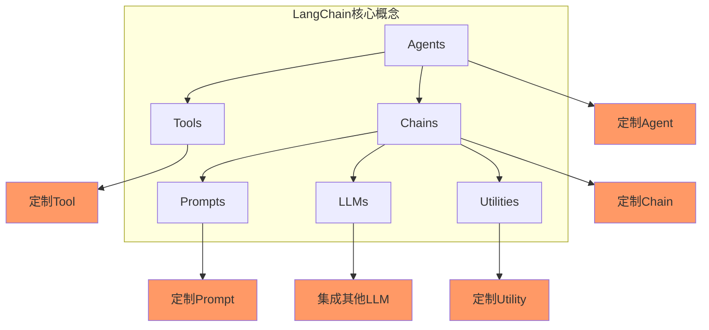
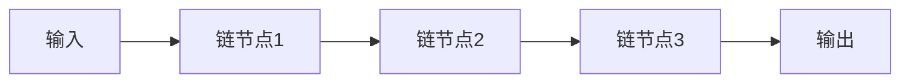

# 【LangChain编程：从入门到实践】自定义Chain实现

## 1. 背景介绍

### 1.1 问题的由来

在当今数据驱动的时代，机器学习(ML)和人工智能(AI)技术已经广泛应用于各个领域。然而,构建和部署这些系统通常需要大量的代码和工程工作。LangChain是一个新兴的Python库,旨在简化与大型语言模型(LLM)的交互,并提供一种更高层次的方式来构建AI应用程序。

LangChain的核心概念是"链"(Chain),它允许开发人员将不同的组件(如LLM、数据库、API等)链接在一起,形成复杂的工作流程。这种模块化的方法使得构建和维护AI应用程序变得更加容易。然而,尽管LangChain提供了一些预定义的链,但在许多情况下,开发人员需要根据特定的需求定制自己的链。

### 1.2 研究现状

目前,LangChain已经受到了广泛的关注和采用。越来越多的开发人员和研究人员开始探索如何利用LangChain来构建各种AI应用程序,如聊天机器人、问答系统、文本摘要等。然而,由于LangChain还是一个相对较新的库,关于如何有效地定制和扩展链的文档和示例还相对较少。

### 1.3 研究意义

定制链是LangChain的核心功能之一,它允许开发人员根据特定的需求和用例来构建自己的工作流程。通过掌握定制链的技能,开发人员可以充分利用LangChain的强大功能,构建更加灵活和高效的AI应用程序。此外,分享定制链的最佳实践和示例也有助于促进LangChain社区的发展,使更多人能够从中受益。

### 1.4 本文结构

本文将详细介绍如何使用LangChain定制自己的链。我们将从LangChain的基本概念和架构开始,然后深入探讨定制链的核心算法和实现细节。接下来,我们将通过实际的代码示例和案例分析,帮助读者更好地理解定制链的过程。最后,我们将讨论定制链的实际应用场景、工具和资源推荐,以及未来的发展趋势和挑战。

## 2. 核心概念与联系

在深入探讨定制链的细节之前,让我们先了解一些LangChain的核心概念和它们之间的联系。

1. **Agents**: 代理是LangChain中的一个高级概念,它可以根据给定的目标和工具自主地执行任务。代理可以利用LLM来规划和决策,并调用适当的工具来完成任务。

2. **Tools**: 工具是代理可以调用的各种功能组件,例如数据库查询、API调用、文件操作等。LangChain提供了一些预定义的工具,开发人员也可以定制自己的工具。

3. **Chains**: 链是LangChain的核心概念,它将不同的组件(如LLM、工具、数据等)链接在一起,形成复杂的工作流程。LangChain提供了一些预定义的链,如序列链、转换链等,开发人员也可以定制自己的链。

4. **Prompts**: 提示是与LLM交互的关键,它决定了LLM的输入和输出。LangChain提供了一些预定义的提示模板,开发人员也可以定制自己的提示。

5. **LLMs**: 大型语言模型(LLM)是LangChain的核心组件之一,它提供了自然语言处理和生成的能力。LangChain支持多种LLM,如GPT-3、BERT等,开发人员也可以集成其他LLM。

6. **Utilities**: 实用程序是一些辅助功能,如文本处理、数据操作等,它们可以被其他组件调用。LangChain提供了一些预定义的实用程序,开发人员也可以定制自己的实用程序。

通过定制和扩展这些核心概念,开发人员可以构建出满足特定需求的AI应用程序。在接下来的章节中,我们将重点介绍如何定制链。

## 3. 核心算法原理 & 具体操作步骤

### 3.1 算法原理概述

定制链的核心算法原理是将不同的组件(如LLM、工具、数据等)按照特定的顺序和逻辑组合在一起,形成一个复杂的工作流程。这个工作流程可以被视为一个"黑盒",它接收输入,执行一系列操作,并产生输出。

在LangChain中,定制链的实现基于一种称为"链式模式"(Chain of Responsibility Pattern)的设计模式。这种模式将请求的处理过程分解为多个独立的链节点,每个节点都有机会处理请求,如果无法处理,则将请求传递给下一个节点。

在定制链的上下文中,每个链节点可以是一个LLM、工具或其他组件。链节点之间通过输入和输出进行交互,形成一个连续的工作流程。

### 3.2 算法步骤详解

定制链的具体步骤如下:

1. **确定需求和用例**: 首先,需要明确定制链的目的和用例。这将帮助您确定所需的组件和工作流程。

2. **选择组件**: 根据需求,选择合适的组件,如LLM、工具、数据等。LangChain提供了许多预定义的组件,您也可以定制自己的组件。

3. **设计工作流程**: 确定组件之间的交互顺序和逻辑,构建出整个工作流程。您可以使用流程图或伪代码来可视化和规划工作流程。

4. **实现链节点**: 为每个组件实现一个链节点,定义其输入、输出和处理逻辑。

5. **组装链**: 使用LangChain提供的API,将链节点按照设计的工作流程顺序组装成一个完整的链。

6. **测试和调试**: 使用示例输入数据测试定制的链,检查其正确性和性能。根据需要进行调试和优化。

7. **部署和集成**: 将定制的链集成到您的AI应用程序中,并部署到生产环境。

8. **维护和更新**: 根据需求的变化和新的需求,持续维护和更新定制的链。

### 3.3 算法优缺点

定制链的优点包括:

- **灵活性**: 可以根据特定的需求和用例定制工作流程,提高了系统的灵活性。
- **模块化**: 将系统分解为独立的组件,提高了可维护性和可扩展性。
- **复用性**: 定制的链节点和组件可以在多个链中复用,提高了开发效率。

缺点包括:

- **复杂性**: 定制链的设计和实现可能会比较复杂,需要一定的学习成本。
- **性能开销**: 链式结构可能会引入一些性能开销,尤其是在处理大量数据时。
- **调试困难**: 由于链的模块化特性,调试可能会比较困难,需要仔细追踪数据流。

### 3.4 算法应用领域

定制链的应用领域非常广泛,包括但不限于:

- **自然语言处理(NLP)**: 如聊天机器人、问答系统、文本摘要等。
- **数据处理**: 如数据清洗、数据转换、数据集成等。
- **自动化工作流**: 如业务流程自动化、机器人流程自动化等。
- **决策支持系统**: 如风险评估、投资决策、医疗诊断等。
- **科学计算**: 如数据分析、建模和模拟等。

总的来说,只要涉及到复杂的数据处理和决策过程,定制链都可以发挥作用,帮助简化系统的构建和维护。

## 4. 数学模型和公式 & 详细讲解 & 举例说明

虽然定制链主要是一种软件工程实践,但在某些情况下,我们可能需要使用数学模型和公式来描述和优化链的行为。在本节中,我们将探讨一些常见的数学模型和公式,并通过示例说明它们在定制链中的应用。

### 4.1 数学模型构建

在构建定制链时,我们可以使用马尔可夫决策过程(Markov Decision Process, MDP)来建模链的行为。MDP是一种数学框架,用于描述在不确定环境下进行决策的过程。

在MDP中,我们定义以下元素:

- **状态集合 $S$**: 表示系统可能处于的所有状态。在定制链的上下文中,状态可以是链节点的输入或输出。
- **动作集合 $A$**: 表示系统可以执行的所有动作。在定制链中,动作可以是调用特定的链节点或组件。
- **转移函数 $P(s'|s,a)$**: 给定当前状态 $s$ 和动作 $a$,表示系统转移到下一个状态 $s'$ 的概率。
- **奖励函数 $R(s,a,s')$**: 给定当前状态 $s$、动作 $a$ 和下一个状态 $s'$,表示系统获得的即时奖励。

目标是找到一个策略 $\pi(s)$,即在每个状态 $s$ 下选择最优动作,使得累积奖励最大化。

在定制链的上下文中,我们可以将链节点视为状态,将调用链节点视为动作。转移函数可以描述链节点之间的数据流,而奖励函数可以反映链节点的执行成本或输出质量。通过求解MDP,我们可以找到最优的链节点执行顺序,从而优化整个链的性能。

### 4.2 公式推导过程

在MDP框架下,我们可以使用动态规划或强化学习等方法来求解最优策略。以下是一种常见的动态规划算法,称为值迭代(Value Iteration)。

值迭代算法的目标是找到每个状态 $s$ 下的最优值函数 $V^*(s)$,表示在状态 $s$ 下遵循最优策略可获得的最大累积奖励。算法的步骤如下:

1. 初始化值函数 $V(s)$ 为任意值,例如全部设为 0。
2. 对于每个状态 $s$,计算:

$$
V(s) \leftarrow \max_{a \in A} \left\{ R(s,a) + \gamma \sum_{s' \in S} P(s'|s,a)V(s') \right\}
$$

其中 $\gamma$ 是折现因子,用于平衡即时奖励和未来奖励的权重。

3. 重复步骤 2,直到值函数收敛。
4. 对于每个状态 $s$,最优动作 $\pi^*(s)$ 可以通过以下公式获得:

$$
\pi^*(s) = \arg\max_{a \in A} \left\{ R(s,a) + \gamma \sum_{s' \in S} P(s'|s,a)V(s') \right\}
$$

通过值迭代算法,我们可以获得每个状态下的最优值函数和最优动作,从而确定定制链中链节点的最优执行顺序。

### 4.3 案例分析与讲解

为了更好地理解数学模型和公式在定制链中的应用,我们将通过一个简单的案例进行分析和讲解。

假设我们要构建一个自动问答系统,该系统需要从知识库中查找相关信息,然后使用LLM生成回答。我们可以将这个过程建模为一个MDP,其中:

- 状态集合 $S$ 包括初始状态(用户提问)和中间状态(从知识库检索到的信息)。
- 动作集合 $A$ 包括查询知识库和调用LLM生成回答。
- 转移函数 $P(s'|s,a)$ 描