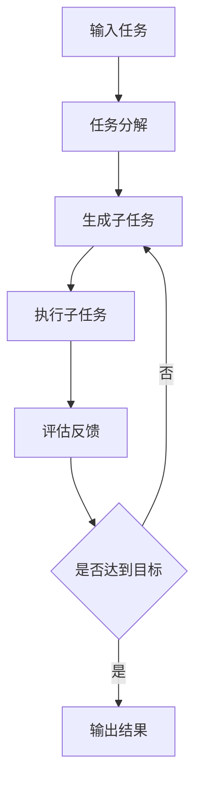

# 【大模型应用开发 动手做AI Agent】BabyAGI实战

## 1. 背景介绍

### 1.1 问题的由来

随着人工智能技术的飞速发展,大语言模型(LLMs)的出现为构建智能Agent开辟了新的可能。传统的AI系统通常专注于特定领域,缺乏通用性和灵活性。而LLMs强大的语言理解和生成能力,为打造具备认知推理、多任务处理等高级能力的AI Agent奠定了基础。

### 1.2 研究现状 

目前业界已经涌现出一批基于LLMs的AI Agent应用,如Anthropic的Claude、Adept的ACT-1等。它们展示了利用大模型进行任务规划、信息检索、工具使用等复杂认知任务的潜力。不过这些系统大多采用黑盒封装,缺乏透明性和可解释性。

而BabyAGI作为一个开源项目,为研究者提供了一个简洁而完整的范例,演示了如何基于LLMs和Prompt工程构建具备任务分解、迭代优化能力的AI Agent。其思路清晰,代码简约,非常适合作为学习和实践的起点。

### 1.3 研究意义

BabyAGI虽然是一个简化版的AI Agent,但蕴含了大模型应用开发的诸多关键要素:

- 面向目标的任务分解与规划
- 基于Prompt的大模型调用与交互 
- 迭代式的信息积累与优化
- 模块化的系统架构设计

深入研究BabyAGI的实现原理和开发过程,有助于我们掌握利用LLMs构建认知型AI应用的基本范式,为探索更加复杂、智能的Agent系统积累知识和经验。同时也为思考提示工程、few-shot learning等前沿课题提供了绝佳的实践案例。

### 1.4 本文结构

本文将从以下几个方面深入剖析BabyAGI项目:

- 介绍BabyAGI的核心概念与工作机制
- 剖析其关键算法与实现步骤
- 讲解系统中的数学模型与公式
- 结合代码实例解读其程序架构与逻辑
- 探讨其潜在应用场景与局限性
- 总结BabyAGI对于大模型应用开发的启示意义
- 展望基于大模型的AI Agent的未来发展方向与挑战

## 2. 核心概念与联系

BabyAGI的核心理念是通过任务分解与迭代优化,利用LLMs的语言理解与生成能力,构建一个可以自主规划和执行任务的AI Agent。其关键概念包括:

- 任务(Task):Agent需要完成的目标,通常由用户以自然语言形式输入。
- 子任务(Subtask):将复杂任务分解为多个可执行的原子步骤。
- 任务列表(Task List):Agent规划出的子任务队列,按优先级排序。
- 执行(Execution):Agent根据子任务逐步执行并获取结果。
- 反馈(Feedback):根据执行结果对原有任务列表进行更新和优化。
- 迭代(Iteration):多轮次执行上述过程,不断改进任务完成质量。

这些概念环环相扣,构成了BabyAGI的基本工作流程:



BabyAGI利用LLMs强大的few-shot学习能力,通过精心设计的Prompt模板,引导模型进行任务分解、子任务生成、执行结果分析等关键步骤。通过迭代优化,Agent可以不断积累任务相关知识,改进执行策略,提升任务完成质量。

## 3. 核心算法原理 & 具体操作步骤

### 3.1 算法原理概述

BabyAGI的核心算法可以概括为面向任务的迭代优化。具体来说,它遵循以下基本原则:

1. 任务分解:将复杂任务拆解为多个可执行的子任务。
2. 优先级排序:根据子任务的重要性和依赖关系进行排序。
3. 逐步执行:按优先级依次完成子任务,并记录执行结果。
4. 迭代优化:根据反馈对原有任务列表进行更新,生成新的子任务。
5. 收敛判断:重复上述过程直到满足终止条件(如达到预期目标)。

该算法充分利用了LLMs在语言理解和生成方面的优势,通过Prompt引导模型进行任务规划与分解。同时采用迭代优化策略,在执行过程中不断学习和改进,以期获得更好的任务完成效果。

### 3.2 算法步骤详解

BabyAGI的核心算法可以分为以下5个步骤:

1. 任务输入:用户以自然语言的形式描述要完成的任务目标。

2. 任务分解:根据预定义的Prompt模板,将用户输入的任务描述传递给LLMs,生成一系列子任务。Prompt模板一般包含任务分解的指令、输入任务描述、对子任务的格式要求等信息。LLMs根据Prompt分析任务并输出结构化的子任务列表。

3. 子任务排序:根据子任务的优先级和依赖关系,对生成的子任务列表进行排序。优先级可以由LLMs根据任务重要性和时间紧迫度等因素推断得出。

4. 子任务执行:按照排序后的子任务列表,依次执行每个子任务。执行过程中,将子任务内容作为Prompt输入LLMs,让其根据上下文生成对应的执行结果。执行结果会记录在任务列表中,用于后续分析。

5. 迭代优化:根据已执行子任务的结果,更新任务列表。将原有任务描述、已完成的子任务、执行结果等信息构造成新的Prompt,请LLMs分析是否达到预期目标,并对剩余子任务进行优化或生成新的子任务。重复步骤3-5,直到达到预设的终止条件。

以下是BabyAGI算法的伪代码表示:

```python
def baby_agi(task_description):
    task_list = decompose_task(task_description)
    
    while not is_finished(task_list):
        prioritize_tasks(task_list)
        
        for subtask in task_list:
            result = execute_task(subtask)
            record_result(subtask, result)
        
        task_list = update_tasks(task_list, task_description)
        
    return get_final_result(task_list)
```

其中`decompose_task`, `prioritize_tasks`, `execute_task`, `update_tasks`等函数都是通过向LLMs发送特定Prompt实现的。

### 3.3 算法优缺点

BabyAGI算法的主要优点包括:

- 简单高效:核心思路清晰,易于实现和扩展。
- 语言驱动:充分利用LLMs的语言理解和生成能力,降低了任务定义和执行的复杂度。
- 迭代优化:通过持续的执行-反馈-更新循环,不断改进任务完成效果。

同时该算法也存在一些局限性:

- 依赖LLMs性能:任务分解和执行的效果很大程度上取决于LLMs的理解和生成能力。
- 缺乏长期记忆:该算法没有显式的知识存储和积累机制,难以应对需要长期记忆的复杂任务。
- 泛化能力有限:对于超出LLMs知识范围的新领域任务,该算法的适应能力有待验证。

### 3.4 算法应用领域

BabyAGI为构建基于大语言模型的通用AI Agent提供了一种简洁而有效的范式。其思路可以应用于以下领域:

- 智能任务规划:自动将复杂任务拆解为可执行的步骤。
- 智能问答:通过迭代优化生成更加准确、完整的答案。
- 开放式对话:引导多轮对话,理解用户意图并提供恰当回应。
- 数据分析:自动提取、总结文本数据的关键信息。

未来,BabyAGI的理念有望与更先进的LLMs、Prompt优化技术、知识图谱等结合,衍生出更加智能和高效的Agent应用。

## 4. 数学模型和公式 & 详细讲解 & 举例说明

### 4.1 数学模型构建

BabyAGI虽然是一个概念性的算法范式,但我们仍然可以尝试对其任务分解和迭代优化的过程进行数学建模。设定如下符号:

- $T$:用户输入的任务描述
- $S_i$:第$i$个子任务
- $R_i$:第$i$个子任务的执行结果
- $P_i$:第$i$个子任务的优先级
- $U_i$:第$i$次迭代优化后的任务列表
- $f_d$:任务分解函数(由LLMs实现)
- $f_p$:子任务排序函数
- $f_e$:子任务执行函数(由LLMs实现)
- $f_u$:任务列表更新函数(由LLMs实现)

则BabyAGI的任务分解和迭代优化过程可以表示为:

$$
\begin{aligned}
S_0 &= f_d(T) \\
U_0 &= f_p(S_0) \\
R_i &= f_e(S_i), i=1,2,...,n \\
U_{i+1} &= f_u(U_i, R_i, T), i=0,1,...,n-1
\end{aligned}
$$

其中$n$为迭代次数。最终的任务完成结果可以表示为:

$$
Result = g(U_n, \{R_i\}_{i=1}^n, T)
$$

其中$g$为根据最终任务列表、所有子任务结果和原始任务描述生成最终结果的函数。

### 4.2 公式推导过程

以上数学模型是对BabyAGI算法的一种抽象表示。下面我们对其中的一些关键公式进行推导说明:

1. 任务分解公式:$S_0 = f_d(T)$
   
   该公式表示将原始任务描述$T$传入LLMs实现的任务分解函数$f_d$,得到初始子任务列表$S_0$。$f_d$的具体实现是向LLMs发送包含任务描述的Prompt,让其生成子任务并解析结果。

2. 子任务排序公式:$U_0 = f_p(S_0)$

   该公式表示对初始子任务列表$S_0$进行排序,得到有序列表$U_0$。排序函数$f_p$可以根据子任务的重要性、紧迫度等属性计算优先级,常见的算法有优先队列、拓扑排序等。

3. 子任务执行公式:$R_i = f_e(S_i)$
   
   该公式表示执行第$i$个子任务$S_i$并获得结果$R_i$。执行函数$f_e$通过向LLMs发送包含子任务内容的Prompt实现,LLMs根据上下文生成自然语言形式的执行结果。

4. 任务列表更新公式:$U_{i+1} = f_u(U_i, R_i, T)$

   该公式表示根据第$i$次迭代的任务列表$U_i$、子任务执行结果$R_i$和原始任务描述$T$,更新任务列表并得到$U_{i+1}$。更新函数$f_u$通过向LLMs发送包含以上信息的Prompt实现,LLMs分析任务完成进度,对剩余子任务进行优化,并生成新的子任务。

### 4.3 案例分析与讲解

下面我们以一个简单的任务为例,演示BabyAGI的数学模型在实际中的应用。

假设用户输入的任务描述$T$为"帮我写一篇关于BabyAGI的文章"。经过任务分解函数$f_d$处理后,得到以下初始子任务列表$S_0$:

1. 研究BabyAGI的原理和实现
2. 总结BabyAGI的核心概念
3. 分析BabyAGI的优缺点
4. 讨论BabyAGI的应用场景
5. 撰写文章大纲
6. 撰写文章正文
7. 润色和修改文章
   
经过排序函数$f_p$处理,得到有序列