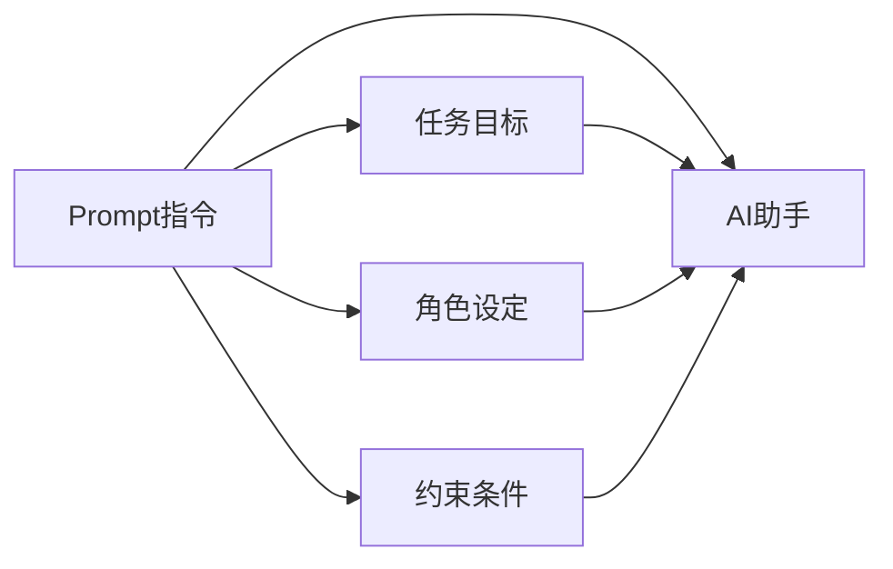

# 【大模型应用开发 动手做AI Agent】不写代码，在Playground中玩Assistants

作者：禅与计算机程序设计艺术 / Zen and the Art of Computer Programming

## 1. 背景介绍

### 1.1  问题的由来

随着人工智能技术的飞速发展，大语言模型(Large Language Models, LLMs)在自然语言处理领域取得了突破性的进展。基于海量文本数据训练的LLMs展现出了惊人的语言理解和生成能力，为构建智能对话系统和知识问答系统开辟了新的途径。然而，如何利用LLMs快速构建实用的AI应用，对很多开发者来说仍是一大挑战。

### 1.2  研究现状

目前，主流的LLMs如GPT-3、PaLM、LLaMA等，大多以API或开源模型的形式提供。开发者需要具备一定的编程能力和机器学习知识，才能基于这些模型开发AI应用。这无疑提高了AI应用开发的门槛，限制了LLMs的普及和应用。

与此同时，也出现了一些面向非技术用户的LLM应用开发平台，如Anthropic的Claude、OpenAI的ChatGPT等。这些平台以更加友好的交互方式，让用户无需编程就能定制AI助手的任务能力。但它们大多是封闭的商业平台，缺乏灵活性和可扩展性。

### 1.3  研究意义

探索一种简单易用、灵活开放的LLM应用开发方式，对于推动LLMs的普及应用具有重要意义：

- 降低AI应用开发门槛，让更多非技术用户参与其中
- 加速AI助手等智能应用的迭代优化，及时响应用户需求
- 促进LLM生态的开放协作，避免平台垄断和技术封闭

### 1.4  本文结构

本文将以Anthropic的AI助手构建平台Claude Playground为例，介绍一种简单易用的LLM应用开发方法。通过设计Prompt指令，我们可以在Playground中快速构建和测试定制化的AI助手，而无需编写代码。全文结构如下：

- 介绍Claude Playground的基本概念和工作原理
- 详解AI助手Prompt设计的核心要素和最佳实践
- 以实例演示如何用Prompt定制AI助手的任务能力
- 讨论该方法的优缺点以及未来的改进方向

## 2. 核心概念与联系

Claude Playground是一个基于Prompt的AI助手构建平台。它利用Prompt指令来定制AI模型的任务目标、知识背景、行为约束等，从而实现特定领域的智能助手。其核心概念包括：

- AI助手(AI Agent): 一个基于LLM实现的对话式AI应用，能够理解用户指令并完成特定任务。
- Prompt指令: 一段包含任务描述、背景知识、约束条件等信息的文本，用于指导AI模型的行为。
- 任务目标(Goal): 定义AI助手需要完成的具体任务，如信息检索、问题解答、创意生成等。
- 角色设定(Role): 赋予AI助手特定的身份和专业背景，使其具备相应的知识和能力。
- 约束条件(Constraint): 对AI助手的行为进行限制和引导，确保其输出符合预期且合乎伦理。

下图展示了这些概念之间的关系：



可以看出，Prompt指令通过定义任务目标、角色设定和约束条件，最终构建出一个定制化的AI助手，用于完成特定的任务。

## 3. 核心算法原理 & 具体操作步骤

### 3.1  算法原理概述

Claude Playground基于Anthropic的宪章AI(Constitutional AI)技术，通过Prompt引导LLM生成安全可控的助手回复。其核心算法可以概括为以下步骤：

1. 将Prompt指令输入预训练的LLM，生成助手的初始回复
2. 用一个辅助的分类器模型评估回复的安全性和相关性
3. 如果回复不够安全或相关，则返回步骤1，重新生成回复
4. 如果回复通过评估，则将其返回给用户

通过这种"生成-评估-重试"的迭代优化过程，算法能够不断改进助手回复的质量，直至满足预设的约束条件。

### 3.2  算法步骤详解

下面我们详细解释算法的每个步骤：

步骤1. LLM生成初始回复
- 将Prompt指令和用户输入拼接成一个完整的上下文
- 将上下文输入预训练的LLM，如GPT-3、Claude等
- 使用Sampling、Beam Search等策略生成助手的初始回复

步骤2. 评估回复的安全性和相关性
- 使用一个预训练的分类器模型，如GPT-3 Curie等
- 将回复文本输入分类器，预测其在安全性、相关性等维度的得分
- 设定安全性和相关性的阈值，判断回复是否满足要求

步骤3. 根据评估结果决定是否重试
- 如果回复的安全性或相关性得分低于阈值，则认为回复不合格
- 返回步骤1，用同样的上下文重新生成回复
- 可以尝试调整LLM的生成参数，如Temperature、Top-p等，以获得更好的回复

步骤4. 返回最终的助手回复
- 如果回复通过了安全性和相关性评估，则将其返回给用户
- 可以对回复进行后处理，如过滤敏感词、格式化等
- 记录本次对话的Prompt指令和回复，用于优化后续的助手行为

### 3.3  算法优缺点

该算法的主要优点包括：
- 通过Prompt引导LLM生成定制化的助手回复，无需训练专用模型
- 利用分类器评估回复质量，确保助手输出的安全性和相关性
- 采用迭代优化策略，不断改进助手回复，提升用户体验

同时，该算法也存在一些局限性：
- Prompt设计需要一定的经验和技巧，质量参差不齐
- 分类器的准确性有待提高，尤其是针对开放域对话
- 迭代优化的计算开销较大，实时性能有待优化

### 3.4  算法应用领域

基于Prompt的AI助手构建算法，可以应用于多个领域，例如：
- 智能客服：提供个性化的客户服务和问题解答
- 教育助手：辅导学生学习，解答疑难问题
- 写作助手：协助用户进行文案创作和编辑润色
- 行业顾问：提供专业领域的咨询建议和决策支持
- 生活助手：帮助用户管理日程、提供生活贴士等

## 4. 数学模型和公式 & 详细讲解 & 举例说明

### 4.1  数学模型构建

我们可以用数学语言来刻画Prompt引导下的AI助手生成过程。假设有一个预训练的语言模型 $M$，输入为 Prompt 指令 $P$ 和用户查询 $Q$，输出为助手的回复 $R$。则整个过程可以表示为:

$$ R = \arg\max_R P(R|P,Q,M) $$

其中，$P(R|P,Q,M)$ 表示在给定Prompt $P$、查询 $Q$ 和模型 $M$ 的条件下，生成回复 $R$ 的概率。我们的目标是找到概率最大的回复 $R$。

### 4.2  公式推导过程

根据贝叶斯公式，可以将 $P(R|P,Q,M)$ 分解为:

$$ P(R|P,Q,M) = \frac{P(P,Q|R,M)P(R|M)}{P(P,Q|M)} $$

其中，$P(P,Q|R,M)$ 表示在给定回复 $R$ 和模型 $M$ 的条件下，生成Prompt $P$ 和查询 $Q$ 的概率；$P(R|M)$ 表示在模型 $M$ 下生成回复 $R$ 的先验概率；$P(P,Q|M)$ 表示在模型 $M$ 下生成Prompt $P$ 和查询 $Q$ 的概率，可视为归一化常数。

进一步地，可以用语言模型的对数似然来估计这些概率：

$$ \log P(P,Q|R,M) = \sum_{i=1}^n \log P(w_i|w_{<i},R,M) $$

$$ \log P(R|M) = \sum_{j=1}^m \log P(v_j|v_{<j},M) $$

其中，$w_i$ 表示 Prompt 和查询的第 $i$ 个单词，$v_j$ 表示回复的第 $j$ 个单词。

### 4.3  案例分析与讲解

举一个简单的例子，假设我们要设计一个天气查询助手。Prompt指令 $P$ 可以写成：

```
你是一个天气助手，用户会询问你某个城市的天气情况。你需要根据最新的天气预报数据，以简洁易懂的方式回答用户的问题。
```

假设用户的查询 $Q$ 是：

```
上海今天的天气怎么样？
```

则助手生成的回复 $R$ 可能是：

```
上海今天天气晴朗，最高气温28°C，最低气温20°C，东南风3-4级，空气质量优。适合外出游玩，注意防晒。
```

在生成这个回复的过程中，语言模型 $M$ 综合考虑了 Prompt 指令 $P$ 对助手角色和任务的定义，以及用户查询 $Q$ 提供的具体问题。通过解码算法（如Beam Search）搜索可能的回复空间，选择对数似然概率最高的回复 $R$ 作为最终输出。

### 4.4  常见问题解答

Q: Prompt 指令对助手回复有什么影响？
A: Prompt 指令定义了助手的角色、任务和约束，直接影响了助手回复的内容和风格。一个设计良好的 Prompt 可以引导语言模型生成高质量、符合预期的助手回复。

Q: 如何权衡回复的流畅性和相关性？
A: 可以在语言模型中引入长短期记忆机制，兼顾回复的局部连贯性和全局相关性。同时，可以通过Prompt中的约束条件，对回复的内容进行适当限制和引导。

Q: 如何避免助手生成不安全或有害的内容？
A: 可以在Prompt中明确定义禁止生成的内容类型，如暴力、色情、歧视等。另外，可以在回复生成后，用分类器进行安全性检查，过滤掉不合规的内容。

## 5. 项目实践：代码实例和详细解释说明

### 5.1  开发环境搭建

要在Claude Playground中构建AI助手，只需要一个现代的Web浏览器和稳定的网络连接。建议使用Chrome、Firefox等主流浏览器的最新版本，以获得最佳的使用体验。

### 5.2  源代码详细实现

在Claude Playground中，我们通过编写Prompt指令来定义AI助手的角色、任务和约束。下面是一个简单的天气助手的Prompt示例：

```
# 角色定义
你是一个天气助手，代号"WeatherGPT"。你掌握了全球各大城市的实时天气数据，能够根据用户的问询提供准确、简洁的天气预报服务。

# 任务目标
你的任务是：
1. 理解用户输入的城市名和日期
2. 查询该城市在指定日期的天气预报数据
3. 以简明扼要的语言回复用户，包括天气状况、温度范围、风力风向、空气质量等信息
4. 根据天气情况，为用户提供出行建议

# 约束条件
在生成回复时，你需要遵循以下约束：
- 使用中文回复，语言要简洁明了，避免使用晦涩难懂的术语
- 天气描述要尽量具体，避免模棱两可的表述
- 不允许生成任何不相关的内容，如广告、推销等
- 如果无法查询到指定城市或日期的天气数据，要如实告知用户
- 对于不合法或不道德的用户输入，要予以警告和劝阻
```

### 5.3  代码解读与分析