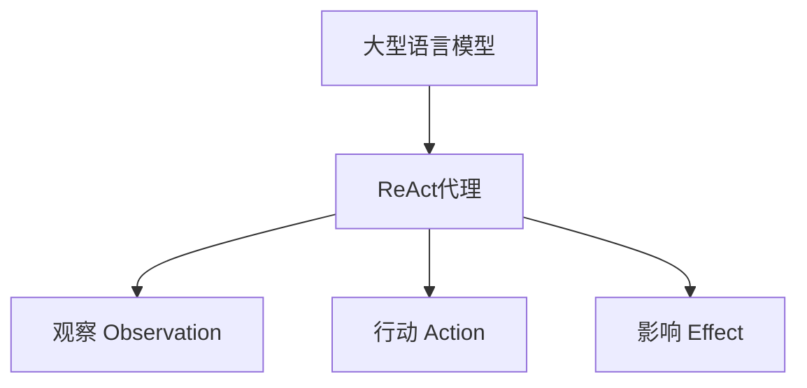

以下是根据您的要求撰写的技术博客文章正文:

# 【大模型应用开发 动手做AI Agent】执行ReAct Agent

## 1. 背景介绍

### 1.1 问题的由来

在当今的人工智能时代,大型语言模型展现出了惊人的能力,可以执行各种复杂的任务,如问答、文本生成、代码编写等。然而,这些模型通常被视为"黑箱",缺乏可解释性和可控性。因此,需要一种新的范式来控制和指导这些强大的模型,使它们能够以更加可靠、透明和可控的方式执行任务。

### 1.2 研究现状 

为了解决这一问题,研究人员提出了"ReAct"(Reasoning Actuator)范式,旨在将大型语言模型转变为可控和可解释的智能体。ReAct代理通过将模型的输出分解为"观察(Observation)"、"行动(Action)"和"影响(Effect)"三个部分,从而实现对模型行为的细粒度控制。

### 1.3 研究意义

ReAct范式的引入为大型语言模型的应用开发带来了全新的机遇。通过将模型转化为可控制的智能体,开发人员可以更好地理解和调整模型的行为,确保其输出符合预期,并避免潜在的风险。此外,ReAct代理还可以在各种领域发挥作用,如智能助手、自动化系统、教育等。

### 1.4 本文结构

本文将详细介绍ReAct范式及其在大型语言模型应用开发中的实践。我们将首先探讨ReAct的核心概念和原理,然后深入剖析其算法细节和数学模型。接下来,我们将通过代码示例和实际案例,展示如何开发和部署ReAct代理。最后,我们将讨论ReAct在各个领域的应用前景,以及未来的发展趋势和挑战。

## 2. 核心概念与联系

ReAct范式的核心思想是将大型语言模型转化为一个可控制的智能体,通过分解其输出为"观察(Observation)"、"行动(Action)"和"影响(Effect)"三个部分,实现对模型行为的细粒度控制。

- **观察(Observation)**: 代理从环境中获取的信息,包括任务描述、上下文等。
- **行动(Action)**: 代理根据观察做出的决策,通常是一个文本输出。
- **影响(Effect)**: 代理的行动对环境产生的影响,可能会改变环境状态或触发新的观察。

通过将模型的输出分解为这三个部分,ReAct代理可以更好地控制模型的行为,确保其输出符合预期,并避免潜在的风险。同时,这种分解也提高了模型的可解释性,使开发人员能够更好地理解模型的决策过程。

## 3. 核心算法原理 & 具体操作步骤

### 3.1 算法原理概述

ReAct算法的核心思想是将大型语言模型的输出分解为观察、行动和影响三个部分,并通过一系列规则和约束来控制模型的行为。算法的主要步骤如下:

1. **观察(Observation)**: 从环境中获取任务描述、上下文等信息,作为模型的输入。
2. **生成(Generation)**: 模型根据观察生成一个初步的文本输出。
3. **分解(Decomposition)**: 将模型的输出分解为观察、行动和影响三个部分。
4. **规则检查(Rule Checking)**: 根据预定义的规则和约束,检查行动和影响的合法性和安全性。
5. **反馈(Feedback)**: 如果行动或影响不合法或不安全,则将反馈信息输入模型,重新生成输出。
6. **执行(Execution)**: 如果行动和影响合法且安全,则执行行动,并将影响应用于环境。
7. **迭代(Iteration)**: 根据新的环境状态,重复上述步骤,直到任务完成。

该算法通过引入规则检查和反馈机制,实现了对模型输出的控制和约束,确保了输出的合法性和安全性。同时,通过将输出分解为不同部分,提高了模型的可解释性和可控性。

### 3.2 算法步骤详解

1. **观察(Observation)获取**

   算法首先从环境中获取任务描述、上下文等信息,作为模型的输入。这些信息可以是文本形式,也可以是其他形式的数据,如图像、音频等。

2. **生成(Generation)**

   模型根据观察生成一个初步的文本输出。这个输出可能包含多个部分,如对观察的解释、建议的行动、预期的影响等。

3. **分解(Decomposition)**

   将模型的输出分解为观察、行动和影响三个部分。这个步骤通常需要一些自然语言处理技术,如命名实体识别、关系抽取等。

   例如,如果模型的输出是"根据天气预报,今天有雨,我建议带伞出门,这样可以避免被淋湿",那么可以分解为:

   - 观察(Observation): 根据天气预报,今天有雨
   - 行动(Action): 我建议带伞出门
   - 影响(Effect): 这样可以避免被淋湿

4. **规则检查(Rule Checking)**

   根据预定义的规则和约束,检查行动和影响的合法性和安全性。这些规则可以是通用的,也可以是特定任务或领域的规则。

   例如,对于上面的例子,规则可能包括:

   - 行动必须是合法且安全的
   - 影响不能涉及伤害或违法行为

   如果行动或影响不合法或不安全,则算法将进入反馈阶段。

5. **反馈(Feedback)**

   如果行动或影响不合法或不安全,则将反馈信息输入模型,要求其重新生成输出。反馈信息可以是简单的错误提示,也可以是更详细的解释和指导。

   例如,如果行动是"我建议偷一把伞",那么反馈可能是:"偷盗是违法的,请重新生成一个合法的行动建议"。

6. **执行(Execution)**

   如果行动和影响合法且安全,则执行行动,并将影响应用于环境。这个步骤可能需要与外部系统或设备交互,如发送指令、控制机器人等。

7. **迭代(Iteration)**

   根据新的环境状态,重复上述步骤,直到任务完成。在每个迭代中,观察都会更新,模型会根据新的观察生成新的输出,并经过分解、检查和执行的过程。

通过这一系列步骤,ReAct算法实现了对大型语言模型输出的控制和约束,确保了输出的合法性和安全性,同时也提高了模型的可解释性和可控性。

### 3.3 算法优缺点

**优点**:

1. **可控性**: 通过引入规则检查和反馈机制,ReAct算法实现了对大型语言模型输出的控制和约束,确保了输出的合法性和安全性。

2. **可解释性**: 将模型输出分解为观察、行动和影响三个部分,提高了模型决策过程的可解释性,使开发人员能够更好地理解模型的行为。

3. **灵活性**: ReAct算法可以应用于各种任务和领域,只需定义相应的规则和约束即可。

4. **可扩展性**: 算法的各个步骤都可以根据需求进行优化和扩展,如引入更先进的自然语言处理技术、更复杂的规则等。

**缺点**:

1. **计算开销**: 将模型输出分解为多个部分,并进行规则检查和反馈,会增加算法的计算开销。

2. **规则定义困难**: 定义合适的规则和约束可能是一个挑战,需要对特定任务和领域有深入的理解。

3. **反馈质量影响**: 反馈的质量直接影响模型输出的质量,如果反馈不够明确或有误导,可能会导致模型产生错误的输出。

4. **环境交互复杂性**: 执行行动并应用影响可能需要与外部系统或设备交互,增加了系统的复杂性。

### 3.4 算法应用领域

ReAct算法可以应用于各种需要大型语言模型的领域,如:

1. **智能助手**: 作为智能助手的核心,ReAct算法可以确保助手的输出符合预期,避免产生不当或有害的内容。

2. **自动化系统**: 在自动化流程中,ReAct算法可以控制语言模型的输出,确保其生成的指令或操作是安全和合法的。

3. **教育领域**: 在教育场景中,ReAct算法可以用于生成个性化的学习内容和反馈,同时确保内容的适当性和准确性。

4. **内容创作**: 在内容创作领域,ReAct算法可以辅助生成高质量的文本内容,并根据规则和约束进行调整和优化。

5. **法律和合规性**: 在法律和合规性领域,ReAct算法可以确保语言模型的输出符合相关法规和政策。

6. **医疗健康**: 在医疗健康领域,ReAct算法可以用于生成个性化的诊断和治疗建议,同时确保建议的安全性和合理性。

总的来说,ReAct算法为大型语言模型的应用开发提供了一种可控和可解释的范式,可以广泛应用于各个领域。

## 4. 数学模型和公式 & 详细讲解 & 举例说明

### 4.1 数学模型构建

为了更好地理解和优化ReAct算法,我们可以将其形式化为一个数学模型。假设我们有一个语言模型 $M$,它接受观察 $o$ 作为输入,并生成一个输出序列 $y$。我们的目标是将 $y$ 分解为观察 $o'$、行动 $a$ 和影响 $e$,并确保它们符合预定义的规则和约束。

我们可以将这个问题建模为一个约束优化问题,其目标函数如下:

$$\max_{o',a,e} P(o',a,e|o,M)$$
$$\text{s.t.} \quad R(o',a,e) = \text{True}$$

其中:

- $P(o',a,e|o,M)$ 是语言模型 $M$ 在给定观察 $o$ 的情况下,生成观察 $o'$、行动 $a$ 和影响 $e$ 的概率。
- $R(o',a,e)$ 是一个布尔函数,表示观察 $o'$、行动 $a$ 和影响 $e$ 是否满足预定义的规则和约束。

这个优化问题的目标是找到最大化模型概率的观察、行动和影响的组合,同时满足所有规则和约束。

### 4.2 公式推导过程

为了解决上述优化问题,我们可以使用动态规划或其他优化算法。在这里,我们将使用拉格朗日乘数法来推导出一个解析解。

首先,我们定义拉格朗日函数 $\mathcal{L}$ 如下:

$$\mathcal{L}(o',a,e,\lambda) = P(o',a,e|o,M) + \lambda R(o',a,e)$$

其中 $\lambda$ 是拉格朗日乘数。

接下来,我们对 $\mathcal{L}$ 取偏导数,并令其等于零,以获得极值条件:

$$\frac{\partial \mathcal{L}}{\partial o'} = \frac{\partial P(o',a,e|o,M)}{\partial o'} + \lambda \frac{\partial R(o',a,e)}{\partial o'} = 0$$

$$\frac{\partial \mathcal{L}}{\partial a} = \frac{\partial P(o',a,e|o,M)}{\partial a} + \lambda \frac{\partial R(o',a,e)}{\partial a} = 0$$

$$\frac{\partial \mathcal{L}}{\partial e} = \frac{\partial P(o',a,e|o,M)}{\partial e} + \lambda \frac{\partial R(o',a,e)}{\partial e} = 0$$

$$\frac{\partial \mathcal{L}}{\partial \lambda} = R(o',a,e) = 0$$

上述方程组给出了观察 $o'$、行动 $a$ 和影响 $e$ 的最优解,同时满足规则和约束。

### 4.3 案例分析与