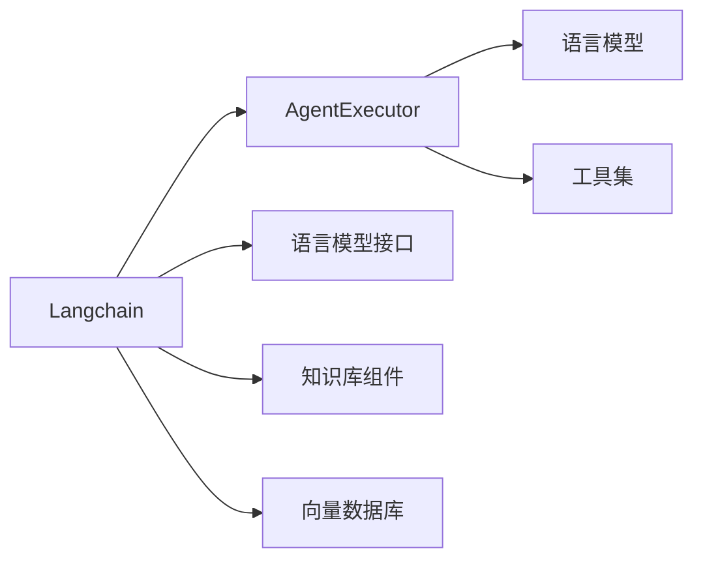

# 【大模型应用开发 动手做AI Agent】深挖AgentExecutor的运行机制

关键词：大模型、AI Agent、AgentExecutor、运行机制、Langchain

## 1. 背景介绍
### 1.1  问题的由来
随着人工智能技术的快速发展,尤其是大语言模型的出现,让我们看到了通用人工智能的曙光。然而,如何将强大的语言模型应用到实际的生产环境中,构建智能化的应用程序,仍然是一个巨大的挑战。传统的人工智能应用开发需要大量的人力成本和专业知识,开发周期长,难以快速迭代。因此,急需一种高效、灵活、易用的人工智能应用开发范式。

### 1.2  研究现状
近年来,AI Agent的概念开始兴起,通过将语言模型、知识库、推理引擎等多种AI组件进行组合,构建具备感知、推理、决策、执行能力的智能体,为人工智能应用开发提供了新的思路。业界已经涌现出一些优秀的AI Agent开发框架,如Langchain、AgentGPT等,受到了广泛关注。

其中,Langchain作为一个灵活的AI Agent构建工具,提供了丰富的接口和组件,可以方便地与各种语言模型、知识库对接,快速搭建AI Agent应用。而AgentExecutor作为Langchain的核心执行引擎,在整个系统中起到了至关重要的作用。

### 1.3  研究意义
深入研究AgentExecutor的运行机制,对于理解AI Agent的工作原理,掌握使用Langchain进行Agent开发的核心要点,具有重要意义。一方面,有助于我们站在更高的视角审视人工智能系统的架构设计,另一方面,可以帮助开发者更好地驾驭这一先进的开发工具,提升AI应用的开发效率和质量。

### 1.4  本文结构
本文将从以下几个方面展开论述：

首先,介绍AgentExecutor的核心概念和在Langchain中的定位；
然后,深入剖析AgentExecutor的内部运行机制和算法原理；  
接着,通过一个实际的案例,演示如何使用AgentExecutor进行Agent开发；
最后,总结AgentExecutor的特点,展望其未来的发展方向,并提出一些值得关注的问题。

## 2. 核心概念与联系

在正式进入AgentExecutor的技术细节之前,我们有必要先明确几个核心概念：

- **Agent**: 广义的Agent是指一个可以感知环境,做出决策,并采取行动的自主实体。狭义的AI Agent特指由人工智能技术驱动,能够代替人类完成特定任务的智能体。它一般由感知、推理、知识、规划、执行等多个模块构成。

- **Executor**: 执行器,负责调度和执行Agent的动作。可以简单理解为Agent的"四肢",负责实际干活的部分。

- **Langchain**: 一个灵活的AI Agent构建工具,提供了语言模型接口、知识库组件、推理引擎等多种功能模块,可以帮助开发者快速搭建AI Agent应用。

- **AgentExecutor**: Langchain中的一个特殊Executor,是专门为Agent设计的执行引擎。它以语言模型为核心,通过Prompt引导语言模型进行决策,再调用相应的工具执行动作,完成任务,是一个"LLM+工具"的架构。

下图展示了AgentExecutor在Langchain中的位置,以及与其他组件的关系:



可以看到,AgentExecutor是Langchain的核心组件之一,它联结了语言模型和外部工具,赋予了Agent"思考"和"行动"的能力,是实现端到端任务的关键。

## 3. 核心算法原理 & 具体操作步骤
### 3.1  算法原理概述
AgentExecutor的核心算法,是基于Prompt的语言模型决策。具体来说,它将Agent的任务目标、已有观察、可用工具等信息拼接成一个Prompt,喂给语言模型,语言模型根据Prompt推理出下一步应该执行的动作,AgentExecutor再调用相应的工具执行该动作,循环往复,直到任务完成。

这种"LLM+工具"的架构有几个优点：
1. 语言模型可以根据Prompt进行开放域的推理,不受限于特定领域,具有一定的通用性。
2. 将复杂的任务拆解为高层的决策和底层的执行,有利于模块化设计和快速迭代。
3. 不同的Agent可以共用同一个语言模型,通过更换Prompt和工具集实现热插拔,提高复用性。

### 3.2  算法步骤详解
AgentExecutor的工作流程可以分为以下几个步骤:

1. **初始化阶段**
   - 输入Agent的任务目标,可用工具集等配置参数
   - 创建一个空的观察集合,用于存储Agent的感知信息
   
2. **决策阶段**  
   - 将当前的任务目标、观察、工具集等信息拼接成Prompt
   - 将Prompt输入语言模型,让其推理出下一步动作
   - 语言模型返回下一步动作的描述
   
3. **执行阶段**
   - 解析语言模型返回的动作描述,提取工具名和参数
   - 调用对应的工具,传入参数,执行动作
   - 将动作的执行结果添加到观察集合
   
4. **迭代阶段**
   - 判断是否满足任务完成条件,若是则结束,否则进入下一轮迭代
   - 更新任务目标,将观察集合清空
   - 重复步骤2-4,直到任务完成

### 3.3  算法优缺点

AgentExecutor的优点在于：
- 架构简洁,易于理解和实现
- 可扩展性强,可以方便地接入不同的语言模型和工具
- 适合开放域任务,不限于特定领域

但它也存在一些局限性：
- 依赖语言模型的推理能力,有时可能会产生不合理的动作
- 难以处理需要多轮对话或长期记忆的复杂任务
- 缺乏显式的规划能力,只能做单步决策

### 3.4  算法应用领域
AgentExecutor适用于一些开放域的任务,如信息检索、问答系统、数据分析等。同时,通过更换工具集,它也可以应用到一些特定领域,如客服对话、金融分析、医疗诊断等。总的来说,AgentExecutor是一种通用的Agent构建范式,可以覆盖相当广泛的应用场景。

## 4. 数学模型和公式 & 详细讲解 & 举例说明
### 4.1  数学模型构建
为了更清晰地描述AgentExecutor的决策过程,我们可以将其抽象为一个马尔可夫决策过程(MDP)。

一个MDP由以下几个要素组成：
- 状态集合 $\mathcal{S}$
- 动作集合 $\mathcal{A}$ 
- 状态转移概率函数 $\mathcal{P}(s'|s,a)$
- 奖励函数 $\mathcal{R}(s,a)$

在AgentExecutor中,我们可以将状态 $s$ 定义为当前的观察集合 $\mathcal{O}$,动作 $a$ 定义为每一步执行的工具和参数。

状态转移概率 $\mathcal{P}$ 由语言模型的推理过程决定。给定当前状态 $s$ 和动作 $a$,语言模型根据Prompt生成下一个动作 $a'$ 的概率可以表示为:

$$P(a'|s,a) = LM(Prompt(s,a))$$

其中,$LM$表示语言模型,$Prompt(s,a)$表示根据状态和动作构建的Prompt。

奖励函数 $\mathcal{R}$ 可以根据任务的特点灵活设计。一种常见的做法是,如果当前状态满足任务目标,则给予较大的正向奖励,否则给予较小的负向奖励。

### 4.2  公式推导过程
有了MDP的定义,我们就可以将AgentExecutor的决策过程表示为在MDP上进行策略搜索。

我们的目标是寻找一个最优策略 $\pi^*$,使得在该策略下,Agent能够获得最大的期望累积奖励。

$$\pi^* = \arg\max_{\pi} \mathbb{E}[\sum_{t=0}^{T} \gamma^t \mathcal{R}(s_t,a_t)|\pi]$$

其中,$\gamma$是折扣因子,$T$是任务的最大步数。

由于AgentExecutor是一种基于模型的决策方法,我们可以直接用语言模型的输出来近似最优策略。

$$\pi^*(a|s) \approx LM(Prompt(s))$$

也就是说,在每个状态下,我们让语言模型基于当前Prompt生成下一个动作,作为最优动作的近似。

### 4.3  案例分析与讲解
下面我们用一个简单的例子来说明AgentExecutor的决策过程。

假设我们要完成一个"查询明天天气"的任务,给定的工具集包括:
- Search(query): 搜索引擎,根据query返回搜索结果
- ExtractWeather(text): 从文本中提取天气信息

初始状态为空,任务目标为"明天天气如何?"。

**第一步:**
- 状态: $s_0=\{\}$ 
- Prompt: 根据任务目标和工具集构建Prompt
```
任务: 明天天气如何?  
已知: 
工具:
- Search(query): 搜索引擎,根据query返回搜索结果 
- ExtractWeather(text): 从文本中提取天气信息
```
- 语言模型决策: Search("明天天气")
- 执行结果: 返回若干条关于明天天气的搜索结果

**第二步:**  
- 状态: $s_1=\{$明天天气搜索结果$\}$
- Prompt: 根据更新后的状态构建Prompt
```
任务: 明天天气如何?
已知:  
- 明天天气搜索结果
工具:
- Search(query): 搜索引擎,根据query返回搜索结果
- ExtractWeather(text): 从文本中提取天气信息
```  
- 语言模型决策: ExtractWeather(明天天气搜索结果)
- 执行结果: 从搜索结果中提取出明天具体的天气信息

**第三步:**
- 状态: $s_2=\{$明天具体天气$\}$
- Prompt: 根据更新后的状态构建Prompt
```
任务: 明天天气如何?
已知:
- 明天具体天气 
工具:
- Search(query): 搜索引擎,根据query返回搜索结果
- ExtractWeather(text): 从文本中提取天气信息
```
- 语言模型决策: 任务完成

至此,Agent已经通过搜索和提取,获得了明天的天气信息,完成了任务目标。

### 4.4  常见问题解答
1. 语言模型生成的动作不合理怎么办?
   
   可以通过优化Prompt、调整语言模型参数、增加对动作的约束等方法缓解。必要时需要人工介入修正。

2. 如何设计奖励函数?
   
   奖励函数的设计需要根据具体任务而定。通常可以参考任务的评价指标,或者人工设定一些里程碑奖励。奖励函数会直接影响Agent的决策质量,需要仔细调试。

3. 是否可以结合强化学习算法?

   AgentExecutor本质上是一种模型决策方法,与强化学习正交。二者可以互补,例如用AgentExecutor生成高质量的轨迹数据,再用强化学习算法在这些轨迹上进行训练,提升策略的性能。

## 5. 项目实践：代码实例和详细解释说明
### 5.1  开发环境搭建
首先需要安装Langchain及其依赖,建议使用Python 3.8+版本。

```bash
pip install langchain openai faiss-cpu
```

其中,openai用于接入GPT-3等语言模型,faiss-cpu用于构建向量数据库。

### 5.2  源代码详细实现
下面是一个使用AgentExecutor的简单示例代码:

```python
from langchain.agents import AgentExecutor, Tool, BaseSingle