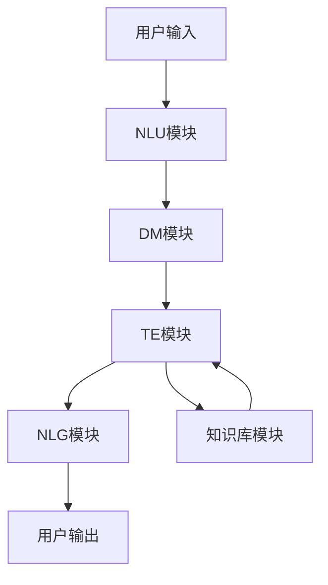

好的,我理解了您的要求。以下是文章正文部分的内容:

# 【大模型应用开发 动手做AI Agent】自动办公好助手

## 1. 背景介绍

### 1.1 问题的由来

在当今快节奏的商业环境中,办公自动化和提高工作效率是许多公司和个人都面临的挑战。传统的办公方式已经无法满足现代化工作的需求,人们需要更智能、更高效的解决方案来应对日益增长的工作量和复杂性。

随着人工智能(AI)技术的不断发展,特别是大型语言模型(Large Language Model,LLM)的出现,为解决办公自动化问题提供了新的契机。大型语言模型通过对海量文本数据进行训练,掌握了丰富的自然语言理解和生成能力,可以被应用于各种场景,如问答系统、文本摘要、内容创作等。

### 1.2 研究现状  

目前,一些科技公司已经开始探索将大型语言模型应用于办公场景。例如,OpenAI的GPT-3模型可用于自动写作、邮件撰写等任务;Anthropic的Claude模型可以作为智能助手,协助完成各种办公工作。但这些产品大多处于初级阶段,功能有限,还无法完全满足复杂办公环境的需求。

同时,研究人员也在积极探索大型语言模型在办公自动化方面的应用潜力。一些学术论文提出了将大型语言模型与其他AI技术(如计算机视觉、规划与决策等)相结合,构建智能办公助理系统的方案。但这些研究大多停留在理论层面,缺乏真实场景的实践和评估。

### 1.3 研究意义

开发一款真正实用的基于大型语言模型的智能办公助理,可以极大地提高办公效率,减轻人们的工作压力。它不仅可以执行简单的重复性任务,还能协助完成更加复杂的决策和创新性工作,为人类办公生活带来全新的体验。

从技术层面来看,将大型语言模型应用于实际的办公场景,需要解决诸多挑战,如多模态交互、任务规划与执行、领域知识融合等,这将推动相关AI技术的创新与发展。同时,通过实践积累的经验,也将为未来的智能办公助理系统奠定基础。

### 1.4 本文结构

本文将全面介绍如何基于大型语言模型开发一款智能办公助理系统。我们将首先阐述系统的核心概念和技术路线,然后深入探讨关键算法原理、数学模型和具体实现细节,并通过案例分析展示系统的实际应用场景。最后,我们将总结研究成果,并对未来的发展趋势和挑战进行展望。

## 2. 核心概念与联系

智能办公助理系统的核心是一个基于大型语言模型的对话代理(Conversational Agent),它能够与用户进行自然语言交互,理解用户的需求并提供相应的服务。该系统由以下几个关键模块组成:

1. **自然语言理解(NLU)模块**: 负责分析用户的自然语言输入,提取意图(Intent)和相关信息。

2. **对话管理(DM)模块**: 根据用户的意图和上下文,规划并执行相应的任务流程。

3. **任务执行(TE)模块**: 完成具体的办公任务,如文本创作、数据分析、文件操作等。

4. **自然语言生成(NLG)模块**: 将任务执行结果转化为自然语言输出,反馈给用户。

5. **知识库(KB)模块**: 存储领域知识和数据资源,为任务执行提供支持。

这些模块通过有机结合,构成了一个端到端的智能办公助理系统。下面是系统的总体架构流程图:

其中,自然语言理解和生成模块依赖于大型语言模型的能力;对话管理模块需要具备任务规划和决策能力;任务执行模块则涉及各种办公领域的专业知识和技能。因此,构建一个高效智能的办公助理系统,需要将大型语言模型与其他AI技术相结合,实现多模块的紧密协作。

## 3. 核心算法原理 & 具体操作步骤  

### 3.1 算法原理概述

智能办公助理系统的核心算法主要包括三个部分:

1. **自然语言理解算法**:将用户的自然语言输入映射为结构化的意图和槽位(Slot)表示。常用的方法有基于规则的方法、基于机器学习的序列标注方法(如条件随机场CRF)、基于注意力机制的神经网络方法等。

2. **对话状态跟踪算法**:跟踪对话过程中的状态变化,维护对话上下文和已获取的信息。主流方法包括基于规则的有限状态机、基于机器学习的隐马尔可夫模型(HMM)、部分可观测马尔可夫决策过程(POMDP)等。

3. **对话策略学习算法**:根据当前对话状态,选择最优的对话行为或系统响应。常见的方法有基于规则的策略、基于监督学习的策略模型(如深度神经网络)、基于强化学习的策略等。

### 3.2 算法步骤详解  

智能办公助理系统的工作流程如下:

1. **自然语言理解**:
   - 将用户的自然语言输入(如"帮我写一份会议纪要")送入NLU模块
   - NLU模块使用序列标注算法(如BiLSTM-CRF)对输入进行分析
   - 提取出用户的意图(如"文本创作")和相关槽位信息(如会议时间、参与人员等)

2. **对话状态跟踪**:
   - 对话管理模块维护一个对话跟踪器,记录当前对话状态
   - 根据NLU模块提取的意图和槽位,更新对话状态
   - 如果缺少某些必要信息(如会议时间),则询问用户补充

3. **对话策略选择**:
   - 对话管理模块根据当前对话状态,使用策略模型(如深度Q网络DQN)选择最优的系统行为
   - 可选行为包括:请求槽位信息、执行任务操作、进行clarification、结束对话等

4. **任务执行**:
   - 如果对话策略是执行任务操作,则激活任务执行模块
   - 任务执行模块根据意图和槽位信息,调用相应的功能模块(如文本创作模块)
   - 利用知识库中的资源(如会议记录模板),完成具体任务

5. **自然语言生成**:  
   - 任务执行模块将结果(如生成的会议纪要文本)传递给NLG模块
   - NLG模块调用大型语言模型,将结果自然化为语言响应
   - 将响应返回给用户,结束本次对话或进入下一轮

以上步骤循环执行,直至完成用户的请求任务。算法的关键在于自然语言理解、对话状态建模和策略选择等环节,需要综合运用多种机器学习技术。

### 3.3 算法优缺点

**优点**:

- 端到端的流程设计,能够灵活处理各种办公场景
- 融合了自然语言处理、对话系统、任务规划等多种AI技术
- 利用大型语言模型的强大能力,可以支持多种自然语言服务
- 模块化设计,每个模块可以单独优化和更新

**缺点**:

- 整体系统复杂,需要大量的训练数据和计算资源 
- 不同模块之间的协作需要精心设计,存在信息传递瓶颈
- 策略学习过程难以充分考虑所有状态和行为的组合  
- 缺乏对常识知识和因果关系的建模能力

### 3.4 算法应用领域

智能办公助理系统可以应用于多个场景:

- 文书办公:会议纪要撰写、邮件处理、文档创作/总结等
- 数据分析:构建报表、数据可视化、统计建模等
- 日程管理:安排会议、处理待办事项、提醒重要事务等  
- 信息检索:根据需求查找相关资料、知识整合等
- 决策辅助:为决策提供建议,风险评估等
- 工作流管理:协调多人协作的工作流程

除了办公场景,该算法也可以扩展到其他领域,如智能客服、教育辅助、健康咨询等,为用户提供个性化的智能服务。

## 4. 数学模型和公式 & 详细讲解 & 举例说明

### 4.1 数学模型构建

智能办公助理系统中,自然语言理解和对话策略学习是两个核心环节,都需要构建数学模型来指导算法设计。

**自然语言理解模型**

自然语言理解任务可以形式化为给定一个输入序列 $X = (x_1, x_2, \ldots, x_n)$,需要预测其对应的标注序列 $Y = (y_1, y_2, \ldots, y_n)$。我们可以使用条件随机场(CRF)作为序列标注模型:

$$P(Y|X) = \frac{1}{Z(X)}\exp\left(\sum_{i=1}^n\sum_{j}\lambda_jt_j(y_{i-1},y_i,X,i)\right)$$

其中:
- $Z(X)$是归一化因子
- $t_j$是特征函数,描述了标注序列与输入序列之间的某些特征
- $\lambda_j$是对应的特征权重

通过对特征函数和权重的设计,CRF可以很好地捕捉序列标注问题中的短程和长程依赖关系。

**对话策略模型**

对话策略学习可以建模为马尔可夫决策过程(MDP):在每个时间步$t$,根据当前状态$s_t$选择一个行为$a_t$,然后获得即时奖励$r_t$,并转移到下一个状态$s_{t+1}$。目标是学习一个策略$\pi$,最大化预期的累积奖励:

$$\pi^* = \arg\max_\pi \mathbb{E}\left[\sum_{t=0}^\infty \gamma^tr_t|s_0=s,\pi\right]$$

其中$\gamma$是折扣因子。

策略$\pi$可以建模为一个深度Q网络(DQN),其输入为当前状态$s_t$,输出是每个可能行为$a$的Q值$Q(s_t,a)$,代表在当前状态下执行该行为的累积奖励。我们选择具有最大Q值的行为作为策略输出:

$$\pi(s_t) = \arg\max_a Q(s_t, a)$$

通过互动过程中不断更新Q网络的参数,可以学习到一个优化的对话策略模型。

### 4.2 公式推导过程

以自然语言理解模型为例,我们来推导CRF的基本公式。

首先,对于一个给定的输入序列$X$和标注序列$Y$,我们定义它们的联合概率为:

$$P(Y|X) = \frac{1}{Z(X)}\exp\left(\sum_{i=1}^n\sum_{j}\lambda_jt_j(y_{i-1},y_i,X,i)\right)$$

其中,分子部分是一个指数形式,包含了所有特征函数的加权和;分母$Z(X)$是个归一化因子,使得$P(Y|X)$对所有可能的$Y$求和为1。

我们来具体推导归一化因子$Z(X)$的计算公式:

$$\begin{aligned}
Z(X) &= \sum_Y \exp\left(\sum_{i=1}^n\sum_{j}\lambda_jt_j(y_{i-1},y_i,X,i)\right)\\
      &= \sum_{y_1}\sum_{y_2}\cdots\sum_{y_n}\exp\left(\sum_{i=1}^n\sum_{j}\lambda_jt_j(y_{i-1},y_i,X,i)\right)\\
      &= \sum_{y_1}\left[\exp\left(\sum_{j}\lambda_jt_j(y_0,y_1,X,1)\right)\sum_{y_2}\exp\left(\sum_{j}\lambda_jt_j(y_1,y_2