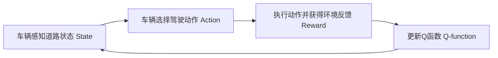

# 一切皆是映射：AI Q-learning在自动驾驶中的应用

关键词：Q-learning, 强化学习, 自动驾驶, 深度学习, 智能决策

## 1. 背景介绍
### 1.1 问题的由来
随着人工智能技术的飞速发展,自动驾驶已经成为当前最热门、最具挑战性的研究领域之一。传统的自动驾驶系统主要依赖于规则和模型的方法,难以应对复杂多变的真实道路环境。因此,如何让自动驾驶系统具备智能决策和自主学习的能力,成为了亟待解决的关键问题。

### 1.2 研究现状
近年来,强化学习作为一种从环境中自主学习的机器学习范式,在自动驾驶领域展现出了巨大的潜力。其中,Q-learning作为一种经典的强化学习算法,以其简单高效的特点受到广泛关注。目前已有不少研究将Q-learning应用于自动驾驶的各个方面,如轨迹规划[1]、车道保持[2]、速度控制[3]等,取得了可喜的成果。

### 1.3 研究意义 
将Q-learning引入自动驾驶系统,可以让车辆像人一样从环境反馈中不断学习和优化策略,提高系统的智能性和鲁棒性。这对于实现更安全、更高效的自动驾驶具有重要意义。同时,Q-learning思想的引入也为自动驾驶系统的设计开辟了新的思路。

### 1.4 本文结构
本文将重点探讨Q-learning在自动驾驶中的应用。首先介绍Q-learning的核心概念和基本原理,然后详细讲解Q-learning算法的数学模型和实现步骤。接着,我们将以一个简单的自动驾驶案例为例,演示如何用Q-learning构建智能决策系统。最后,展望Q-learning在自动驾驶领域的发展前景和面临的挑战。

## 2. 核心概念与联系
Q-learning属于强化学习的范畴,其核心思想是:智能体(agent)通过不断与环境(environment)交互,根据环境的反馈(reward)来学习最优策略(policy),以获得最大的累积奖赏。

在自动驾驶场景下,车辆扮演智能体的角色,道路环境对应强化学习中的环境。车辆根据传感器感知到的道路状态(state)采取相应的驾驶动作(action),如加速、刹车、转向等,环境会根据车辆的动作给出即时反馈(reward),如行驶平稳度、与障碍物之间的距离等。车辆的目标是通过不断尝试和学习,寻找一个最优的驾驶策略,使长期累积奖赏最大化。

Q-learning算法的核心是学习一个Q函数(Q-function),它表示在某个状态下采取某个动作的长期价值。具体而言,Q(s,a)表示智能体在状态s下选择动作a可以获得的累积奖赏的期望。一旦学习到最优的Q函数,智能体的最优策略就是在每个状态下选择Q值最大的动作。下图展示了Q-learning在自动驾驶中的基本框架:



## 3. 核心算法原理 & 具体操作步骤
### 3.1 算法原理概述
Q-learning算法的目标是学习最优Q函数 $Q^*(s,a)$,它满足如下的贝尔曼最优方程(Bellman Optimality Equation):

$$
Q^*(s,a) = R(s,a) + \gamma \max_{a'}Q^*(s',a') 
$$

其中,$R(s,a)$ 表示在状态 $s$ 下采取动作 $a$ 的即时奖赏,$\gamma$ 是折扣因子(discount factor),表示对未来奖赏的重视程度,$s'$ 表示采取动作 $a$ 后转移到的新状态。

Q-learning算法采用值迭代(value iteration)的思想,通过不断迭代更新Q函数来逼近最优Q函数:

$$
Q(s,a) \leftarrow Q(s,a) + \alpha [R(s,a) + \gamma \max_{a'}Q(s',a') - Q(s,a)]
$$

其中,$\alpha$ 是学习率(learning rate),控制每次更新的幅度。

### 3.2 算法步骤详解
Q-learning算法的具体步骤如下:

1. 初始化Q函数 $Q(s,a)$,对所有状态动作对,初始化为0或随机值。
2. 重复以下步骤直到收敛或达到最大训练轮数:
   1) 智能体处于当前状态 $s$
   2) 根据某种策略(如 $\epsilon$-greedy)选择动作 $a$
   3) 执行动作 $a$,观察环境反馈的即时奖赏 $r$ 和新状态 $s'$  
   4) 根据上面的更新公式更新 $Q(s,a)$
   5) $s \leftarrow s'$
3. 输出最终学到的Q函数

在实际应用中,由于状态和动作空间往往很大,我们通常用函数近似(function approximation)的方法来表示Q函数,如深度神经网络。将Q函数参数化为 $Q(s,a;\theta)$,其中 $\theta$ 为网络参数,然后利用随机梯度下降等优化算法来学习最优参数。

### 3.3 算法优缺点
Q-learning算法的主要优点有:
- 简单易实现,适用于离散状态和动作空间
- 能够从经验数据中自主学习,不需要环境模型
- 能够收敛到最优策略

但Q-learning也存在一些局限:
- 难以处理连续状态和动作空间
- 需要大量的训练数据和训练时间
- 容易受到奖赏函数设计的影响

### 3.4 算法应用领域
除了自动驾驶,Q-learning还被广泛应用于机器人控制、智能电网、推荐系统、游戏AI等诸多领域。

## 4. 数学模型和公式 & 详细讲解 & 举例说明
### 4.1 数学模型构建
我们考虑一个简单的自动驾驶场景:车辆在单车道上行驶,状态空间为车速 $v$,动作空间为加速度 $a$,目标是尽可能快速平稳地行驶,同时避免碰撞。我们可以将该场景建模为一个马尔可夫决策过程(MDP):
- 状态空间 $\mathcal{S}$:车速 $v \in [0,v_{max}]$ 
- 动作空间 $\mathcal{A}$:加速度 $a \in [a_{min},a_{max}]$
- 状态转移函数 $\mathcal{P}$:$v' = v + a\Delta t$
- 奖赏函数 $\mathcal{R}$:
$$
R(s,a) = 
\begin{cases}
-10 & v' < 0 \text{ or } v' > v_{max} \text{ (碰撞)} \\ 
-1 & |a| > a_{comfort} \text{ (不适)} \\
v'\Delta t & \text{otherwise (行驶距离)}
\end{cases}
$$

其中,$\Delta t$ 是时间步长,$a_{comfort}$ 是舒适加速度阈值。奖赏函数的设计体现了我们对车辆行驶的要求:尽量快速(奖励行驶距离),但要平稳(惩罚过大加速度),同时避免碰撞(严厉惩罚)。

### 4.2 公式推导过程
根据Q-learning算法,我们的目标是学习最优Q函数:

$$
Q^*(s,a) = R(s,a) + \gamma \max_{a'}Q^*(s',a') 
$$

将奖赏函数 $\mathcal{R}$ 代入,展开得:

$$
Q^*(v,a) = 
\begin{cases}
-10 + \gamma \max_{a'}Q^*(v',a') & v' < 0 \text{ or } v' > v_{max} \\
-1 + \gamma \max_{a'}Q^*(v',a') & |a| > a_{comfort} \\  
v'\Delta t + \gamma \max_{a'}Q^*(v',a') & \text{otherwise}
\end{cases}
$$

其中,$ v' = v + a\Delta t$。我们的任务就是通过不断与环境交互,来学习逼近上述最优Q函数。

### 4.3 案例分析与讲解
我们用一个简单例子来说明Q-learning的学习过程。假设当前状态为 $v=5m/s$,智能体选择动作 $a=1m/s^2$,环境反馈即时奖赏 $r=1$,新状态为 $v'=6m/s$。我们用Q表格(Q-table)的形式来表示Q函数,假设学习率 $\alpha=0.1$,折扣因子 $\gamma=0.9$,则Q表格的更新过程如下:

$$
\begin{aligned}
Q(5,1) &\leftarrow Q(5,1) + \alpha [r + \gamma \max_{a'}Q(6,a') - Q(5,1)] \\
&= Q(5,1) + 0.1 \times [1 + 0.9 \times \max_{a'}Q(6,a') - Q(5,1)]
\end{aligned}
$$

假设 $\max_{a'}Q(6,a')=2.0$,原来的 $Q(5,1)=1.5$,则更新后的 $Q(5,1)=1.5+0.1\times[1+0.9\times2.0-1.5]=1.53$。可见,Q值向着真实Q值 $r + \gamma \max_{a'}Q(6,a')=1+0.9\times2.0=2.8$ 的方向更新了一步。随着学习的进行,Q表格中的值会不断被更新,最终收敛到最优Q函数。

### 4.4 常见问题解答
**Q: Q-learning能否处理连续状态和动作空间?**
A: 传统Q-learning假设离散状态和动作空间,无法直接处理连续问题。但我们可以采用函数近似的方法,用深度神经网络来拟合Q函数,将其推广到连续空间,称为Deep Q-Network(DQN)。

**Q: Q-learning收敛的条件是什么?**
A: Q-learning的收敛性需要满足以下条件:
1. 所有状态动作对都要被无限次访问到; 
2. 学习率满足 $\sum_t \alpha_t(s,a)=\infty$ 和 $\sum_t \alpha_t^2(s,a)<\infty$;
3. 折扣因子 $\gamma<1$。

在实践中,我们通常采用 $\epsilon$-greedy探索策略来访问所有状态动作对,并使用衰减的学习率。

## 5. 项目实践：代码实例和详细解释说明
### 5.1 开发环境搭建
我们使用Python和OpenAI Gym库来实现一个简单的自动驾驶Q-learning案例。首先安装依赖:

```
pip install gym numpy matplotlib
```

### 5.2 源代码详细实现
下面是完整的Q-learning代码实现:

```python
import gym
import numpy as np
import matplotlib.pyplot as plt

# 超参数
N_STATES = 20   # 速度离散化为20个区间
N_ACTIONS = 5   # 加速度离散化为5个区间
EPSILON = 0.9   # epsilon-greedy策略的参数
ALPHA = 0.1     # 学习率
GAMMA = 0.9    # 折扣因子
MAX_EPISODES = 500  # 最大训练轮数

class QLearningAgent:
    def __init__(self, n_states, n_actions, epsilon, alpha, gamma):
        self.n_states = n_states
        self.n_actions = n_actions
        self.epsilon = epsilon
        self.alpha = alpha
        self.gamma = gamma
        self.Q = np.zeros((n_states, n_actions))
        
    def choose_action(self, state):
        if np.random.uniform() < self.epsilon:
            action = np.argmax(self.Q[state, :])
        else:
            action = np.random.choice(self.n_actions)
        return action
        
    def update(self, state, action, reward, next_state):
        self.Q[state, action] += self.alpha * (reward + self.gamma * np.max(self.Q[next_state, :]) - self.Q[state, action])

# 离散化状态和动作空间
def discretize_state(state):
    v_min, v_max = 0, 20
    state = (state - v_min) / (v_max - v_min) * N_STATES
    return int(state)

def discretize_action(action):
    a_min, a_max = -2, 