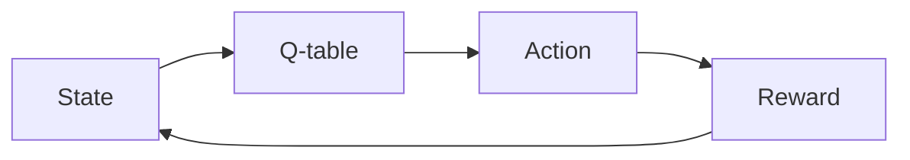

# 一切皆是映射：AI Q-learning转化策略实战

## 1. 背景介绍
### 1.1  问题的由来
人工智能和机器学习领域一直在探索如何让机器像人一样学习和做决策。强化学习作为一种重要的机器学习范式,旨在让智能体(agent)通过与环境的交互来学习最优策略,以获得最大的累积奖励。而Q-learning作为一种经典的无模型、离线策略的强化学习算法,为解决这一问题提供了重要思路。

然而,Q-learning在实际应用中仍面临一些挑战:状态空间和动作空间过大导致Q表难以存储和更新、难以应对连续状态空间、难以有效利用先验知识等。为了克服这些局限,研究者们提出了多种Q-learning的改进算法和策略,如Deep Q Network(DQN)、Double DQN、Policy Gradient等。这些算法在一定程度上提升了Q-learning的性能,但在工程实践中如何更好地应用这些策略,将其与业务场景相结合,仍是一个值得深入探讨的问题。

### 1.2  研究现状
近年来,围绕Q-learning的研究和应用取得了长足进展。DeepMind提出的DQN算法成功地将深度学习与Q-learning结合,在Atari游戏中取得了超越人类的成绩[1]。此后,Double DQN[2]、Dueling DQN[3]、Prioritized Experience Replay[4]等改进算法相继被提出,进一步提升了DQN的性能和稳定性。

除了算法改进,研究者们还探索了Q-learning在不同领域的应用。如在自动驾驶领域,Q-learning被用于智能体的决策控制[5];在推荐系统领域,Q-learning被用于构建用户画像和生成推荐[6];在智能电网领域,Q-learning被用于需求响应和能源管理[7]。这些研究表明,Q-learning在实际问题中具有广阔的应用前景。

### 1.3  研究意义
尽管Q-learning取得了诸多进展,但在实际应用中如何将其与业务场景深度融合,提升算法的可解释性和适用性,仍是亟待解决的问题。本文旨在探讨Q-learning的内在机制和优化策略,并结合实际项目,给出Q-learning的最佳实践范式。

一方面,本文从数学和代码的角度,深入剖析Q-learning的原理,并提出将"映射"作为Q-learning的核心思想,从而增强算法的可解释性。另一方面,本文总结了Q-learning在实际项目中的常见问题和解决方案,并给出了代码实例,为工程实践提供了重要参考。

本文的研究对于推动Q-learning在更多领域的应用具有重要意义。通过提升Q-learning的可解释性和工程适用性,可以帮助开发者更好地理解和运用这一算法,加速其在智能系统中的落地。同时,本文厘清了Q-learning的内在机制和外在表现,为算法的进一步优化指明了方向。

### 1.4  本文结构
本文共分为九个部分。第一部分介绍研究背景和意义;第二部分阐述Q-learning的核心概念;第三部分详细讲解Q-learning的算法原理和操作步骤;第四部分建立Q-learning的数学模型,并给出公式推导和案例分析;第五部分通过代码实例,展示Q-learning的具体实现;第六部分讨论Q-learning在不同场景下的应用;第七部分推荐Q-learning的学习资源和开发工具;第八部分总结全文,展望Q-learning的未来发展方向和挑战;第九部分为附录,解答Q-learning的常见问题。

## 2. 核心概念与联系
Q-learning的核心概念可以归纳为以下几点:

- Agent(智能体):与环境交互,根据观察到的状态采取行动,并获得相应的奖励,目标是最大化累积奖励。
- Environment(环境):Agent所处的环境,接收Agent的动作,并返回新的状态和奖励。
- State(状态):环境在某一时刻的表征,Agent根据状态选择动作。
- Action(动作):Agent在某一状态下可以采取的行为选择。
- Reward(奖励):环境对Agent动作的即时反馈,引导Agent学习最优策略。
- Policy(策略):Agent的行为准则,即在每一个状态下应该采取的动作。最优策略可以使累积奖励最大化。
- Q-value(Q值):在某一状态下采取某一动作的期望累积奖励,Q-learning的目标就是学习最优的Q值函数。
- Q-table(Q表):存储每一个状态-动作对的Q值,用于Q值的更新和策略的生成。

这些概念环环相扣,共同构建了Q-learning的理论框架。Agent通过与Environment交互,不断更新Q-table中的Q值,最终学习到最优Policy。整个过程可以看作是一系列"映射"的迭代优化:



这里的箭头代表了一种"映射"关系:State映射到Q-table,Q-table映射到Action,Action映射到Reward,Reward又影响下一个State。Q-learning的本质,就是通过不断调整这些映射,使得Agent在与环境的交互中获得最大累积奖励。

## 3. 核心算法原理 & 具体操作步骤
### 3.1  算法原理概述
Q-learning的核心思想是通过值迭代来更新Q值函数。在每一个时间步,Agent观察到当前状态s,采取动作a,获得奖励r,并转移到下一个状态s'。然后,根据下一个状态s'的最大Q值来更新当前状态动作对(s,a)的Q值:

$$Q(s,a) \leftarrow Q(s,a) + \alpha [r + \gamma \max_{a'}Q(s',a') - Q(s,a)]$$

其中,$\alpha$是学习率,$\gamma$是折扣因子。这个更新公式可以理解为:当前Q值向"实际Q值"(即奖励r加上下一状态的最大Q值$\max_{a'}Q(s',a')$)逼近,学习率$\alpha$控制逼近的速度,折扣因子$\gamma$控制未来奖励的重要程度。

通过反复迭代更新Q值,Q-learning最终能够收敛到最优Q值函数,从而得到最优策略。这个过程可以用下面的伪代码表示:

```
Initialize Q(s,a) arbitrarily
Repeat (for each episode):
    Initialize s
    Repeat (for each step of episode):
        Choose a from s using policy derived from Q (e.g., ε-greedy)
        Take action a, observe r, s'
        Q(s,a) ← Q(s,a) + α [r + γ maxa' Q(s',a') - Q(s,a)]
        s ← s';
    until s is terminal
```

可以看出,Q-learning是一种无模型(model-free)、异策略(off-policy)的时序差分学习方法。它不需要环境的转移概率模型,通过异策略(如ε-greedy)来平衡探索和利用,并使用时序差分来更新Q值。

### 3.2  算法步骤详解
下面,我们对Q-learning的算法步骤进行详细讲解。

**步骤1:初始化Q表**
在开始学习之前,我们需要初始化一个Q表来存储每个状态-动作对的Q值。Q表的大小为$|S| \times |A|$,其中$|S|$是状态空间的大小,$|A|$是动作空间的大小。Q值可以随机初始化,也可以根据先验知识设置初值。

**步骤2:选择动作**
在每个状态s,Agent需要选择一个动作a。Q-learning常用ε-greedy策略来选择动作:以概率ε随机选择动作(探索),以概率1-ε选择Q值最大的动作(利用)。这样可以在探索和利用之间取得平衡,避免过早陷入局部最优。

**步骤3:执行动作并观察奖励**
Agent执行选定的动作a,环境返回奖励r和下一个状态s'。这一步是Agent与环境交互的核心,奖励r反映了动作a的好坏,下一状态s'为Agent提供了新的决策信息。

**步骤4:更新Q值**
根据观察到的奖励r和下一状态s',Agent使用Q-learning的更新公式来更新当前状态动作对(s,a)的Q值:

$$Q(s,a) \leftarrow Q(s,a) + \alpha [r + \gamma \max_{a'}Q(s',a') - Q(s,a)]$$

这里的$\max_{a'}Q(s',a')$表示在下一状态s'下,选择Q值最大的动作a'。通过这种方式,Q值向"实际Q值"逼近,不断优化Agent的决策。

**步骤5:状态转移**
将当前状态s更新为下一状态s',继续下一轮迭代。

**步骤6:终止条件判断**
如果当前状态s为终止状态(如游戏结束),则停止当前episode,重新开始新的episode。否则,返回步骤2,继续迭代。

Q-learning的收敛性保证来自Bellman最优方程。通过不断迭代更新Q值,Q-learning最终能够收敛到最优Q值函数,从而得到最优策略。但在实际应用中,我们往往在有限的时间内停止迭代,得到一个近似最优的Q值函数。

### 3.3  算法优缺点
Q-learning作为一种经典的强化学习算法,具有以下优点:

- 无模型学习:不需要事先知道环境的转移概率模型,通过与环境的交互来学习最优策略。
- 异策略学习:可以使用与目标策略不同的行为策略(如ε-greedy)来产生数据,提高了数据利用效率。
- 简单有效:Q-learning的思想简单直观,容易实现,在许多问题上都取得了不错的效果。

但Q-learning也存在一些局限性:

- 维数灾难:当状态和动作空间过大时,Q表难以存储和更新,时间和空间复杂度急剧上升。
- 离散限制:传统Q-learning只适用于离散状态和动作空间,难以处理连续问题。
- 采样效率低:Q-learning需要大量的数据来更新Q值,采样效率较低,学习速度慢。
- 过估计问题:Q-learning使用max操作来更新Q值,容易导致Q值的过估计,影响学习的稳定性。

针对这些问题,研究者们提出了多种改进方法,如函数近似、Experience Replay、Double Q-learning等,在一定程度上缓解了Q-learning的局限性。

### 3.4  算法应用领域
Q-learning在许多领域都有广泛应用,包括:

- 游戏:如Atari游戏、围棋、德州扑克等,Q-learning可以通过自我对弈来学习最优策略。
- 机器人控制:如自动驾驶、机械臂操作等,Q-learning可以学习连续动作空间下的最优控制策略。
- 推荐系统:如电商推荐、新闻推荐等,Q-learning可以根据用户反馈动态调整推荐策略。
- 通信网络:如路由选择、资源分配等,Q-learning可以在动态网络环境下寻找最优决策。
- 能源管理:如智能电网调度、可再生能源优化等,Q-learning可以适应不确定的能源供需平衡需求。

这些应用表明,Q-learning是一种通用的决策优化算法,在智能系统领域有广阔的应用前景。同时,Q-learning在不同领域的应用也促进了算法本身的发展,催生出许多领域特定的改进方法。

## 4. 数学模型和公式 & 详细讲解 & 举例说明
### 4.1  数学模型构建
Q-learning可以用马尔可夫决策过程(Markov Decision Process, MDP)来建模。一个MDP由以下元素组成:

- 状态空间S:所有可能的状态s的集合。
- 动作空间A:所有可能的动作a的集合。
- 转移概率P:状态转移的概率分布,P(s'|s,a)表示在状态s下执行动作a后转移到状态s'的概率。
- 奖励函数R:在状态s下执行动作a后获得的即时奖励r,r = R(s,a)。
- 折扣因子γ:未来奖励的折扣系数,γ∈[0,1]。γ越大,表示对未来奖励的重视程度越高。

MDP的目标是寻找一个最优策略π,