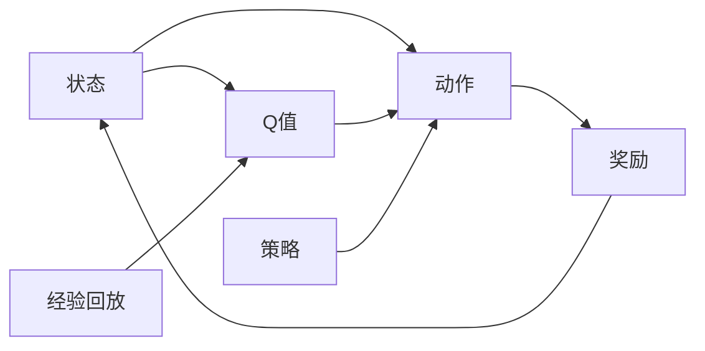

# 一切皆是映射：DQN的模型评估与性能监控方法

关键词：深度强化学习、DQN、模型评估、性能监控、映射

## 1. 背景介绍
### 1.1  问题的由来
深度强化学习（Deep Reinforcement Learning，DRL）是近年来人工智能领域的一个研究热点。其中，深度Q网络（Deep Q-Network，DQN）作为DRL的代表性算法之一，在许多领域取得了突破性进展，如游戏、机器人、自然语言处理等。然而，DQN模型的评估与性能监控一直是一个亟待解决的问题。传统的评估方法难以全面评估DQN模型的性能，缺乏有效的性能监控手段，导致模型调优困难，上线风险大。

### 1.2  研究现状
目前，针对DQN模型评估与性能监控的研究主要集中在以下几个方面：
1. 基于奖励函数的评估方法。通过设计合理的奖励函数，评估模型在特定任务上的性能。但奖励函数的设计需要领域知识，且难以全面评估模型性能。

2. 基于人工评估的方法。通过人工观察模型行为，主观评判模型性能。但人工评估耗时耗力，且评估结果易受主观因素影响。

3. 基于可视化的性能监控方法。通过可视化技术实时监控模型的状态变化。但可视化方法只能监控特定指标，难以全面评估模型性能。

### 1.3  研究意义
DQN模型评估与性能监控的研究意义主要体现在以下几个方面：

1. 提高模型性能。通过全面评估模型性能，发现并解决模型存在的问题，可以显著提升模型性能。

2. 降低上线风险。通过实时监控模型性能，及时发现并处理异常情况，可以大幅降低模型上线风险。

3. 加速模型迭代。通过自动化的评估与监控手段，可以显著加快模型迭代速度，缩短开发周期。

### 1.4  本文结构
本文将从以下几个方面展开论述：
- 第2部分介绍DQN的核心概念与原理
- 第3部分详细讲解DQN的核心算法原理与具体操作步骤
- 第4部分建立DQN的数学模型，并通过公式推导与案例分析加以说明
- 第5部分给出DQN的代码实例，并进行详细解释说明
- 第6部分讨论DQN在实际场景中的应用情况
- 第7部分推荐DQN相关的工具与学习资源
- 第8部分总结全文，展望DQN的未来发展趋势与面临的挑战
- 第9部分列出常见问题与解答

## 2. 核心概念与联系
DQN的核心概念包括：
- 状态(State)：环境的当前状况，通常用特征向量表示。
- 动作(Action)：智能体可执行的操作，如移动、攻击等。
- 奖励(Reward)：环境对智能体动作的反馈，用数值表示。
- 策略(Policy)：智能体选择动作的规则，即状态到动作的映射。
- Q值(Q-value)：状态-动作对的价值，表示在某状态下采取某动作的长期回报。
- 经验回放(Experience Replay)：用于打破数据关联性和提高样本利用率的技术。

这些概念间的联系可用下图表示：



智能体根据当前状态，使用策略选择动作，执行后环境返回奖励并转移到新状态。同时将状态转移过程存入经验回放池。智能体通过不断更新Q值（价值函数），优化策略，最终获得最优策略。

## 3. 核心算法原理 & 具体操作步骤
### 3.1  算法原理概述
DQN通过深度神经网络（DNN）逼近最优Q函数，将高维状态映射到动作价值。DQN的核心思想是：
1. 使用DNN作为Q函数的近似，输入为状态，输出为各动作的Q值。
2. 采用经验回放和固定Q目标技术，解决数据关联性和不稳定性问题。
3. 使用贪婪策略选择动作，平衡探索和利用。
4. 定期更新目标Q网络，提高训练稳定性。

### 3.2  算法步骤详解
DQN的具体训练步骤如下：
1. 初始化经验回放池D，容量为N；初始化Q网络参数θ，目标Q网络参数θ'=θ
2. for episode = 1, M do
3.    初始化初始状态s1
4.    for t = 1, T do
5.       使用ε-贪婪策略，根据Q网络选择动作at
6.       执行动作at，观察奖励rt和新状态st+1
7.       将转移(st, at, rt, st+1)存入D
8.       从D中随机采样一个批次的转移样本(s, a, r, s')
9.       计算目标Q值：
          if s'为终止状态：y = r
          else：y = r + γ max Q'(s', a'; θ')
10.      最小化损失：L(θ) = E[(y - Q(s, a; θ))^2]
11.      每C步同步目标Q网络参数：θ' = θ
12.   end for
13. end for

其中，γ为折扣因子，ε为探索概率，Q'为目标Q网络，C为同步频率。

### 3.3  算法优缺点
DQN的主要优点包括：
- 端到端的学习方式，不需要人工设计特征
- 通过经验回放提高数据利用率，打破数据关联性
- 使用目标Q网络提高训练稳定性
- 通过ε-贪婪策略平衡探索和利用

DQN的主要缺点包括：
- 难以应用于连续动作空间
- 对超参数敏感，调参困难
- 在稀疏奖励环境中探索效率低
- 难以学习长期依赖

### 3.4  算法应用领域
DQN广泛应用于以下领域：
- 游戏：如Atari、星际争霸等
- 机器人：如机械臂控制、自动驾驶等  
- 推荐系统：如电商推荐、广告投放等
- 通信：如动态信道分配、基站休眠等
- 自然语言处理：如对话系统、机器翻译等

## 4. 数学模型和公式 & 详细讲解 & 举例说明
### 4.1  数学模型构建
DQN可用马尔可夫决策过程（MDP）建模，一个MDP由四元组(S, A, P, R)定义：
- 状态空间S：有限状态集合
- 动作空间A：有限动作集合 
- 状态转移概率P：P(s'|s,a)表示在状态s下采取动作a转移到状态s'的概率
- 奖励函数R：R(s,a)表示在状态s下采取动作a获得的即时奖励

MDP的目标是寻找一个最优策略π：S->A，使得累积期望奖励最大化：

$$
\pi^* = \arg\max_{\pi} \mathbb{E} \left[ \sum_{t=0}^{\infty} \gamma^t R(s_t, \pi(s_t)) \right]
$$

其中，γ为折扣因子，t为时间步。

定义状态-动作值函数（Q函数）为：

$$
Q^{\pi}(s,a) = \mathbb{E} \left[ \sum_{t=0}^{\infty} \gamma^t R(s_t, a_t) | s_0=s, a_0=a, \pi \right]
$$

表示从状态s开始，采取动作a，之后遵循策略π所获得的累积期望奖励。

最优Q函数定义为：

$$
Q^*(s,a) = \max_{\pi} Q^{\pi}(s,a)
$$

贝尔曼最优方程为：

$$
Q^*(s,a) = R(s,a) + \gamma \sum_{s'\in S} P(s'|s,a) \max_{a'} Q^*(s',a')
$$

### 4.2  公式推导过程
DQN使用DNN逼近Q函数，即：

$$
Q(s,a;\theta) \approx Q^*(s,a)
$$

其中，θ为DNN参数。

DQN的损失函数定义为：

$$
L(\theta) = \mathbb{E}_{(s,a,r,s')\sim D} \left[ \left( r + \gamma \max_{a'} Q(s',a';\theta') - Q(s,a;\theta) \right)^2 \right]
$$

其中，(s,a,r,s')为从经验回放池D中采样的转移样本，θ'为目标Q网络参数。

DQN通过最小化损失函数来更新Q网络参数：

$$
\theta \leftarrow \theta - \alpha \nabla_{\theta} L(\theta)
$$

其中，α为学习率。

### 4.3  案例分析与讲解
以Atari游戏Breakout为例，说明DQN的工作原理。

Breakout的状态为游戏画面，动作空间包含三个动作：左移、右移和不动。奖励为击中砖块的得分。

DQN的输入为当前状态（游戏画面），输出为三个动作的Q值。DQN通过不断与环境交互，收集(s,a,r,s')样本，并用于训练Q网络。

在每个时间步，DQN根据ε-贪婪策略选择动作：以ε的概率随机选择动作，否则选择Q值最大的动作。执行动作后，环境返回奖励和新状态，DQN将(s,a,r,s')存入经验回放池。

DQN从经验回放池中随机采样一批样本，计算目标Q值，并最小化损失函数，更新Q网络参数。同时，每隔一定步数将Q网络参数复制给目标Q网络。

通过不断迭代，DQN最终学习到最优策略，即在每个状态下选择Q值最大的动作，最大化累积奖励。

### 4.4  常见问题解答
**Q1: DQN能否处理连续状态和动作空间？**

A1: DQN原本只能处理离散状态和动作空间。对于连续状态空间，可以使用函数逼近（如DNN）将其映射到离散空间。对于连续动作空间，可以使用Actor-Critic等其他算法。

**Q2: DQN的收敛性如何？**

A2: DQN理论上能收敛到最优策略，但实际中受探索策略、网络结构、超参数等影响，难以保证收敛性。可以通过合理设置超参数、使用Double DQN等改进方法提高收敛性。

**Q3: DQN的样本效率如何？**

A3: DQN通过经验回放提高样本利用率，但在稀疏奖励环境中探索效率较低。可以使用优先级经验回放、内在奖励等方法提高样本效率。

**Q4: DQN能否处理部分可观察环境？**

A4: DQN假设环境是完全可观察的，即状态信息完整。对于部分可观察环境，可以使用DRQN等基于RNN的方法，将历史观察编码为状态表示。

## 5. 项目实践：代码实例和详细解释说明
### 5.1  开发环境搭建
- Python 3.x
- PyTorch 1.x
- OpenAI Gym
- NumPy
- Matplotlib

### 5.2  源代码详细实现
```python
import torch
import torch.nn as nn
import torch.optim as optim
import numpy as np
import random
from collections import deque

class DQN(nn.Module):
    def __init__(self, state_dim, action_dim):
        super(DQN, self).__init__()
        self.fc1 = nn.Linear(state_dim, 64)
        self.fc2 = nn.Linear(64, 64)
        self.fc3 = nn.Linear(64, action_dim)
        
    def forward(self, x):
        x = torch.relu(self.fc1(x))
        x = torch.relu(self.fc2(x))
        x = self.fc3(x)
        return x
    
class ReplayBuffer:
    def __init__(self, capacity):
        self.buffer = deque(maxlen=capacity) 
    
    def push(self, state, action, reward, next_state, done):
        self.buffer.append((state, action, reward, next_state, done))
    
    def sample(self, batch_size):
        batch = random.sample(self.buffer, batch_size)
        states, actions, rewards, next_states, dones = zip(*batch)
        return np.array(states), np.array(actions), np