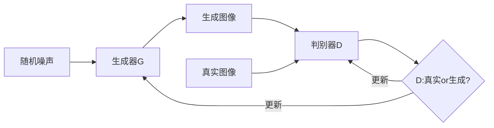

# 一切皆是映射：GAN在艺术创作中的应用实例

关键词：生成对抗网络(GAN)、深度学习、艺术创作、神经网络、计算机视觉

## 1. 背景介绍

### 1.1 问题的由来

随着人工智能技术的飞速发展,机器学习尤其是深度学习在计算机视觉、自然语言处理等领域取得了突破性进展。近年来,一种名为生成对抗网络(Generative Adversarial Networks, GAN)的深度学习模型引起了广泛关注。GAN 通过生成器和判别器的对抗学习,可以生成与真实样本极其相似的合成图像。这一特性使得 GAN 在艺术创作领域有着广阔的应用前景。

### 1.2 研究现状

自从 2014 年 Ian Goodfellow 等人提出 GAN 以来,相关研究如雨后春笋般涌现。各种 GAN 变体被提出用于图像生成、图像翻译、图像编辑等任务。比如 DCGAN、CycleGAN、Pix2Pix、StyleGAN 等。一些艺术家和研究者开始尝试用 GAN 进行艺术创作,并取得了惊艳的效果。著名艺术家 Mario Klingemann 用 GAN 生成了一系列超现实主义风格的肖像画,引发了广泛讨论。Christie's 拍卖行以 43 万美元的价格拍卖了一幅 AI 生成的画作,这是首次 AI 艺术品进入主流拍卖市场。

### 1.3 研究意义

GAN 等深度学习模型为艺术创作开辟了全新的可能性。传统艺术创作依赖艺术家的灵感和技巧,而 AI 可以作为艺术家的助手和延伸,激发更多创意灵感,挖掘更广阔的艺术表现空间。同时,AI 艺术也引发了关于创造力本质、艺术归属等问题的思考。研究 GAN 在艺术创作中的应用,有助于我们更好地理解人工智能与艺术的关系,探索科技与人文的融合。

### 1.4 本文结构

本文将首先介绍 GAN 的核心概念和基本原理,然后重点探讨 GAN 在艺术创作中的应用实例,包括图像风格迁移、新颖图像生成等。同时给出 GAN 艺术创作的数学模型和算法实现细节。最后,本文将畅想 GAN 艺术的发展前景和面临的挑战。

## 2. 核心概念与联系

生成对抗网络(GAN)由生成器(Generator)和判别器(Discriminator)两个神经网络组成。生成器的目标是生成尽可能逼真的假样本去欺骗判别器,而判别器要去判断输入的样本是生成器生成的还是来自真实数据集。两个网络在训练过程中互相博弈,最终使生成器生成的图像与真实图像难以区分。

GAN 常用于以下任务:

- 图像生成:根据随机噪声生成指定类别的图像
- 图像翻译:将图像从一个域转换到另一个域,例如黑白照片上色
- 图像编辑:根据文本描述或属性标签修改图像
- 图像补全:补全图像中缺失的部分
- 超分辨率:将低分辨率图像转换为高分辨率图像

这些任务都可以用于艺术创作,例如:

- 根据艺术家的画风生成新的艺术作品
- 将照片转换为油画、水彩画等艺术风格 
- 根据文字描述生成对应的插图
- 修复残缺的古代艺术品图像
- 将草图转换为高清图像

GAN 实现艺术创作的核心在于学习艺术图像的内在分布,并根据这种分布生成新颖和逼真的艺术图像。GAN 可以作为艺术家的创意助手,提供灵感和素材,但同时艺术家的审美和创造力也是不可或缺的。

## 3. 核心算法原理 & 具体操作步骤

### 3.1 算法原理概述

GAN 的核心思想是让两个神经网络相互博弈。生成器 G 接收一个随机噪声向量 z 作为输入,将其映射到图像空间,生成假图像。判别器 D 接收一张图像作为输入,输出该图像为真实图像的概率。训练过程中,生成器努力欺骗判别器,而判别器努力distinguishing 真假图像。博弈的目标可以表示为如下的极小极大问题:

$$ \min_G \max_D V(D,G) = \mathbb{E}_{x \sim p_{data}(x)}[\log D(x)] + \mathbb{E}_{z \sim p_z(z)}[\log (1 - D(G(z)))] $$

其中 $p_{data}$ 为真实数据分布, $p_z$ 为随机噪声分布。

### 3.2 算法步骤详解

GAN 的训练算法可分为以下步骤:

1. 初始化生成器 G 和判别器 D 的参数
2. 重复以下步骤直到收敛:
   1) 随机采样一批真实图像 $\{x^{(1)}, \dots, x^{(m)}\}$
   2) 随机采样一批噪声样本 $\{z^{(1)}, \dots, z^{(m)}\}$
   3) 用采样的噪声生成一批假图像 $\{\tilde{x}^{(1)}, \dots, \tilde{x}^{(m)}\}$,其中 $\tilde{x}^{(i)} = G(z^{(i)})$  
   4) 更新判别器参数以最大化目标函数:
      
      $\nabla_{\theta_d} \frac{1}{m} \sum_{i=1}^m [\log D(x^{(i)}) + \log (1 - D(\tilde{x}^{(i)}))]$
   5) 随机采样一批噪声样本 $\{z^{(1)}, \dots, z^{(m)}\}$
   6) 更新生成器参数以最小化目标函数:
     
      $\nabla_{\theta_g} \frac{1}{m} \sum_{i=1}^m \log (1 - D(G(z^{(i)})))$

### 3.3 算法优缺点

GAN 的优点在于:
- 可生成高质量、细节丰富的图像
- 可应用于多种图像生成和编辑任务
- 通过端到端训练,不需要复杂的人工特征工程

GAN 的缺点包括:
- 训练不稳定,容易出现模式崩溃现象
- 生成多样性不足,容易过拟合
- 对超参数敏感,调参复杂
- 缺乏可解释性,生成图像不可控

### 3.4 算法应用领域

除了艺术创作,GAN 还被广泛应用于以下领域:

- 计算机视觉:图像生成、图像翻译、超分辨率等
- 医学影像:合成医学图像数据、图像增强等  
- 视频生成:根据文本生成视频、视频预测等
- 语音合成:语音转换、语音增强等
- 时尚:虚拟试衣、服装设计等
- 游戏:游戏场景生成、角色生成等

## 4. 数学模型和公式 & 详细讲解 & 举例说明

### 4.1 数学模型构建

GAN 的数学模型可以表示为一个二人极小极大博弈:

$$\min_G \max_D V(D,G) = \mathbb{E}_{x \sim p_{data}(x)}[\log D(x)] + \mathbb{E}_{z \sim p_z(z)}[\log (1 - D(G(z)))]$$

其中 $D(x)$ 表示判别器给定输入 $x$ 为真实图像的概率,$G(z)$ 表示生成器给定随机噪声 $z$ 生成的图像。

判别器的目标是最大化真实图像的对数概率和生成图像的负对数概率之和。直观地说,就是要尽可能准确地判断真实图像和生成图像。

生成器的目标是最小化生成图像被判别为假的对数概率。直观地说,就是要尽可能欺骗判别器,使其无法判断生成图像是假的。

### 4.2 公式推导过程

令 $p_g$ 表示生成器 $G(z)$ 的分布,上述博弈可以重新表述为:

$$\min_G \max_D V(G, D) = \int_x p_{data}(x) \log D(x)dx + \int_z p_z(z) \log (1-D(G(z))) dz$$

$$= \int_x p_{data}(x) \log D(x) + p_g(x) \log (1-D(x)) dx$$

最优判别器 $D$ 满足:

$$D^*_G(x) = \frac{p_{data}(x)}{p_{data}(x) + p_g(x)}$$

将最优判别器 $D^*_G$ 代入目标函数:

$$\begin{aligned}
C(G) &= \max_D V(G, D) \\
&= \mathbb{E}_{x \sim p_{data}} [\log D^*_G(x)] + \mathbb{E}_{x \sim p_g}[\log (1 - D^*_G(x))] \\
&= \mathbb{E}_{x \sim p_{data}} [\log \frac{p_{data}(x)}{p_{data}(x) + p_g(x)}] + \mathbb{E}_{x \sim p_g}[\log \frac{p_g(x)}{p_{data}(x)+p_g(x)}] \\
&= -\log 4 + KL(p_{data} \| \frac{p_{data}+p_g}{2}) + KL(p_g \| \frac{p_{data}+p_g}{2})\\
&= -\log 4 + 2 \cdot JSD(p_{data} \| p_g)
\end{aligned}$$

其中 $KL$ 表示KL散度,$JSD$ 表示Jensen-Shannon散度。可以看出,最小化 $C(G)$ 等价于最小化真实分布 $p_{data}$ 和生成分布 $p_g$ 之间的JS散度。当二者完全重合时,JS散度为0,此时 $C(G)$ 取得最小值 $-\log 4$。

### 4.3 案例分析与讲解

下面我们以图像生成任务为例,直观感受 GAN 的效果。假设我们要生成人脸图像,真实数据集为大量人脸照片。

首先随机初始化一个生成器 $G$ 和一个判别器 $D$。给定随机噪声 $z$,生成器 $G$ 生成一张人脸图像 $\tilde{x} = G(z)$。判别器 $D$ 接收 $\tilde{x}$ 和真实人脸照片 $x$,输出它们为真实照片的概率。

训练开始时,生成器 $G$ 生成的图像质量很差,与真实照片相去甚远。判别器 $D$ 可以轻松判别真假图像。但随着训练的进行,生成器 $G$ 生成的图像越来越逼真,判别器 $D$ 越来越难以分辨。最终,生成器 $G$ 可以生成以假乱真的人脸图像,判别器 $D$ 对真假图像的判别概率接近50%。

下图展示了 DCGAN 在不同训练阶段生成的人脸图像样例:

可以看到,随着训练的进行,GAN 生成的人脸越来越清晰、越来越真实。这展示了 G