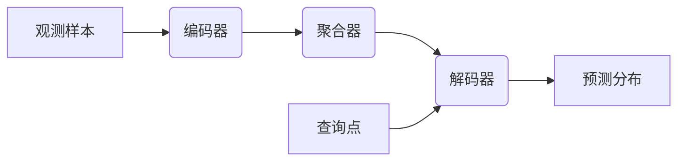

# 一切皆是映射：深入剖析条件神经过程（CNPs）

关键词：条件神经过程，函数映射，元学习，贝叶斯推断，高斯过程，深度学习

## 1. 背景介绍
### 1.1 问题的由来
人工智能的发展日新月异，机器学习尤其是深度学习在各个领域取得了令人瞩目的成就。然而，当前的深度学习方法大多需要大量的标注数据和计算资源，对于小样本学习、快速适应新任务等场景还存在局限性。为了让机器具备更强的学习能力，元学习（Meta-Learning）应运而生。条件神经过程（Conditional Neural Processes，简称CNPs）正是元学习领域的重要突破之一。

### 1.2 研究现状
近年来，国内外学者对CNPs展开了广泛而深入的研究。DeepMind在2018年提出了CNPs模型[1]，通过将神经网络与高斯过程相结合，使模型能够根据少量观测样本对新函数进行推断。此后，一系列工作如Attentive CNPs[2]、Sequential CNPs[3]等，从注意力机制、时序建模等角度对CNPs进行了改进和扩展。同时CNPs在图像补全、时间序列预测、推荐系统等诸多领域得到应用[4,5]。

### 1.3 研究意义
CNPs作为一种灵活而强大的元学习范式，让机器能够像人一样通过少量样本对新知识和新技能快速学习、泛化和适应，这对于实现通用人工智能具有重要意义。深入理解CNPs的原理和机制，对于推动元学习的发展、拓展机器学习的边界有着重要价值。同时，CNPs在医疗、金融、工业等实际场景中的应用探索，有望解决传统深度学习方法的痛点，催生更多创新性的应用。

### 1.4 本文结构
本文将从以下几个方面对CNPs展开详细探讨：第2部分介绍CNPs的核心概念与联系；第3部分重点阐述CNPs的算法原理与步骤；第4部分从数学角度对CNPs的建模与推导过程进行讲解；第5部分通过代码实例演示CNPs的具体实现；第6部分讨论CNPs的实际应用场景；第7部分推荐CNPs相关的学习资源；第8部分对CNPs的研究现状与未来进行总结展望。

## 2. 核心概念与联系
条件神经过程的核心思想是将函数映射问题转化为基于条件概率的回归问题。传统的监督学习旨在学习输入 $x$ 到输出 $y$ 的映射，即：$f:x \rightarrow y$。而CNPs的目标是学习一组输入-输出对 $(x_i,y_i)$ 到新的输入-输出对 $(x_t,y_t)$ 的映射，即：$F: (x_i,y_i)_{i=1}^{n} \rightarrow (x_t,y_t)$。

CNPs借鉴了贝叶斯推断和高斯过程的思想。在贝叶斯推断中，我们根据先验分布和观测数据来推断后验分布。而高斯过程可以看作是函数空间上的一个概率分布，通过有限的观测样本对函数进行非参数化的建模。CNPs将神经网络引入到这一框架中，用深度学习的强大拟合能力来刻画函数映射的条件概率分布。

具体而言，CNPs由三部分组成：编码器（Encoder）、聚合器（Aggregator）和解码器（Decoder）。编码器将每个观测样本 $(x_i,y_i)$ 映射为一个隐向量 $r_i$；聚合器将这些隐向量 $r_i$ 聚合为一个上下文向量 $r$，作为函数映射的条件；解码器根据 $r$ 和查询点 $x_t$，输出对应的预测均值和方差 $(\mu_t,\sigma_t)$，表征 $y_t$ 的概率分布。

下图展示了CNPs的整体架构：

## 3. 核心算法原理 & 具体操作步骤
### 3.1 算法原理概述
CNPs的训练过程可以分为以下几个步骤：

1. 编码：将每个观测样本 $(x_i,y_i)$ 通过编码器映射为隐向量 $r_i$。
2. 聚合：将所有观测样本的隐向量 $r_i$ 聚合为一个上下文向量 $r$。
3. 解码：将上下文向量 $r$ 和查询点 $x_t$ 输入解码器，输出预测分布的均值和方差 $(\mu_t,\sigma_t)$。
4. 损失计算：基于预测分布和真实值 $y_t$，计算负对数似然损失。
5. 参数更新：通过反向传播算法更新CNPs模型的参数。

### 3.2 算法步骤详解
接下来我们对每个步骤进行更详细的说明。

**编码**：给定一组观测样本 $\{(x_i,y_i)\}_{i=1}^{n}$，编码器 $h$ 将每个样本 $(x_i,y_i)$ 映射为一个 $d$ 维隐向量 $r_i$：

$$r_i = h(x_i,y_i) \in \mathbb{R}^d$$

其中，$h$ 可以是一个多层感知机（MLP）或卷积神经网络（CNN）。

**聚合**：聚合器 $a$ 将所有观测样本的隐向量 $\{r_i\}_{i=1}^{n}$ 聚合为一个 $d$ 维的上下文向量 $r$：

$$r = a(\{r_i\}_{i=1}^{n}) \in \mathbb{R}^d$$

常见的聚合方式包括求平均、求和、最大池化等。

**解码**：给定上下文向量 $r$ 和查询点 $x_t$，解码器 $g$ 输出预测分布的均值 $\mu_t$ 和方差 $\sigma_t$：

$$\mu_t,\sigma_t = g(r,x_t)$$

其中，$g$ 也可以是一个MLP或CNN。预测分布通常假设为高斯分布，即 $y_t \sim \mathcal{N}(\mu_t,\sigma_t^2)$。

**损失计算**：基于预测分布和真实值 $y_t$，我们可以计算负对数似然损失：

$$\mathcal{L} = -\log p(y_t|x_t,r) = \frac{1}{2}\log(2\pi\sigma_t^2) + \frac{(y_t-\mu_t)^2}{2\sigma_t^2}$$

**参数更新**：通过最小化损失函数 $\mathcal{L}$，利用反向传播算法更新编码器 $h$、聚合器 $a$ 和解码器 $g$ 的参数，优化CNPs模型。

### 3.3 算法优缺点
CNPs算法的主要优点包括：
- 通过元学习的方式，能够根据少量观测样本对新函数进行快速推断和泛化。
- 将神经网络引入高斯过程框架，增强了函数映射的拟合能力。
- 通过预测均值和方差，可以刻画预测结果的不确定性。

但CNPs也存在一些局限性：
- 假设观测样本和查询点相互独立，忽略了数据点之间的相关性。
- 聚合器对隐向量的聚合较为简单，缺乏对样本之间交互的建模。
- 解码器独立地对每个查询点做推断，没有考虑查询点之间的关系。

针对这些不足，后续的一些工作如Attentive CNPs引入注意力机制来建模数据点之间的依赖关系。

### 3.4 算法应用领域
CNPs 可以应用于多个领域，包括：
- 图像补全：根据图像的部分观测，推断缺失区域的像素值。
- 时间序列预测：根据历史观测，对未来时间步的值进行预测。
- 推荐系统：根据用户的历史交互，推断用户对新物品的偏好。
- 药物发现：根据已知药物-靶点相互作用，预测新药物与靶点的亲和力。

## 4. 数学模型和公式 & 详细讲解 & 举例说明
### 4.1 数学模型构建
我们从概率的角度来描述CNPs的数学模型。假设存在一个随机函数 $f$，我们的目标是根据观测样本 $D=\{(x_i,y_i)\}_{i=1}^{n}$ 来推断查询点 $x_t$ 处的函数值 $y_t$。

在贝叶斯推断框架下，这可以表示为：

$$p(y_t|x_t,D) = \int p(y_t|x_t,f)p(f|D)\mathrm{d}f$$

其中，$p(f|D)$ 是给定观测样本 $D$ 时函数 $f$ 的后验分布，$p(y_t|x_t,f)$ 是给定函数 $f$ 和查询点 $x_t$ 时 $y_t$ 的条件概率。

然而，这个后验分布 $p(f|D)$ 通常难以求解。CNPs利用神经网络来近似这个后验分布。具体地，CNPs通过编码器 $h$ 将观测样本 $D$ 编码为上下文向量 $r$，然后利用解码器 $g$ 根据 $r$ 和查询点 $x_t$ 来近似条件概率 $p(y_t|x_t,f)$：

$$p(y_t|x_t,D) \approx p(y_t|x_t,r) = p(y_t|x_t,a(h(D)))$$

其中，$h(D)=\{h(x_i,y_i)\}_{i=1}^{n}$，$a$ 是聚合器。

### 4.2 公式推导过程
接下来我们推导CNPs的损失函数。根据上述近似，我们可以最大化以下对数似然函数：

$$\log p(y_t|x_t,D) \approx \log p(y_t|x_t,r) = \log \mathcal{N}(y_t|\mu_t,\sigma_t^2)$$

其中，$\mu_t$ 和 $\sigma_t$ 是解码器 $g$ 的输出：

$$\mu_t,\sigma_t = g(r,x_t) = g(a(h(D)),x_t)$$

展开高斯分布的对数概率密度，我们得到：

$$\log \mathcal{N}(y_t|\mu_t,\sigma_t^2) = -\frac{1}{2}\log(2\pi\sigma_t^2) - \frac{(y_t-\mu_t)^2}{2\sigma_t^2}$$

因此，最小化负对数似然损失等价于最小化以下损失函数：

$$\mathcal{L} = \frac{1}{2}\log(2\pi\sigma_t^2) + \frac{(y_t-\mu_t)^2}{2\sigma_t^2}$$

这个损失函数可以解释为均方误差的正则化版本，其中 $\sigma_t$ 起到了调节预测不确定性的作用。

### 4.3 案例分析与讲解
我们以一个简单的正弦函数拟合为例来说明CNPs的工作原理。假设我们有以下观测样本：

$$D = \{(0.1,\sin(0.1)),(0.3,\sin(0.3)),(0.5,\sin(0.5)),(0.7,\sin(0.7)),(0.9,\sin(0.9))\}$$

我们希望根据这些观测样本来推断查询点 $x_t=0.4$ 处的函数值。

首先，编码器 $h$ 将每个观测样本 $(x_i,y_i)$ 映射为隐向量 $r_i$：

$$r_i = h(x_i,y_i), \quad i=1,2,\dots,5$$

然后，聚合器 $a$ 将这些隐向量聚合为上下文向量 $r$：

$$r = a(\{r_i\}_{i=1}^{5})$$

接着，解码器 $g$ 根据上下文向量 $r$ 和查询点 $x_t=0.4$，输出预测分布的均值和方差：

$$\mu_t,\sigma_t = g(r,0.4)$$

最后，我们可以根据预测分布 $\mathcal{N}(\mu_t,\sigma_t^2)$ 来估计查询点 $x_t=0.4$ 处的函数值。