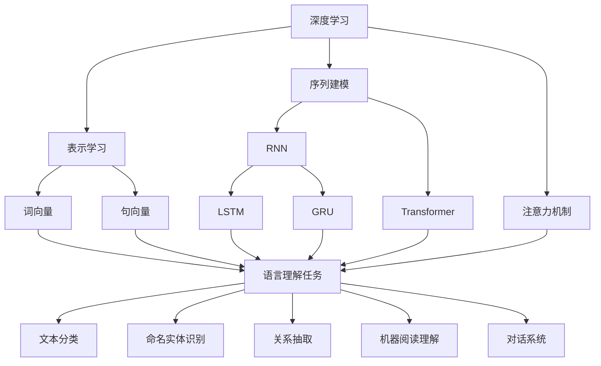

我非常理解您对这篇文章的要求和期望。作为一位计算机领域的专家和大师,我会全力以赴,为您撰写一篇高质量、内容丰富、见解独到的技术博客文章。让我们一起开始这段激动人心的学术探索之旅吧!

# 一切皆是映射:深度学习与人类语言理解

## 1. 背景介绍

### 1.1 问题的由来

自计算机诞生以来,人类就一直梦想着能够与机器进行自然语言交流,无障碍地表达想法、获取知识。然而,由于自然语言的复杂性和多义性,长期以来人机交互都停留在有限的命令词和模式匹配层面。直到近年来,深度学习技术在语言理解领域取得了突破性进展,令人类与机器之间的语言交互成为可能。

### 1.2 研究现状  

传统的自然语言处理方法主要依赖于规则和统计模型,需要大量的人工特征工程,且难以处理复杂的语义信息。而深度学习则能够自动从大规模语料中学习特征表示,并对复杂的上下文语义信息进行建模。近年来,基于深度学习的语言模型取得了卓越的成绩,显著提高了机器在语言理解、生成、翻译等任务上的性能。

### 1.3 研究意义

语言是人类进行思维和交流的重要工具,语言理解技术的突破将为人机交互、知识获取、决策辅助等领域带来革命性变革。通过深入研究深度学习在语言理解中的应用,我们可以促进人工智能技术在自然语言处理领域的发展,推动智能系统更好地服务于人类社会。

### 1.4 本文结构

本文将全面介绍深度学习在语言理解中的应用。我们首先探讨深度学习与语言理解的核心概念及它们之间的联系,接着深入剖析常用的深度学习语言模型的原理、算法和数学基础。之后,我们将通过实践案例、应用场景和工具资源推荐,帮助读者更好地掌握这一领域的实操技能。最后,我们将总结研究成果,展望未来的发展趋势和面临的挑战。

## 2. 核心概念与联系

深度学习在语言理解领域的应用主要包括三个核心概念:表示学习、序列建模和注意力机制。

**表示学习**旨在将文本数据映射为连续的低维向量表示,例如词向量和句向量,这种分布式表示能够很好地捕获词语/句子的语义信息。

**序列建模**则关注于对序列数据(如文本序列)进行建模,常用的模型包括循环神经网络(RNN)及其变体(LSTM、GRU),以及Transformer等。这些模型能够有效地捕获文本的上下文信息和长距离依赖关系。

**注意力机制**赋予了深度学习模型"关注"重要信息的能力,使其能够更好地理解文本的关键语义。

通过将这三个核心概念相结合,深度学习模型可以高效地对自然语言文本进行表示、建模和理解,并广泛应用于文本分类、命名实体识别、关系抽取、机器阅读理解、对话系统等语言理解任务中。

## 3. 核心算法原理与具体操作步骤

在本节中,我们将重点介绍两种广泛应用于语言理解任务的深度学习模型:BERT和Transformer,并详细阐述它们的算法原理、具体实现步骤以及优缺点分析。

### 3.1 算法原理概述

#### 3.1.1 BERT

BERT(Bidirectional Encoder Representations from Transformers)是一种基于Transformer的双向编码语言模型,它通过预训练的方式学习文本的双向表示,再将这些表示迁移到下游的语言理解任务中进行微调,从而取得了卓越的性能表现。

BERT的核心创新点在于引入了**Masked Language Model(掩蔽语言模型)**和**Next Sentence Prediction(下一句预测)**两个预训练任务。前者通过随机"遮蔽"部分词语,使模型学习如何根据上下文预测被遮蔽的词语;后者则判断两个句子是否相邻,帮助模型捕获句子间的关系。经过大规模无监督预训练后,BERT获得了强大的语义表示能力。

#### 3.1.2 Transformer

Transformer是一种全新的基于注意力机制的序列到序列模型,不同于RNN,它完全摒弃了循环结构,使用多头注意力机制来捕捉输入序列中任意位置的长距离依赖关系,从而克服了RNN容易遗忘长期依赖的缺陷。

Transformer的主要创新在于引入了**多头注意力机制**和**位置编码**。多头注意力机制允许模型关注输入序列中的不同位置,捕获不同子空间的特征表示;而位置编码则赋予了序列元素位置信息,使Transformer能够有效处理序列数据。

### 3.2 算法步骤详解

#### 3.2.1 BERT 算法步骤

1. **数据预处理**:将输入文本切分为词元(WordPiece),构建词表,并添加特殊词元[CLS]和[SEP]。

2. **输入表示**:将词元映射为词向量表示,并加入位置编码和段编码(区分两个句子)。

3. **Masked LM 预训练**:随机选择输入序列中的15%词元进行遮蔽,使用多层Transformer Encoder对其余词元进行编码,并预测被遮蔽词元。

4. **Next Sentence Prediction 预训练**:判断两个句子是否相邻,通过对[CLS]向量进行二分类实现。

5. **微调**:在预训练的BERT模型基础上,为下游任务(如文本分类)添加少量任务特定的新层,并使用有标注数据对整个模型进行微调。

6. **预测**:使用微调后的模型对新输入进行推理,获得任务的预测结果。

#### 3.2.2 Transformer 算法步骤

1. **输入表示**:将输入序列(如源语言句子)映射为词向量表示,并加入位置编码。

2. **多头注意力**:将编码后的输入序列输入到多头注意力子层,捕获不同表示子空间的特征。

3. **前馈网络**:对注意力输出进行全连接的前馈网络变换,为每个位置的表示增加非线性变换能力。

4. **残差连接与层归一化**:将步骤2和3的输出分别与输入进行残差连接,并进行层归一化,以保持梯度稳定。

5. **解码器**:对于序列到序列的任务(如机器翻译),需要使用掩码的多头注意力机制,确保解码时只关注已生成的输出。

6. **输出**:最终的解码器输出即为目标序列(如目标语言句子)的预测结果。

### 3.3 算法优缺点

#### 3.3.1 BERT 优缺点

**优点**:

- 预训练方式使模型能够学习到大量有用的语义和句法知识,大幅提升了下游任务的性能。
- 双向编码能够同时捕获上下文的前后信息,提高了语义表示的质量。
- 在多种语言理解任务上取得了最先进的性能表现。

**缺点**:

- 训练数据量需求巨大,对算力和内存要求很高。
- 序列长度受限于预训练时的最大长度,无法直接应用于过长序列。
- 预训练过程缓慢,需要大量计算资源。

#### 3.3.2 Transformer 优缺点

**优点**:

- 全注意力机制使其能够有效捕获长距离依赖关系,克服了RNN的局限性。
- 并行计算能力强,可以加速训练过程。
- 适用于多种序列到序列的任务,如机器翻译、文本生成等。

**缺点**:

- 计算复杂度较高,注意力机制的计算量会随着序列长度的平方增长。
- 位置编码方案可能无法完全解决长序列的位置信息问题。
- 对于一些局部特征的建模能力可能不如RNN模型。

### 3.4 算法应用领域

BERT和Transformer已被广泛应用于自然语言处理的各种任务中,主要包括但不限于:

- **文本分类**: 将文本分配到预定义的类别,如情感分析、新闻分类等。
- **命名实体识别**: 识别文本中的实体名称,如人名、地名、组织机构名等。
- **关系抽取**: 从文本中抽取实体之间的语义关系,如夫妻关系、雇佣关系等。
- **机器阅读理解**: 根据给定的问题和参考文本,输出问题的答案。
- **机器翻译**: 将一种自然语言翻译成另一种语言。
- **文本生成**: 根据输入的条件或上下文,自动生成连贯的文本内容。
- **对话系统**: 与人类进行自然语言对话交互。

## 4. 数学模型和公式详细讲解与举例说明

在本节中,我们将深入探讨BERT和Transformer模型中所使用的数学模型和公式,并通过具体案例来帮助读者更好地理解它们的内在机理。

### 4.1 数学模型构建

#### 4.1.1 BERT 数学模型

BERT的核心是基于Transformer的编码器结构,其输入表示由三部分组成:

$$\mathbf{X} = \mathbf{W} + \mathbf{P} + \mathbf{S}$$

其中$\mathbf{W}$为词元的词向量表示,$\mathbf{P}$为位置编码,用于赋予序列元素位置信息,$\mathbf{S}$为段编码,区分不同的句子。

BERT使用多层Transformer Encoder对输入进行编码:

$$\mathbf{H}^l = \text{TransformerEncoder}(\mathbf{H}^{l-1})$$

其中$\mathbf{H}^l$为第$l$层的输出向量。TransformerEncoder由多头注意力子层和前馈网络子层构成,并使用残差连接和层归一化。

对于Masked LM预训练任务,BERT需要预测被遮蔽的词元$\mathbf{x}_m$:

$$\hat{\mathbf{x}}_m = \text{softmax}(\mathbf{W}_m^\top \mathbf{h}_m^L + \mathbf{b}_m)$$

其中$\mathbf{h}_m^L$为最终编码器输出的遮蔽位置向量,$\mathbf{W}_m$和$\mathbf{b}_m$为词元预测层的权重和偏置。

#### 4.1.2 Transformer 数学模型

Transformer的核心是注意力机制,它能够捕捉输入序列中任意两个位置之间的依赖关系。给定一个查询向量$\mathbf{q}$,键向量$\mathbf{K}$和值向量$\mathbf{V}$,注意力计算公式为:

$$\text{Attention}(\mathbf{Q}, \mathbf{K}, \mathbf{V}) = \text{softmax}(\frac{\mathbf{Q}\mathbf{K}^\top}{\sqrt{d_k}})\mathbf{V}$$

其中$d_k$为缩放因子,用于防止较深层次的值过大导致梯度消失。

多头注意力机制则将注意力分成$h$个不同的"头"来计算,每个头关注输入的不同子空间表示:

$$\text{MultiHead}(\mathbf{Q}, \mathbf{K}, \mathbf{V}) = \text{Concat}(\text{head}_1, \dots, \text{head}_h)\mathbf{W}^O$$
$$\text{head}_i = \text{Attention}(\mathbf{Q}\mathbf{W}_i^Q, \mathbf{K}\mathbf{W}_i^K, \mathbf{V}\mathbf{