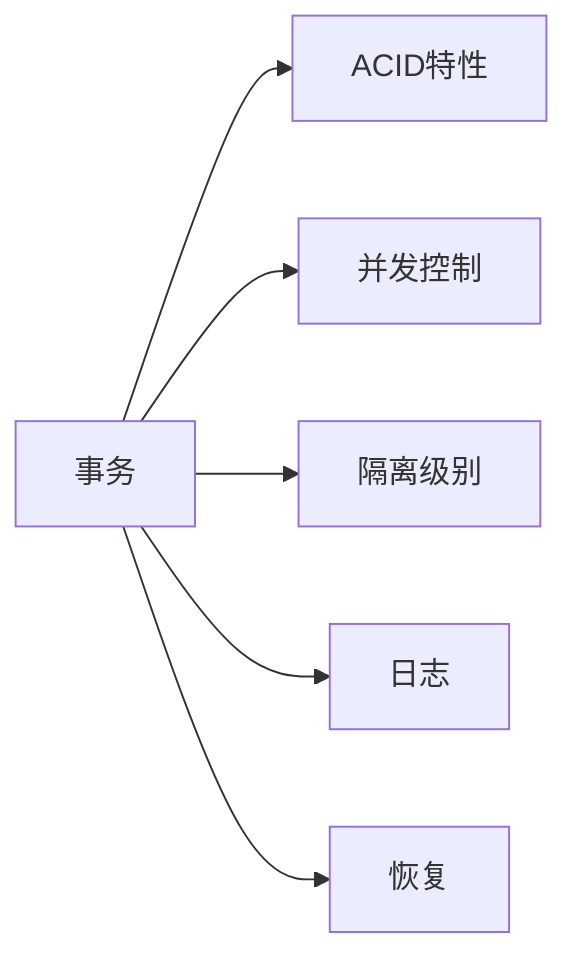

# 事务 原理与代码实例讲解

## 1. 背景介绍

### 1.1 问题的由来
在现代软件系统中,数据的一致性和完整性至关重要。然而,由于系统故障、并发访问等因素的影响,保证数据一致性面临着巨大挑战。为了解决这一问题,事务(Transaction)应运而生。事务是保证数据库一致性的重要机制,广泛应用于各类数据库管理系统和应用程序中。

### 1.2 研究现状
事务的概念最早由Jim Gray在20世纪70年代提出,此后在数据库领域得到了广泛的研究和应用。传统的关系型数据库如Oracle、MySQL等都内置了事务支持。近年来,随着NoSQL、NewSQL等新型数据库的兴起,事务的研究也出现了新的方向和挑战,如如何在保证可扩展性的同时实现强一致性事务。

### 1.3 研究意义 
深入理解事务的工作原理,对于开发高可靠、高性能的数据密集型应用至关重要。通过学习事务的基本概念、ACID特性、隔离级别、并发控制等核心知识,可以避免数据不一致问题,提高系统的健壮性。此外,掌握事务相关的编程实践和优化技巧,有助于开发者设计和实现更加可靠高效的软件系统。

### 1.4 本文结构
本文将全面讲解事务的相关知识,内容涵盖:

- 事务的核心概念与联系
- 事务的ACID特性与隔离级别
- 并发控制与两阶段锁协议
- 事务的数学模型与公式推导
- 事务代码实例与详细解读
- 事务在实际项目中的应用场景
- 事务相关的学习资源与工具推荐
- 事务技术的未来发展趋势与挑战

通过理论与实践相结合的方式,力求给读者呈现一个全面、深入、易懂的事务技术教程。

## 2. 核心概念与联系

要理解事务,首先需要了解几个核心概念:

- **事务(Transaction)**: 事务是数据库操作的基本单元,是一系列数据库操作的集合,要么全部执行,要么全部不执行。事务具有ACID特性。

- **ACID特性**: ACID是事务的四大特性,包括原子性(Atomicity)、一致性(Consistency)、隔离性(Isolation)和持久性(Durability)。

- **并发控制**: 并发控制是为了保证多个事务可以并发执行而不破坏数据库的一致性而采取的机制,常见的并发控制技术有锁、时间戳、乐观锁等。

- **隔离级别**: 隔离级别是指事务之间的隔离程度,SQL标准定义了4种隔离级别:读未提交(Read Uncommitted)、读已提交(Read Committed)、可重复读(Repeatable Read)和串行化(Serializable)。

- **日志**: 日志是数据库管理系统用于保证事务原子性和持久性的重要机制,记录了事务执行过程中的各种状态信息。

- **恢复**: 恢复是指在系统发生故障时,利用日志等信息将数据库恢复到一致状态的过程。

下图展示了这些核心概念之间的关系:

事务的ACID特性是事务正确性的基础,而并发控制、隔离级别、日志和恢复则是为了保证事务的ACID特性而采取的各种机制和技术手段。只有深刻理解这些概念的内涵和联系,才能真正掌握事务技术的精髓。

## 3. 核心算法原理 & 具体操作步骤

### 3.1 算法原理概述
事务的实现离不开一系列核心算法的支持,这里重点介绍两阶段锁协议(2PL)和两阶段提交协议(2PC)。

**两阶段锁协议(2PL)** 是一种并发控制方法,通过在事务执行过程中对数据项加锁来保证事务的隔离性。2PL将事务分为两个阶段:增长阶段(Growing Phase)和缩减阶段(Shrinking Phase)。在增长阶段,事务可以获取锁但不能释放锁;在缩减阶段,事务可以释放锁但不能再获取新的锁。2PL可以有效避免事务间的干扰,从而保证事务的正确性。

**两阶段提交协议(2PC)** 是保证分布式事务原子性的经典协议。2PC引入了协调者(Coordinator)和参与者(Participant)两个角色,将事务的提交过程分为投票阶段(Voting Phase)和提交阶段(Commit Phase)两个阶段。在投票阶段,协调者询问所有参与者是否准备好提交事务,参与者返回同意或拒绝。在提交阶段,如果所有参与者都同意提交,协调者向所有参与者发送提交命令;否则,发送回滚命令。2PC通过协调者的存在,保证了分布式事务的原子性。

### 3.2 算法步骤详解

#### 两阶段锁协议(2PL)的步骤如下:

1. 增长阶段:
   - 事务在执行读写操作之前,必须先获取相应的锁。 
   - 如果数据项已经被其他事务加锁,则当前事务必须等待锁被释放。
   - 事务在增长阶段可以获取新的锁,但不能释放已经持有的锁。

2. 缩减阶段:  
   - 事务在缩减阶段只能释放锁,不能再获取新的锁。
   - 当事务释放了所有持有的锁,就可以正常结束了。
   
两阶段锁协议保证了事务在整个执行过程中,要么处于增长阶段,要么处于缩减阶段,从而避免了死锁和级联回滚等问题。

#### 两阶段提交协议(2PC)的步骤如下:

1. 投票阶段:
   - 协调者向所有参与者发送Prepare消息,询问是否可以执行事务提交操作。
   - 参与者执行事务操作,并将Undo和Redo信息记录到事务日志中。
   - 参与者响应协调者的Prepare消息,如果事务执行成功则返回Yes,否则返回No。

2. 提交阶段:
   - 如果所有参与者都返回Yes响应,协调者向所有参与者发送Commit消息;否则发送Rollback消息。
   - 参与者根据协调者的指令执行Commit或Rollback操作,并释放事务资源。
   - 参与者反馈执行结果给协调者。
   - 协调者收集所有参与者的反馈,如果所有参与者都成功执行了Commit或Rollback,则协调者完成事务。

2PC协议的关键在于协调者必须等待所有参与者的响应才能做出最终决策,任何一个参与者失败都会导致整个事务的回滚。

### 3.3 算法优缺点

**两阶段锁协议(2PL)的优点:**
- 能够保证事务的可串行化调度,避免了脏读、不可重复读、幻读等并发问题。
- 实现相对简单,许多数据库都采用了2PL机制。

**2PL的缺点如下:**
- 可能会导致死锁,影响系统的并发性能。
- 级联回滚问题,由于2PL要求事务持有锁直到结束,一个事务的回滚可能导致其他事务也要回滚。

**两阶段提交协议(2PC)的优点:**
- 能够保证分布式事务的原子性,要么所有节点都提交,要么都回滚。
- 相比一些乐观的分布式事务协议,2PC的一致性和正确性更有保障。

**2PC的缺点如下:**  
- 同步阻塞问题,协调者需要等待所有参与者的响应,性能和可用性受影响。
- 单点故障问题,协调者如果宕机,整个事务将无法完成。
- 数据不一致问题,如果在提交阶段协调者发送Commit消息后宕机,部分参与者收到Commit消息并执行提交,而其他参与者没有收到,就会导致数据不一致。

### 3.4 算法应用领域
两阶段锁协议(2PL)在关系型数据库、键值存储、文档数据库等各类数据库中广泛使用,是保证事务隔离性的重要手段。一些典型的数据库如MySQL、PostgreSQL、SQL Server的事务实现都依赖于2PL。

两阶段提交协议(2PC)主要应用于分布式数据库和分布式系统,用于保证分布式事务的原子性。许多分布式数据库如Spanner、OceanBase都采用了2PC协议。此外,像分布式消息队列、分布式文件系统等系统中也常用2PC来实现分布式事务。

## 4. 数学模型和公式 & 详细讲解 & 举例说明

### 4.1 数学模型构建
我们可以用一个简单的数学模型来刻画事务的特性。假设有一组事务$T = \{T_1, T_2, ..., T_n\}$,每个事务$T_i$都由一系列读写操作组成,记为$T_i = \{r_i(x), w_i(x), ...\}$,其中$r_i(x)$表示事务$T_i$读取数据项$x$的值,$w_i(x)$表示事务$T_i$将数据项$x$的值改写为新值。

如果事务$T_i$成功完成了所有操作,我们说事务$T_i$处于committed状态,记为$T_i^c$;如果事务$T_i$失败了,我们说事务$T_i$处于aborted状态,记为$T_i^a$。

对于一个调度(schedule)$S$,它是事务集合$T$中各个事务的所有操作的一个序列。如果调度$S$能够保证事务的ACID特性,我们就说调度$S$是正确的(correct)。

### 4.2 公式推导过程
下面我们用数学公式来推导事务的可串行化特性。

**定义1(冲突等价):** 如果调度$S$和$S'$满足以下条件,就称$S$和$S'$是冲突等价的:
1. $S$和$S'$包含相同的事务集合和相同的操作。 
2. 对于任意两个冲突操作$p_i$和$q_j$(即$p_i$和$q_j$操作同一个数据项,且至少有一个是写操作),在$S$中$p_i$在$q_j$之前当且仅当在$S'$中$p_i$也在$q_j$之前。

记为$S \cong_c S'$。

**定理1:** 如果调度$S$和调度$S'$是冲突等价的,那么$S$是正确的当且仅当$S'$也是正确的。

证明: 用反证法,假设$S$是正确的而$S'$不是正确的,那么在$S'$的执行结果中,必然存在某个事务读到了中间结果的值,这与$S$和$S'$是冲突等价的矛盾,因为冲突等价保证了两个调度中事务读写顺序的一致性。

**定义2(视图等价):** 如果调度$S$和$S'$满足以下条件,就称$S$和$S'$是视图等价的:
1. $S$和$S'$的事务集合相同,且每个事务的读操作都读到了相同的值。
2. 对于每一个事务$T_i$,在$S$和$S'$中,$T_i$的写操作写入的最终值是相同的。

记为$S \cong_v S'$。

**定理2:** 如果调度$S$和调度$S'$是视图等价的,那么$S$是正确的当且仅当$S'$也是正确的。

证明: 由视图等价的定义可知,每个事务在$S$和$S'$中的执行结果都是一样的,所以如果$S$的结果是正确的,那么$S'$的结果也一定是正确的,反之亦然。

**定义3(可串行化):** 如果调度$S$与某个串行调度$S'$冲突等价,就称调度$S$是可串行化的。

**定理3:** 如果调度$S$是可串行化的,那么$S$是正确的。

证明: 因为$S$与串行调度$S'$