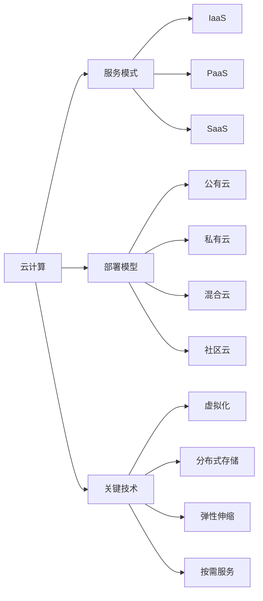

# 云计算 (Cloud Computing)

## 1. 背景介绍

### 1.1  问题的由来
随着互联网技术的飞速发展,越来越多的企业和个人开始依赖于网络服务。传统的IT基础设施已经无法满足日益增长的计算和存储需求。如何提供高效、灵活、经济的计算资源,成为了亟待解决的问题。云计算应运而生,它通过网络按需提供计算资源,为用户带来了前所未有的便利。

### 1.2  研究现状
自2006年亚马逊推出EC2服务以来,云计算经历了十多年的发展。目前,云计算已成为IT领域最热门的技术之一。各大科技公司纷纷推出了自己的云服务,如亚马逊AWS、微软Azure、谷歌云等。同时,开源云平台如OpenStack、CloudStack也得到了广泛应用。云计算相关的研究涉及虚拟化、分布式系统、资源管理等多个领域,取得了丰硕的成果。

### 1.3  研究意义
云计算的研究对于推动信息技术的发展具有重要意义。首先,云计算大大提高了计算资源的利用率,节约了成本。其次,云计算使得用户可以随时随地访问所需的服务,提高了工作效率。此外,云计算还为大数据、人工智能等新兴技术提供了强大的计算支持。深入研究云计算,对于开发更加智能、高效的应用具有重要价值。

### 1.4  本文结构
本文将从以下几个方面对云计算进行深入探讨：
- 第2部分介绍云计算的核心概念及其相互联系
- 第3部分重点阐述云计算的关键技术原理和实现步骤
- 第4部分建立云计算的数学模型,推导相关公式,并给出案例分析
- 第5部分通过代码实例,演示如何搭建云计算环境并开发应用
- 第6部分总结云计算的实际应用场景和未来展望
- 第7部分推荐云计算相关的学习资源、开发工具和文献
- 第8部分对全文进行总结,分析云计算的发展趋势和面临的挑战
- 第9部分列举云计算领域一些常见问题及其解答

## 2. 核心概念与联系
云计算的核心概念包括:
- 服务模式: IaaS(基础设施即服务)、PaaS(平台即服务)、SaaS(软件即服务)
- 部署模型: 公有云、私有云、混合云、社区云
- 虚拟化技术: 将物理资源抽象为逻辑资源,实现资源共享
- 分布式存储: 将数据分散存储在多个节点,提高可靠性和访问性能 
- 弹性伸缩: 根据负载动态调整资源配置,满足应用需求
- 按需服务: 用户可以根据需要,随时获取和释放资源

下图展示了这些概念之间的关系:



服务模式和部署模型从不同角度描述了云计算的服务形式。IaaS、PaaS和SaaS 分别对应基础设施、平台和软件三个层次的服务内容。公有云、私有云等部署模型则反映了云服务的提供方式和可访问性。

虚拟化、分布式存储、弹性伸缩、按需服务是实现云计算的关键技术。虚拟化技术将物理资源抽象为逻辑资源,是云计算的基础。分布式存储通过冗余提高了数据可靠性,并优化了访问性能。弹性伸缩根据系统负载自动调整资源配置,提高资源利用率。按需服务则最大程度地满足了用户个性化的资源需求。

## 3. 核心算法原理 & 具体操作步骤

### 3.1 算法原理概述
云计算涉及一系列资源管理算法,如虚拟机放置、负载均衡、任务调度等。这里重点介绍虚拟机放置算法,它的目标是将虚拟机映射到合适的物理机上,优化资源利用率和应用性能。常见的虚拟机放置算法包括贪心算法、启发式算法、基于约束编程的算法等。

### 3.2 算法步骤详解
以贪心算法为例,其基本步骤如下:
1. 对所有虚拟机按照某种规则(如CPU需求)排序
2. 遍历每个虚拟机,为其选择当前最优的物理机
3. 更新物理机的剩余资源 
4. 重复步骤2-3,直到所有虚拟机都得到放置

在选择物理机时,可以采用Best Fit策略,即优先选择剩余资源最少的物理机,以尽可能减少碎片。

### 3.3 算法优缺点
贪心算法的优点是实现简单,计算速度快。但其局限性在于它只考虑了当前的最优解,而没有从全局角度优化,因此得到的是次优解。

启发式算法如遗传算法,通过模拟生物进化,在解空间中intelligently search,能够得到接近最优的解。但其计算复杂度较高。

基于约束编程的算法将放置问题转化为约束满足问题求解,可以得到最优解。但其计算量大,难以处理大规模问题。

### 3.4 算法应用领域
虚拟机放置算法在IaaS云中有广泛应用,用于VM Placement、VM Consolidation、Power Management等任务。此外,类似思想也可应用于容器调度、边缘计算等场景。

## 4. 数学模型和公式 & 详细讲解 & 举例说明

### 4.1 数学模型构建
我们可以将虚拟机放置问题形式化为一个多目标优化模型。定义如下符号:

- $M$: 物理机集合, $M=\{m_1, m_2, ..., m_n\}$
- $V$: 虚拟机集合, $V=\{v_1, v_2, ..., v_k\}$
- $C_m^r$: 物理机$m$的资源容量向量, $C_m^r=(c_m^1, c_m^2, ..., c_m^d)$
- $R_v^r$: 虚拟机$v$的资源需求向量, $R_v^r=(r_v^1, r_v^2, ..., r_v^d)$
- $x_{vm}$: 决策变量,表示虚拟机$v$放置在物理机$m$上

目标函数可定义为最小化物理机数量,或最小化能耗:

$$
\min \sum_{m \in M} y_m \quad or \quad \min \sum_{m \in M} y_m \cdot P_m
$$

其中$y_m$表示物理机$m$是否被使用, $P_m$为其能耗。

约束条件包括:

(1) 虚拟机资源需求不超过物理机容量:

$$
\sum_{v \in V} x_{vm} \cdot r_v^i \leq c_m^i, \forall m \in M, i \in \{1,2,...,d\}
$$

(2) 每个虚拟机只能放置在一个物理机上:

$$
\sum_{m \in M} x_{vm} = 1, \forall v \in V
$$

(3) 决策变量取值为0或1:

$$
x_{vm}, y_m \in \{0, 1\}, \forall v \in V, m \in M 
$$

### 4.2 公式推导过程
上述模型可转化为整数规划问题求解。以最小化物理机数量为例,可将目标函数等价变换为:

$$
\min \sum_{m \in M} y_m \\
s.t. \quad y_m \geq x_{vm}, \forall v \in V
$$

这样,当任一虚拟机放置在物理机$m$上时, $y_m$必须取1。再加上前面的约束(1)-(3),构成了完整的整数规划模型。

### 4.3 案例分析与讲解
考虑一个简单例子,有3台物理机和5个虚拟机,其资源属性如下表所示(只考虑CPU和内存两种资源):

| 物理机 | CPU(cores) | 内存(GB) |
|-------|------------|----------|
| m1    | 8          | 16       |
| m2    | 12         | 32       |
| m3    | 16         | 48       |

| 虚拟机 | CPU(cores) | 内存(GB) |
|--------|------------|----------|
| v1     | 2          | 4        |
| v2     | 4          | 8        |
| v3     | 1          | 2        |
| v4     | 4          | 16       |
| v5     | 8          | 24       |

求解上述整数规划模型,可得最优解为:

- v1放置在m1上
- v2放置在m1上 
- v3放置在m1上
- v4放置在m2上
- v5放置在m3上

此时,总共使用了3台物理机。可见,数学模型能够帮助我们找到最优的资源分配方案。

### 4.4 常见问题解答
Q: 模型能否考虑物理机的多维异构资源?
A: 可以,只需在约束(1)中对不同资源分别建立不等式即可。这被称为多维装箱问题(Multi-dimensional Bin Packing)。

Q: 模型是否支持动态放置?
A: 支持。将已放置的虚拟机看作物理机的初始负载,在后续放置新虚拟机时,同样应用上述模型即可。

Q: 除了整数规划,是否还有其他求解方法?
A: 针对NP-hard问题,启发式算法是一种常用的替代方案,如遗传算法、蚁群算法等。此外,近年来深度强化学习在组合优化领域也显示出了巨大潜力。

## 5. 项目实践：代码实例和详细解释说明

### 5.1 开发环境搭建
以OpenStack为例,介绍如何搭建一个IaaS云平台。

首先,准备至少两台Linux服务器,一台作为控制节点,其余作为计算节点。在控制节点上,安装以下服务:

- Keystone: 认证服务
- Glance: 镜像服务  
- Nova: 计算服务
- Neutron: 网络服务
- Horizon: Web UI

在计算节点上,安装Nova Compute服务即可。

安装过程可参考官方文档: https://docs.openstack.org/install-guide/

### 5.2 源代码详细实现
下面展示了一个简单的虚拟机放置算法的Python实现:

```python
class VM:
    def __init__(self, cpu, mem):
        self.cpu = cpu
        self.mem = mem

class Host:
    def __init__(self, cpu, mem):
        self.cpu = cpu
        self.mem = mem
        self.vms = []

    def place_vm(self, vm):
        if self.cpu >= vm.cpu and self.mem >= vm.mem:
            self.vms.append(vm)
            self.cpu -= vm.cpu
            self.mem -= vm.mem
            return True
        else:
            return False

def vm_placement(vms, hosts):
    for vm in sorted(vms, key=lambda x: x.cpu, reverse=True):
        for host in sorted(hosts, key=lambda x: x.cpu):
            if host.place_vm(vm):
                break
    
    return hosts

if __name__ == '__main__':
    vms = [VM(2,4), VM(4,8), VM(1,2), VM(4,16), VM(8,24)]
    hosts = [Host(8,16), Host(12,32), Host(16,48)]
    
    result = vm_placement(vms, hosts)
    for i, host in enumerate(result):
        print(f"Host {i}: {[vm.cpu for vm in host.vms]}")
```

### 5.3 代码解读与分析
- VM类表示一个虚拟机,包含CPU和内存两个属性
- Host类表示一个物理机,包含CPU、内存、虚拟机列表三个属性,以及放置虚拟机的方法
- vm_placement函数实现了简单的贪心算法。它首先将虚拟机按CPU需求降序排列,将物理机按CPU容量升序排列。然后遍历每个虚拟机,尝试将其放置在当前剩余资源最少的物理机上
- 主程序部分创建了虚拟机和物理机对象,调用vm