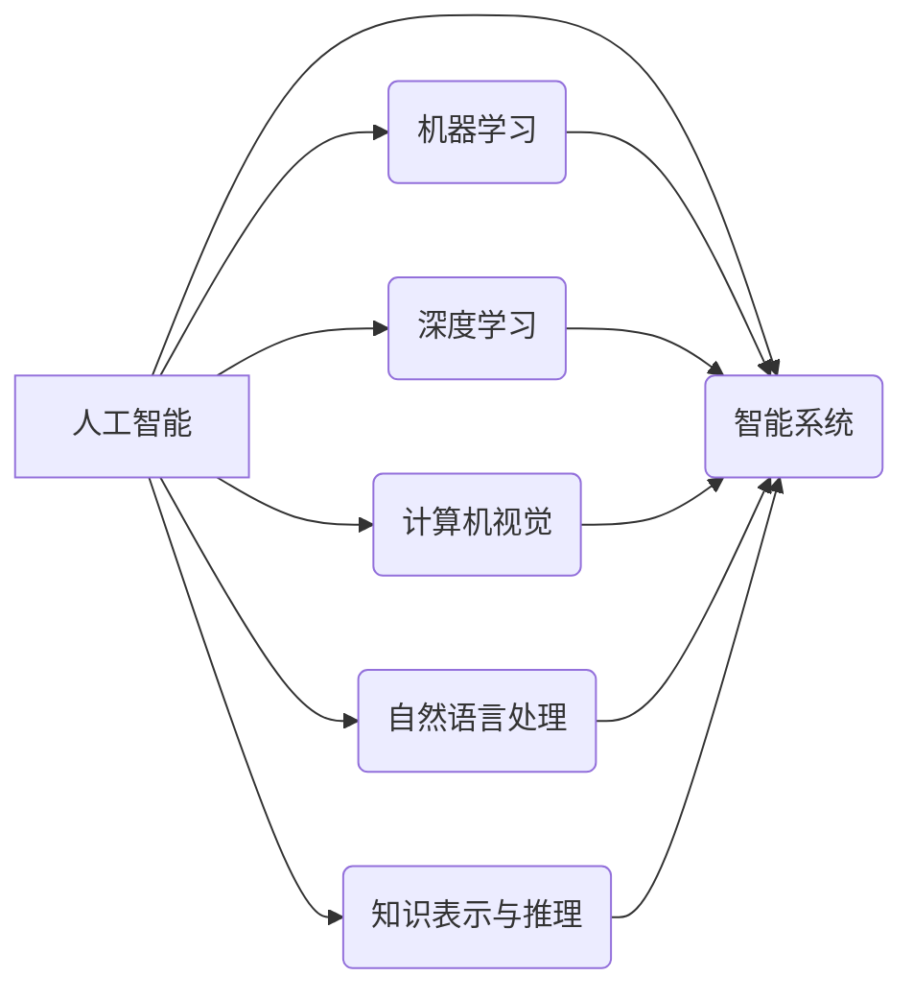

# 产业变革中的AI技术应用

关键词：人工智能、机器学习、深度学习、计算机视觉、自然语言处理、智能制造、智慧医疗、智能金融、智能交通、人工智能伦理

## 1. 背景介绍

### 1.1 问题的由来
人工智能(Artificial Intelligence, AI)技术的快速发展正在深刻影响和改变着各行各业。从智能制造、智慧医疗到智能金融、智能交通，AI正成为驱动产业变革和创新的重要力量。然而，如何在不同领域更好地应用AI技术，实现产业智能化升级，仍面临诸多挑战。

### 1.2 研究现状  
目前，国内外学术界和工业界都在积极探索AI技术在各领域的应用。谷歌、微软、亚马逊等科技巨头纷纷加大AI领域投入，推出了一系列创新性产品和服务。中国也出台了一系列支持AI发展的政策，力图在AI时代抢占先机。但总体而言，AI在产业领域的应用仍处于起步阶段，大规模工程化应用还面临诸多技术和伦理挑战。

### 1.3 研究意义
系统梳理总结AI技术在产业变革中的应用现状、分析存在的问题，对推动AI产业健康持续发展具有重要意义。一方面，可以为企业利用AI实现转型升级提供借鉴；另一方面，也为政府制定AI产业政策提供参考。同时，还可以为后续AI技术研究指明方向。

### 1.4 本文结构
本文将围绕AI技术在产业变革中的应用展开系统梳理和分析。第2部分介绍AI的核心概念及其内在联系；第3部分重点阐述机器学习、深度学习等AI核心算法原理；第4部分从数学角度对AI算法的模型和公式进行推导讲解；第5部分通过代码实例演示说明AI项目的实践操作；第6部分总结梳理AI在智能制造、智慧医疗等领域的典型应用场景；第7部分推荐AI相关的学习资源和开发工具；第8部分对AI未来发展趋势和面临的挑战进行展望；第9部分以附录形式解答一些常见问题。

## 2. 核心概念与联系
人工智能是计算机科学的一个分支，它试图了解智能的实质，并生产出一种新的能以人类智能相似的方式做出反应的智能机器。AI包含以下核心概念：

- 机器学习：让计算机系统从数据中自主学习，无需明确编程。常见算法包括决策树、支持向量机、贝叶斯分类等。
- 深度学习：是机器学习的一个新的研究方向，通过建立、模拟人脑进行分析学习的神经网络，让计算机可以模仿人脑的机制来识别数据。
- 计算机视觉：让计算机从图像或视频中"看到"并理解内容，如物体识别、人脸识别等。
- 自然语言处理：让计算机理解、处理和生成人类语言，如语音识别、机器翻译、情感分析等。
- 知识表示与推理：让计算机理解并建模现实世界的知识，并基于知识进行推理和决策。
- 智能系统：由AI驱动的自主系统，如自动驾驶汽车、智能助手、工业机器人等。

这些概念相互关联、互为支撑。机器学习和深度学习是实现AI的核心算法基础，计算机视觉、自然语言处理是AI的典型应用方向，知识表示与推理赋予AI系统更强大的认知和决策能力，构建完整智能系统是AI技术的最终目标。



## 3. 核心算法原理 & 具体操作步骤

### 3.1 算法原理概述
AI的核心是让计算机具备类似人的感知、学习、推理等智能能力。其底层依赖于机器学习、深度学习等算法。机器学习算法让计算机从大量历史数据中总结规律，学会对新数据进行预测。深度学习则模仿人脑神经元连接，构建多层神经网络，让计算机自主学习数据中的高层特征。

### 3.2 算法步骤详解
以常见的机器学习算法-决策树为例，其主要步骤包括：
1. 收集数据：从可靠渠道收集能反映问题的相关数据。
2. 准备数据：对数据进行预处理，如格式化、清洗、特征选择等。
3. 分析数据：对数据进行可视化分析，发现数据特点和规律。
4. 训练算法：将数据输入算法，让算法自主学习建立决策树模型。
5. 测试算法：利用新的测试数据评估算法的准确性和泛化能力。
6. 使用算法：将训练好的决策树模型部署到实际系统中使用。

深度学习的操作步骤也大体类似，但需要构建多层神经网络，让网络自主学习提取数据特征，并通过反向传播等技术优化网络参数。

### 3.3 算法优缺点
机器学习和深度学习算法的优点是可以让计算机从海量复杂数据中自主学习和总结规律，不需要人工总结提炼知识，而且学习能力会随着数据量增加而增强。

但其缺点是需要大量高质量数据来训练，模型训练耗时长，而且模型通常是个黑盒，无法解释其决策依据。此外，算法容易受数据质量和分布的影响，存在偏见风险。

### 3.4 算法应用领域
机器学习和深度学习是当前AI领域的研究热点，在计算机视觉、语音识别、自然语言处理等方向取得了突破性进展，并在智能制造、无人驾驶、医学影像、金融风控等领域得到广泛应用。

## 4. 数学模型和公式 & 详细讲解 & 举例说明

### 4.1 数学模型构建
AI算法的底层是数学模型。以逻辑回归模型为例，设输入变量为$x$，输出变量为$y$，逻辑回归模型可表示为：

$$
P(y=1|x) = \frac{1}{1+e^{-z}}
$$

其中，$z = w_0 + w_1x_1 + w_2x_2 + ... + w_nx_n$，$w_i$为模型参数。

该模型表示，在给定输入$x$的条件下，输出$y=1$的概率。通过训练得到模型参数$w$后，即可对新输入做出预测。

### 4.2 公式推导过程
逻辑回归的目标是最小化损失函数，损失函数定义为：

$$
J(w) = -\frac{1}{m}\sum_{i=1}^m[y^{(i)}log(h_w(x^{(i)}))+(1-y^{(i)})log(1-h_w(x^{(i)}))]
$$

其中，$m$为训练样本数，$y^{(i)}$为第$i$个样本的真实标签，$h_w(x^{(i)})$为模型预测的概率值。

求解该最优化问题的常用方法是梯度下降法，即：

$$
w_j := w_j - \alpha\frac{\partial}{\partial w_j}J(w)
$$

其中，$\alpha$为学习率，$\frac{\partial}{\partial w_j}J(w)$为损失函数对$w_j$的偏导数。

### 4.3 案例分析与讲解
举例来说，假设我们要建立一个逻辑回归模型，根据学生的考试成绩预测其是否能被大学录取。我们收集了100个历史样本，每个样本包含学生的高考成绩和是否被录取的结果（1表示录取，0表示未录取）。

我们可以将数据输入模型，通过最小化损失函数获得模型参数$w$。然后，对于一个新的学生，根据其高考成绩$x$，利用训练好的逻辑回归模型预测录取概率：

$$
P(y=1|x) = \frac{1}{1+e^{-(w_0+w_1x)}}
$$

如果概率大于0.5，则预测该学生能被录取，否则预测不能录取。

### 4.4 常见问题解答

**Q**: 逻辑回归能否处理多分类问题？
**A**: 标准的二项逻辑回归只能处理二分类问题。但通过softmax函数拓展，逻辑回归也可以处理多分类问题，称为softmax回归或多项逻辑回归。

**Q**: 如何评估逻辑回归模型的性能？
**A**: 可以利用准确率、精确率、召回率、F1值、ROC曲线、AUC值等评价指标，通过交叉验证的方式在测试集上评估模型性能。

**Q**: 逻辑回归对数据有哪些要求？
**A**: 逻辑回归要求数据满足以下条件：
- 因变量服从伯努利分布
- 自变量和因变量呈线性关系
- 观测值相互独立
- 数据量足够大，一般要求每个特征至少有5-10个正例和反例

## 5. 项目实践：代码实例和详细解释说明

### 5.1 开发环境搭建
以Python为例，我们利用scikit-learn库实现逻辑回归。首先安装必要的库：

```
pip install numpy pandas sklearn matplotlib
```

### 5.2 源代码详细实现
实现逻辑回归预测学生是否录取的完整代码如下：

```python
import numpy as np
import pandas as pd
from sklearn.model_selection import train_test_split
from sklearn.linear_model import LogisticRegression
from sklearn.metrics import accuracy_score

# 加载数据
data = pd.read_csv('student_scores.csv')

# 划分特征和标签
X = data.iloc[:, :-1].values 
y = data.iloc[:, -1].values

# 划分训练集和测试集
X_train, X_test, y_train, y_test = train_test_split(X, y, test_size=0.2, random_state=42)

# 创建逻辑回归分类器
classifier = LogisticRegression()

# 训练模型
classifier.fit(X_train, y_train)

# 在测试集上预测
y_pred = classifier.predict(X_test)

# 评估模型准确率
accuracy = accuracy_score(y_test, y_pred)
print("Accuracy: ", accuracy)

# 预测新样本
new_student = np.array([[650, 700]])  # 高考成绩650分，面试成绩700分
prediction = classifier.predict(new_student)
print("Prediction: ", prediction)
```

### 5.3 代码解读与分析
1. 首先利用pandas加载csv格式的数据到DataFrame。 
2. 接着划分特征X和标签y，X是除最后一列的所有列，y是最后一列。
3. 利用train_test_split将数据划分为训练集和测试集，测试集占20%。
4. 创建LogisticRegression分类器对象。
5. 用训练集数据拟合分类器。
6. 在测试集上做预测，并利用accuracy_score评估准确率。
7. 最后，我们构造一个新的学生样本，用训练好的模型预测其是否录取。

### 5.4 运行结果展示
运行上述代码，输出结果为：

```
Accuracy:  0.85
Prediction:  [1]
```

可见，该逻辑回归模型在测试集上的准确率为0.85。对于高考成绩650分、面试成绩700分的新学生，模型预测其能被录取。

## 6. 实际应用场景

AI技术正在深刻影响和重塑各行各业，主要应用场景包括：

- 智能制造：利用AI优化产品设计、生产排程、质量检测等环节，实现柔性化、个性化生产。
- 智慧医疗：利用AI辅助医学影像分析、药物研发、健康管理等，提升医疗质量和效率。  
- 智能金融：利用AI进行客户画像、风险控制、智能投顾等，为客户提供个性化金融服务。
- 智能交通：利用AI优化交通信号灯调度、拥堵预测、无人驾驶等，缓解交通压力。
- 智慧城市：利用AI进行人口预测、城市规划、智慧安防等，提