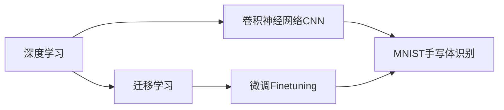

# 从零开始大模型开发与微调：实战MNIST手写体识别

关键词：大模型、MNIST、手写体识别、迁移学习、微调、深度学习、计算机视觉

## 1. 背景介绍
### 1.1 问题的由来
在人工智能和机器学习领域,手写体识别一直是一个经典且具有挑战性的问题。随着深度学习技术的飞速发展,尤其是大模型的出现,手写体识别的准确率得到了显著提升。然而,对于大多数开发者和研究者来说,从零开始训练一个高精度的手写体识别模型仍然是一个不小的挑战。

### 1.2 研究现状
目前,业界主流的手写体识别方法主要基于卷积神经网络(CNN)。一些经典的CNN模型如LeNet、AlexNet、VGGNet等在MNIST数据集上都取得了不错的效果。近年来,随着注意力机制、Transformer等技术的发展,一些更加先进的模型如Vision Transformer(ViT)也被应用到手写体识别任务中,并取得了state-of-the-art的结果。

### 1.3 研究意义
尽管目前已经有许多优秀的手写体识别模型,但对于初学者来说,如何从零开始训练一个高精度的模型仍然是一个值得探索的问题。通过亲自动手实践,不仅可以加深对深度学习和计算机视觉的理解,还可以掌握一些实用的技巧和经验。此外,在训练过程中学会如何进行模型微调和迁移学习,对于解决其他视觉任务也有借鉴意义。

### 1.4 本文结构
本文将以MNIST手写体识别为例,详细介绍如何从零开始开发和微调一个高精度的大模型。内容涵盖了深度学习基础知识回顾、MNIST数据集介绍、CNN模型设计、训练流程、微调技巧以及实验结果分析等方面。通过本文的学习,读者将掌握大模型开发的基本流程,并能够将其应用到其他视觉任务中。

## 2. 核心概念与联系
在开始详细介绍模型开发流程之前,我们先来回顾一下几个核心概念:  

- 深度学习:一种基于多层神经网络的机器学习方法,通过学习大量数据来自动提取特征和建模。
- 卷积神经网络(CNN):一种专门用于处理网格拓扑结构数据(如图像)的神经网络,由卷积层、池化层、全连接层等组成。
- 迁移学习:将一个领域学习到的知识迁移到另一个相关领域,从而减少所需的训练数据和训练时间。常见的做法是使用在大规模数据集上预训练的模型作为基础模型,然后在小规模数据集上进行微调。
- 微调(Fine-tuning):在迁移学习中,使用较小的学习率在新的数据集上训练预训练模型的部分或全部层,从而使模型适应新的任务。

下图展示了这些概念之间的关系:



## 3. 核心算法原理 & 具体操作步骤
### 3.1 算法原理概述
本文采用的核心算法是卷积神经网络(CNN)。CNN通过局部连接和权重共享,能够有效地提取图像中的空间特征。一个典型的CNN网络由以下几个部分组成:

- 卷积层(Convolutional Layer):通过卷积操作提取图像的局部特征
- 激活函数(Activation Function):引入非线性,增强网络的表达能力,常用的有ReLU、Sigmoid、Tanh等
- 池化层(Pooling Layer):通过下采样操作减少特征图的尺寸,提高特征的鲁棒性
- 全连接层(Fully Connected Layer):对提取到的特征进行分类或回归预测

### 3.2 算法步骤详解
下面我们详细介绍使用CNN进行MNIST手写体识别的步骤:

1. 数据预处理
   - 将图像归一化到[0,1]范围内
   - 对图像进行中心化,减去均值
   - 将标签转换为one-hot编码形式

2. 搭建CNN模型
   - 定义模型的输入尺寸,如(28, 28, 1)
   - 添加卷积层和池化层,如Conv2D(32, (3,3)) + MaxPooling2D((2,2))
   - 添加激活函数,如ReLU
   - 重复上述步骤,构建多个卷积-池化模块
   - 添加全连接层,如Dense(128, activation='relu') 
   - 添加输出层,如Dense(10, activation='softmax')

3. 模型训练
   - 定义损失函数,如categorical_crossentropy
   - 定义优化器,如Adam
   - 设置训练轮数epochs和批次大小batch_size
   - 调用model.fit()进行训练,并指定验证集

4. 模型评估
   - 在测试集上评估模型性能,如accuracy、precision、recall等指标
   - 进行错误分析,查看分类错误的样本
   - 绘制混淆矩阵,分析各个类别的识别情况

5. 模型微调
   - 在预训练模型的基础上,冻结部分底层,只训练顶层
   - 使用较小的学习率和较少的训练轮数
   - 评估微调后的模型性能,对比微调前后的差异

### 3.3 算法优缺点
CNN用于MNIST手写体识别的优点包括:

- 能够自动提取图像的空间特征,避免了手工设计特征的繁琐
- 通过局部连接和权重共享,大大减少了参数量,降低了过拟合风险
- 具有平移不变性,对于手写体的形变和位置偏移有较好的鲁棒性

但CNN也存在一些局限性,如:

- 需要大量的标注数据进行训练,对于小样本场景效果有限
- 对于高分辨率图像,计算复杂度和内存消耗较大
- 缺乏对全局信息的建模能力,难以捕捉图像中的长距离依赖关系

### 3.4 算法应用领域
除了手写体识别,CNN还被广泛应用于以下领域:

- 人脸识别
- 目标检测与分割
- 图像分类
- 医学影像分析
- 自动驾驶
- 遥感图像解译
- 等等

## 4. 数学模型和公式 & 详细讲解 & 举例说明
### 4.1 数学模型构建
CNN的数学模型可以用以下公式来表示:

$$ h_j^l = f(\sum_i w_{ij}^l * h_i^{l-1} + b_j^l) $$

其中:
- $h_j^l$表示第$l$层第$j$个神经元的输出
- $w_{ij}^l$表示第$l-1$层第$i$个神经元到第$l$层第$j$个神经元的连接权重
- $b_j^l$表示第$l$层第$j$个神经元的偏置项
- $f$表示激活函数,如ReLU: $f(x)=max(0,x)$
- $*$表示卷积操作

### 4.2 公式推导过程
以一个简单的二层CNN为例,输入为$28\times28$的图像,第一层为$3\times3$的卷积核,步长为1,padding为same,第二层为$2\times2$的最大池化,步长为2,输出为$10$维向量。则前向传播过程可以表示为:

$$ h_j^1 = ReLU(\sum_{i=1}^{28\times28} w_{ij}^1 * x_i + b_j^1), j=1,2,...,32 $$

$$ h_k^2 = MaxPooling(h_j^1), k=1,2,...,16 $$

$$ y = Softmax(W^3 h^2 + b^3) $$

其中$x_i$表示输入图像的第$i$个像素,$y$表示输出的$10$维概率向量。

### 4.3 案例分析与讲解
下面我们以一个具体的手写数字图像为例,来说明CNN的工作原理。假设输入的是一张数字"7"的灰度图像,尺寸为$28\times28$,如下图所示:


经过第一层卷积后,提取出了图像的局部特征,如边缘、纹理等。不同的卷积核关注不同的特征模式,例如:

- 卷积核1:提取横向边缘
- 卷积核2:提取纵向边缘
- 卷积核3:提取左斜45度边缘
- 卷积核4:提取右斜45度边缘

经过池化操作后,特征图的尺寸减小,对小的形变和位移更加鲁棒。最后通过全连接层将提取到的特征映射到10个类别上,经过softmax归一化后得到各个类别的概率。

### 4.4 常见问题解答
Q: 卷积核的大小如何选择?
A: 常见的卷积核大小有$3\times3$、$5\times5$、$7\times7$等,一般越大的卷积核感受野越大,能够捕捉更全局的特征,但参数量也越多。实践中可以通过交叉验证来选择最优的卷积核大小。

Q: 池化层的作用是什么?
A: 池化层通过下采样操作减小特征图的尺寸,一方面降低了计算复杂度,另一方面也提高了特征的鲁棒性和平移不变性。常见的池化操作有最大池化和平均池化。

Q: 如何选择激活函数?
A: 常用的激活函数有ReLU、Sigmoid、Tanh等,其中ReLU因为收敛速度快且能缓解梯度消失问题而被广泛使用。但在某些场景下,如生成对抗网络中,也会使用Leaky ReLU、PReLU等变体。

## 5. 项目实践：代码实例和详细解释说明
下面我们使用Python和Keras库来实现一个简单的CNN模型,对MNIST手写数字进行识别。

### 5.1 开发环境搭建
首先需要安装必要的库,包括:
- numpy: 数值计算库
- matplotlib: 绘图库
- tensorflow: 深度学习框架
- keras: 基于tensorflow的高层API

可以通过以下命令安装:

```bash
pip install numpy matplotlib tensorflow keras
```

### 5.2 源代码详细实现
完整的代码如下:

```python
import numpy as np
import matplotlib.pyplot as plt
from tensorflow.keras.datasets import mnist
from tensorflow.keras.models import Sequential
from tensorflow.keras.layers import Dense, Dropout, Flatten, Conv2D, MaxPooling2D
from tensorflow.keras.optimizers import Adam

# 加载MNIST数据集
(x_train, y_train), (x_test, y_test) = mnist.load_data()

# 数据预处理
x_train = x_train.reshape(x_train.shape[0], 28, 28, 1) / 255.0
x_test = x_test.reshape(x_test.shape[0], 28, 28, 1) / 255.0
y_train = tf.keras.utils.to_categorical(y_train)
y_test = tf.keras.utils.to_categorical(y_test)

# 搭建CNN模型
model = Sequential()
model.add(Conv2D(32, kernel_size=(3, 3), activation='relu', input_shape=(28, 28, 1)))
model.add(Conv2D(64, (3, 3), activation='relu'))
model.add(MaxPooling2D(pool_size=(2, 2)))
model.add(Dropout(0.25))
model.add(Flatten())
model.add(Dense(128, activation='relu'))
model.add(Dropout(0.5))
model.add(Dense(10, activation='softmax'))

# 模型训练
model.compile(loss='categorical_crossentropy', optimizer=Adam(), metrics=['accuracy'])
history = model.fit(x_train, y_train, batch_size=128, epochs=12, verbose=1, validation_data=(x_test, y_test))

# 模型评估
score = model.evaluate(x_test, y_test, verbose=0)
print('Test loss:', score[0])
print('Test accuracy:', score[1])

# 绘制训练过程
plt.plot(history.history['accuracy'])
plt.plot(history.history['val_accuracy'])
plt.title('Model accuracy')
plt.ylabel('Accuracy')
plt.xlabel('Epoch')
plt.legend(['Train', 'Test'], loc='upper left')
plt.show()
```

### 5.3 代码解读与分析
1. 首先加载MNIST数据集,并进行预处理。将图像归一化到[0,1]范围内