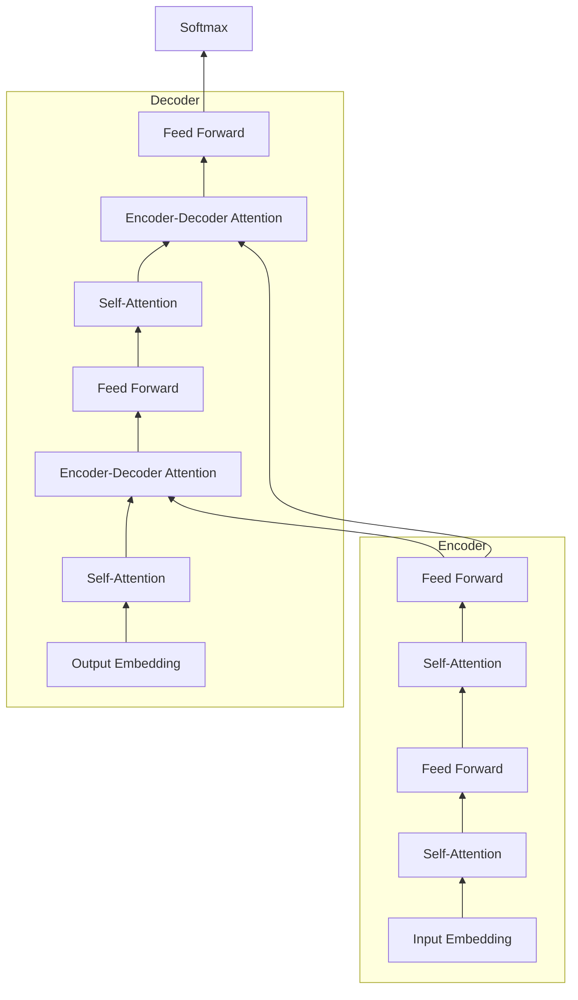
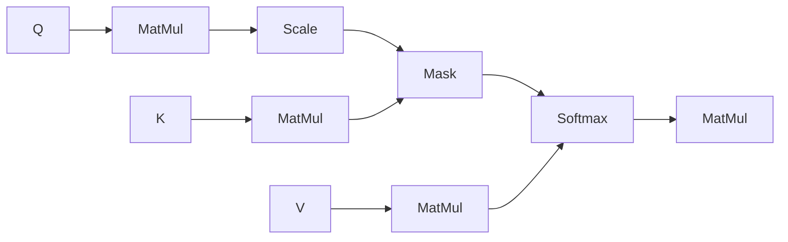
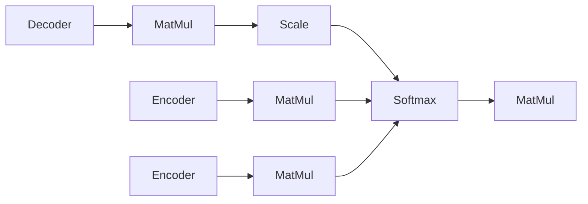

# 从零开始大模型开发与微调：解码器的核心—注意力模型

关键词：大模型、注意力机制、Transformer、自然语言处理、深度学习、机器翻译、Seq2Seq、自回归、编码器-解码器

## 1. 背景介绍

### 1.1 问题的由来

随着人工智能技术的不断发展,自然语言处理(NLP)已成为当前最热门的研究领域之一。在NLP的众多任务中,机器翻译、文本摘要、对话系统等序列到序列(Seq2Seq)的生成任务一直是研究的重点。传统的Seq2Seq模型通常采用编码器-解码器(Encoder-Decoder)的架构,其中解码器在生成目标序列时,需要考虑源序列的信息以及已生成的目标序列信息。然而,RNN等传统的序列模型难以捕捉长距离的依赖关系,生成的文本连贯性和信息捕捉能力有限。

### 1.2 研究现状

2017年,Google提出了基于注意力机制的Transformer模型[1],开创了NLP领域的新时代。Transformer抛弃了传统的RNN结构,完全依靠注意力机制来学习序列间的依赖关系,并引入了自注意力、多头注意力、位置编码等创新性的设计,大幅提升了模型的性能。此后,各种Transformer的变体如BERT[2]、GPT[3]、T5[4]等大型预训练语言模型(PLM)不断涌现,刷新了NLP各项任务的性能记录。

### 1.3 研究意义

尽管Transformer在学术界和工业界得到了广泛应用,但对于初学者来说,其内部的注意力机制仍然是一个难以理解的"黑盒子"。特别是在Seq2Seq任务中,解码器需要同时建模源序列和目标序列的信息,其注意力计算过程更加复杂。深入理解Transformer解码器的注意力模型,对于从零开始进行大模型的开发和微调具有重要意义。只有真正掌握了其内部原理,才能更好地根据具体任务进行模型设计与改进。

### 1.4 本文结构

本文将重点介绍Transformer解码器中的注意力模型。第2部分介绍Transformer的整体架构和核心概念。第3部分重点剖析解码器注意力的计算过程和算法原理。第4部分给出注意力计算的数学模型和公式推导。第5部分提供了解码器注意力的代码实现和详细解释。第6部分讨论了注意力机制在实际应用中的一些改进和拓展。第7部分推荐了一些学习Transformer的资源。第8部分对全文进行总结,并对未来的研究方向进行展望。

## 2. 核心概念与联系

在深入解码器的注意力模型之前,我们先回顾一下Transformer的整体架构和一些核心概念。

Transformer采用了编码器-解码器的架构,如图1所示。编码器由若干个相同的层堆叠而成,每一层包含两个子层:自注意力层和前馈神经网络层。解码器也由若干个相同的层堆叠而成,每一层包含三个子层:自注意力层、编码-解码注意力层和前馈神经网络层。Transformer的核心创新在于采用了注意力机制来学习序列间的依赖关系,抛弃了传统的RNN结构。

图1 Transformer的编码器-解码器架构

自注意力机制允许序列中的任意两个位置计算注意力,捕捉长距离依赖。多头注意力通过引入多个注意力函数,增强模型的表示能力。前馈神经网络层由两个线性变换和一个ReLU激活函数组成,用于对特征进行非线性变换。

在编码器中,自注意力层让序列的每个位置都能与其他位置进行信息交互。在解码器中,自注意力层只能看到当前位置之前的信息,保证了生成过程的自回归性。而编码-解码注意力层则让解码器的每个位置都能获取编码器的输出信息,建立源序列和目标序列的联系。

此外,Transformer还引入了位置编码(Positional Encoding)来引入序列的位置信息。通过将位置编码与词嵌入相加,让模型能够区分不同位置的词。

## 3. 核心算法原理 & 具体操作步骤

### 3.1 算法原理概述

解码器是Seq2Seq模型的核心组件,它根据编码器的输出和之前生成的信息,预测下一个目标词。Transformer解码器采用了自回归的生成方式,通过自注意力和编码-解码注意力来建模序列内部和序列间的依赖关系。解码器的每一层都包含三个子层:自注意力层、编码-解码注意力层和前馈神经网络层。

### 3.2 算法步骤详解

1. 自注意力层
   
自注意力层让解码器的每个位置都能与之前的位置进行信息交互。与编码器的自注意力略有不同,解码器的自注意力采用了masked multi-head attention,通过mask矩阵的设置,防止解码器看到未来的信息,如图2所示。

图2 Masked Multi-Head Attention

具体来说,自注意力的计算过程如下:

a. 将解码器的输入X分别乘以三个权重矩阵$W^Q$,$W^K$,$W^V$,得到三个矩阵Q,K,V。

$Q=XW^Q, K=XW^K, V=XW^V$

b. 将Q,K进行点积并除以$\sqrt{d_k}$,得到scores矩阵。其中$d_k$为K的维度。

$scores=\frac{QK^T}{\sqrt{d_k}}$

c. 在scores矩阵上应用mask,将当前位置之后的scores设为负无穷,防止看到未来信息。

d. 对scores矩阵应用softmax函数,得到注意力权重矩阵。

$Attention(Q,K,V)=softmax(\frac{QK^T}{\sqrt{d_k}}+mask)V$

e. 将注意力权重矩阵与V相乘,得到自注意力的输出。

f. 将多头注意力的结果拼接,并乘以一个权重矩阵$W^O$,得到最终的自注意力输出。

$MultiHead(X)=Concat(head_1,...,head_h)W^O$

其中$head_i=Attention(XW_i^Q,XW_i^K,XW_i^V)$

2. 编码-解码注意力层

编码-解码注意力层让解码器的每个位置都能获取编码器的输出信息,如图3所示。其计算过程与自注意力类似,只不过Q来自解码器,而K和V来自编码器的输出。由于解码器可以看到编码器的所有信息,因此不需要进行mask操作。

图3 Encoder-Decoder Attention

3. 前馈神经网络层

前馈神经网络层对特征进行非线性变换,增强模型的表示能力。它由两个线性变换和一个ReLU激活函数组成:

$FFN(x)=max(0,xW_1+b_1)W_2+b_2$

其中$W_1,W_2,b_1,b_2$为可学习的参数。

### 3.3 算法优缺点

Transformer解码器的注意力模型具有以下优点:

- 通过自注意力建模序列内部的长距离依赖,克服了RNN的长期依赖问题。
- 通过编码-解码注意力获取源序列的相关信息,提高了翻译质量。
- 采用多头注意力,增强了模型的表示能力。
- 计算高度并行,训练速度快。

但它也存在一些缺点:

- 计算复杂度随序列长度平方增长,难以处理很长的序列。
- 位置编码是固定的,难以建模复杂的位置关系。
- 解码需要自回归,难以支持非自回归的生成方式。

### 3.4 算法应用领域

Transformer解码器的注意力模型已成为NLP领域的标配,广泛应用于以下任务:

- 机器翻译:将源语言序列转换为目标语言序列。
- 文本摘要:将长文本压缩为简短的摘要。
- 对话系统:根据对话历史生成回复。
- 语言模型:根据上文预测下一个词。
- 图像描述:根据图像生成自然语言描述。

此外,Transformer的解码器也被用于语音识别、视频字幕等跨模态任务中。

## 4. 数学模型和公式 & 详细讲解 & 举例说明

### 4.1 数学模型构建

我们以机器翻译任务为例,介绍Transformer解码器的数学模型。设源语言序列为$X=(x_1,...,x_n)$,目标语言序列为$Y=(y_1,...,y_m)$。Transformer解码器的目标是最大化以下条件概率:

$P(Y|X)=\prod_{t=1}^m P(y_t|y_{<t},X)$

其中$y_{<t}$表示$y_t$之前的目标词。解码器在每个时间步$t$根据之前生成的序列$y_{<t}$和编码器的输出$H^e$来预测下一个目标词$y_t$。

### 4.2 公式推导过程

解码器在时间步$t$的输入为$y_{<t}$的嵌入向量$E^d$和位置编码$P^d$之和:

$H_0^d=E^d+P^d$

其中$E^d \in \mathbb{R}^{m \times d_{model}}$,$P^d \in \mathbb{R}^{m \times d_{model}}$。$d_{model}$为模型维度。

然后,解码器的每一层按照以下步骤进行计算:

1. 自注意力层

$A_l^d=MultiHead(H_{l-1}^d,H_{l-1}^d,H_{l-1}^d)$

$H_l^{d*}=LayerNorm(A_l^d+H_{l-1}^d)$

其中$MultiHead$为多头自注意力函数,$LayerNorm$为层归一化。

2. 编码-解码注意力层

$C_l^d=MultiHead(H_l^{d*},H^e,H^e)$

$H_l^{d'}=LayerNorm(C_l^d+H_l^{d*})$

其中$H^e$为编码器的输出。

3. 前馈神经网络层

$F_l^d=FFN(H_l^{d'})$

$H_l^d=LayerNorm(F_l^d+H_l^{d'})$

最后,解码器的输出$H_L^d$经过线性变换和softmax函数,得到目标词的概率分布:

$P(y_t|y_{<t},X)=softmax(H_L^dW^{out}+b^{out})$

其中$W^{out} \in \mathbb{R}^{d_{model} \times |V|}$,$b^{out} \in \mathbb{R}^{|V|}$为可学习的参数,$|V|$为目标语言词表大小。

### 4.3 案例分析与讲解

我们以一个英译汉的例子来说明解码器的生成过程。假设源语言序列为"I love you",目标语言序列为"我爱你"。

编码器首先将源语言序列编码为一个上下文向量序列$H^e$。然后,解码器在每个时间步根据之前生成的汉语词和$H^e$来预测下一个汉语词。

具体来说,在第