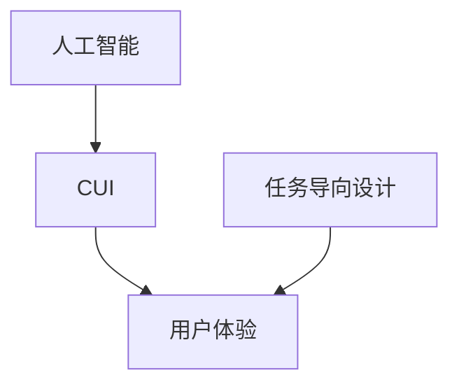

# 任务导向设计思维在CUI中的应用

关键词：任务导向设计、CUI、用户体验、交互设计、人工智能

## 1. 背景介绍
### 1.1 问题的由来
随着人工智能技术的飞速发展,对话式用户界面(Conversational User Interface,CUI)正在成为人机交互的新趋势。与传统的图形用户界面(GUI)不同,CUI通过自然语言对话的方式实现人机交互,让用户能够更自然、更高效地完成任务。然而,如何设计出优秀的CUI,为用户提供出色的交互体验,仍然是一个值得深入探讨的问题。

### 1.2 研究现状
目前,学术界和工业界都在积极探索CUI的设计方法。谷歌、微软、苹果等科技巨头纷纷推出了自己的对话式AI助手,如Google Assistant、Cortana、Siri等。这些产品在实践中证明,CUI确实能够显著提升用户体验。但另一方面,由于对CUI的设计理念和方法还不够成熟,许多CUI产品在用户体验上仍存在不足,如对话不够自然、任务完成效率低下等问题。

### 1.3 研究意义
深入研究CUI的设计方法,对于推动CUI技术的发展和应用具有重要意义。一方面,优秀的CUI设计能够极大提升用户体验,让用户以更自然、更高效的方式与系统进行交互;另一方面,CUI作为人工智能落地应用的重要场景之一,对其设计方法的探索也将促进人工智能技术的进步。因此,研究CUI的设计方法具有重要的理论和实践价值。

### 1.4 本文结构
本文将从任务导向设计思维的角度,探讨如何将其应用于CUI的设计中。全文共分为9个章节:第1章介绍研究背景;第2章阐述CUI、任务导向设计等核心概念;第3章分析将任务导向设计思维应用于CUI设计的原理和步骤;第4章建立数学模型并推导设计公式;第5章通过代码实例演示设计方法;第6章讨论该设计方法的实际应用场景;第7章推荐相关工具和资源;第8章总结全文并展望未来;第9章为文章附录。

## 2. 核心概念与联系
在探讨将任务导向设计思维应用于CUI之前,首先需要明确几个核心概念:

- CUI(Conversational User Interface):通过自然语言对话实现人机交互的用户界面。其特点是交互自然、任务导向、个性化程度高。
- 任务导向设计(Task-Oriented Design):以用户需要完成的具体任务为中心来设计系统和界面的方法。其核心是站在用户的角度,优化任务完成的路径和效率。
- 用户体验(User Experience):用户在使用产品或服务的过程中建立起来的整体感受,涉及使用的便捷性、愉悦性、效率等多个维度。
- 人工智能(Artificial Intelligence):使机器能够模拟人的智能行为(如学习、推理、判断等)的技术。其中自然语言处理是实现CUI的关键AI技术。

这几个概念之间有着紧密的联系。任务导向设计思维是指导CUI设计的重要方法,其目标是为用户创造优秀的使用体验。而人工智能技术,尤其是自然语言处理,则是实现CUI的底层技术基础。下图展示了这几个核心概念之间的关系:

## 3. 核心算法原理 & 具体操作步骤
### 3.1 算法原理概述
将任务导向设计思维应用于CUI,其核心是构建一个以任务为中心的对话管理系统。该系统需要具备以下关键能力:

1. 理解用户意图:准确理解用户在对话中的真实需求,识别出用户想要完成的任务。这需要运用自然语言理解(NLU)技术。 

2. 管理对话流程:根据用户意图,规划多轮对话的进行路径,引导用户高效完成任务。这需要对话管理器(Dialogue Manager)发挥作用。

3. 生成自然回复:根据对话的上下文,为用户生成自然、合理的回复内容。这需要自然语言生成(NLG)技术。

4. 记忆对话历史:为了使对话连贯,系统需要记住对话的历史信息,理解上下文语义。这需要一定的存储和理解能力。

### 3.2 算法步骤详解
基于上述原理,任务导向的CUI设计可分为以下步骤:

1. 定义任务:根据产品场景,分析和定义用户可能要完成的典型任务,并将其抽象为若干意图。

2. 设计对话流:针对每个意图,设计一个多轮对话的流程图,确定每一步对话的主要目的。

3. 撰写对话脚本:为对话流中的每个节点撰写对话脚本,设计机器的问题和用户的可能回答。

4. 配置NLU模型:根据对话脚本,配置NLU模型,训练其准确识别用户意图和关键信息。

5. 实现对话管理:根据对话流,实现一个对话管理器,控制多轮对话的进行,记录对话状态。

6. 接入NLG模型:选择合适的NLG模型,生成自然、流畅的对话回复。

7. 设计补充话术:为一些特殊情况设计补充话术,如无法识别意图、对话脱轨等。

8. 设计过渡语:在对话的不同阶段,设计自然的过渡语,让对话更流畅。

9. 反复测试优化:在真实场景中反复测试对话,不断优化NLU、对话管理和NLG的效果。

### 3.3 算法优缺点
上述算法的优点在于:
- 以真实任务为导向设计对话,有助于提升用户的任务完成效率;
- 将复杂任务拆解为多个意图和多轮对话,简化了系统理解和回应的难度;
- 应用成熟的NLU、对话管理和NLG技术,可以实现较为自然流畅的对话体验。

但该算法也存在一些局限性:
- 预先定义任务和设计对话流,在一定程度上限制了对话的灵活性;  
- 难以处理超出预设意图和流程的对话;
- 对于非常复杂的任务,完整的对话流设计成本高,难度大。

### 3.4 算法应用领域
任务导向的CUI设计方法,主要应用在以完成特定任务为目标的场景中,比如:
- 智能客服:通过对话引导用户解决问题,如账号问题、订单状态查询等。
- 任务助手:通过对话帮助用户完成特定任务,如订机票、设置闹钟、查天气等。
- 信息查询:通过对话为用户提供特定信息,如股票查询、路况查询等。
- 操作引导:通过对话引导用户进行某些操作,如设备安装、软件操作等。

## 4. 数学模型和公式 & 详细讲解 & 举例说明
### 4.1 数学模型构建
为了实现更加智能、自然的任务导向CUI,我们可以建立一个数学模型。设计思路是:根据当前对话状态 $s$,结合用户输入 $u$ 和对话历史 $h$,预测下一步对话动作 $a$。形式化表示为:

$$
a = \arg\max_{a'}P(a'|s,u,h)
$$

其中, $P(a'|s,u,h)$ 表示在当前对话状态 $s$ 下,基于用户输入 $u$ 和对话历史 $h$,选择动作 $a'$ 的概率。我们的目标是选择概率最大的动作 $a$。

### 4.2 公式推导过程
根据贝叶斯公式,可以将 $P(a'|s,u,h)$ 进一步分解为:

$$
P(a'|s,u,h) = \frac{P(s,u,h|a') \cdot P(a')}{P(s,u,h)}
$$

其中, $P(s,u,h|a')$ 表示采取动作 $a'$ 后,产生当前对话状态、用户输入和历史的概率; $P(a')$ 是选择动作 $a'$ 的先验概率; $P(s,u,h)$ 为归一化因子,与 $a'$ 的选择无关,可以忽略。因此,上式可以简化为:

$$
P(a'|s,u,h) \propto P(s,u,h|a') \cdot P(a')
$$

进一步,假设对话状态 $s$ 只与前一步的动作 $a_p$ 有关,用户输入 $u$ 只与当前状态 $s$ 有关,历史 $h$ 与当前动作 $a'$ 无关,则有:

$$
P(s,u,h|a') = P(s|a_p) \cdot P(u|s) \cdot P(h)
$$

代入上式,得到:

$$
P(a'|s,u,h) \propto P(s|a_p) \cdot P(u|s) \cdot P(a')
$$

其中, $P(s|a_p)$ 可以通过对话状态转移概率建模, $P(u|s)$ 可以通过NLU模型计算用户意图概率得到, $P(a')$ 可以用对话动作的先验分布估计。

### 4.3 案例分析与讲解
下面我们用一个简单的例子来说明如何应用上述模型。假设我们要设计一个订餐助手的CUI,它需要通过对话获取用户的订餐信息。我们定义了以下对话状态:

- $s_1$:问候状态,等待用户回复
- $s_2$:询问用餐人数状态
- $s_3$:询问用餐时间状态
- $s_4$:推荐菜品状态
- $s_5$:确认订单状态

在 $s_1$ 状态下,假设用户输入为 "我要订餐",通过NLU模型计算得到用户意图为"订餐",概率 $P(u|s_1)=0.8$。系统可选动作有:
- $a_1$:问候用户,维持 $s_1$ 状态
- $a_2$:询问用餐人数,转到 $s_2$ 状态

假设 $P(s_1|a_1)=0.9$, $P(s_2|a_2)=0.8$,两个动作的先验概率相同,则可计算:

$$
P(a_1|s_1,u) \propto 0.9 \times 0.8 \times 0.5 = 0.36 \\
P(a_2|s_1,u) \propto 0.8 \times 0.8 \times 0.5 = 0.32
$$

因此系统会选择动作 $a_1$,回复"你好,欢迎使用订餐助手,我能为你做些什么?"。

类似地,系统可以在每个状态下根据用户输入和对话历史,计算最佳动作,引导用户完成订餐。

### 4.4 常见问题解答
1. 如何设计对话状态和动作空间?
   
   对话状态和动作的设计需要根据具体任务和场景而定。通常,我们可以将任务拆解为几个关键步骤,每个步骤定义为一个状态。每个状态下,可以定义一组动作,如询问信息、提供建议、确认结果等。状态和动作设计的原则是尽量简洁,但要覆盖任务的关键流程。

2. 如何评估对话策略的好坏?

   可以从以下几个维度来评估一个对话策略:
   - 任务完成率:用户能否在对话中完成预定任务。
   - 对话效率:用户完成任务所需的对话轮数。
   - 用户满意度:用户对对话过程的主观评价。
   
   针对这些指标,我们可以设计一些定量和定性的评估方法,如用户调研、人工评估等。通过评估结果不断迭代优化对话策略。
   
3. 对话策略能否自动学习优化?

   除了人工设计对话策略,我们还可以利用强化学习等算法,让系统根据反馈自动学习优化策略。具体而言,我们可以将对话过程建模为一个马尔可夫决策过程(MDP),通过与用户的多次对话