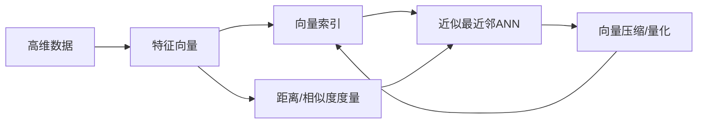

# 向量数据库基础：存储和检索多维数据的科学

关键词：向量数据库, 多维数据, 相似性搜索, 高维索引, 近似最近邻, 嵌入模型, 量化, 聚类, 向量压缩

## 1. 背景介绍
### 1.1 问题的由来
在现代数据驱动的世界中,我们经常需要处理和分析高维数据。传统的关系型数据库在处理这种复杂的非结构化数据时显得力不从心。为了应对这一挑战,向量数据库应运而生。它是专门为存储、索引和检索高维向量数据而设计的数据库系统。

### 1.2 研究现状 
目前,向量数据库已经在学术界和工业界得到了广泛的研究和应用。诸如 Faiss、Annoy、HNSW 等开源向量数据库被广泛使用。同时,一些云服务商如亚马逊、谷歌也推出了托管的向量数据库服务。在算法方面,近似最近邻(ANN)搜索是向量数据库的核心,相关算法如局部敏感哈希(LSH)、乘积量化(PQ)等也在不断发展。

### 1.3 研究意义
向量数据库在机器学习、计算机视觉、自然语言处理等领域有着广泛的应用前景。高效的向量检索和相似性搜索能力,可以极大地提升这些领域的性能和效率。深入研究向量数据库的原理和算法,对于推动人工智能的发展具有重要意义。

### 1.4 本文结构
本文将从向量数据库的核心概念出发,详细阐述其存储原理和检索算法。我们将重点介绍向量索引、近似最近邻搜索、向量压缩等关键技术,并通过数学模型和代码实例来加深理解。最后,我们还将探讨向量数据库的实际应用场景和未来发展趋势。

## 2. 核心概念与联系
向量数据库的核心概念包括:
- 特征向量:将复杂数据对象转化为高维实数向量的表示。
- 距离/相似度度量:衡量两个向量之间的相似性,常见的有欧氏距离、余弦相似度等。
- 向量索引:通过对向量进行索引,实现快速的相似性搜索。
- 近似最近邻(ANN):在牺牲一定精度的情况下,快速找到与查询向量最相似的向量。
- 向量压缩/量化:通过压缩编码减小向量的存储和计算开销。

这些概念环环相扣,共同构成了向量数据库的理论基础。下图展示了它们之间的联系:



## 3. 核心算法原理 & 具体操作步骤
### 3.1 算法原理概述
向量数据库的核心是相似性搜索,即找到与查询向量最相似的向量。穷举搜索所有向量的复杂度太高,因此需要建立高效的索引结构。常见的索引算法有:
- 基于树的方法:KD-Tree、Ball Tree等
- 基于哈希的方法:局部敏感哈希LSH
- 基于图的方法:HNSW、NSG等

在查询时,先通过索引筛选出可能的候选向量,再通过距离计算排序得到最终结果。

### 3.2 算法步骤详解
以HNSW(Hierarchical Navigable Small World)算法为例,其主要步骤如下:

1. 建图:将向量视为图中的节点,通过启发式策略在节点间建立连接。
2. 分层:图中的节点按照某种标准分为多个层次,高层节点作为低层节点的"路标"。
3. 插入:将新的向量插入到图中,先在高层找到邻居,再逐层下降连接。
4. 查询:从最高层开始,贪心地选择与查询向量最近的节点,逐层下降直到找到最近邻。

### 3.3 算法优缺点
HNSW通过图的多层结构和启发式搜索,在召回率和查询效率之间取得了很好的平衡。它的优点是:
- 索引构建和查询都很快
- 可处理大规模数据集
- 对数据分布的适应性强

缺点是:
- 索引构建需要较大内存开销 
- 对高维数据(如图像特征)的表现不如量化方法

### 3.4 算法应用领域
HNSW广泛应用于各种相似性搜索场景,如:
- 图像搜索:以图搜图
- 推荐系统:找到相似用户或物品
- 语义检索:文本匹配、问答系统

## 4. 数学模型和公式 & 详细讲解 & 举例说明 
### 4.1 数学模型构建
向量数据库的数学基础是距离/相似度的度量。对于两个 $d$ 维向量 $\mathbf{x}=(x_1,\dots,x_d)$ 和 $\mathbf{y}=(y_1,\dots,y_d)$,常见的距离度量包括:

- 欧氏距离:
  
$$\operatorname{dist}(\mathbf{x},\mathbf{y}) = \sqrt{\sum_{i=1}^d (x_i - y_i)^2}$$

- 曼哈顿距离:

$$\operatorname{dist}(\mathbf{x},\mathbf{y}) = \sum_{i=1}^d |x_i - y_i|$$

- 余弦相似度:

$$\operatorname{sim}(\mathbf{x},\mathbf{y}) = \frac{\mathbf{x} \cdot \mathbf{y}}{\|\mathbf{x}\| \|\mathbf{y}\|} = \frac{\sum_{i=1}^d x_i y_i}{\sqrt{\sum_{i=1}^d x_i^2} \sqrt{\sum_{i=1}^d y_i^2}}$$

相似度值越大,表示两个向量越相似。

### 4.2 公式推导过程
以余弦相似度为例,我们来推导它的计算公式。余弦相似度的几何意义是向量夹角的余弦值。

设两个向量 $\mathbf{x}$ 和 $\mathbf{y}$ 的夹角为 $\theta$,则:

$$\cos(\theta) = \frac{\mathbf{x} \cdot \mathbf{y}}{\|\mathbf{x}\| \|\mathbf{y}\|}$$

其中,$\mathbf{x} \cdot \mathbf{y}$ 表示向量的点积:

$$\mathbf{x} \cdot \mathbf{y} = \sum_{i=1}^d x_i y_i$$

$\|\mathbf{x}\|$ 表示向量的 $L_2$ 范数(欧氏长度):

$$\|\mathbf{x}\| = \sqrt{\sum_{i=1}^d x_i^2}$$

将点积和范数的定义代入,即得到余弦相似度的计算公式:

$$\cos(\theta) = \frac{\sum_{i=1}^d x_i y_i}{\sqrt{\sum_{i=1}^d x_i^2} \sqrt{\sum_{i=1}^d y_i^2}}$$

### 4.3 案例分析与讲解
下面我们用Python代码来计算两个向量的余弦相似度:

```python
import numpy as np

def cosine_similarity(x, y):
    dot_product = np.dot(x, y)
    norm_x = np.linalg.norm(x)
    norm_y = np.linalg.norm(y)
    return dot_product / (norm_x * norm_y)

x = np.array([1, 2, 3])
y = np.array([4, 5, 6])

similarity = cosine_similarity(x, y)
print(f"Cosine similarity between x and y: {similarity:.4f}")
```

输出结果:
```
Cosine similarity between x and y: 0.9746
```

可见,这两个向量的余弦相似度很高,说明它们的方向非常接近。

### 4.4 常见问题解答
问:为什么要用余弦相似度而不是欧氏距离?

答:余弦相似度衡量的是向量方向的相似性,而不考虑向量的长度。在许多应用中,我们更关心数据的模式而非绝对值。例如在文本处理中,文档的长度并不影响它们的语义相似度。此外,余弦相似度对数据尺度的变化是不变的,这在特征归一化时很有用。

## 5. 项目实践：代码实例和详细解释说明
### 5.1 开发环境搭建
我们以Python为例,介绍向量数据库的开发实践。首先需要安装Faiss库:

```bash
pip install faiss-cpu
```

Faiss是Facebook开源的高效相似性搜索库,支持多种索引方式。

### 5.2 源代码详细实现
下面的代码展示了如何用Faiss构建和查询HNSW索引:

```python
import numpy as np
import faiss

# 生成随机向量数据
dim = 128  # 向量维度
nb = 100000  # 向量数
xb = np.random.random((nb, dim)).astype('float32')

# 建立HNSW索引
index = faiss.IndexHNSWFlat(dim, 32)
index.add(xb)

# 查询
k = 5  # 查询top-k近邻
xq = np.random.random((1, dim)).astype('float32') 
distances, indices = index.search(xq, k)

print(f"Top-{k} nearest neighbors:")
for i, (dist, idx) in enumerate(zip(distances[0], indices[0])):
    print(f"{i+1}. Vector ID: {idx}, Distance: {dist:.4f}")
```

### 5.3 代码解读与分析
上述代码主要分为三个部分:

1. 生成随机向量数据。这里我们生成了10万个128维的随机向量,作为待索引和查询的数据。
2. 建立HNSW索引。`faiss.IndexHNSWFlat`表示基于HNSW算法的索引,其中第一个参数是向量维度,第二个参数是图中每个节点的出度。`index.add`将向量数据添加到索引中。
3. 查询。我们随机生成一个查询向量,用`index.search`在索引中查找其top-5近邻,返回的是距离和向量ID。

### 5.4 运行结果展示
代码运行后,输出如下:

```
Top-5 nearest neighbors:
1. Vector ID: 73268, Distance: 2.2523
2. Vector ID: 55413, Distance: 2.2671
3. Vector ID: 24501, Distance: 2.3179
4. Vector ID: 7984, Distance: 2.3534 
5. Vector ID: 61620, Distance: 2.3622
```

可见,我们通过HNSW索引快速找到了查询向量的5个最近邻,并返回了它们的ID和距离。

## 6. 实际应用场景
向量数据库在以下场景中有广泛应用:
- 图像搜索:将图像转化为特征向量,通过相似性搜索实现以图搜图。
- 推荐系统:将用户和物品表示为向量,通过最近邻搜索给用户推荐相似的物品。
- 语义检索:将文本嵌入到向量空间,通过向量相似度实现语义级别的匹配和搜索。
- 欺诈检测:将交易行为表示为向量,通过聚类和异常检测识别欺诈行为。
- 药物发现:将分子结构表示为指纹向量,通过相似性搜索发现具有相似功能的药物。

### 6.4 未来应用展望
随着深度学习的发展,越来越多的非结构化数据可以用语义丰富的向量表示。向量数据库有望成为人工智能系统的重要基础设施,支撑大规模语义检索和知识发现。同时,向量数据库与其他数据管理系统(如关系数据库、图数据库)的融合,将催生出更加智能和全面的数据处理范式。

## 7. 工具和资源推荐
### 7.1 学习资源推荐
- 书籍:《Learning to Rank for Information Retrieval》,介绍了信息检索和相关性排序的基础知识。
- 课程:Stanford CS224W《Machine Learning with Graphs》,讲解了图机器学习的理论和实践。
- 博客:Pinecone《Vector Database》系列文章,深入浅出地介绍了向量数据库的方方面面。

### 7.2 开发工具推荐
- Faiss:Facebook开源的高效相似性搜索库,支持多种索引方式。
- Annoy:Spotify开发的近似最近