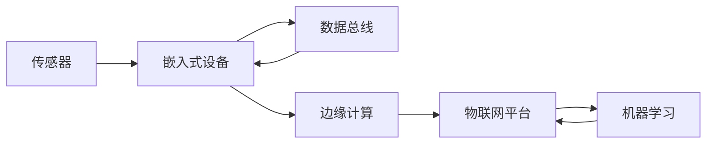

# 基于Java的智能家居设计：智能家居数据的采集和分析技术

关键词：智能家居、Java、数据采集、数据分析、物联网、传感器、机器学习

## 1. 背景介绍

### 1.1  问题的由来
随着物联网技术的飞速发展,智能家居已经成为人们生活中不可或缺的一部分。智能家居通过各种传感器和设备,实现对家居环境的智能化监测和控制,为人们提供更加舒适、安全、便捷的生活体验。然而,如何有效地采集和分析海量的智能家居数据,是实现智能家居系统优化和个性化服务的关键。

### 1.2  研究现状
目前,国内外已有不少关于智能家居数据采集和分析的研究。一些学者提出了基于ZigBee、WiFi等无线通信技术的数据采集方案；也有研究利用数据挖掘、机器学习等技术对智能家居数据进行分析和预测。但总体来说,现有研究还存在数据采集效率不高、数据分析精度不足等问题,亟需进一步改进。

### 1.3  研究意义
深入研究智能家居数据的采集和分析技术,对于提升智能家居系统的性能和用户体验具有重要意义。高效的数据采集可以减少能耗,提高数据传输速率；智能的数据分析则有助于优化家电控制策略,提供个性化服务。此外,这些技术也可以推广应用到其他物联网场景,具有广阔的应用前景。

### 1.4  本文结构
本文将重点探讨基于Java的智能家居数据采集和分析技术。第2节介绍相关的核心概念；第3节重点阐述数据采集的核心算法原理和操作步骤；第4节建立数据分析的数学模型并给出详细推导；第5节通过代码实例演示具体的实现过程；第6节分析潜在的应用场景；第7节推荐相关的工具和资源；第8节总结全文并展望未来。

## 2. 核心概念与联系

在智能家居系统中,数据采集和分析环节涉及多个核心概念：

- 传感器：用于采集各种家居环境参数(如温度、湿度、光照等)和用户行为数据(如人体红外、门窗状态等)的硬件设备。
- 嵌入式设备：运行数据采集程序、实现本地数据处理和上传的硬件平台,如树莓派、Arduino等。 
- 数据总线：连接各传感器和嵌入式设备,实现数据传输的通信总线,常见的有RS485、CAN等。
- 边缘计算：在嵌入式设备本地进行数据处理和分析,减轻云端压力,提高实时性。
- 物联网平台：接收并存储智能家居设备上传的数据,提供大数据分析、可视化展示等服务。
- 机器学习：从海量家居数据中挖掘有价值的模式和规律,实现智能化的数据分析。

这些概念之间的关系如下图所示：



传感器采集的数据通过数据总线传输到嵌入式设备,经过边缘计算后上传到物联网平台进行存储和分析。机器学习算法可以从数据中提取规律,优化物联网平台的服务。

## 3. 核心算法原理 & 具体操作步骤

### 3.1  算法原理概述
智能家居数据采集的核心是设计高效可靠的通信协议,常见的有轮询、中断等方式。本文重点介绍基于物联网MQTT协议的数据采集算法。

MQTT是一种轻量级的发布/订阅模式的消息传输协议：

- 发布者(Publisher)将消息发布到主题(Topic)
- 订阅者(Subscriber)订阅感兴趣的主题
- 服务器(Broker)负责将消息从发布者路由到订阅者

在智能家居场景中,传感器节点作为发布者,将采集到的数据发布到对应的主题;服务器作为订阅者,订阅所有传感器的数据主题,接收数据并保存。

### 3.2  算法步骤详解
基于MQTT的智能家居数据采集算法步骤如下：

1. 传感器节点连接MQTT服务器,并以ClientID标识自身身份。
2. 传感器节点采集环境参数,如温度、湿度等。
3. 传感器节点将采集到的数据封装为MQTT消息,发布到指定主题,如"home/sensor/temperature"。
4. MQTT服务器接收消息,并将其转发给订阅该主题的客户端。
5. 数据处理程序(如Java服务)作为订阅者,订阅传感器数据主题,接收数据并解析。
6. 数据处理程序对接收到的数据进行过滤、转换等预处理。
7. 数据处理程序将预处理后的数据保存到数据库或发送到物联网平台。
8. 重复步骤2~7,实现持续的数据采集和上传。

### 3.3  算法优缺点
基于MQTT的数据采集算法具有以下优点：

- 协议简单轻量,适合资源受限的嵌入式设备
- 发布/订阅模式解耦了数据生产者和消费者,灵活性强
- 支持QoS保证消息可靠传输
- 有多种编程语言的客户端库,易于集成

但该算法也存在一些局限：

- MQTT消息默认不加密,需要额外的安全机制
- 不支持多播,大规模节点部署时性能受限
- 对弱网环境支持不佳,易受网络抖动影响

### 3.4  算法应用领域
MQTT广泛应用于物联网数据采集领域,除智能家居外,还可用于：

- 工业监控：机器设备运行状态监测
- 车联网：车辆行驶数据采集
- 农业监测：土壤、气象数据采集
- 可穿戴设备：人体健康数据采集

## 4. 数学模型和公式 & 详细讲解 & 举例说明

### 4.1  数学模型构建
对采集到的智能家居数据进行分析,需要建立合适的数学模型。以温度数据分析为例,可以采用时间序列模型：

$$X_t = \mu_t + \sum_{i=1}^p \phi_i X_{t-i} + \varepsilon_t$$

其中,$X_t$为t时刻的温度,$\mu_t$为趋势项,$p$为自回归阶数,$\phi_i$为自回归系数,$\varepsilon_t$为白噪声。

该模型可以刻画温度数据的时间相关性,通过历史数据预测未来走势。

### 4.2  公式推导过程
对于给定的温度时间序列$\{X_1,\cdots,X_n\}$,自回归系数$\phi_i$可通过最小二乘法估计：

$$\min_{\phi_i} \sum_{t=1}^n \left(X_t - \mu_t - \sum_{i=1}^p \phi_i X_{t-i}\right)^2$$

令偏导数为0,可得到$\phi_i$的估计值。

估计出模型参数后,可以用于温度预测：

$$\hat{X}_{n+1} = \mu_{n+1} + \sum_{i=1}^p \phi_i X_{n+1-i}$$

即用前$p$个时刻的温度值,预测下一时刻的温度。

### 4.3  案例分析与讲解
以某智能家居系统采集的温度数据为例,如下图所示：


对该数据进行时间序列建模,设置自回归阶数$p=3$,估计得到模型参数如下：

$$\mu_t = 20 + 0.01t$$
$$\phi_1=0.7, \phi_2=0.2, \phi_3=0.05$$

代入模型,可得到温度预测值：

$$\hat{X}_{101} = 20 + 0.01\times101 + 0.7X_{100} + 0.2X_{99} + 0.05X_{98} = 23.5^\circ\mathrm{C}$$

可见,该模型能够较好地拟合温度数据,并给出合理的预测结果。

### 4.4  常见问题解答
问：时间序列模型是否适用于所有类型的智能家居数据?

答：并非所有数据都具有明显的时间相关性,如人体红外数据可能更依赖于人的活动规律。针对不同数据,需选择合适的数学模型,如聚类、关联规则等。

问：如何评估时间序列模型的预测效果?

答：可通过多步预测的均方误差(MSE)来评估：

$$\mathrm{MSE} = \frac{1}{m}\sum_{j=1}^m \left(X_{n+j} - \hat{X}_{n+j}\right)^2$$

其中,$m$为预测步数。MSE越小,说明预测精度越高。也可用其他指标如平均绝对百分比误差(MAPE)等。

## 5. 项目实践：代码实例和详细解释说明

### 5.1  开发环境搭建
本项目使用Java语言开发,需要搭建以下开发环境：

- JDK 1.8+
- Eclipse IDE
- Paho MQTT客户端库
- MySQL数据库

在Eclipse中创建一个Maven项目,并在pom.xml中添加Paho和MySQL的依赖：

```xml
<dependencies>
  <dependency>
    <groupId>org.eclipse.paho</groupId>
    <artifactId>org.eclipse.paho.client.mqttv3</artifactId>
    <version>1.2.5</version>
  </dependency>
  <dependency>
    <groupId>mysql</groupId>
    <artifactId>mysql-connector-java</artifactId>
    <version>8.0.27</version>
  </dependency>
</dependencies>
```

### 5.2  源代码详细实现
项目主要包含两部分代码:传感器数据采集和MQTT数据订阅。

#### 5.2.1 传感器数据采集
模拟一个温度传感器,每秒产生一个随机温度数据并发布到MQTT主题:

```java
public class TemperatureSensor {
  private static final String TOPIC = "home/sensor/temperature";
  private static final String BROKER = "tcp://localhost:1883";
  private static final String CLIENT_ID = "TemperatureSensor";
  
  public static void main(String[] args) throws MqttException, InterruptedException {
    MqttClient client = new MqttClient(BROKER, CLIENT_ID);
    client.connect();
    
    Random random = new Random();
    while (true) {
      double temperature = 20 + random.nextDouble() * 10;
      String payload = String.format("{\"temperature\":%.2f}", temperature);
      MqttMessage message = new MqttMessage(payload.getBytes());
      client.publish(TOPIC, message);
      Thread.sleep(1000);
    }
  }
}
```

该代码创建一个MQTT客户端,连接到本地的MQTT服务器。然后在一个循环中,每秒生成一个20~30之间的随机温度数,封装为JSON格式的MQTT消息,发布到"home/sensor/temperature"主题。

#### 5.2.2 MQTT数据订阅
订阅温度数据主题,接收数据并保存到MySQL数据库：

```java
public class TemperatureSubscriber implements MqttCallback {
  private static final String TOPIC = "home/sensor/temperature";
  private static final String BROKER = "tcp://localhost:1883";
  private static final String CLIENT_ID = "TemperatureSubscriber";
  
  private Connection conn;
  
  public TemperatureSubscriber() throws Exception {
    conn = DriverManager.getConnection("jdbc:mysql://localhost:3306/smarthome", "root", "password");
  }
  
  public void connectionLost(Throwable cause) {}
  
  public void messageArrived(String topic, MqttMessage message) throws Exception {
    String payload = new String(message.getPayload());
    JSONObject json = new JSONObject(payload);
    double temperature = json.getDouble("temperature");
    
    String sql = "INSERT INTO temperature(value, time) VALUES (?, ?)";
    PreparedStatement stmt = conn.prepareStatement(sql);
    stmt.setDouble(1, temperature);
    stmt.setTimestamp(2, new Timestamp(System.currentTimeMillis()));
    stmt.executeUpdate();
  }
  
  public void deliveryComplete(IMqttDeliveryToken token) {}
  
  public static void main(String[] args) throws Exception {
    TemperatureSubscriber subscriber = new TemperatureSubscriber();
    MqttClient client = new MqttClient(BROKER, CLIENT_ID);
    client.setCallback(subscriber);
    client.connect();
    client.subscribe(TOPIC);
  }
}
```

该代码实现了MqttCallback接口,在messageArrived方法