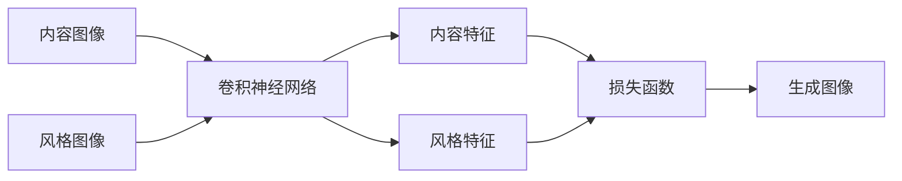

# 基于卷积神经网络的图像风格化处理

关键词：卷积神经网络、图像风格化、深度学习、计算机视觉

## 1. 背景介绍

### 1.1 问题的由来

在计算机视觉领域中，图像风格化处理是一个令人着迷的研究方向。它旨在将一幅图像的风格特征转移到另一幅图像上，同时保留目标图像的内容信息。传统的图像风格化方法通常需要大量的手工特征工程和复杂的优化过程，难以实现高质量和高效率的风格转换。近年来，随着深度学习技术的发展，特别是卷积神经网络（Convolutional Neural Networks, CNNs）的出现，图像风格化处理取得了突破性进展。

### 1.2 研究现状

卷积神经网络在计算机视觉任务中表现出色，如图像分类、目标检测和语义分割等。研究人员发现，通过利用预训练的卷积神经网络提取的特征，可以有效地捕捉图像的内容和风格信息。基于此，许多研究工作将卷积神经网络应用于图像风格化处理，并取得了令人瞩目的成果。

其中，Gatys等人在2015年提出了一种基于卷积神经网络的图像风格化算法，通过最小化内容图像和风格图像在卷积特征空间上的差异，实现了令人印象深刻的风格转换效果。此后，许多研究者在此基础上进行了改进和扩展，如加入额外的正则化项、使用更深的网络结构、引入注意力机制等，进一步提升了风格化的质量和效率。

### 1.3 研究意义

图像风格化处理具有广泛的应用前景。在艺术创作领域，它可以帮助艺术家快速生成具有特定风格的作品，激发创意灵感。在游戏和电影行业，风格化技术可以用于创建独特的视觉效果和艺术风格。此外，图像风格化还可以应用于图像增强、图像修复等任务，提升图像的视觉质量和美感。

深入研究基于卷积神经网络的图像风格化处理，不仅可以推动计算机视觉领域的发展，还可以为相关行业提供更加智能和高效的工具，促进艺术与科技的融合。

### 1.4 本文结构

本文将围绕基于卷积神经网络的图像风格化处理展开深入探讨。第二部分将介绍图像风格化的核心概念和卷积神经网络的基本原理。第三部分将详细阐述基于卷积神经网络的图像风格化算法，包括算法原理、具体步骤和优缺点分析。第四部分将介绍图像风格化的数学模型和公式推导，并通过案例进行说明。第五部分将展示项目实践，包括代码实现和结果展示。第六部分将讨论图像风格化的实际应用场景和未来展望。第七部分将推荐相关的工具和学习资源。第八部分将总结全文，并对未来的发展趋势和挑战进行展望。最后，附录部分将解答一些常见问题。

## 2. 核心概念与联系

图像风格化的目标是将一幅风格图像的风格特征转移到一幅内容图像上，生成一幅融合了内容图像内容和风格图像风格的新图像。这个过程涉及到以下几个核心概念：

1. 内容图像：提供内容信息的图像，即我们希望保留其内容结构的图像。
2. 风格图像：提供风格特征的图像，即我们希望从中提取风格信息的图像。
3. 生成图像：风格化处理的输出图像，融合了内容图像的内容和风格图像的风格。
4. 卷积神经网络：一种深度学习模型，通过卷积操作提取图像的层次特征。
5. 特征表示：卷积神经网络在不同层提取的图像特征，捕捉了图像的内容和风格信息。
6. 损失函数：衡量生成图像与内容图像和风格图像之间差异的函数，用于指导风格化过程。

这些概念之间存在着紧密的联系。卷积神经网络通过逐层卷积和池化操作，提取图像的层次特征表示。在图像风格化中，我们利用预训练的卷积神经网络提取内容图像和风格图像的特征表示，并通过最小化损失函数来优化生成图像，使其在内容和风格上与目标图像相似。

下图展示了基于卷积神经网络的图像风格化处理的整体流程：

## 3. 核心算法原理 & 具体操作步骤

### 3.1 算法原理概述

基于卷积神经网络的图像风格化算法的核心思想是利用预训练的卷积神经网络提取图像的内容和风格特征，并通过最小化损失函数来优化生成图像，使其同时保留内容图像的内容信息和风格图像的风格特征。

具体而言，该算法通过以下步骤实现图像风格化：

1. 选择一个预训练的卷积神经网络（如VGG网络），并将其应用于内容图像、风格图像和初始生成图像。
2. 在卷积神经网络的不同层提取内容图像和风格图像的特征表示。
3. 定义内容损失函数，衡量生成图像与内容图像在内容特征上的差异。
4. 定义风格损失函数，衡量生成图像与风格图像在风格特征上的差异。
5. 定义总损失函数，将内容损失和风格损失加权求和。
6. 通过反向传播和梯度下降优化算法，最小化总损失函数，更新生成图像的像素值。
7. 迭代优化过程，直到达到预设的迭代次数或满足一定的收敛条件。
8. 输出最终的风格化生成图像。

### 3.2 算法步骤详解

下面对算法的关键步骤进行详细说明：

1. 特征提取：
   - 使用预训练的卷积神经网络（如VGG-19）对内容图像、风格图像和生成图像进行前向传播。
   - 在网络的不同卷积层提取特征图，通常选择较高层的特征图来表示内容信息，选择较低层和较高层的特征图来表示风格信息。

2. 内容损失计算：
   - 选择一个或多个卷积层作为内容表示层，计算生成图像与内容图像在这些层上的特征图的均方误差（MSE）作为内容损失。
   - 内容损失函数的定义如下：
     $L_{content}(p,x) = \frac{1}{2}\sum_{i,j}(F_{ij}^l(p) - F_{ij}^l(x))^2$
     其中，$p$表示内容图像，$x$表示生成图像，$F^l$表示第$l$层卷积层的特征图，$i,j$为特征图的空间位置索引。

3. 风格损失计算：
   - 选择一个或多个卷积层作为风格表示层，计算生成图像与风格图像在这些层上的特征图的Gram矩阵的均方误差作为风格损失。
   - Gram矩阵表示特征图之间的相关性，捕捉了图像的纹理和风格信息。
   - 风格损失函数的定义如下：
     $L_{style}(a,x) = \frac{1}{4N_l^2M_l^2}\sum_{i,j}(G_{ij}^l(a) - G_{ij}^l(x))^2$
     其中，$a$表示风格图像，$x$表示生成图像，$G^l$表示第$l$层卷积层特征图的Gram矩阵，$N_l$和$M_l$分别表示第$l$层特征图的高度和宽度。

4. 总损失函数定义：
   - 将内容损失和风格损失加权求和，得到总损失函数。
   - 总损失函数的定义如下：
     $L_{total}(p,a,x) = \alpha L_{content}(p,x) + \beta L_{style}(a,x)$
     其中，$\alpha$和$\beta$分别表示内容损失和风格损失的权重系数，用于平衡两种损失的重要性。

5. 优化过程：
   - 使用反向传播算法计算生成图像相对于总损失函数的梯度。
   - 采用梯度下降优化算法（如Adam优化器）更新生成图像的像素值，以最小化总损失函数。
   - 迭代执行前向传播、损失计算、反向传播和参数更新的过程，直到达到预设的迭代次数或满足一定的收敛条件。

6. 输出风格化图像：
   - 当优化过程结束后，将生成图像作为最终的风格化图像输出。

### 3.3 算法优缺点

基于卷积神经网络的图像风格化算法具有以下优点：

1. 高质量的风格转换：通过利用卷积神经网络提取的高级特征，该算法能够生成视觉上令人印象深刻的风格化图像，保留了内容图像的语义信息，同时呈现出风格图像的艺术风格。

2. 通用性强：该算法可以应用于各种不同风格的图像，无需对特定风格进行手工调整或设计专门的算法。只需提供一张风格图像，就可以将其风格转移到任意内容图像上。

3. 端到端的学习：该算法通过端到端的学习方式，直接从数据中学习风格转换的映射关系，无需手工提取特征或设计复杂的规则。

4. 可控性：通过调整内容损失和风格损失的权重系数，可以控制生成图像中内容和风格的相对重要性，实现不同程度的风格转换效果。

然而，该算法也存在一些局限性：

1. 计算成本较高：由于需要在卷积神经网络的多个层上提取特征并计算损失函数，该算法的计算复杂度较高，需要较长的处理时间和较大的内存开销。

2. 依赖预训练模型：该算法通常依赖于预训练的卷积神经网络（如VGG网络）来提取图像特征，这限制了算法的灵活性和适应性。

3. 生成图像的多样性有限：该算法生成的风格化图像虽然在视觉上令人满意，但往往缺乏创意和多样性。生成的图像倾向于模仿风格图像的纹理和颜色，而不会引入新的艺术元素。

4. 对高分辨率图像的处理受限：由于计算资源的限制，该算法在处理高分辨率图像时可能面临困难，需要更大的内存和更长的处理时间。

### 3.4 算法应用领域

基于卷积神经网络的图像风格化算法在以下领域有广泛的应用：

1. 艺术创作：该算法可以帮助艺术家快速生成具有特定风格的艺术作品，如将照片转换为油画、水彩画或抽象画风格，激发艺术灵感和创意。

2. 游戏和电影行业：在游戏和电影制作中，风格化技术可以用于创建独特的视觉效果和艺术风格，增强视觉冲击力和沉浸感。

3. 图像增强和修复：通过将风格化技术应用于图像增强和修复任务，可以提升图像的视觉质量和美感，如将低质量图像转换为高质量的艺术图像。

4. 用户界面设计：风格化技术可以应用于用户界面设计，根据不同的主题或风格自动生成相应的界面元素和图标，提供个性化的视觉体验。

5. 虚拟现实和增强现实：在虚拟现实和增强现实应用中，风格化技术可以用于创建逼真的虚拟环境和艺术效果，增强用户的沉浸感和交互体验。

6. 教育和培训：风格化技术可以应用于教育和培训领域，如将教学材料和插图转换为更具吸引力和艺术感的风格，提高学习者的兴趣和参与度。

## 4. 数学模型和公式 & 详细讲解 &