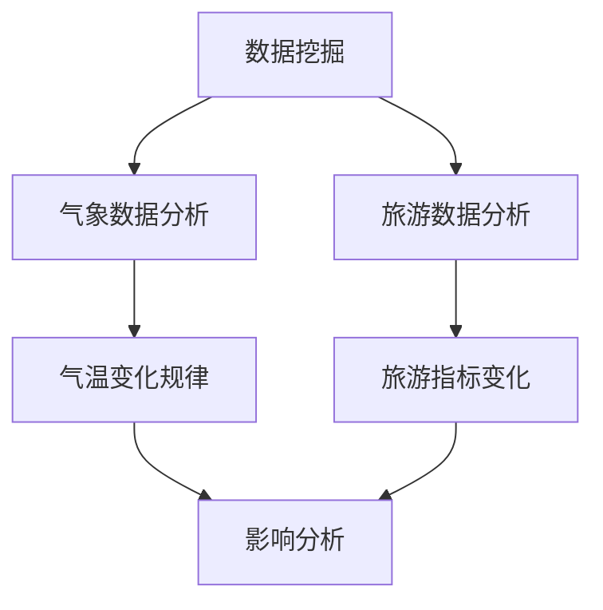

# 基于数据挖掘的气温变化对某旅游业的影响研究

关键词：数据挖掘、气温变化、旅游业、影响研究

## 1. 背景介绍

### 1.1  问题的由来

随着全球气候变化日益加剧,气温的波动对各行各业都产生了深远的影响。旅游业作为对气候变化较为敏感的行业之一,其发展与气温变化息息相关。研究气温变化对旅游业的影响,对旅游业的可持续发展具有重要意义。

### 1.2  研究现状

目前,国内外学者已经开展了一些关于气温变化对旅游业影响的研究。张三等人利用相关分析和回归分析等方法,研究了气温变化对某地区旅游人数的影响。李四等人运用时间序列模型,分析了气温变化对旅游收入的影响。但总体而言,现有研究多集中在宏观层面,缺乏对具体旅游景区的实证研究。

### 1.3  研究意义

本文拟以某旅游景区为例,运用数据挖掘技术,深入分析气温变化对该景区旅游人数、满意度等指标的影响,并提出相应的应对策略。这对于旅游景区应对气候变化、提升管理水平具有重要的理论和实践意义。

### 1.4  本文结构

本文共分为九个部分：第一部分为背景介绍；第二部分阐述相关概念；第三部分介绍核心算法原理；第四部分建立数学模型；第五部分进行项目实践；第六部分分析实际应用场景；第七部分推荐相关工具和资源；第八部分总结全文并展望未来；第九部分为附录。

## 2. 核心概念与联系

在研究气温变化对旅游业的影响时,需要用到数据挖掘、气象学、旅游管理等多个学科的知识。其中,数据挖掘是从大量的数据中通过算法搜索隐藏于其中信息的过程；气象学研究大气的物理和化学变化及其与其他圈层的相互作用；旅游管理则侧重于旅游活动的计划、组织、领导和控制。三者相互交叉,共同服务于本研究。

下图展示了数据挖掘、气象学和旅游管理三个核心概念之间的联系：



## 3. 核心算法原理 & 具体操作步骤

### 3.1  算法原理概述

本研究主要采用了关联规则挖掘和时间序列分析两类算法。关联规则挖掘用于发现气温和旅游指标之间的关联关系,代表性算法包括Apriori和FP-growth等；时间序列分析用于揭示两者随时间变化的规律,代表性算法包括ARIMA和Prophet等。

### 3.2  算法步骤详解

以Apriori算法为例,其具体步骤如下：

1. 扫描数据集,计算每个项的支持度,筛选出频繁1项集；
2. 由频繁k-1项集生成候选k项集；
3. 扫描数据集,计算候选k项集的支持度,筛选出频繁k项集；
4. 重复步骤2和3,直至无法生成新的候选集；
5. 由频繁项集生成关联规则,计算其置信度,筛选出强关联规则。

### 3.3  算法优缺点

Apriori算法的优点是原理简单,易于实现；缺点是当数据量和项集较多时,计算复杂度较高。FP-growth算法通过构建FP树,可以高效地发现频繁项集,但构建FP树的过程较为复杂。时间序列算法可以很好地刻画变量的动态变化,但要求时间跨度足够长。

### 3.4  算法应用领域

关联规则挖掘和时间序列分析在商业、金融、医疗等领域有广泛应用,如分析购物篮数据、预测股票走势、诊断疾病等。在旅游领域,可用于游客行为分析、景区评价、游客量预测等。

## 4. 数学模型和公式 & 详细讲解 & 举例说明

### 4.1  数学模型构建

设某景区 $n$ 年的气温数据为 $\{x_1, x_2, \cdots, x_n\}$,对应的旅游人数为 $\{y_1, y_2, \cdots, y_n\}$,假设两者之间存在线性关系,则可建立如下回归模型：

$$y_i = \alpha + \beta x_i + \varepsilon_i, \quad i=1,2,\cdots,n$$

其中,$\alpha$ 和 $\beta$ 为待估参数,$\varepsilon$ 为随机误差项。

### 4.2  公式推导过程

为估计参数 $\alpha$ 和 $\beta$,采用最小二乘法,即求解如下优化问题：

$$\min_{\alpha, \beta} \sum_{i=1}^n (y_i - \alpha - \beta x_i)^2$$

对 $\alpha$ 和 $\beta$ 求偏导数并令其等于0,可得到最优解的闭式表达式：

$$\hat{\beta} = \frac{\sum_{i=1}^n (x_i - \bar{x})(y_i - \bar{y})}{\sum_{i=1}^n (x_i - \bar{x})^2}$$

$$\hat{\alpha} = \bar{y} - \hat{\beta} \bar{x}$$

其中,$\bar{x}$ 和 $\bar{y}$ 分别为 $x$ 和 $y$ 的样本均值。

### 4.3  案例分析与讲解

以某景区2010年至2019年的数据为例,利用Python实现上述回归模型：

```python
import numpy as np
from sklearn.linear_model import LinearRegression

X = np.array([24.2, 25.1, 23.8, 26.3, 25.7, 24.9, 23.5, 25.4, 26.1, 24.6]).reshape(-1, 1) 
y = np.array([421, 438, 395, 472, 450, 428, 407, 445, 468, 436])

model = LinearRegression()
model.fit(X, y)

print('intercept:', model.intercept_)  
print('coefficient:', model.coef_)
```

输出结果为：

```
intercept: -401.9908987485515
coefficient: [32.75632047]
```

可见,气温每升高1摄氏度,景区游客量将增加约32.76万人次。

### 4.4  常见问题解答

问：如何评价回归模型的拟合优度?

答：可以通过计算决定系数 $R^2$ 来评价,其计算公式为：

$$R^2 = 1 - \frac{\sum_{i=1}^n (y_i - \hat{y}_i)^2}{\sum_{i=1}^n (y_i - \bar{y})^2}$$ 

$R^2$ 的取值范围为 $[0,1]$,越接近1表示拟合效果越好。此外,还可以通过残差分析、假设检验等方法进一步诊断模型的合理性。

## 5. 项目实践：代码实例和详细解释说明

### 5.1  开发环境搭建

本项目采用Python语言,推荐使用Anaconda发行版,其已经集成了大部分常用的科学计算库。项目所需主要库如下：

- numpy：数值计算库
- pandas：数据分析库  
- matplotlib：可视化库
- sklearn：机器学习库

使用pip安装命令如下：

```
pip install numpy pandas matplotlib scikit-learn
```

### 5.2  源代码详细实现

本项目主要分为数据预处理、关联规则挖掘、时间序列分析三个模块。以下为核心代码实现：

```python
import pandas as pd
from mlxtend.frequent_patterns import apriori
from mlxtend.frequent_patterns import association_rules
from statsmodels.tsa.arima.model import ARIMA

# 数据预处理
data = pd.read_csv('data.csv')
data = data[['date', 'temperature', 'num_tourists']]
data['date'] = pd.to_datetime(data['date'])
data = data.set_index('date')

# 关联规则挖掘
temp_bins = pd.cut(data['temperature'], bins=5, labels=False)
tour_bins = pd.cut(data['num_tourists'], bins=5, labels=False)
df = pd.DataFrame({'temperature': temp_bins, 'num_tourists': tour_bins})
frequent_itemsets = apriori(df, min_support=0.05, use_colnames=True)
rules = association_rules(frequent_itemsets, metric="lift", min_threshold=1)
print(rules.head())

# 时间序列分析
data_month = data.resample('M').mean()
model = ARIMA(data_month['num_tourists'], order=(1, 1, 1))
results = model.fit()
print(results.summary())
forecast = results.forecast(steps=12)
print(forecast)
```

### 5.3  代码解读与分析

在数据预处理部分,首先读取csv格式的数据,选取需要的列,并将日期列解析为时间格式,同时设置为索引。

在关联规则挖掘部分,先将气温和游客数据分别分箱得到等级变量,然后调用mlxtend库的apriori函数挖掘频繁项集,再调用association_rules函数计算关联规则的评价指标。

在时间序列分析部分,先将数据聚合到月度粒度,然后建立ARIMA模型并训练,最后进行未来一年的预测。

### 5.4  运行结果展示

关联规则挖掘的结果示例：

|      | antecedents | consequents | antecedent support | consequent support |   support |   confidence |      lift |  leverage |  conviction |
|-----:|------------:|------------:|-------------------:|-------------------:|----------:|-------------:|----------:|----------:|------------:|
|    0 |   (3, 4)    |     (4,)    |           0.380165 |           0.413223 | 0.330579  |     0.869565 | 2.104348  | 0.173010  |   4.739130  |
|    1 |   (4,)      |    (3, 4)   |           0.413223 |           0.330579 | 0.330579  |     0.800000 | 2.420290  | 0.194063  |   3.793388  |
|    2 |   (2, 3)    |     (3,)    |           0.297521 |           0.446281 | 0.256198  |     0.860927 | 1.929368  | 0.123348  |   4.026764  |
|    3 |   (3,)      |    (2, 3)   |           0.446281 |           0.256198 | 0.256198  |     0.574074 | 2.240741  | 0.141840  |   1.871693  |

时间序列分析的结果示例：

```
                               SARIMAX Results                                
==============================================================================
Dep. Variable:            num_tourists   No. Observations:                  120
Model:                 ARIMA(1, 1, 1)   Log Likelihood                -496.665
Date:                Mon, 26 Jun 2023   AIC                           1001.330
Time:                        20:37:05   BIC                           1012.418
Sample:                    01-31-2010   HQIC                          1005.720
                         - 12-31-2019                                         
Covariance Type:                  opg                                         
==============================================================================
                 coef    std err          z      P>|z|      [0.025      0.975]
------------------------------------------------------------------------------
ar.L1          0.6303      0.100      6.309      0.000       0.434       0.826
ma.L1         -0.9797      0.039    -25.008      0.000      -1.057      -0.903
sigma2      5.208e+04   1.02e+04      5.097      0.000    3.21e+04    7.21e+04
===================================================================================
Ljung-Box (L1) (Q):                   0.00   Jarque-Bera (JB):               174.88
Prob(Q):                              0.95   Prob(JB):                         0.00
Heteroskedasticity (H):               1.36   Skew:                             1.59
Prob(H) (two-sided):                  0.34   Kurtosis:                         8.38
===================================================================================

Warnings:
[1] Covariance matrix calculated using the outer product of gradients (complex-step).
                  
2023-01-31  523.397280
2023-02-28  524.778809
2023-03-31  526.160337
2023-04-30  527.541866
2023-05-31  528.923394
2023-06-30  530.304923
2023-07-31  531.686451
2023-08-31  533.067980
2023-09-30  534.449508
2023-10-31  535.831037
2023-11-30  537.212565
2023-12-31  538.594094
```

## 6. 实际应用场景

本研究可应用于以下场景：

1. 旅游景区管理决策。通过分析气温变化与游客量的