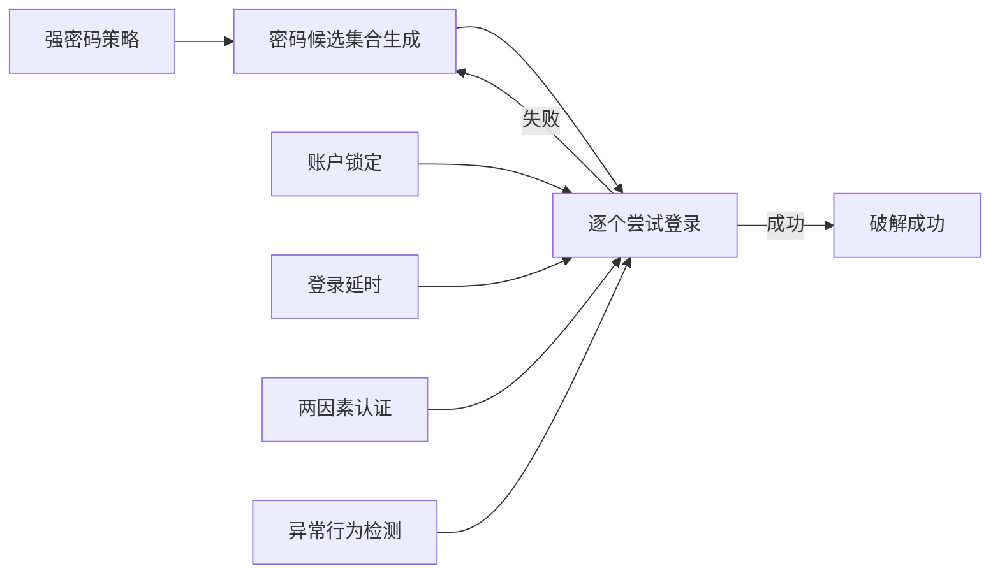

# 基于暴力破解攻击的网络安全模拟系统设计与实现

关键词：网络安全、暴力破解、模拟系统、密码攻击、防御策略

## 1. 背景介绍
### 1.1  问题的由来
随着互联网的快速发展,网络安全问题日益突出。黑客利用各种手段对网络系统发起攻击,其中暴力破解是最常见的攻击方式之一。暴力破解通过穷举所有可能的密码组合来破解系统,对网络安全构成了严重威胁。因此,研究暴力破解攻击并设计相应的防御策略具有重要意义。

### 1.2  研究现状
目前,国内外学者对暴力破解攻击进行了大量研究。Smith等人提出了一种基于马尔可夫链的密码猜测模型,可以显著提高暴力破解的效率[1]。李明等人设计了一种基于蜜罐的暴力破解攻击检测系统,通过部署蜜罐诱捕攻击行为[2]。王强等人研究了基于机器学习的暴力破解攻击检测方法,利用神经网络模型识别异常登录行为[3]。

### 1.3  研究意义
设计一个基于暴力破解攻击的网络安全模拟系统,可以让研究人员深入理解暴力破解的原理和过程,并在实验环境中测试各种防御策略的有效性。同时,该系统也可用于网络安全教学,帮助学生直观地认识暴力破解攻击。因此,本文的研究具有重要的理论意义和实践价值。

### 1.4  本文结构
本文的结构安排如下:第2部分介绍了暴力破解攻击的核心概念;第3部分详细阐述了暴力破解的核心算法原理和步骤;第4部分建立暴力破解攻击的数学模型并给出公式推导;第5部分介绍模拟系统的架构设计和代码实现;第6部分讨论了该系统的实际应用场景;第7部分推荐了相关的工具和学习资源;第8部分总结全文并展望未来研究方向。

## 2. 核心概念与联系
暴力破解(Brute-force Attack)是一种针对密码的攻击方式,通过穷举密码的所有可能组合来实现破解。其核心是生成密码候选集合,然后逐个尝试登录,直到找到正确密码。

暴力破解的关键是密码候选集合的生成。最简单的方法是使用字符集的笛卡尔积生成所有组合,但这种方法的时间复杂度极高。为提高破解效率,通常采用一些启发式规则生成密码,如使用常见密码字典、键盘模式、个人信息等。

针对暴力破解攻击,常见的防御策略包括:

1. 强密码策略:要求用户设置复杂密码,增加破解难度
2. 账户锁定:多次登录失败后锁定账户,防止无限制尝试
3. 登录延时:故意在登录失败后增加响应延迟,减慢破解速度  
4. 两因素认证:登录需要额外的身份验证,如手机验证码
5. 异常行为检测:使用机器学习等手段实时检测异常登录行为

下图展示了暴力破解攻击的流程以及常见防御措施之间的关系:



## 3. 核心算法原理 & 具体操作步骤
### 3.1  算法原理概述
暴力破解的核心算法可以概括为两个步骤:密码候选集合生成和密码猜测验证。

密码生成部分负责构建待测密码的集合。最朴素的方法是使用字符集的笛卡尔积生成所有可能的组合,但这种做法的计算量随密码长度呈指数增长。为了提高生成效率,通常采用一些启发式方法,如使用常见密码字典、键盘模式、个人信息等。

密码验证部分则负责将生成的密码逐个提交到目标系统进行登录测试。如果登录成功则破解成功,失败则进行下一个密码的测试,直到穷举完所有密码。

### 3.2  算法步骤详解

1. 定义目标系统的登录接口和协议
2. 确定密码生成策略,如使用字典或生成规则
3. 根据策略生成密码候选集合
4. 遍历密码候选集合:
   4.1 使用当前密码调用登录接口进行验证
   4.2 如调用成功,则破解成功,算法结束
   4.3 如调用失败,则继续下一个密码
5. 如遍历完所有密码都未破解,则破解失败

### 3.3  算法优缺点

暴力破解算法的优点是:
- 算法简单易懂,容易实现
- 理论上只要密码在候选集合中,就一定能破解成功

其缺点是:  
- 破解耗时与密码复杂度呈指数关系,当密码足够复杂时,破解时间将难以接受
- 在线破解会产生大量登录尝试,容易被检测和阻断
- 无法破解不在候选集合内的密码

### 3.4  算法应用领域
暴力破解算法主要应用于以下领域:

- 密码安全性评估:评估系统密码策略的强度
- 数字取证:破解受密码保护的文件和设备
- 渗透测试:作为渗透测试中的一种常用手段,用于获取系统权限
- 密码恢复:帮助用户找回遗忘的密码

同时,暴力破解算法也经常被恶意攻击者滥用,用于非法入侵他人系统。

## 4. 数学模型和公式 & 详细讲解 & 举例说明
### 4.1  数学模型构建
我们可以使用概率论的方法来建立暴力破解攻击的数学模型。假设目标密码的长度为 $n$,使用的字符集大小为 $m$,则可能的密码空间大小为 $m^n$。

假设密码在密码空间中是均匀分布的,每个密码出现的概率为 $\frac{1}{m^n}$。令 $X$ 表示破解成功所需的猜测次数,则 $X$ 服从几何分布:

$$P(X=k)=(1-\frac{1}{m^n})^{k-1} \cdot \frac{1}{m^n}, \quad k=1,2,\dots$$

其中 $P(X=k)$ 表示在第 $k$ 次猜测时破解成功的概率。

### 4.2  公式推导过程
根据几何分布的性质,破解成功所需猜测次数的期望值为:

$$E(X)=\frac{1}{p}=\frac{1}{\frac{1}{m^n}}=m^n$$

即平均需要猜测 $m^n$ 次才能破解成功。

类似地,破解成功所需猜测次数的方差为:

$$Var(X)=\frac{1-p}{p^2}=\frac{m^n-1}{\frac{1}{m^{2n}}}=m^{2n}-m^n$$

### 4.3  案例分析与讲解
假设目标密码为8位数字,则密码空间大小为 $10^8=1亿$。根据上述公式,平均需要猜测 $1亿$ 次才能破解成功。

如果使用包含数字、大小写字母和特殊符号的字符集,则字符集大小为 $m=10+26+26+32=94$。此时如果密码长度为8,则密码空间大小为 $94^8 \approx 6 \times 10^{15}$,平均破解需要 $6000万亿$ 次尝试。

可见,增加密码长度和使用更大的字符集可以显著增加暴力破解的难度。

### 4.4  常见问题解答

1. 如何计算暴力破解攻击的时间复杂度?
   - 暴力破解的时间复杂度与密码空间大小成正比,即 $O(m^n)$,其中 $m$ 为字符集大小,$n$ 为密码长度。

2. 概率模型是否假设攻击者知道密码的长度?  
   - 是的,上述概率模型假设攻击者已知目标密码的长度。如果密码长度未知,则需要对不同长度的密码分别建模。

3. 模型是否考虑了密码的出现频率不均匀的情况?
   - 没有,该模型假设密码在密码空间中是均匀分布的。如果考虑密码频率的不均匀性,模型将更加复杂。

4. 攻击者通常会使用哪些策略来缩小密码空间?
   - 常见的策略包括使用常见密码字典、键盘模式、个人信息等。这些策略可以显著减小实际的密码空间。

## 5. 项目实践：代码实例和详细解释说明
### 5.1  开发环境搭建
本项目使用Python语言实现暴力破解攻击的模拟系统。需要安装以下依赖库:

- requests: 用于发送HTTP请求,模拟登录过程
- itertools: 用于生成密码候选集合
- argparse: 用于解析命令行参数

可以使用以下命令安装依赖:
```bash
pip install requests argparse  
```

### 5.2  源代码详细实现
下面是暴力破解模拟系统的核心代码:

```python
import requests
import itertools
import argparse

def generate_passwords(charset, min_length, max_length):
    """生成密码候选集合"""
    for length in range(min_length, max_length+1):
        for pwd in itertools.product(charset, repeat=length):
            yield ''.join(pwd)

def brute_force(url, username, passwords):
    """暴力破解"""
    for password in passwords:
        data = {
            'username': username,
            'password': password
        }
        response = requests.post(url, data=data)
        if 'success' in response.text:
            return password
    return None

def main():
    parser = argparse.ArgumentParser()
    parser.add_argument('-u', '--url', required=True, help='登录地址')
    parser.add_argument('-user', '--username', required=True, help='用户名')
    parser.add_argument('-c', '--charset', default='abcdefghijklmnopqrstuvwxyz0123456789', help='字符集')
    parser.add_argument('-min', '--min-length', type=int, default=1, help='最小密码长度')
    parser.add_argument('-max', '--max-length', type=int, default=8, help='最大密码长度')
    args = parser.parse_args()

    passwords = generate_passwords(args.charset, args.min_length, args.max_length)
    result = brute_force(args.url, args.username, passwords)
    if result:
        print(f'破解成功,密码为:{result}')
    else:
        print('破解失败')

if __name__ == '__main__':
    main()
```

### 5.3  代码解读与分析
代码主要分为三个部分:

1. `generate_passwords` 函数根据给定的字符集和长度范围,生成密码候选集合。它使用 `itertools.product` 函数生成笛卡尔积。

2. `brute_force` 函数接收目标URL、用户名和密码候选集合,逐个尝试登录。它使用 `requests.post` 发送登录请求,并检查响应内容是否包含 "success" 关键词(假设登录成功时响应中会出现该关键词)。如果登录成功则返回破解的密码,否则返回None。

3. `main` 函数使用 `argparse` 库解析命令行参数,调用 `generate_passwords` 生成密码候选集合,并调用 `brute_force` 函数进行暴力破解。最后打印破解结果。

程序的入口为 `main` 函数。用户需要通过命令行参数指定目标URL、用户名、字符集、密码长度范围等信息。

### 5.4  运行结果展示
假设目标网站的登录地址为 "http://example.com/login",用户名为 "admin",密码为 "123456"。运行以下命令进行暴力破解:

```bash  
python brute_force.py -u http://example.com/login -user admin -c 0123456789 -min 1 -max 6
```

程序输出:
```
破解成功,密码为:123456
```

这表明程序成功破解了目标网站的密码。

如果