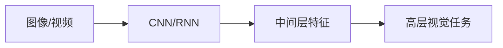
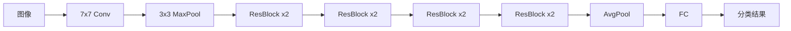

# 基于深度学习提取图像视频特征

关键词：深度学习、图像特征提取、视频特征提取、卷积神经网络、长短期记忆网络

## 1. 背景介绍

### 1.1 问题的由来
随着多媒体数据的爆炸式增长,如何有效地分析和理解图像视频内容,成为了人工智能和计算机视觉领域的重要课题。传统方法往往依赖于手工设计特征,存在特征表达能力不足、泛化性差等问题。深度学习的兴起为图像视频特征提取带来了新的契机。

### 1.2 研究现状
近年来,深度学习在计算机视觉任务中取得了显著成果,尤其是卷积神经网络(CNN)在图像分类、目标检测、语义分割等方面表现优异。针对视频理解,研究者提出了多种基于深度学习的特征提取方法,如双流网络、3D卷积、长短期记忆网络(LSTM)等,在视频分类、动作识别等任务上取得了良好效果。

### 1.3 研究意义
图像视频特征提取是计算机视觉的基础,是图像分类、目标检测、视频分析等高层任务的前提。探索基于深度学习的特征提取方法,对于提升视觉智能水平、推动多媒体内容理解具有重要意义。同时,这一研究也有助于拓展深度学习在计算机视觉中的应用。

### 1.4 本文结构
本文将围绕基于深度学习的图像视频特征提取展开论述。第2节介绍相关核心概念;第3节阐述特征提取的核心算法原理与步骤;第4节给出数学模型与公式推导;第5节展示代码实现;第6节分析实际应用场景;第7节推荐相关工具和资源;第8节总结全文并展望未来。

## 2. 核心概念与联系

在探讨基于深度学习的图像视频特征提取之前,有必要厘清几个核心概念:

- 特征:指数据中最能表达其本质属性、区分不同类别的关键信息。图像的特征可以是边缘、纹理、颜色等,视频的特征还包括运动信息。
- 特征提取:旨在从原始数据中抽取出discriminative的特征表示,用于后续的分析和理解。传统方法多采用手工设计特征。
- 深度学习:一类多层神经网络模型及其训练方法。深度学习能够学习层次化的特征表示,从原始数据中自动提取高层语义特征。
- 卷积神经网络:一种结构化的深度学习模型,擅长处理网格化数据如图像。CNN利用局部连接、权值共享等结构,能够有效提取图像空间特征。
- 循环神经网络:一种序列化的深度学习模型,适合处理时序数据。RNN能够建模数据的时间依赖关系,在视频特征提取中发挥重要作用。

这些概念之间紧密相关。CNN和RNN作为深度学习的代表模型,为图像视频特征提取提供了新思路。基于深度学习的特征提取流程可概括为:输入图像/视频 -> 深度网络前向计算 -> 提取中间层输出作为特征。相比传统方法,深度学习能够端到端地学习更加强大的特征表示。



## 3. 核心算法原理 & 具体操作步骤

### 3.1 算法原理概述
基于深度学习的图像视频特征提取,核心是利用CNN、RNN等深度模型学习层次化的特征表示。以CNN为例,其通过堆叠卷积层和池化层,逐层将图像映射到更高维度的特征空间,提取出语义层次更高的抽象特征。网络浅层提取局部特征如边缘纹理,深层提取全局语义特征。

### 3.2 算法步骤详解
图像特征提取的典型步骤如下:
1. 构建或选择合适的CNN模型,如VGG、ResNet等。
2. 在大规模图像数据集如ImageNet上预训练CNN模型。
3. 移除CNN的最后一层全连接层,将其余部分作为特征提取器。
4. 将待提取特征的图像输入到特征提取器,前向计算得到特征图。
5. 对特征图做全局平均池化,得到固定长度的特征向量。
6. 将提取到的特征用于下游任务,如图像分类、检索等。

对于视频特征提取,可在CNN基础上结合RNN,联合建模视频的外观和运动特征:
1. 逐帧提取视频的CNN特征。
2. 将CNN特征序列输入RNN如LSTM,学习时序依赖。
3. 将LSTM最后一个时间步的输出作为视频级别特征。

此外,还可采用3D CNN、双流网络等更复杂的模型,同时建模视频的空间和时间信息。

### 3.3 算法优缺点
基于深度学习的特征提取相比传统方法的优势在于:
- 自动学习特征表示,不需手工设计,节省人力。
- 学习到的特征语义层次更高,表达能力更强。
- 模型具有一定的泛化能力,可迁移到不同任务。

但该方法也存在一些局限:
- 需要大规模标注数据训练模型,对计算资源要求高。
- 模型学习到的特征缺乏可解释性。
- 对于小样本学习、跨域迁移等复杂场景,特征提取性能有待提升。

### 3.4 算法应用领域
图像视频特征提取作为计算机视觉的基础技术,在以下领域有广泛应用:
- 图像分类与检索:提取图像特征,用于大规模图像识别、相似性度量等。
- 目标检测与跟踪:提取候选区域特征,用于定位和追踪感兴趣目标。
- 人脸识别:提取人脸特征,用于人脸比对、身份验证等。
- 行为识别:提取视频特征,用于分析人物动作、事件检测等。
- 视觉问答:提取图像视频特征,结合文本问题,回答关于视觉内容的问题。

随着深度学习的不断发展,图像视频特征提取技术有望在更多领域发挥作用。

## 4. 数学模型和公式 & 详细讲解 & 举例说明

### 4.1 数学模型构建
对于一个L层的CNN,其数学模型可表示为:

$$
\begin{aligned}
\mathbf{a}^{(0)} &= \mathbf{x} \\
\mathbf{z}^{(l)} &= \mathbf{W}^{(l)}\mathbf{a}^{(l-1)} + \mathbf{b}^{(l)}, \quad l=1,2,\dots,L \\  
\mathbf{a}^{(l)} &= g^{(l)}(\mathbf{z}^{(l)}), \quad l=1,2,\dots,L-1 \\
\mathbf{\hat{y}} &= \text{softmax}(\mathbf{z}^{(L)})
\end{aligned}
$$

其中,$\mathbf{x}$为输入图像,$\mathbf{a}^{(l)}$为第$l$层激活值,$\mathbf{z}^{(l)}$为第$l$层加权输入,$\mathbf{W}^{(l)}$和$\mathbf{b}^{(l)}$为第$l$层权重和偏置,$g^{(l)}$为第$l$层激活函数,$\mathbf{\hat{y}}$为输出预测概率。

对于特征提取,取CNN倒数第二层$\mathbf{a}^{(L-1)}$作为图像特征即可。

### 4.2 公式推导过程
CNN通过反向传播算法学习模型参数。给定训练集$\{(\mathbf{x}_i, \mathbf{y}_i)\}_{i=1}^N$,CNN的损失函数定义为:

$$J(\mathbf{W},\mathbf{b}) = -\frac{1}{N}\sum_{i=1}^N\sum_{k=1}^K y_{ik}\log \hat{y}_{ik} + \frac{\lambda}{2} \sum_{l=1}^L \|\mathbf{W}^{(l)}\|_F^2$$

其中第一项为交叉熵损失,第二项为L2正则化。

在训练过程中,采用随机梯度下降法更新参数:

$$
\begin{aligned}
\mathbf{W}^{(l)} &:= \mathbf{W}^{(l)} - \alpha \frac{\partial J}{\partial \mathbf{W}^{(l)}} \\
\mathbf{b}^{(l)} &:= \mathbf{b}^{(l)} - \alpha \frac{\partial J}{\partial \mathbf{b}^{(l)}}
\end{aligned}
$$

其中$\alpha$为学习率。

CNN的反向传播过程涉及梯度的层层计算与传递:

$$
\begin{aligned}
\boldsymbol{\delta}^{(L)} &= \mathbf{\hat{y}} - \mathbf{y} \\
\boldsymbol{\delta}^{(l)} &= ((\mathbf{W}^{(l+1)})^T \boldsymbol{\delta}^{(l+1)}) \odot g'^{(l)}(\mathbf{z}^{(l)}), \quad l=L-1,\dots,2,1 \\
\frac{\partial J}{\partial \mathbf{W}^{(l)}} &= \frac{1}{N} \boldsymbol{\delta}^{(l)} (\mathbf{a}^{(l-1)})^T + \lambda \mathbf{W}^{(l)} \\
\frac{\partial J}{\partial \mathbf{b}^{(l)}} &= \frac{1}{N} \sum_{i=1}^N \boldsymbol{\delta}_i^{(l)}
\end{aligned}
$$

其中$\boldsymbol{\delta}^{(l)}$为第$l$层的误差项,$\odot$为Hadamard积。

### 4.3 案例分析与讲解
下面以ResNet为例,说明如何用CNN提取图像特征。

ResNet引入了残差学习的思想,通过恒等映射使得网络可以非常深。以ResNet-18为例,其包含1个卷积层、16个残差块和1个全连接层,如下图所示:



对于特征提取,取Global Average Pooling层的输出作为图像特征。具体步骤为:
1. 加载预训练的ResNet-18模型。
2. 移除最后的全连接层,保留其余网络部分。
3. 将图像输入网络,前向计算直到Global Average Pooling层。
4. 将Pooling层输出的512维向量作为图像特征。

这样,就得到了图像的一个全局语义特征表示,可用于后续的分类、检索等任务。

### 4.4 常见问题解答
问:为什么要用CNN提取图像特征?
答:相比手工特征,CNN学习的特征语义层次更高,判别性更强。且CNN能自动学习特征,不需要耗费人力去设计。

问:为什么取CNN最后一层输出作为特征?
答:CNN逐层提取特征,层数越深语义层次越高。最后一层输出蕴含了图像的全局高层语义,适合作为图像级别的特征表示。

问:提取的CNN特征可以用于哪些任务?
答:CNN特征可用于多种视觉任务,如图像分类、检索、聚类等。不同任务可能需要在特定数据集上进一步fine-tune模型。

问:对于视频特征提取,是否一定要用RNN?
答:RNN善于建模序列依赖,是视频特征提取的常用方法。但也可以只用CNN提取逐帧特征,再做时序融合如平均池化。具体采用何种模型,需要根据任务需求和计算资源权衡。

## 5. 项目实践：代码实例和详细解释说明

### 5.1 开发环境搭建
实验环境:
- Python 3.7
- PyTorch 1.8
- torchvision 0.9

安装依赖:
```
pip install torch torchvision
```

### 5.2 源代码详细实现
下面给出基于ResNet提取图像特征的PyTorch代码。

```python
import torch