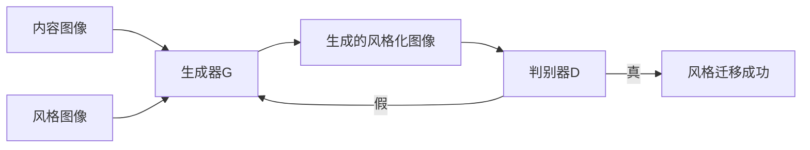

# 基于生成对抗网络的图像风格迁移在广告设计中的应用

关键词：生成对抗网络、图像风格迁移、广告设计、深度学习、计算机视觉

## 1. 背景介绍
### 1.1  问题的由来
在当今数字媒体时代,广告设计已经成为企业营销推广的重要手段之一。传统的广告设计主要依赖设计师的创意和审美,需要投入大量的时间和人力成本。随着人工智能技术的发展,利用深度学习算法实现图像风格迁移,为广告设计带来了新的思路和可能性。
### 1.2  研究现状 
近年来,以生成对抗网络(GAN)为代表的深度学习算法在计算机视觉领域取得了显著成果。GAN 通过生成器和判别器的对抗学习,可以生成逼真的图像。将 GAN 应用于图像风格迁移,可以自动将一幅图像的风格迁移到另一幅图像上,实现艺术化创作。目前已有不少研究将 GAN 用于广告设计,取得了一定效果。
### 1.3  研究意义
将基于 GAN 的图像风格迁移技术应用于广告设计,有望大幅提升广告创意生成效率,节省人力成本。设计师可以利用算法自动生成多种创意方案,再进行筛选和优化,最终得到满意的广告作品。这种人机协作的创作模式为广告行业带来新的发展动力。同时,借助算法的帮助,设计师也可以尝试更多创新的表现形式,拓宽创意思路。
### 1.4  本文结构
本文将重点探讨如何利用基于 GAN 的图像风格迁移技术进行广告设计创意生成。第2部分介绍相关核心概念;第3部分阐述 GAN 的基本原理和训练流程;第4部分建立图像风格迁移的数学模型,推导相关公式;第5部分通过实例代码演示算法的具体实现;第6部分分析该技术在广告设计中的应用场景;第7部分推荐相关学习资源;第8部分总结全文,展望未来发展方向。

## 2. 核心概念与联系
- 生成对抗网络(GAN):一种深度学习模型,由生成器和判别器组成,通过两者的博弈学习来生成逼真的数据。
- 图像风格迁移:将一幅图像的风格特征迁移到另一幅图像的内容上,生成具有艺术风格的图像。
- 广告设计:利用平面、色彩、图形等视觉元素,创作出有吸引力和感染力的平面广告作品。
- 卷积神经网络(CNN):一种常用于图像识别和生成的深度学习模型,通过卷积和池化操作提取图像特征。

下图展示了 GAN 在图像风格迁移中的作用:



GAN 中的生成器 G 接收内容图像和风格图像,生成风格化后的图像。判别器 D 对生成图像进行真假判断,引导生成器不断优化,最终得到高质量的风格迁移结果。将这一技术应用于广告设计,就可以自动生成具有艺术风格的创意广告图像。

## 3. 核心算法原理 & 具体操作步骤
### 3.1  算法原理概述
GAN 由生成器(Generator)和判别器(Discriminator)组成。生成器接收随机噪声,生成假样本;判别器接收真实样本和生成样本,判断其真假。两者互相博弈,最终使生成器生成接近真实的样本。

在图像风格迁移中,生成器接收内容图像和风格图像,将风格特征迁移到内容图像上。常用的是基于 CNN 的生成器,通过 VGG 等预训练网络提取图像特征。损失函数包括内容损失、风格损失和对抗损失,分别衡量内容相似性、风格相似性和图像真实性。

### 3.2  算法步骤详解
1. 准备数据集,包括内容图像和风格图像。
2. 搭建生成器 G 和判别器 D 的网络结构。生成器采用 U-Net 等架构,判别器采用 PatchGAN 等分类器。
3. 定义损失函数,包括内容损失、风格损失和对抗损失。内容损失采用 VGG 特征的 L2 距离,风格损失采用 Gram 矩阵的 L2 距离,对抗损失采用二元交叉熵。
4. 训练 GAN 模型。先训练生成器,再训练判别器,交替进行多个 epoch,直到生成效果满意。
5. 测试模型效果。用训练好的生成器对新的内容图像进行风格迁移,生成风格化的图像。

### 3.3  算法优缺点
优点:
- 可以自动生成多样化的艺术风格图像,提高创意效率。
- 通过调整损失函数权重,可以灵活控制内容保真度和风格化程度。
- 生成效果逼真,具有一定的美学价值。

缺点:  
- 训练过程需要大量时间和计算资源。
- 生成效果依赖训练数据质量,需要进行筛选。
- 难以完全复制特定画家的风格,存在一定局限性。

### 3.4  算法应用领域
- 广告设计:自动生成具有艺术风格的创意广告图像。
- 电影特效:为视频镜头添加绘画风格,制作梦幻效果。
- 游戏美术:快速生成游戏场景和角色的概念艺术图。
- 虚拟试妆:将化妆风格迁移到人像照片上,虚拟试妆。

## 4. 数学模型和公式 & 详细讲解 & 举例说明
### 4.1  数学模型构建
GAN 的数学模型可以表示为一个极小化极大(minimax)博弈问题:

$$\min_G \max_D V(D,G) = \mathbb{E}_{x \sim p_{data}(x)}[\log D(x)] + \mathbb{E}_{z \sim p_z(z)}[\log (1-D(G(z)))]$$

其中,$G$为生成器,$D$为判别器,$x$为真实样本,$z$为随机噪声,$p_{data}$为真实数据分布,$p_z$为噪声分布。

目标是训练生成器 $G$ 以欺骗判别器 $D$,同时训练 $D$ 以区分真实样本和生成样本。纳什均衡状态下,生成器可以生成与真实数据分布相同的样本。

在图像风格迁移中,除了对抗损失外,还引入内容损失和风格损失:

$$\mathcal{L}_{total} = \lambda_c \mathcal{L}_{content} + \lambda_s \mathcal{L}_{style} + \lambda_a \mathcal{L}_{adv}$$

其中,$\mathcal{L}_{content}$为内容损失,$\mathcal{L}_{style}$为风格损失,$\mathcal{L}_{adv}$为对抗损失,$\lambda_c,\lambda_s,\lambda_a$为权重系数。

### 4.2  公式推导过程
内容损失$\mathcal{L}_{content}$衡量生成图像$\hat{y}$与内容图像$y_c$在 VGG 特征空间的 L2 距离:

$$\mathcal{L}_{content} = \frac{1}{C_jH_jW_j} \sum_{i=1}^{C_j}\sum_{h=1}^{H_j}\sum_{w=1}^{W_j}(\phi_j(\hat{y})_{i,h,w} - \phi_j(y_c)_{i,h,w})^2$$

其中,$\phi_j$为 VGG 网络第$j$层输出特征图,$C_j,H_j,W_j$为特征图的通道数、高度和宽度。

风格损失$\mathcal{L}_{style}$衡量生成图像$\hat{y}$与风格图像$y_s$在 VGG 特征空间的 Gram 矩阵 L2 距离:

$$\mathcal{L}_{style} = \sum_{j=1}^J \frac{1}{4C_j^2H_j^2W_j^2} \sum_{i=1}^{C_j}\sum_{k=1}^{C_j}(G(\phi_j(\hat{y}))_{i,k} - G(\phi_j(y_s))_{i,k})^2$$

其中,$G(\phi_j(y))$为特征图$\phi_j(y)$的 Gram 矩阵:

$$G(\phi_j(y))_{i,k} = \frac{1}{C_jH_jW_j} \sum_{h=1}^{H_j}\sum_{w=1}^{W_j} \phi_j(y)_{i,h,w} \phi_j(y)_{k,h,w}$$

对抗损失$\mathcal{L}_{adv}$为判别器 $D$ 的二元交叉熵损失:

$$\mathcal{L}_{adv} = -\mathbb{E}_{y \sim p_{data}(y)}[\log D(y)] - \mathbb{E}_{\hat{y} \sim p_g(\hat{y})}[\log (1-D(\hat{y}))]$$

其中,$p_{data}$为真实图像分布,$p_g$为生成图像分布。

### 4.3  案例分析与讲解
以下是一个利用 GAN 进行梵高风格迁移的案例。选取一幅风景照片作为内容图像,梵高的《星夜》作为风格图像。

内容图像:


风格图像:


经过 GAN 风格迁移后,生成以下图像:


可以看到,生成图像保留了原始照片的内容结构,同时呈现出梵高笔触的流动感和色彩斑斓。城堡、树木、天空等元素以抽象的形式重现,充满了艺术感。

这一结果很好地展示了 GAN 图像风格迁移的效果。通过调整内容损失和风格损失的权重,可以控制生成图像的保真度和抽象程度,满足不同的创意需求。

### 4.4  常见问题解答
问:GAN 的训练为什么会不稳定?

答:GAN 训练的不稳定性主要源于生成器和判别器的博弈过程。如果判别器训练过强,生成器梯度消失,难以继续优化;如果生成器训练过强,判别器梯度消失,不能给出有效引导。因此需要小心平衡两者的训练进度,如交替训练、梯度惩罚等技巧。

问:图像风格迁移对风格图像的选择有什么要求?

答:风格图像需要具有明显的艺术风格特征,如笔触、色彩、构图等。过于写实的照片不太适合作为风格图像。此外,风格图像的语义内容最好与内容图像相近,如人像、风景、静物等,这样有助于保持语义信息。

问:如何控制风格迁移的效果?

答:主要通过调整内容损失和风格损失的权重来控制。增大内容损失权重,生成图像更接近内容图像;增大风格损失权重,生成图像更接近风格图像。也可以选择 VGG 网络的不同层提取特征,浅层偏重细节纹理,深层偏重全局结构。

## 5. 项目实践：代码实例和详细解释说明
### 5.1  开发环境搭建
- 操作系统:Ubuntu 20.04
- 深度学习框架:PyTorch 1.8.1
- CUDA 版本:11.1
- 显卡:NVIDIA GeForce RTX 3090

安装 PyTorch:
```bash
pip install torch==1.8.1+cu111 torchvision==0.9.1+cu111 torchaudio==0.8.1 -f https://download.pytorch.org/whl/torch_stable.html
```

### 5.2  源代码详细实现
以下是基于 PyTorch 实现 GAN 图像风格迁移的核心代码:

```python
import torch
import torch.nn as nn
import torchvision.models as models
import torchvision.transforms as transforms

# 定义生成器
class Generator(nn.Module):
    def __init__(self):
        super(Generator, self).__init__()
        # 编码器
        self.encoder = nn.Sequential(
            ConvBlock(3, 64, 7, 1, 3),
            Con