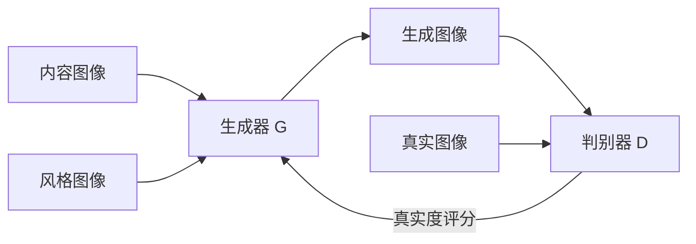

# 基于生成对抗网络的图像风格迁移效果评价体系研究

关键词：生成对抗网络、图像风格迁移、效果评价、深度学习、计算机视觉

## 1. 背景介绍
### 1.1 问题的由来
随着深度学习技术的快速发展,尤其是生成对抗网络(Generative Adversarial Networks, GANs)的出现,图像风格迁移领域取得了巨大的突破。图像风格迁移旨在将一幅内容图像的风格转换为另一幅风格图像的风格,同时保留内容图像的语义内容。这一技术在艺术创作、游戏设计、虚拟现实等领域有着广泛的应用前景。然而,如何客观、准确地评估不同算法生成的风格迁移图像的质量,仍然是一个亟待解决的问题。

### 1.2 研究现状
目前,大多数图像风格迁移算法的评估都是基于主观评价的方式进行的,即通过人工观察生成图像的视觉效果来判断算法的优劣。这种评估方式存在主观性强、评估标准不一致等问题,难以对不同算法的性能进行量化比较。此外,一些研究者提出了基于特征相似度、内容保真度等指标的客观评价方法,但这些方法往往针对特定的算法,泛化能力有限。因此,构建一套通用的、客观的图像风格迁移效果评价体系显得尤为重要。

### 1.3 研究意义 
本文旨在探索基于生成对抗网络的图像风格迁移效果评价体系的构建方法。一方面,通过分析现有主流的图像风格迁移算法,总结它们的优缺点,为算法的改进提供参考。另一方面,提出一种新颖的评价指标体系,综合考虑风格迁移图像的视觉质量、内容保真度、风格相似度等因素,实现对不同算法生成结果的量化评估。该评价体系不仅可以为图像风格迁移算法的设计和优化提供依据,也为其他生成对抗网络相关任务的评估提供了新的思路。

### 1.4 本文结构
本文的结构安排如下:第2节介绍图像风格迁移和生成对抗网络的核心概念及二者之间的联系;第3节详细阐述主流的图像风格迁移算法原理及其优缺点比较;第4节建立图像风格迁移效果的数学评价模型,并推导相关公式;第5节通过实验验证所提出评价指标的有效性,给出具体代码实现;第6节讨论该评价体系的实际应用场景;第7节总结全文工作并展望未来研究方向。

## 2. 核心概念与联系
图像风格迁移的目标是将内容图像的视觉风格转换为参考风格图像的风格,同时最大限度地保留内容图像的语义内容。形式化地描述,记内容图像为 $I_c$,风格图像为 $I_s$,风格迁移的过程可表示为寻找一个生成图像 $I_g$,使其同时满足内容相似性约束和风格相似性约束:

$$
I_g = \arg\min_{I} \mathcal{L}_c(I, I_c) + \lambda \mathcal{L}_s(I, I_s)
$$

其中 $\mathcal{L}_c$ 和 $\mathcal{L}_s$ 分别表示内容损失和风格损失, $\lambda$ 为平衡两种损失的权重系数。

生成对抗网络由生成器(Generator)和判别器(Discriminator)两部分组成,通过二者的博弈学习来生成逼真的图像。其中,生成器负责生成假样本以欺骗判别器,判别器负责区分真实样本和生成样本。记生成器为 $G$,判别器为 $D$,GAN的训练过程可表示为以下极小极大博弈问题:

$$
\min_G \max_D \mathbb{E}_{x \sim p_{data}(x)}[\log D(x)] + \mathbb{E}_{z \sim p_z(z)}[\log(1-D(G(z)))]
$$

其中 $x$ 为真实样本, $z$ 为随机噪声。

将GAN引入图像风格迁移任务,可以利用生成器来生成风格迁移图像,利用判别器来评估生成图像的真实性。与传统方法相比,基于GAN的风格迁移具有生成效果更加逼真、训练过程端到端等优势。下图展示了基于GAN的图像风格迁移的基本架构:

## 3. 核心算法原理 & 具体操作步骤
### 3.1 算法原理概述
基于GAN的图像风格迁移算法的核心思想是将风格迁移问题转化为图像到图像的翻译问题。具体而言,通过训练一个条件生成对抗网络(Conditional GAN),以内容图像和风格图像为条件,生成相应的风格迁移图像。该算法主要包含以下几个关键组件:

1. 生成器:以内容图像和风格图像为输入,生成风格迁移图像。通常采用编码器-解码器架构,先将输入图像映射到隐空间,再由解码器重建出风格迁移图像。
2. 判别器:判断输入图像是真实图像还是生成图像。通过对抗训练,促使生成器生成更加逼真的风格迁移图像。
3. 内容损失:衡量生成图像与内容图像在语义特征上的相似性,通常使用预训练的卷积神经网络提取高层特征,计算特征图之间的 L2 距离。
4. 风格损失:衡量生成图像与风格图像在纹理特征上的相似性,通过计算特征图的 Gram 矩阵来刻画风格信息。
5. 对抗损失:衡量生成图像的真实性,使用判别器的输出计算交叉熵损失。

算法通过联合优化内容损失、风格损失和对抗损失,使生成器能够生成既保留内容图像语义信息,又具有风格图像视觉风格的风格迁移图像。

### 3.2 算法步骤详解
基于GAN的图像风格迁移算法的具体步骤如下:

1. 数据准备:收集大量内容图像和风格图像,并进行必要的预处理,如尺寸调整、归一化等。
2. 网络构建:搭建生成器和判别器网络。生成器采用编码器-解码器结构,判别器采用分类器结构。根据任务需求选择合适的网络层数和参数设置。
3. 定义损失函数:包括内容损失、风格损失和对抗损失。内容损失和风格损失分别使用预训练的VGG网络提取特征,对抗损失采用交叉熵损失。
4. 训练模型:
   - 固定生成器,训练判别器。将真实图像和生成图像输入判别器,计算对抗损失,并更新判别器参数。
   - 固定判别器,训练生成器。将内容图像和风格图像输入生成器,计算内容损失、风格损失和对抗损失,并更新生成器参数。
   - 交替进行以上两个步骤,直到模型收敛或达到预设的迭代次数。
5. 测试模型:使用训练好的生成器,对新的内容图像和风格图像进行风格迁移,生成相应的风格迁移图像。
6. 评估结果:使用主观评价或客观指标评估生成图像的质量,分析算法的优缺点。

### 3.3 算法优缺点
基于GAN的图像风格迁移算法具有以下优点:
- 生成效果逼真:通过生成对抗训练,可以生成视觉质量高、细节丰富的风格迁移图像。
- 端到端训练:无需手工设计特征或先验知识,算法可以端到端地学习风格迁移映射。
- 泛化能力强:训练好的模型可以迁移到新的内容图像和风格图像,具有良好的泛化能力。

同时,该算法也存在一些局限性:
- 训练不稳定:GAN的训练过程容易出现模式崩溃、梯度消失等问题,需要仔细调参和监控。  
- 计算开销大:生成器和判别器通常都是较深的卷积网络,训练和推理的计算开销较大。
- 风格多样性不足:生成的风格迁移图像可能过于相似,缺乏风格的多样性和创造性。

### 3.4 算法应用领域
基于GAN的图像风格迁移算法在以下领域有广泛的应用前景:

- 艺术创作:可以将名画、素描等艺术风格迁移到照片上,辅助艺术家进行创作。
- 游戏设计:利用风格迁移技术,可以快速生成具有特定风格的游戏场景和角色。
- 虚拟现实:将真实场景的图像转换为卡通、油画等风格,增强虚拟现实的沉浸感。  
- 电影特效:自动将视频中的画面转换为特定风格,降低后期制作的工作量。
- 图像编辑:用户可以根据自己的喜好,对图像进行风格化处理,实现个性化编辑。

## 4. 数学模型和公式 & 详细讲解 & 举例说明
### 4.1 数学模型构建
为了量化评估图像风格迁移的效果,我们提出一种综合考虑内容保真度、风格相似度和感知质量的评价指标。

首先,定义内容保真度 $CPS$,用于衡量风格迁移图像与原始内容图像在语义内容上的相似性。给定内容图像 $I_c$ 和风格迁移图像 $I_g$,内容保真度可以表示为:

$$
CPS(I_c, I_g) = \frac{1}{N}\sum_{i=1}^N \cos(\phi_i(I_c), \phi_i(I_g))
$$

其中 $\phi_i$ 表示预训练的 VGG 网络第 $i$ 层的特征图, $N$ 为提取特征的层数, $\cos$ 表示余弦相似度。内容保真度的取值范围为 $[0,1]$,值越大表示内容保留得越好。

其次,定义风格相似度 $SSS$,用于衡量风格迁移图像与风格参考图像在纹理特征上的相似性。给定风格图像 $I_s$ 和风格迁移图像 $I_g$,风格相似度可以表示为:

$$
SSS(I_s, I_g) = \frac{1}{M}\sum_{j=1}^M \frac{||G(\psi_j(I_s)) - G(\psi_j(I_g))||_F}{||G(\psi_j(I_s))||_F}
$$

其中 $\psi_j$ 表示 VGG 网络第 $j$ 层的特征图, $M$ 为提取特征的层数, $G$ 表示 Gram 矩阵, $||\cdot||_F$ 表示矩阵的 Frobenius 范数。风格相似度的取值范围为 $[0,1]$,值越小表示风格迁移得越好。

最后,定义感知质量 $PQ$,用于衡量风格迁移图像的视觉质量和真实感。借助预训练的图像质量评估网络(如 NIMA),可以直接预测图像的感知质量得分:

$$
PQ(I_g) = NIMA(I_g)
$$

其中 $NIMA$ 表示预训练的图像质量评估网络。感知质量的取值范围为 $[0,1]$,值越大表示图像质量越高。

综合以上三个指标,我们定义图像风格迁移的综合评价指标 $CST$:

$$
CST(I_c, I_s, I_g) = \alpha \cdot CPS(I_c, I_g) + \beta \cdot (1-SSS(I_s, I_g)) + \gamma \cdot PQ(I_g)
$$

其中 $\alpha, \beta, \gamma$ 为权重系数,满足 $\alpha + \beta + \gamma = 1$。$CST$ 的取值范围为 $[0,1]$,值越大表示风格迁移的综合效果越好。

### 4.2 公式推导过程
以内容保真度 $CPS$ 