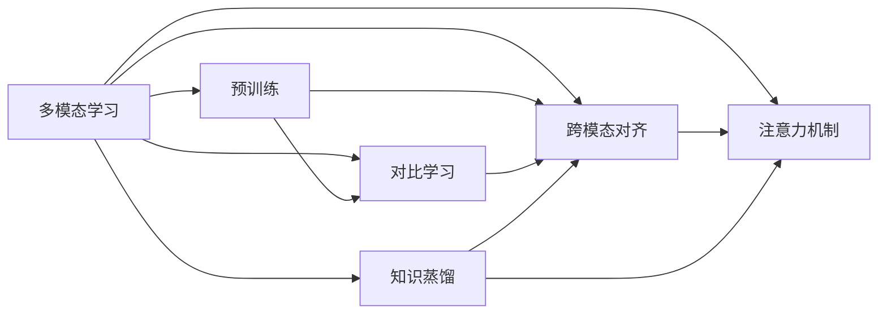

# 多模态大模型：技术原理与实战 OpenAI特殊的股权设计带来的启示

## 1. 背景介绍
### 1.1  问题的由来
近年来,人工智能领域取得了突飞猛进的发展,尤其是以深度学习为代表的技术在计算机视觉、自然语言处理、语音识别等领域取得了令人瞩目的成就。随着算力的提升和数据规模的增长,深度学习模型的规模也在不断扩大,从最初的几层神经网络发展到现在拥有数百亿甚至上千亿参数的超大规模模型。这些大模型展现出了强大的学习能力和泛化能力,在多个任务上取得了超越人类的表现。

然而,目前的大模型大多是针对单一模态(如文本、图像)进行训练的,难以有效处理现实世界中的多模态信息。为了进一步提升人工智能系统的感知和理解能力,学术界和工业界开始探索多模态大模型的研究。多模态大模型旨在融合不同模态的信息,构建更加全面和准确的世界表征,从而实现更加智能和自然的人机交互。

### 1.2  研究现状
目前,多模态大模型的研究还处于起步阶段,但已经取得了一些有益的探索和尝试。一些代表性的工作包括:

- OpenAI的CLIP(Contrastive Language-Image Pre-training)模型。该模型在大规模图文对数据上进行预训练,学习视觉与语言的对齐表征,在图像分类、检索等任务上取得了良好效果。

- Google的LIMoE(Language-Image Mixture of Experts)模型。该模型采用混合专家模块来建模图像和文本的交互,在VQA、图文匹配等任务上表现优异。

- 微软的Oscar模型。该模型利用目标检测和图像字幕数据进行预训练,构建了object-semantics aligned表征,在下游任务如VQA、图像字幕等任务上取得了SOTA效果。

- 清华大学与旷视科技合作提出的LXMERT模型。该模型采用两阶段的预训练方式,先在大规模图文数据上预训练,再在下游任务数据上微调,在多个视觉-语言任务上取得了最优性能。

除了上述工作外,还有不少其他有价值的多模态大模型研究,如ViLBERT、VisualBERT、Unicoder-VL等。这些工作从不同角度探索了视觉-语言表征学习,为多模态大模型的发展提供了重要参考。

### 1.3  研究意义
多模态大模型的研究具有重要的理论和实践意义:

- 从认知科学的角度看,多模态大模型有助于探索人类大脑如何整合不同感官信息,加深对人类认知机制的理解。多模态信息的融合是人类智能的重要特征,对其进行计算建模具有重要意义。

- 从人工智能的角度看,多模态大模型是构建通用人工智能(AGI)的重要途径。自然界的信息本质上是多模态的,单一模态的建模存在先天局限性。只有实现多模态信息的有机融合,才能让机器具备更接近人类的感知和认知能力。

- 从应用的角度看,多模态大模型可以支撑更加智能和自然的人机交互系统。传统的人机交互方式往往局限于单一模态(如语音、文本),缺乏灵活性和交互性。多模态系统可以更好地理解用户意图,提供个性化、情境化的服务,极大提升用户体验。同时,多模态技术在医疗、教育、娱乐等领域也有广阔应用前景。

### 1.4  本文结构
本文将围绕多模态大模型的技术原理与实战展开系统探讨。全文结构安排如下:

第二部分介绍多模态大模型涉及的核心概念,并分析它们之间的内在联系。

第三部分重点阐述多模态大模型的核心算法原理,并给出具体操作步骤。

第四部分从数学角度对多模态大模型的原理进行建模,并结合案例进行公式推导和详细讲解。

第五部分以实际项目为例,展示多模态大模型的代码实现,并对关键代码进行解读。

第六部分分析多模态大模型技术的实际应用场景,展望其未来发展空间。

第七部分推荐多模态领域的学习资源、开发工具和相关文献。

第八部分总结全文,评述多模态大模型的研究现状、未来趋势和面临的挑战。

第九部分列举多模态大模型领域的常见问题,并给出参考答案,便于读者理解和回顾。

## 2. 核心概念与联系

多模态大模型涉及的核心概念包括:

- 多模态学习(Multimodal Learning):利用多种模态的数据(如视觉、语音、文本等)进行机器学习,挖掘不同模态数据之间的内在联系,构建统一的表征空间。

- 跨模态对齐(Cross-modal Alignment):在多模态学习中,需要找到不同模态数据之间的语义对应关系。跨模态对齐旨在学习一种映射机制,将不同模态数据映射到公共表征空间,使它们在语义层面尽可能一致。

- 注意力机制(Attention Mechanism):注意力机制是深度学习中的一种常用技术,通过加权平均的方式聚焦输入数据中的关键信息。在多模态场景下,注意力机制可以用于不同模态之间的信息交互,帮助模型更好地建模模态间的关联。  

- 预训练(Pre-training):预训练是利用大规模无监督数据进行模型初始化的方法。在 NLP 领域,以 BERT 为代表的预训练语言模型取得了巨大成功。在多模态学习中,预训练可以帮助模型学习通用的跨模态表征,减少训练难度。

- 对比学习(Contrastive Learning):对比学习是一种自监督学习范式,通过最小化正样本对之间的距离、最大化负样本对之间的距离,来学习数据的语义表征。对比学习方法在多模态对齐中得到了广泛应用。

- 知识蒸馏(Knowledge Distillation):知识蒸馏是将大模型的知识迁移到小模型的一种方法。在多模态场景下,知识蒸馏可以用于不同模态模型之间的知识迁移,帮助提升模型性能,降低计算开销。

这些概念之间存在着紧密的内在联系:

多模态学习是一个总领概念,其核心目标是实现跨模态对齐。注意力机制、预训练、对比学习、知识蒸馏等技术都是实现多模态对齐的重要手段。其中,注意力机制主要用于建模模态内和模态间的关联;预训练可以学习通用的跨模态表征;对比学习用于最小化不同模态的语义差异;知识蒸馏用于不同模态模型之间的知识迁移。这些技术相互配合,共同推动了多模态大模型的发展。

## 3. 核心算法原理 & 具体操作步骤
### 3.1  算法原理概述
多模态大模型的核心是实现不同模态数据的有效融合和语义对齐。目前主流的技术路线可以概括为两类:

(1) 基于共享表征空间的方法。该类方法旨在学习一个公共的语义表征空间,将不同模态的数据映射到该空间,从而实现跨模态对齐。代表性工作包括 CLIP、LIMoE 等。

(2) 基于交互建模的方法。该类方法显式建模不同模态之间的交互,通过注意力机制等技术来实现模态融合。代表性工作包括 LXMERT、ViLBERT 等。

两类方法各有优势,可以根据任务需求进行选择。总体而言,多模态大模型的训练一般包括以下几个关键步骤:

### 3.2  算法步骤详解

(1) 多模态数据准备

多模态大模型的训练需要大规模的多模态数据作为支撑。常见的数据形式包括图文对、视频-文本对、图像-语音对等。数据准备过程需要对不同模态的数据进行对齐和清洗,确保数据质量和一致性。

(2) 模态特征提取  

对于不同模态的数据,需要使用相应的特征提取器将其转化为向量表示。对于图像,常用的特征提取器包括 CNN 网络(如 ResNet);对于文本,常用的特征提取器包括 RNN、Transformer 等。

(3) 模态表征学习

在特征提取的基础上,需要进一步学习高层语义表征。可以使用预训练模型(如 BERT、ViT 等)在大规模数据上进行预训练,学习通用的语义表征。

(4) 模态融合与对齐

模态融合与对齐是多模态大模型的核心。前面提到,主要有两种技术路线:共享表征空间法和交互建模法。以 CLIP 模型为例,它通过对比学习来最小化图像和文本特征之间的距离,从而实现跨模态对齐。以 LXMERT 为例,它使用 self-attention 和 cross-attention 来建模模态内和模态间的长距离依赖,实现模态融合。

(5) 模型微调与评估

在完成预训练后,还需要在下游任务数据上进行微调,以适应特定任务。微调过程中,可以使用 MLM、ITM 等方式对模型进行调优。最后,在测试集上评估模型性能,并不断迭代优化。

### 3.3  算法优缺点

多模态大模型具有以下优点:

- 通过融合多模态信息,可以学习更加全面和准确的语义表征,提升模型的理解能力。
- 预训练范式可以充分利用大规模无监督数据,减少对标注数据的依赖,提高模型的泛化性。  
- 模态对齐技术突破了不同模态数据分布差异的限制,使得跨模态推理成为可能。

同时,多模态大模型也存在一些局限性:

- 模态数据的异构性给模型训练带来了挑战,如何高效建模不同模态的交互是一个难点。
- 缺乏可解释性,模态融合的内部机制还不够清晰,存在黑盒子问题。
- 对算力和存储有很高要求,给实际应用带来挑战。

### 3.4  算法应用领域

多模态大模型可以应用于多个领域,包括:

- 跨模态检索:根据一个模态的查询(如文本),检索另一个模态的相关样本(如图像)。
- 视觉问答:根据图像和文本问题,生成自然语言答案。
- 图像字幕:根据图像生成对应的文本描述。
- 语音识别:将语音信号转化为文本。
- 机器翻译:实现文本和语音之间的互译。
- 多模态对话:融合视觉、语音、文本等信息,实现智能对话系统。

未来,多模态大模型有望在更多领域得到应用,如医学影像分析、工业视觉检测等。

## 4. 数学模型和公式 & 详细讲解 & 举例说明
### 4.1  数学模型构建
以 CLIP 模型为例,我们详细讲解其数学原理。CLIP 的核心思想是通过对比学习,最小化图像和文本特征之间的距离,从而实现跨模态对齐。

设图像编码器为 $f_{\theta}(x)$,文本编码器为 $g_{\phi}(y)$,其中 $x$ 表示图像, $y$ 表示文本。对于一个批次的 $N$ 个图文对 $(x_i,y_i),i=1,2,...,N$,我们希望最大化以下对比损失函数:

$$
L(\theta,\phi) = \frac{1}{N}\sum_{i=1}^{N}\log\frac{\exp(s(f_{\theta}(x_i),g_{\phi}(y_i))/\tau)}{\sum_{j=1}^{N}\exp