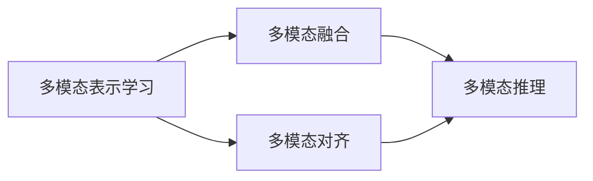

# 多模态大模型：技术原理与实战 OpenAI的成长并非一帆风顺

## 1. 背景介绍
### 1.1 问题的由来
人工智能(Artificial Intelligence, AI)技术的快速发展,使得计算机在视觉、语音、自然语言处理等领域取得了巨大突破。然而,传统的AI系统通常只能处理单一模态的数据,如文本或图像。在现实世界中,人类感知和交互的信息往往是多模态的,包含文本、图像、音频、视频等不同形式。因此,如何让AI系统像人一样理解和生成多模态信息,成为了AI领域的一个重要挑战。

### 1.2 研究现状 
近年来,多模态AI成为了学术界和工业界的研究热点。谷歌、微软、Facebook、OpenAI等科技巨头纷纷投入巨资,开发多模态AI系统。其中,以OpenAI为代表的研究机构,在多模态大模型方面取得了突破性进展。

2021年1月,OpenAI发布了DALL·E模型,可以根据文本描述生成逼真的图像。同年4月,该公司又推出了CLIP模型,可以对图像和文本进行跨模态检索和匹配。2022年4月,OpenAI发布了DALL·E 2模型,生成图像的质量和多样性大幅提升。同年11月,该公司发布了ChatGPT模型,在自然语言对话和任务完成方面展现出惊人的能力。

这些成果表明,多模态大模型已经成为AI领域的新范式,有望在计算机视觉、自然语言处理、语音识别等方面取得更大突破,并在教育、医疗、金融等行业产生深远影响。

### 1.3 研究意义
多模态AI技术的突破,将极大拓展人机交互的边界,使计算机能够更好地理解人类的需求,提供更加智能、个性化的服务。同时,多模态大模型的发展,也为认知科学、神经科学等学科提供了新的研究视角和工具,有助于揭示人类大脑的信息处理机制。

此外,多模态AI技术在教育、医疗、金融、交通等领域也有广阔的应用前景。例如,在教育领域,多模态AI可以为学生提供个性化的学习内容和反馈;在医疗领域,多模态AI可以辅助医生进行疾病诊断和治疗方案制定;在金融领域,多模态AI可以帮助分析师更全面地评估公司价值和风险。

### 1.4 本文结构
本文将围绕多模态大模型的技术原理与实战展开讨论。第2节介绍多模态AI的核心概念及其内在联系。第3节重点阐述多模态大模型的算法原理和具体操作步骤。第4节给出多模态大模型涉及的数学模型和公式,并结合案例进行详细讲解。第5节展示多模态大模型的代码实例,并对关键部分进行解释说明。第6节分析多模态大模型的实际应用场景。第7节推荐相关的学习资源和开发工具。第8节总结全文,展望多模态大模型的未来发展趋势和面临的挑战。第9节列举常见问题并给出解答。

## 2. 核心概念与联系
多模态AI是人工智能的一个分支,旨在让计算机像人一样理解和生成多种形式的信息,如文本、图像、音频、视频等。与传统的单模态AI不同,多模态AI需要处理不同模态数据之间的关联和互补信息,从而获得更全面、准确的认知。

多模态AI的核心概念包括:
- 多模态表示学习:将不同模态的数据映射到一个共同的语义空间,使其可以进行跨模态的比较和检索。
- 多模态融合:综合利用不同模态数据的互补信息,生成更准确、丰富的预测结果。
- 多模态对齐:在语义层面上建立不同模态数据之间的对应关系,实现跨模态的信息传递和交互。
- 多模态推理:利用多模态知识,对不完整或缺失的模态信息进行补全和预测。

这些概念之间存在着紧密的联系。多模态表示学习是多模态AI的基础,为不同模态数据的融合、对齐、推理提供了共同的语义空间。多模态融合和对齐则是实现跨模态信息交互的关键,使得模型能够充分利用不同模态的互补信息。多模态推理则是多模态AI的高级能力,体现了模型在不完整信息下的泛化和创造能力。

下图展示了多模态AI的核心概念及其内在联系:

## 3. 核心算法原理 & 具体操作步骤
### 3.1 算法原理概述
多模态大模型的核心是将不同模态的数据映射到一个共同的语义空间,并在该空间中进行表示学习、融合、对齐和推理。目前主流的多模态大模型主要采用Transformer架构,通过自注意力机制和跨注意力机制来建模不同模态数据之间的关系。

以OpenAI的CLIP模型为例,其将图像和文本映射到一个共同的特征空间,并通过对比学习让图像特征和文本特征在该空间中尽可能接近。具体而言,CLIP模型包含一个图像编码器和一个文本编码器,分别将图像和文本映射为特征向量。然后,模型通过最大化正样本(匹配的图文对)的相似度,同时最小化负样本(不匹配的图文对)的相似度,来学习图文之间的对应关系。

### 3.2 算法步骤详解
以下是CLIP模型的具体训练步骤:

1. 数据准备:收集大量的图文对数据,并将其划分为训练集和验证集。

2. 图像编码:将图像输入到图像编码器(如ViT)中,得到图像特征向量。
$$v_i = Encoder_{image}(image_i)$$

3. 文本编码:将文本输入到文本编码器(如Transformer)中,得到文本特征向量。
$$v_t = Encoder_{text}(text_t)$$

4. 对比学习:对于每个图文对$(image_i, text_i)$,计算其特征向量的余弦相似度:
$$s_{i,i} = \frac{v_i \cdot v_t}{||v_i|| \cdot ||v_t||}$$
同时,计算该图像与其他文本的相似度$s_{i,j}$,以及该文本与其他图像的相似度$s_{j,i}$。

5. 损失函数:使用交叉熵损失函数,最大化正样本的相似度,最小化负样本的相似度:
$$L = -\frac{1}{N} \sum_{i=1}^N \left[ \log \frac{\exp(s_{i,i})}{\exp(s_{i,i}) + \sum_{j \neq i} \exp(s_{i,j})} + \log \frac{\exp(s_{i,i})}{\exp(s_{i,i}) + \sum_{j \neq i} \exp(s_{j,i})} \right]$$

6. 优化训练:使用Adam优化器,通过反向传播算法更新模型参数,最小化损失函数。

7. 推理应用:使用训练好的图像编码器和文本编码器,可以实现图文检索、图文匹配、图文生成等多模态任务。

### 3.3 算法优缺点
CLIP算法的主要优点包括:
- 可以在海量的图文对数据上进行预训练,学习到通用的多模态表示。
- 采用对比学习的方式,避免了人工标注数据的成本。
- 可以应用于各种下游的多模态任务,具有很好的迁移性和泛化性。

但是,CLIP算法也存在一些局限性:
- 对比学习需要大量的负样本,训练成本较高。
- 对于一些细粒度的图文匹配任务,如视觉问答、图文生成等,还需要进一步改进算法。
- 对于一些抽象、隐喻性的图文关系,CLIP算法可能难以准确建模。

### 3.4 算法应用领域
CLIP算法及其衍生模型已经在多个领域得到了广泛应用,包括:
- 图像检索:给定文本查询,从图像库中检索出最相关的图像。
- 图文匹配:判断图像和文本是否匹配,可用于假新闻检测、图文审核等任务。
- 图像描述:根据图像生成自然语言描述,可用于辅助盲人、图像搜索等场景。
- 视觉问答:根据图像和问题,生成自然语言答案。
- 图像编辑:根据文本指令,对图像进行编辑和修改。

## 4. 数学模型和公式 & 详细讲解 & 举例说明
### 4.1 数学模型构建
CLIP模型的核心是将图像和文本映射到一个共同的特征空间,并通过对比学习让匹配的图文对在该空间中尽可能接近。设图像编码器为$f$,文本编码器为$g$,图像$x$和文本$y$在特征空间中的表示分别为$f(x)$和$g(y)$,则它们的余弦相似度为:

$$\cos(f(x), g(y)) = \frac{f(x) \cdot g(y)}{||f(x)|| \cdot ||g(y)||}$$

对于一个匹配的图文对$(x_i, y_i)$,其相似度应该大于其他不匹配的图文对$(x_i, y_j)$和$(x_j, y_i)$。因此,可以构建如下的对比损失函数:

$$L(x_i, y_i) = -\log \frac{\exp(\cos(f(x_i), g(y_i))/\tau)}{\sum_{j=1}^N \exp(\cos(f(x_i), g(y_j))/\tau)}$$

其中,$\tau$是一个温度超参数,用于控制softmax函数的平滑程度。$N$是batch size,即每个batch中的样本数。

### 4.2 公式推导过程
对比损失函数$L(x_i, y_i)$可以看作是一个交叉熵损失,其中正样本为$(x_i, y_i)$,负样本为$(x_i, y_j), j \neq i$。对于正样本,我们希望其相似度经过softmax归一化后尽可能接近1;而对于负样本,我们希望其相似度经过归一化后尽可能接近0。

令$s_{i,j} = \cos(f(x_i), g(y_j))/\tau$,则损失函数可以写成:

$$L(x_i, y_i) = -\log \frac{\exp(s_{i,i})}{\sum_{j=1}^N \exp(s_{i,j})}$$

将其展开,可以得到:

$$L(x_i, y_i) = -s_{i,i} + \log \sum_{j=1}^N \exp(s_{i,j})$$

这就是交叉熵损失的标准形式。最小化该损失函数,就等价于最大化正样本的相似度,同时最小化负样本的相似度。

### 4.3 案例分析与讲解
下面以一个简单的例子来说明CLIP模型的训练过程。假设我们有以下三个图文对:

- (图像1, "一只穿着蓝色T恤的狗")
- (图像2, "一只穿着黄色雨衣的狗")
- (图像3, "一只穿着红色衣服的猫")

我们希望CLIP模型能够学习到图像和文本之间的对应关系,即图像1与文本1最匹配,图像2与文本2最匹配,图像3与文本3最匹配。

在训练过程中,我们首先将图像和文本分别输入到图像编码器和文本编码器中,得到它们的特征向量$f(x_i)$和$g(y_i)$。然后,我们计算每个图像与每个文本之间的相似度$s_{i,j}$,构建相似度矩阵:

$$S = \begin{bmatrix} 
s_{1,1} & s_{1,2} & s_{1,3} \\
s_{2,1} & s_{2,2} & s_{2,3} \\
s_{3,1} & s_{3,2} & s_{3,3}
\end{bmatrix}$$

接下来,我们对每个图像计算其损失函数:

$$L(x_1, y_1) = -\log \frac{\exp(s_{1,1})}{\exp(s_{1,1}) + \exp(s_{1,2