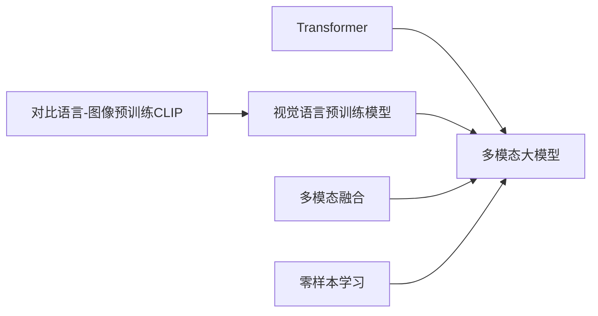
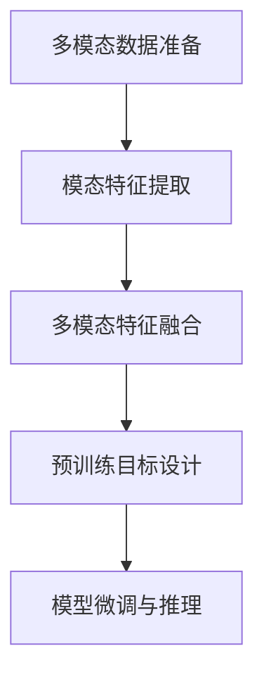

# 多模态大模型：技术原理与实战 自然语言处理的里程碑

关键词：多模态大模型, 自然语言处理, 深度学习, Transformer, 视觉语言预训练模型, CLIP, DALL-E, Stable Diffusion

## 1. 背景介绍
### 1.1  问题的由来
随着人工智能技术的飞速发展,自然语言处理(NLP)和计算机视觉(CV)等领域取得了突破性进展。然而,单一模态的AI系统仍然存在诸多局限性,难以真正理解和处理复杂的现实世界信息。为了更好地模拟人类的感知和认知能力,研究者们开始探索将不同模态数据融合的多模态人工智能技术。多模态大模型应运而生,成为了自然语言处理领域的里程碑式突破。

### 1.2  研究现状 
近年来,以Transformer为代表的大规模预训练语言模型取得了巨大成功,如BERT、GPT等,极大地推动了NLP技术的发展。与此同时,视觉语言预训练模型如CLIP、DALL-E等的出现,让计算机能够同时理解图像和文本信息,生成逼真的图像。多模态大模型正是在这一背景下诞生的,通过将文本、图像、语音等多种模态数据进行融合建模,实现了前所未有的性能提升和应用拓展。

### 1.3  研究意义
多模态大模型的研究具有重要的理论和实践意义:

1. 推动人工智能走向通用智能。多模态技术是迈向通用人工智能的关键一步,有助于计算机全面理解和交互复杂的现实世界。 

2. 拓展自然语言处理的应用边界。多模态融合使得NLP系统能够处理包含视觉等其他模态信息的任务,极大拓宽了其应用场景,如多模态对话、视觉问答等。

3. 提升人机交互体验。多模态交互方式更加自然友好,用户可以通过文本、语音、图像等方式与AI系统进行流畅的交互。

4. 赋能行业智能化升级。多模态大模型可应用于智慧医疗、智能教育、智慧城市等领域,助力传统行业的智能化转型。

### 1.4  本文结构
本文将重点介绍多模态大模型的核心概念、原理和实战。第2章阐述多模态大模型的核心概念;第3章深入讲解其核心算法原理;第4章给出详细的数学模型和公式推导;第5章通过代码实例演示其实现细节;第6章展望其广阔的应用前景;第7章推荐相关学习资源;第8章总结全文并展望未来;第9章为常见问题解答。

## 2. 核心概念与联系
多模态大模型是融合了计算机视觉、自然语言处理等多种人工智能技术的前沿模型范式。其核心是利用海量的多模态数据,通过深度神经网络进行联合建模和学习,使得模型能够同时理解和处理文本、图像、语音等不同形式的信息。下面介绍几个与多模态大模型密切相关的核心概念:

- Transformer:一种基于自注意力机制的神经网络结构,擅长处理序列数据,是大规模语言模型的核心组件。
- 视觉语言预训练模型:同时在大规模图像-文本对数据上进行预训练的模型,代表工作如CLIP、DALL-E等。
- 多模态融合:将不同模态的信息映射到一个共同的语义空间,实现跨模态的理解和交互。常见的融合策略有早期融合、晚期融合和混合融合等。
- 对比语言-图像预训练(CLIP):一种有效的视觉语言预训练范式,通过对比学习使模型学会对齐图像和文本表示。
- 零样本学习:无需重新训练,模型可以利用已学习的多模态知识,直接对新的图像-文本对进行理解和生成。

这些概念环环相扣,共同构成了多模态大模型的理论和方法基础。Transformer提供了强大的建模能力,多模态融合策略实现了跨模态理解,CLIP等预训练范式则赋予了模型高效学习和泛化的能力。



## 3. 核心算法原理 & 具体操作步骤
### 3.1  算法原理概述
多模态大模型的核心算法主要基于Transformer结构和多模态融合策略。具体而言,模型通过Transformer编码器分别对文本和图像进行特征提取,然后利用多模态融合模块将不同模态的特征映射到一个共同的语义空间,实现跨模态的对齐和交互。在预训练阶段,模型在大规模多模态数据上进行自监督学习,如对比学习、掩码语言建模等,从而掌握了丰富的语言和视觉知识。

### 3.2  算法步骤详解
多模态大模型的训练和推理一般分为以下几个步骤:

1. 多模态数据准备:收集和标注大规模的图像-文本对数据,进行必要的预处理和数据增强。

2. 模态特征提取:利用预训练的视觉编码器(如ViT)和语言编码器(如BERT)分别对图像和文本进行特征提取,得到固定长度的特征向量。

3. 多模态特征融合:通过注意力机制、拼接、映射等方式,将不同模态的特征进行融合,得到一个统一的多模态表示。

4. 预训练目标设计:根据任务需求设计合适的预训练目标函数,如对比学习、掩码语言建模、图像-文本匹配等,引导模型学习多模态对齐和融合。

5. 模型微调与推理:在下游任务数据上微调预训练模型,或利用预训练模型进行零样本推理,完成多模态理解、生成等任务。

算法流程如下图所示:



### 3.3  算法优缺点
多模态大模型的主要优点包括:

- 多模态理解能力强,可以处理包含不同模态信息的复杂任务。
- 通过预训练掌握了丰富的语言和视觉知识,具备良好的迁移和泛化能力。
- 支持零样本学习,无需大量标注数据即可应用于新场景。

但其也存在一些局限性:

- 模型参数量巨大,训练和推理成本较高。
- 对数据质量和多样性要求较高,否则容易产生偏见。
- 缺乏可解释性,难以分析模型的决策过程。

### 3.4  算法应用领域
多模态大模型可广泛应用于各类多模态理解和生成任务,如:

- 图像描述、视觉问答:根据图像内容生成自然语言描述,回答图像相关问题。
- 文本-图像检索:根据文本描述检索相关图像,或根据图像查找相关文本。
- 多模态对话:融合文本、图像等多模态信息,实现更自然流畅的人机对话。
- 多模态内容创作:根据文本提示自动生成逼真图像,如DALL-E。

此外,多模态大模型在智慧医疗、智能教育、智慧城市等领域也有广阔的应用前景。

## 4. 数学模型和公式 & 详细讲解 & 举例说明
### 4.1  数学模型构建
多模态大模型的数学模型可以用如下公式表示:

$$\mathbf{y} = f_{\theta}(\mathbf{x}_t, \mathbf{x}_v)$$

其中,$\mathbf{x}_t$和$\mathbf{x}_v$分别表示文本和图像的输入特征,$f_{\theta}$表示参数为$\theta$的多模态融合模型,输出$\mathbf{y}$为融合后的多模态表示。

模型的目标是学习一个最优的参数$\theta^*$,使得模型在多模态理解和生成任务上达到最佳性能:

$$\theta^* = \arg\min_{\theta} \mathcal{L}(\mathbf{y}, \mathbf{y}^*)$$

其中,$\mathcal{L}$为损失函数,$\mathbf{y}^*$为真实标签。

### 4.2  公式推导过程
以CLIP模型为例,其对比学习目标可表示为:

$$\mathcal{L}_{\text{CLIP}} = -\frac{1}{N}\sum_{i=1}^N \log \frac{\exp(\text{sim}(\mathbf{x}_t^i, \mathbf{x}_v^i)/\tau)}{\sum_{j=1}^N \exp(\text{sim}(\mathbf{x}_t^i, \mathbf{x}_v^j)/\tau)}$$

其中,$\text{sim}(\mathbf{x}_t^i, \mathbf{x}_v^i)$表示第$i$个图像-文本对的相似度分数,$\tau$为温度超参数。该损失函数鼓励匹配的图像-文本对具有较高的相似度,而不匹配的对相似度较低。

模型通过最小化该损失函数,学习到一个跨模态对齐的特征空间,从而实现了多模态理解和检索。

### 4.3  案例分析与讲解
以图像描述任务为例,假设给定一张图像$\mathbf{x}_v$,要求模型生成对应的文本描述$\mathbf{y}_t$。多模态大模型首先利用视觉编码器提取图像特征:

$$\mathbf{h}_v = \text{ViT}(\mathbf{x}_v)$$

然后将图像特征$\mathbf{h}_v$作为条件,利用语言生成器(如GPT)生成描述文本:

$$\mathbf{y}_t = \text{GPT}(\mathbf{h}_v, \mathbf{y}_{t,<t})$$

其中,$\mathbf{y}_{t,<t}$为已生成的文本序列。模型通过最大化生成文本的概率来优化:

$$\mathcal{L}_{\text{gen}} = -\sum_{t=1}^T \log p(\mathbf{y}_{t,t}|\mathbf{h}_v, \mathbf{y}_{t,<t})$$

通过这种方式,多模态大模型实现了从图像到文本的跨模态生成。

### 4.4  常见问题解答
Q: 多模态大模型的训练需要多大规模的数据集?

A: 训练高质量的多模态大模型通常需要数千万甚至上亿规模的图像-文本对数据。常用的大规模多模态数据集包括LAION-400M、WIT等。海量数据有助于模型学习更加丰富和鲁棒的多模态知识。

Q: 多模态融合有哪些常见的策略?

A: 常见的多模态融合策略包括:

1. 早期融合:直接将不同模态的特征拼接起来,输入到后续网络中。
2. 晚期融合:分别提取不同模态的特征,在决策层进行融合。
3. 混合融合:在网络的中间层通过注意力机制等方式进行跨模态交互和融合。

不同的融合策略各有优劣,需要根据具体任务进行选择。

## 5. 项目实践：代码实例和详细解释说明
### 5.1  开发环境搭建
首先,我们需要搭建多模态大模型的开发环境。以PyTorch为例,主要依赖包括:

- PyTorch:深度学习框架
- Transformers:提供预训练语言模型如BERT、GPT等
- CLIP:用于图像-文本对比学习
- Pillow:图像处理库

可以通过以下命令安装所需依赖:

```bash
pip install torch torchvision transformers clip pillow
```

### 5.2  源代码详细实现
下面给出一个简单的多模态图像描述生成器的PyTorch实现:

```python
import torch
from transformers import BertTokenizer, BertModel, GPT2LMHeadModel
from PIL import Image
import clip

# 加载预训练模型
device = "cuda" if torch.cuda.is_available() else "cpu"
vision_encoder, _ = clip.load("ViT-B/32", device=device)
text_encoder = BertModel.from_pretraine