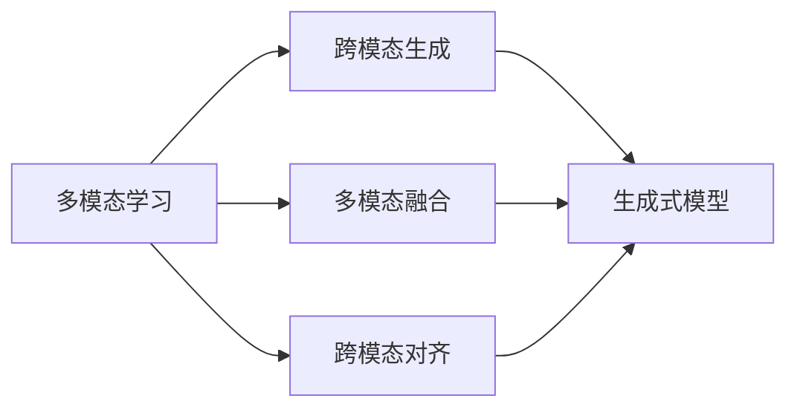

# 多模态生成(Multimodal Generation) - 原理与代码实例讲解

关键词：多模态生成、多模态融合、跨模态对齐、视觉-语言模型、多模态Transformer

## 1. 背景介绍
### 1.1  问题的由来
随着人工智能技术的飞速发展,单一模态的信息处理已经无法满足日益增长的应用需求。在现实世界中,人类感知信息往往来自多个模态,如视觉、语言、音频等。因此,如何有效地融合和利用多模态信息,实现更加智能和自然的人机交互,成为了人工智能领域的重要研究课题。多模态生成作为多模态学习的重要分支,旨在利用多种模态信息生成新的内容,如根据文本生成图像,根据图像生成文本描述等,在智能创作、跨模态检索、人机对话等领域具有广阔的应用前景。

### 1.2  研究现状
近年来,多模态生成领域取得了长足的进展。一方面,大规模多模态预训练模型如CLIP、DALL-E、Flamingo等的提出,极大地提升了视觉-语言表示学习的效果,为多模态生成任务奠定了基础。另一方面,生成对抗网络(GAN)、变分自编码器(VAE)、扩散模型等生成式模型的发展,使得高质量、多样化的跨模态内容生成成为可能。此外,Transformer等注意力机制的引入,也为多模态信息的融合与对齐提供了新的思路。尽管如此,多模态生成仍面临着诸多挑战,如模态间语义鸿沟、生成内容的一致性与连贯性等问题有待进一步探索。

### 1.3  研究意义
多模态生成技术的突破,将为人工智能系统带来更强大的感知与创作能力,使其能够像人一样理解和表达多模态信息。这不仅有助于改善人机交互体验,提升信息检索与推荐的效果,还将催生出更多创新应用,如智能艺术创作、虚拟助理、智能教育等。同时,多模态生成的研究也将推动认知科学、神经科学等交叉学科的发展,加深我们对人类智能的理解。因此,多模态生成已成为人工智能领域备受关注的前沿研究方向之一。

### 1.4  本文结构
本文将围绕多模态生成的原理与实践展开深入探讨。首先,我们将介绍多模态生成的核心概念与关键技术。然后,重点阐述多模态生成的核心算法原理,并给出详细的操作步骤。接着,我们将从数学角度对多模态生成的建模与求解进行分析,并辅以案例讲解。在实践部分,我们将通过代码实例,演示如何利用主流框架实现多模态生成模型。最后,我们将展望多模态生成技术的应用场景与未来发展方向,并总结全文。

## 2. 核心概念与联系
多模态生成涉及了以下几个核心概念:

1. 多模态学习(Multimodal Learning):旨在利用多种模态的信息(如视觉、语言、音频等)进行联合建模与学习,以获得更全面、准确的认知。多模态生成是多模态学习的重要分支。

2. 跨模态生成(Cross-modal Generation):指根据某一模态的输入,生成另一模态的对应内容。如根据文本生成图像(Text-to-Image),根据图像生成文本(Image-to-Text)等。

3. 多模态融合(Multimodal Fusion):将多个模态的特征表示进行整合,形成一个联合的多模态表示。常见的融合策略包括拼接(Concatenation)、注意力融合(Attention Fusion)等。

4. 跨模态对齐(Cross-modal Alignment):学习不同模态间的语义对应关系,使得模态间的表示在公共语义空间中对齐。对齐是实现跨模态生成的关键。

5. 生成式模型(Generative Models):用于学习数据分布并生成新样本的模型。主要包括生成对抗网络(GAN)、变分自编码器(VAE)、扩散模型(Diffusion Model)等。

下图展示了多模态生成的关键技术之间的联系:

## 3. 核心算法原理 & 具体操作步骤
### 3.1  算法原理概述
多模态生成的核心是学习不同模态之间的语义映射关系,并利用这种映射关系实现跨模态的内容生成。以文本到图像生成(Text-to-Image)为例,其主要思路是:首先将文本输入编码为语义特征向量,然后通过生成模型(如GAN)将该语义特征转换为逼真的图像。在这个过程中,需要解决以下关键问题:

1. 跨模态表示学习:如何学习文本和图像的语义表示,使其在公共语义空间中对齐。
2. 跨模态映射:如何建立文本特征到图像特征的映射函数,实现语义信息的跨模态转移。
3. 图像生成:如何基于语义特征生成高质量、语义一致的图像。

### 3.2  算法步骤详解
以下是多模态生成的一般算法步骤:

1. 多模态数据准备:收集并预处理文本-图像对等的多模态数据集。

2. 特征提取:
   - 对于文本模态,通过预训练的语言模型(如BERT)提取语义特征。
   - 对于图像模态,通过预训练的视觉模型(如CNN)提取视觉特征。

3. 跨模态对齐:
   - 使用对比学习等方法,学习将文本特征和图像特征映射到公共语义空间。
   - 优化目标是最小化正样本对(匹配的文本-图像对)的距离,最大化负样本对的距离。

4. 生成模型训练:
   - 构建生成模型(如GAN),包括生成器和判别器两部分。
   - 生成器接收文本特征作为条件,生成对应的图像。
   - 判别器判断生成图像与条件文本的语义一致性,以及图像的真实性。
   - 通过对抗训练优化生成器和判别器,使生成图像逼近真实图像分布。

5. 推断生成:
   - 给定文本输入,提取其语义特征。
   - 将语义特征输入到训练好的生成器中,生成对应的图像输出。

### 3.3  算法优缺点
多模态生成算法的优点包括:
- 可以实现跨模态的内容创作,如根据文字描述生成逼真的图像。
- 通过多模态信息的融合,生成的内容更加丰富和多样。
- 对于跨模态检索、问答等任务,多模态生成可以作为数据增强手段,提升模型性能。

多模态生成算法的缺点包括:
- 对大规模多模态数据的依赖,数据的获取和标注成本较高。
- 生成内容的语义一致性和连贯性有待提高,可能出现语义偏移或细节缺失等问题。
- 生成图像的分辨率和清晰度还有待进一步提升。

### 3.4  算法应用领域
多模态生成算法可应用于以下领域:
- 智能创作:自动生成图像、视频、音乐等多模态内容,辅助设计和创意。
- 跨模态检索:根据文本描述检索相关图像,或根据图像检索相关文本。
- 智能编辑:根据文本指令自动编辑和修改图像。
- 人机交互:通过多模态对话实现更自然、高效的人机交互。
- 虚拟助理:提供个性化的多模态信息服务和推荐。

## 4. 数学模型和公式 & 详细讲解 & 举例说明
### 4.1  数学模型构建
我们以生成对抗网络(GAN)为例,阐述多模态生成的数学建模过程。GAN由生成器$G$和判别器$D$组成,其中生成器用于生成假样本,判别器用于判断样本的真假。两者通过博弈训练,最终使生成器可以生成接近真实样本的数据。

在多模态生成任务中,生成器$G$接收文本特征$t$作为条件,生成对应的图像$\hat{x}$。判别器$D$接收文本特征$t$和图像$x$或$\hat{x}$,判断图像是否与文本语义一致,以及图像是真实样本还是生成样本。

生成器和判别器的目标函数可表示为:

$$
\min_G \max_D \mathcal{L}(D, G) = \mathbb{E}_{x, t \sim p_{\text{data}}}[\log D(x, t)] + \mathbb{E}_{t \sim p_{\text{data}}, z \sim p_z}[\log (1 - D(G(z, t), t))]
$$

其中,$x$和$t$分别表示真实图像和文本,$z$表示随机噪声,$p_{\text{data}}$表示真实数据分布,$p_z$表示噪声分布。

### 4.2  公式推导过程
上述目标函数可以分解为两部分:判别器损失$\mathcal{L}_D$和生成器损失$\mathcal{L}_G$。

判别器损失$\mathcal{L}_D$可表示为:

$$
\mathcal{L}_D = -\mathbb{E}_{x, t \sim p_{\text{data}}}[\log D(x, t)] - \mathbb{E}_{t \sim p_{\text{data}}, z \sim p_z}[\log (1 - D(G(z, t), t))]
$$

生成器损失$\mathcal{L}_G$可表示为:

$$
\mathcal{L}_G = \mathbb{E}_{t \sim p_{\text{data}}, z \sim p_z}[\log (1 - D(G(z, t), t))]
$$

训练过程中,我们交替优化判别器和生成器的损失函数:
1. 固定生成器$G$,优化判别器$D$以最大化$\mathcal{L}_D$。
2. 固定判别器$D$,优化生成器$G$以最小化$\mathcal{L}_G$。

通过不断迭代上述两个步骤,使得判别器和生成器的性能不断提升,最终达到纳什均衡,生成器可以生成与真实样本无法区分的图像。

### 4.3  案例分析与讲解
我们以文本到图像生成任务为例,对多模态生成进行案例分析。假设我们的输入文本$t$为"a red apple on the table",目标是生成与该文本描述语义一致的图像$\hat{x}$。

首先,我们将文本$t$输入预训练的语言模型(如BERT),提取其语义特征向量$v_t$。然后,随机采样噪声向量$z$,将其与$v_t$拼接,输入到生成器$G$中。生成器$G$将生成一张图像$\hat{x}$,其语义应当与输入文本$t$相符合。

接下来,我们将真实图像$x$和生成图像$\hat{x}$分别与文本特征$v_t$拼接,输入到判别器$D$中。判别器$D$将判断图像与文本的语义一致性,以及图像的真实性。对于真实图像-文本对$(x, t)$,判别器应当输出高概率;对于生成图像-文本对$(\hat{x}, t)$,判别器应当输出低概率。

通过优化生成器和判别器的损失函数,使得生成器可以生成与文本语义一致的逼真图像,同时判别器可以准确判别图像-文本对的真实性和语义一致性。最终,我们可以利用训练好的生成器,根据输入的文本描述生成对应的图像。

### 4.4  常见问题解答
1. 问:多模态生成中的模态指的是什么?
   答:模态指的是信息的不同表现形式,如文本、图像、音频等。多模态生成旨在利用多种模态的信息进行内容生成。

2. 问:多模态生成与跨模态检索有何区别?
   答:多模态生成强调根据某一模态信息生成另一模态的内容,如根据文本生成图像。而跨模态检索强调根据某一模态的查询,检索另一模态的相关内容,如以图搜文。