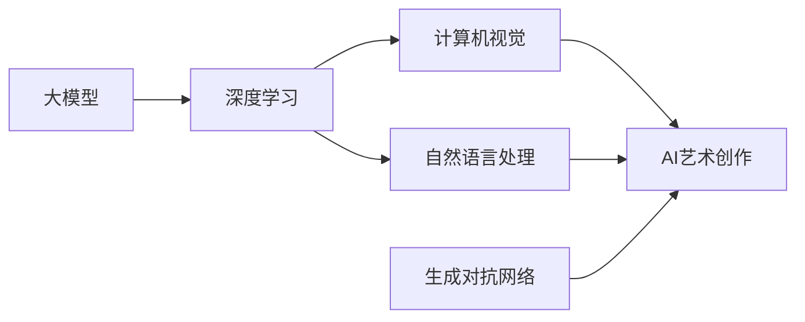
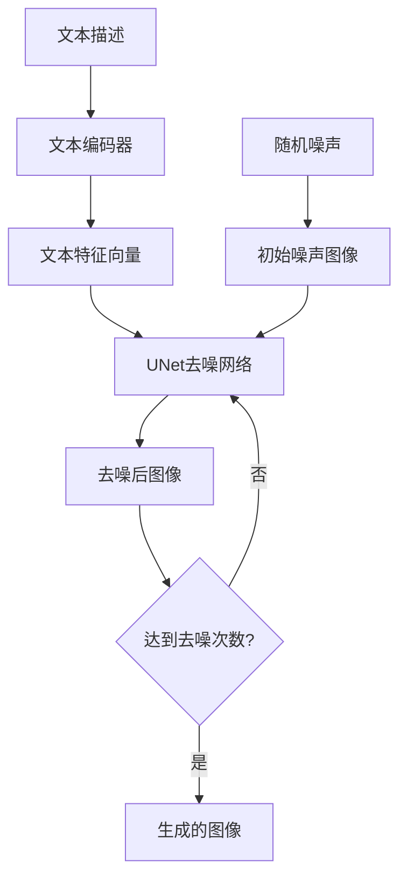

# 大模型与AI辅助艺术创作：从模仿到创新

关键词：大模型, AI艺术, 深度学习, 计算机视觉, 自然语言处理, 艺术创作, 创新

## 1. 背景介绍
### 1.1  问题的由来
随着人工智能技术的飞速发展,特别是深度学习和大模型的出现,AI已经开始在各个领域展现出令人惊叹的能力。近年来,AI在艺术创作领域也取得了突破性的进展,从最初的简单模仿到现在能够生成具有创新性和艺术性的作品。这引发了人们对AI辅助艺术创作的极大兴趣和探讨。

### 1.2  研究现状
目前,利用AI技术辅助艺术创作主要集中在以下几个方面:

1. 图像风格迁移:通过深度学习算法,将一幅图像的风格迁移到另一幅图像上,生成具有特定艺术风格的新图像。代表性的工作有Neural Style Transfer[1]等。 

2. 文本到图像生成:根据文本描述,自动生成与之匹配的图像。如OpenAI的DALL-E[2]和Midjourney等。

3. 音乐生成:利用深度学习模型如Transformer,根据一定的旋律、和弦进行音乐的续写和生成。如OpenAI的Jukebox[3]。

4. 舞蹈动作生成:通过对大量舞蹈动作数据进行学习,生成新的舞蹈动作序列。如UC Berkeley的AutoDance[4]。

以上研究表明,AI已经初步具备了辅助甚至自主进行艺术创作的能力。但目前的AI生成的艺术作品还主要停留在模仿和风格迁移阶段,缺乏更高层次的创新性。

### 1.3  研究意义
探索AI辅助艺术创作,对于推动人工智能和艺术的发展都具有重要意义:

1. 技术层面:研究AI艺术创作有助于提升计算机视觉、自然语言处理等AI技术水平。艺术创作对AI系统的创造力、理解力等提出了更高要求。

2. 艺术层面:AI为艺术家提供新的创作灵感和辅助工具,同时也带来新的艺术表现形式。AI与艺术家的协作将开辟全新的艺术疆域。

3. 认知层面:AI艺术创作为探索机器智能奥秘、思考人类创造力本质提供了新的路径,有助于我们更好地认识人工智能和人类智能。

### 1.4  本文结构
本文将重点探讨大模型在AI辅助艺术创作中的应用。第2部分介绍相关的核心概念。第3部分讨论大模型的基本原理和训练方法。第4部分进一步分析大模型的数学原理。第5部分通过代码实例演示如何利用大模型进行艺术创作。第6部分展望大模型在艺术创作中的应用前景。第7部分推荐相关工具和资源。第8部分总结全文并讨论未来的发展方向。

## 2. 核心概念与联系
在讨论AI辅助艺术创作时,有几个核心概念需要理解:

1. 大模型(Large Model):是指参数量极大(数亿到上千亿)的深度学习模型,通过海量数据训练而成。当前主要指基于Transformer结构的大规模语言模型如GPT-3、PaLM等,以及多模态模型如DALL-E、Stable Diffusion等。它们展现出了惊人的自然语言理解和生成能力,以及跨模态(如文本-图像)的生成能力,为AI艺术创作提供了强大的技术基础。

2. 深度学习(Deep Learning):一种基于神经网络的机器学习方法,模拟人脑的信息处理机制,通过构建具有多层结构的神经网络,从海量数据中自动学习高层次的特征表示。深度学习是当前AI艺术创作的核心技术之一。

3. 计算机视觉(Computer Vision):研究如何使计算机能够"看懂"图像和视频的科学。计算机视觉在图像风格迁移、图像生成等AI艺术应用中起关键作用。

4. 自然语言处理(Natural Language Processing):旨在让计算机能够理解、生成和处理人类语言的技术。NLP使得计算机能根据文本描述生成图像,实现文本与图像的跨模态转换。

5. 生成对抗网络(Generative Adversarial Network):一种用于生成新数据(如图像)的深度学习模型。GAN通过生成器和判别器的博弈训练,使生成的图像更加逼真。GAN被广泛用于图像生成、风格迁移等AI艺术任务。

这些概念之间密切相关,共同构成了AI艺术的技术基石。大模型作为最新的AI技术突破,综合运用了深度学习、计算机视觉、NLP等多个领域的研究成果,使AI艺术创作能力大幅跃升。理解这些概念之间的联系,有助于我们更好地把握AI艺术创作的发展脉络和前沿动态。

## 3. 核心算法原理 & 具体操作步骤
### 3.1  算法原理概述
大模型是AI艺术创作的核心算法,其基本原理是通过海量数据训练,学习数据的内在模式和规律,从而具备了生成新数据(如文本、图像)的能力。以图像生成大模型为例,其主要采用了以下技术方法:

1. Transformer结构:Transformer是一种基于自注意力机制的神经网络结构,擅长处理序列数据。它通过Self-Attention计算序列中不同位置之间的相关性,从而获得更好的特征表示。Transformer最初应用于自然语言处理,后来也被引入到计算机视觉领域。

2. 自回归生成:自回归是一种序列生成方法,即根据之前生成的内容,预测下一个内容。在图像生成中,可以将图像看作一个像素序列,通过自回归的方式,逐个像素地生成整张图像。这种方法可以生成高分辨率、高质量的图像。

3. 交叉注意力:在处理不同模态(如文本和图像)时,需要建立模态之间的关联。交叉注意力通过计算一个模态(如文本)中的元素与另一模态(如图像)中元素的相关性,实现了模态之间的信息交互和对齐。

4. 扩散模型:扩散模型通过迭代的方式,逐步向随机噪声图像中添加细节,最终生成清晰、逼真的图像。扩散模型在图像生成质量上取得了重大突破,代表模型如DALL-E 2和Stable Diffusion。

### 3.2  算法步骤详解
以Stable Diffusion为例,其图像生成过程可分为以下步骤:

1. 文本编码:将输入的文本描述通过一个预训练的文本编码器(如CLIP)编码为文本特征向量。

2. 噪声采样:从高斯分布中采样出一个随机噪声向量作为初始输入。

3. 去噪过程:通过一系列的去噪步骤,逐步将随机噪声向量转化为与文本描述匹配的图像。每一步去噪都通过一个UNet网络完成,该网络以噪声向量和文本特征向量为输入,输出去噪后的图像。

4. 重复去噪:重复步骤3多次(如50次),直到生成高质量、与文本匹配的图像为止。

以下是Stable Diffusion的算法流程图:

### 3.3  算法优缺点
大模型在AI艺术创作中展现出了强大的能力,但同时也存在一些局限性。

优点:
1. 生成能力强:大模型可以生成高质量、高分辨率、富有创意的艺术图像。
2. 灵活可控:通过文本提示,可以灵活地控制生成图像的内容和风格。
3. 多样性:同一文本提示可以生成多样化的图像,展现了AI的"创造力"。

缺点:  
1. 计算开销大:大模型通常包含数亿到上千亿的参数,训练和推理都需要大量的计算资源。  
2. 泛化能力有限:大模型容易过拟合训练数据,导致在新场景下表现不佳。
3. 伦理风险:AI生成的艺术作品可能带来版权、伦理等方面的争议和风险。

### 3.4  算法应用领域
大模型不仅可用于AI艺术创作,还可应用于以下领域:

1. 设计:自动生成产品、建筑、UI等设计方案,辅助设计师工作。
2. 游戏:生成游戏场景、人物、地图等游戏素材,加速游戏开发流程。
3. 虚拟主播:生成虚拟主播的形象、动作和语音,创造新的互动娱乐体验。
4. 教育:生成教学图片、视频等资源,为教育提供丰富的素材。
5. 医疗:生成医学影像数据,辅助医生诊断和治疗。

大模型正在为越来越多的领域带来变革性的影响,AI艺术创作只是其中一个缩影。未来,大模型有望在更广阔的领域大显身手。

## 4. 数学模型和公式 & 详细讲解 & 举例说明
### 4.1  数学模型构建
大模型的核心是基于Transformer的神经网络结构。以下是Transformer的核心数学模型:

1. Self-Attention:
$$
\text{Attention}(Q, K, V) = \text{softmax}(\frac{QK^T}{\sqrt{d_k}})V
$$
其中,$Q$,$K$,$V$分别表示查询、键、值向量,$d_k$为向量维度。

2. Multi-Head Attention:
$$
\text{MultiHead}(Q, K, V) = \text{Concat}(\text{head}_1, ..., \text{head}_h)W^O \\
\text{head}_i = \text{Attention}(QW_i^Q, KW_i^K, VW_i^V)
$$
其中,$W_i^Q$,$W_i^K$,$W_i^V$,$W^O$为可学习的权重矩阵,$h$为注意力头的数量。

3. Feed-Forward Network:
$$
\text{FFN}(x) = \max(0, xW_1 + b_1)W_2 + b_2
$$
其中,$W_1$,$W_2$为可学习的权重矩阵,$b_1$,$b_2$为偏置项。

4. Layer Normalization:
$$
\text{LayerNorm}(x) = \frac{x - \text{E}[x]}{\sqrt{\text{Var}[x] + \epsilon}} * \gamma + \beta
$$
其中,$\text{E}[x]$和$\text{Var}[x]$分别表示$x$的均值和方差,$\epsilon$为平滑项,$\gamma$和$\beta$为可学习的缩放和偏移参数。

### 4.2  公式推导过程
以下以Self-Attention公式为例,推导其计算过程:

1. 输入向量$X$通过三个线性变换得到$Q$,$K$,$V$:
$$
Q = XW^Q, K = XW^K, V = XW^V
$$

2. 计算$Q$和$K$的点积并除以缩放因子$\sqrt{d_k}$:
$$
\text{scores} = \frac{QK^T}{\sqrt{d_k}}
$$

3. 对scores应用softmax函数,得到注意力权重:
$$
\text{weights} = \text{softmax}(\text{scores})
$$

4. 将注意力权重与值向量$V$相乘,得到最终的注意力输出:
$$
\text{Attention}(Q, K, V) = \text{weights} \cdot V
$$

通过以上步骤,Self-Attention可以计算序列中不同位置之间的相关性,并根据相关性对值向量进行加权求和,得到新的表示。

### 4.3  案