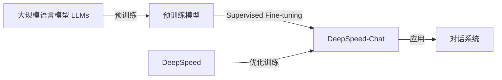

# 大规模语言模型从理论到实践 DeepSpeed-Chat SFT实践

## 1. 背景介绍

### 1.1 问题的由来
近年来,随着人工智能技术的飞速发展,大规模语言模型(Large Language Models, LLMs)已成为自然语言处理(Natural Language Processing, NLP)领域的研究热点。LLMs 通过在海量文本数据上进行预训练,能够学习到丰富的语言知识和世界知识,在许多 NLP 任务上取得了显著的性能提升。然而,训练 LLMs 需要消耗大量的计算资源和训练时间,对于许多研究者和企业来说,训练 LLMs 仍然是一个巨大的挑战。

### 1.2 研究现状 
为了解决 LLMs 训练效率低下的问题,微软研究院提出了 DeepSpeed 训练框架。DeepSpeed 通过一系列优化技术,如混合精度训练、梯度累积、Zero Redundancy Optimizer (ZeRO)等,大幅提升了 LLMs 的训练效率。在 DeepSpeed 的基础上,微软研究院进一步提出了 DeepSpeed-Chat,一个基于 LLMs 的开源对话系统。DeepSpeed-Chat 采用了 Supervised Fine-tuning (SFT) 方法,在预训练好的 LLMs 上进行微调,使其能够适应特定的对话场景。

### 1.3 研究意义
DeepSpeed-Chat 的提出为构建高效、智能的对话系统提供了新的思路。通过 SFT 方法,我们可以在预训练好的 LLMs 上快速适应新的对话场景,而无需从头开始训练模型。这不仅大大节省了训练成本,也使得构建对话系统变得更加简单和高效。同时,DeepSpeed-Chat 作为一个开源项目,为 NLP 研究者提供了一个很好的研究平台,促进了 LLMs 在对话系统中的应用和发展。

### 1.4 本文结构
本文将全面介绍 DeepSpeed-Chat 的理论基础和实践经验。第二部分将介绍 DeepSpeed-Chat 涉及的核心概念,如 LLMs、DeepSpeed、SFT 等。第三部分将详细阐述 DeepSpeed-Chat 的核心算法原理和具体操作步骤。第四部分将建立 DeepSpeed-Chat 的数学模型,并通过案例分析加以说明。第五部分将通过代码实例,展示如何使用 DeepSpeed-Chat 进行对话系统的开发。第六部分将探讨 DeepSpeed-Chat 的实际应用场景。第七部分将推荐 DeepSpeed-Chat 相关的学习资源和开发工具。第八部分将总结 DeepSpeed-Chat 的研究成果,展望其未来发展趋势和面临的挑战。第九部分为文章的附录,解答了一些常见问题。

## 2. 核心概念与联系

在深入探讨 DeepSpeed-Chat 之前,我们需要了解其中涉及的一些核心概念:

- 大规模语言模型(Large Language Models, LLMs):是指在海量文本数据上预训练得到的神经网络模型,如 GPT-3、BERT、RoBERTa 等。LLMs 通过自监督学习,可以学习到丰富的语言知识和世界知识,在许多 NLP 任务上取得了显著的性能提升。

- DeepSpeed:是微软研究院开发的一个用于训练 LLMs 的开源深度学习优化库。DeepSpeed 通过一系列优化技术,如混合精度训练、梯度累积、Zero Redundancy Optimizer (ZeRO)等,大幅提升了 LLMs 的训练效率。

- Supervised Fine-tuning (SFT):是一种在预训练好的模型上进行微调的方法。不同于传统的微调方法,SFT 使用标注好的数据对模型进行微调,使其能够适应特定的任务。在对话系统中,SFT 可以使预训练好的 LLMs 适应特定的对话场景。

- 对话系统(Dialogue System):是一种能够与人进行自然语言交互的计算机系统。传统的对话系统通常基于规则或检索的方法构建,而基于 LLMs 的对话系统则可以生成更加智能、灵活的对话响应。

下图展示了 DeepSpeed-Chat 中各个核心概念之间的联系:



## 3. 核心算法原理 & 具体操作步骤

### 3.1 算法原理概述
DeepSpeed-Chat 的核心算法可以分为两个部分:预训练和微调。在预训练阶段,DeepSpeed-Chat 使用 DeepSpeed 框架在大规模无标注语料上训练 LLMs。通过自监督学习,LLMs 可以学习到语言的基本规律和世界知识。在微调阶段,DeepSpeed-Chat 使用 SFT 方法在预训练好的 LLMs 上进行微调。通过在标注好的对话数据上进行训练,LLMs 可以适应特定的对话场景,生成更加自然、贴切的对话响应。

### 3.2 算法步骤详解
DeepSpeed-Chat 的训练过程可以分为以下几个步骤:

1. 数据准备:收集大规模无标注语料用于预训练,收集标注好的对话数据用于微调。对数据进行清洗、标注等预处理操作。

2. 模型选择:选择合适的 LLMs 作为预训练模型,如 GPT-3、BERT 等。

3. 预训练:使用 DeepSpeed 框架在无标注语料上训练 LLMs。DeepSpeed 通过混合精度训练、梯度累积、ZeRO 等优化技术,可以大幅提升训练效率。

4. 微调:使用 SFT 方法在预训练好的 LLMs 上进行微调。将标注好的对话数据输入到模型中,通过监督学习使模型适应特定的对话场景。

5. 评估:使用留出的测试集评估模型的性能,如 BLEU、Perplexity 等指标。根据评估结果进行模型调优。

6. 部署:将训练好的模型部署到对话系统中,进行实际应用。

### 3.3 算法优缺点
DeepSpeed-Chat 算法的主要优点包括:

- 通过预训练,可以充分利用大规模无标注数据,学习到丰富的语言知识和世界知识。
- 通过 SFT 微调,可以快速适应新的对话场景,而无需从头开始训练模型。  
- 使用 DeepSpeed 优化训练过程,大幅提升了训练效率。

DeepSpeed-Chat 算法的主要缺点包括:  

- 预训练和微调都需要大量的计算资源,对于中小型企业和研究机构来说门槛较高。
- 模型性能依赖于数据质量,需要高质量的标注数据进行微调。
- 模型可解释性较差,难以解释模型生成响应的内在原因。

### 3.4 算法应用领域
DeepSpeed-Chat 算法可以应用于各种对话系统,如:

- 客服机器人:为用户提供智能化的客户服务。
- 个人助理:协助用户完成日常任务,如日程管理、信息查询等。
- 智能教育:为学生提供个性化的学习辅导。
- 医疗助理:协助医生进行病情分析和诊断。

## 4. 数学模型和公式 & 详细讲解 & 举例说明

### 4.1 数学模型构建
DeepSpeed-Chat 的数学模型可以表示为一个条件语言模型。给定一个对话上下文 $c$,模型需要生成一个响应 $r$,使得响应在给定上下文下的条件概率 $P(r|c)$ 最大。

我们可以使用 Transformer 架构来构建这个条件语言模型。Transformer 由多个编码器层和解码器层组成,每一层都包含自注意力机制和前馈神经网络。编码器负责对输入的上下文进行编码,解码器负责根据编码结果生成响应。

### 4.2 公式推导过程
在 Transformer 中,自注意力机制可以表示为:

$$
Attention(Q,K,V) = softmax(\frac{QK^T}{\sqrt{d_k}})V
$$

其中,$Q$,$K$,$V$ 分别表示查询向量、键向量和值向量,$d_k$ 表示向量维度。

前馈神经网络可以表示为:

$$
FFN(x) = max(0, xW_1 + b_1)W_2 + b_2
$$

其中,$W_1$,$b_1$,$W_2$,$b_2$ 为可学习的参数。

在预训练阶段,我们使用语言模型损失函数来优化模型参数:

$$
L_{LM} = -\sum_{i=1}^{n} \log P(w_i|w_{<i})
$$

其中,$w_i$ 表示第 $i$ 个单词,$w_{<i}$ 表示第 $i$ 个单词之前的所有单词。

在微调阶段,我们使用交叉熵损失函数来优化模型参数:

$$
L_{SFT} = -\sum_{i=1}^{m} \log P(r_i|c_i)
$$

其中,$r_i$ 表示第 $i$ 个样本的标注响应,$c_i$ 表示第 $i$ 个样本的对话上下文。

### 4.3 案例分析与讲解
下面我们通过一个简单的例子来说明 DeepSpeed-Chat 的工作原理。

假设我们有以下对话上下文:

```
用户:明天北京的天气怎么样?
```

我们希望模型能够生成一个合适的响应,如"明天北京晴转多云,最高温度25℃,最低温度15℃。"。

首先,我们将上下文输入到编码器中,编码器对上下文进行编码,得到一个上下文向量。然后,我们将这个上下文向量输入到解码器中,解码器根据上下文向量生成响应。

在生成响应的过程中,解码器使用自回归的方式,根据已生成的单词预测下一个单词。例如,当解码器生成"明天北京"这几个单词后,它会根据这几个单词预测下一个最可能的单词,如"晴"。解码器不断重复这个过程,直到生成完整的响应为止。

### 4.4 常见问题解答
1. DeepSpeed-Chat 和传统的对话系统有什么区别?
   
   传统的对话系统通常基于规则或检索的方法构建,而 DeepSpeed-Chat 是基于 LLMs 的生成式对话系统。DeepSpeed-Chat 可以生成更加智能、灵活的对话响应,适应性更强。

2. DeepSpeed-Chat 需要多少标注数据才能达到良好的性能?
   
   DeepSpeed-Chat 在预训练阶段可以利用大规模无标注数据进行训练,因此在微调阶段并不需要大量的标注数据。但是,标注数据的质量对模型性能有较大影响,因此需要高质量的标注数据进行微调。

3. DeepSpeed-Chat 生成的响应是否可控?
   
   DeepSpeed-Chat 生成的响应是基于概率模型的,因此具有一定的随机性和不确定性。我们可以通过调节生成参数(如 temperature)来控制生成响应的多样性和确定性,但无法完全控制生成的具体内容。

## 5. 项目实践：代码实例和详细解释说明

### 5.1 开发环境搭建
首先,我们需要搭建 DeepSpeed-Chat 的开发环境。DeepSpeed-Chat 基于 Python 语言开发,需要安装以下依赖库:

- PyTorch:深度学习框架
- DeepSpeed:LLMs 训练优化库
- Transformers:预训练语言模型库
- Datasets:数据集加载和预处理库

我们可以使用以下命令安装这些依赖库:

```bash
pip install torch deepspeed transformers datasets
```

### 5.2 源代码详细实现
下面我们通过一个简单的代码示例,展示如何使用 DeepSpeed-Chat 进行对话系统的开发。

首先,我们需要加载预训练好的语言模型,这里我们使用 GPT-2 作为示例:

```python
from transformers import GPT2LMHeadModel, GPT2Tokenizer

model = GPT2LMHeadModel.from_pretrained("gpt2")
tokenizer = GPT2Tokenizer.from_pretrained("gpt2")
```

然后,我们需要准