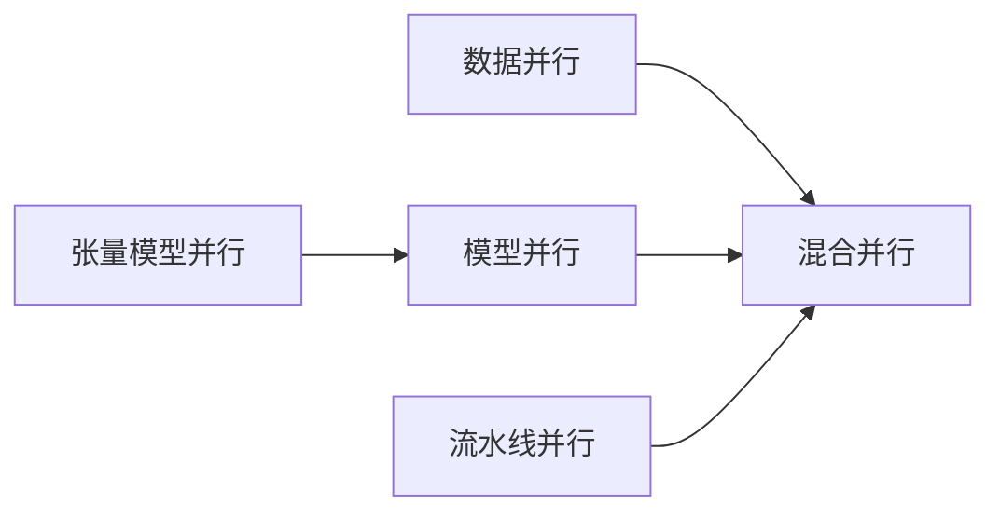
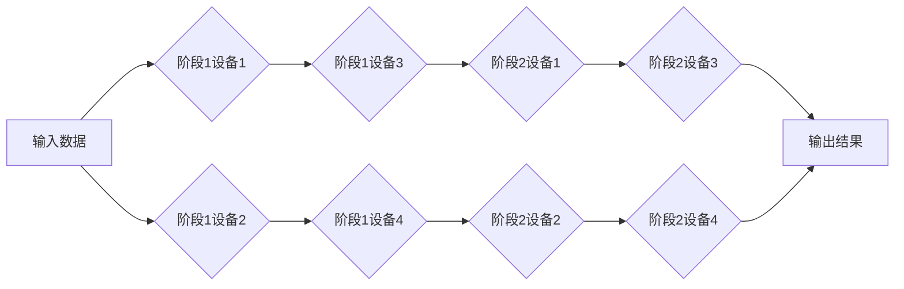

# 大规模语言模型从理论到实践 混合并行

关键词：大规模语言模型、混合并行、数据并行、模型并行、流水线并行、3D并行、Zero Redundancy Optimizer (ZeRO)、DeepSpeed、Megatron-LM

## 1. 背景介绍
### 1.1  问题的由来
随着深度学习的快速发展,尤其是Transformer架构的出现,语言模型的规模越来越大。从ELMo、BERT到GPT-3,参数量从百万级别增长到千亿级别。超大规模语言模型展现出了强大的性能,但训练这些模型需要消耗大量的计算资源和时间成本。因此,如何高效地训练大规模语言模型成为了一个亟待解决的问题。

### 1.2  研究现状
目前,训练大规模语言模型主要采用数据并行(Data Parallelism, DP)的方式。每个GPU拥有完整的模型参数,并处理不同的数据子集,通过梯度平均的方式同步更新。但当模型参数量超过单GPU显存时,数据并行就无法适用了。

为了突破这一限制,研究者们提出了模型并行(Model Parallelism, MP)的思路,将模型切分到多个设备上。但模型并行也面临着通信开销大、负载不均衡等问题。

最新的研究成果是将数据并行、模型并行与流水线并行(Pipeline Parallelism, PP)相结合,形成混合并行范式。代表性的工作有Megatron-LM和DeepSpeed,都实现了万亿参数量级的语言模型训练。

### 1.3  研究意义
发展高效的大规模语言模型训练方法,有助于推动语言模型在更多领域的应用,如问答系统、机器翻译、文本生成等。同时,这些技术也可以推广到其他需要训练超大模型的场景,如图像、语音等。

### 1.4  本文结构
本文将首先介绍大规模语言模型训练中的核心概念,包括数据并行、模型并行、流水线并行、混合并行等。然后重点阐述混合并行的核心算法原理和实现步骤。接着通过数学建模分析其计算和通信复杂度。之后给出混合并行的代码实例和应用场景。最后总结全文,展望未来的研究方向和挑战。

## 2. 核心概念与联系
- 数据并行(Data Parallelism, DP): 将数据划分到多个设备,每个设备拥有完整的模型参数,分别计算梯度并同步平均,更新模型。
- 模型并行(Model Parallelism, MP): 将模型切分到多个设备,每个设备只拥有部分参数。前向和反向传播需要在设备间传输中间激活。
- 流水线并行(Pipeline Parallelism, PP): 将模型切分为多个阶段,每个阶段在不同设备上,以流水线的方式执行前向和反向传播。
- 张量模型并行(Tensor Model Parallelism): 在层内对张量进行切分,以提高设备的利用率和负载均衡。
- 混合并行(Hybrid Parallelism): 将数据、模型、流水线并行相结合,以实现更好的扩展性和性能。

它们的关系如下图所示:

## 3. 核心算法原理 & 具体操作步骤
### 3.1  算法原理概述
混合并行的核心思想是将数据、模型、流水线并行有机结合,最大化硬件利用率和吞吐量。具体来说:
1. 首先将模型切分为多个阶段,每个阶段包含连续的若干层,以流水线并行的方式跨设备。
2. 对每个阶段,再进行数据并行,即每个阶段在多个设备上保存完整参数并处理不同数据。
3. 当模型过大时,还可以对每个阶段做模型并行,即将阶段内的层再切分到多个设备。
4. 考虑到Transformer的注意力计算代价高,还可以对注意力矩阵做张量并行,提高设备利用率。

### 3.2  算法步骤详解
1. **模型切分与流水线并行**
   - 将模型切分为S个阶段,每个阶段包含连续的N/S层(N为总层数)
   - 将S个阶段分别放置在S个设备上
   - 前向传播时,每个阶段处理上一阶段的输出;反向传播时,每个阶段计算损失对本阶段输入的梯度
   - 使用微批次(micro-batch)提高流水线并行的设备利用率
2. **阶段内数据并行**
   - 将每个阶段的层参数复制到D个设备上(D为数据并行度)
   - 将输入数据切分为D份,分别输入D个设备
   - 前向传播时,每个设备计算损失;反向传播时,每个设备计算梯度
   - 对D个设备的梯度做All-Reduce操作,更新模型参数
3. **阶段内模型并行(可选)**
   - 当N/S仍然较大时,可将每个阶段再切分为M个部分(M为模型并行度)
   - 前向传播时,每个部分接收前一部分的输出,计算后传递给下一部分
   - 反向传播时,每个部分计算损失对本部分输入的梯度,传递给前一部分
4. **注意力矩阵张量并行(可选)**
   - 对于注意力计算Q·K^T,将Q和K矩阵按行和列切分到多个设备
   - 每个设备计算局部注意力矩阵,然后做All-Gather操作得到完整结果
   - 反向传播时同样需要All-Gather传递梯度

### 3.3  算法优缺点
优点:
- 可扩展性强,能够支持上万亿参数的超大模型训练
- 设备利用率高,通信开销小
- 实现难度相对较低,基于成熟的数据并行和模型并行原语

缺点:
- 流水线并行引入的bubble(流水线填充)会降低设备利用率
- 模型切分增加了开发和调优难度
- 对任务的适用性有一定限制,如任务有强数据依赖时不适合切分

### 3.4  算法应用领域
- 自然语言处理:语言模型、机器翻译、阅读理解、文本生成等
- 语音识别:声学模型、语言模型的训练
- 图像处理:图像分类、目标检测、图像生成等
- 推荐系统:使用语言模型增强用户和物品表示

## 4. 数学模型和公式 & 详细讲解 & 举例说明
### 4.1  数学模型构建
考虑一个N层的序列到序列模型,训练时的前向传播公式为:

$$h_0 = \text{Embedding}(x)$$

$$h_l = \text{Layer}_l(h_{l-1}), l=1,2,...,N$$

$$\hat{y} = \text{Softmax}(h_N)$$

损失函数为:

$$\mathcal{L} = \text{CrossEntropy}(\hat{y}, y)$$

假设模型切分为S个阶段,每个阶段有N/S层,则阶段s的前向传播为:

$$h_s = \text{Stage}_s(h_{s-1}), s=1,2,...,S$$

其中$h_0$为输入,$h_S$为输出。反向传播时,每个阶段计算损失对本阶段输入的梯度:

$$\nabla_{h_{s-1}} \mathcal{L} = \frac{\partial \mathcal{L}}{\partial h_s} \cdot \frac{\partial h_s}{\partial h_{s-1}}, s=S,S-1,...,1$$

假设阶段内做D路数据并行,则有D个设备各自计算梯度:

$$\nabla_{h_{s-1}}^{(d)} \mathcal{L}, d=1,2,...,D$$

然后做All-Reduce得到完整梯度:

$$\nabla_{h_{s-1}} \mathcal{L} = \frac{1}{D} \sum_{d=1}^D \nabla_{h_{s-1}}^{(d)} \mathcal{L}$$

若阶段内再做M路模型并行,设备m的前向传播为:

$$h_{s,m} = \text{Stage}_{s,m}(h_{s,m-1}), m=1,2,...,M$$

反向传播时,设备m计算梯度:

$$\nabla_{h_{s,m-1}} \mathcal{L} = \frac{\partial \mathcal{L}}{\partial h_{s,m}} \cdot \frac{\partial h_{s,m}}{\partial h_{s,m-1}}$$

最后,对于注意力矩阵Q·K^T,假设按行列切分为R×C块,则设备(i,j)计算:

$$(QK^T)_{i,j} = Q_i \cdot K_j^T$$

All-Gather后得到完整注意力矩阵。反向传播时同理。

### 4.2  公式推导过程
以上公式的推导基于链式法则和梯度的线性性质。对于流水线并行,前向传播时每个阶段依次计算,反向传播时每个阶段依次计算梯度。对于数据并行,前向时每个设备独立计算,反向时每个设备独立计算梯度并做All-Reduce。对于模型并行,前向时每个设备依次计算,反向时每个设备依次计算梯度。对于张量并行,前向时每个设备计算局部结果并All-Gather,反向时每个设备计算局部梯度并All-Gather。

### 4.3  案例分析与讲解
考虑一个8层的Transformer模型,切分为2个阶段,每个阶段4层,阶段内做2路数据并行和2路模型并行。则流水线如下:

前向传播时,输入数据被切分为2份,分别送入阶段1的2个设备。每个设备完成2层的计算后,将结果发送到阶段2的对应设备。阶段2的设备完成剩余4层的计算,得到最终输出。反向传播时,阶段2的设备计算损失对其输入的梯度,发送回阶段1的设备。阶段1的设备计算损失对输入数据的梯度。每个阶段内,2个设备独立计算梯度,然后做All-Reduce得到完整梯度。

假设第2层和第6层为注意力层,注意力矩阵切分为2×2块。则阶段1设备1计算第2层注意力矩阵的左上块,阶段1设备2计算右上块,阶段1设备3计算左下块,阶段1设备4计算右下块。All-Gather后得到完整注意力矩阵。第6层同理。

### 4.4  常见问题解答
- 问: 流水线并行的bubble问题如何缓解?
  答: 可以使用更多的微批次来提高流水线的并发度,从而减少bubble的影响。此外,还可以通过优化调度策略,尽可能地减少不必要的等待。

- 问: 数据并行的通信开销如何优化?
  答: 可以使用Ring All-Reduce等高效的集合通信原语,或者使用NCCL等通信库进行优化。此外,还可以通过梯度压缩、稀疏通信等技术减少通信量。

- 问: 模型并行的负载不均衡问题如何解决?
  答: 可以通过动态调整设备间的任务分配来平衡负载。例如FlexFlow采用了基于运行时的自适应图划分方法。此外,还可以通过数据划分、张量划分等方式来提高并行粒度,减少不均衡。

- 问: 张量并行对带宽的要求高吗?
  答: 相比于流水线并行,张量并行对带宽的要求更高,因为需要频繁地做All-Gather通信。但相比于数据并行,张量并行的通信量要小。可以通过增加并行粒度、减少通信频率来降低带宽压力。

## 5. 项目实践：代码实例和详细解释说明
### 5.1  开发环境搭建
实验环境:
- 硬件:8块NVIDIA V100 