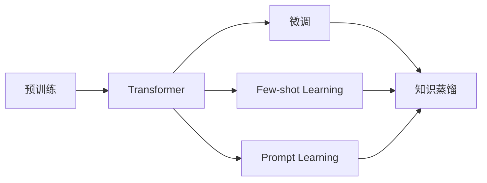
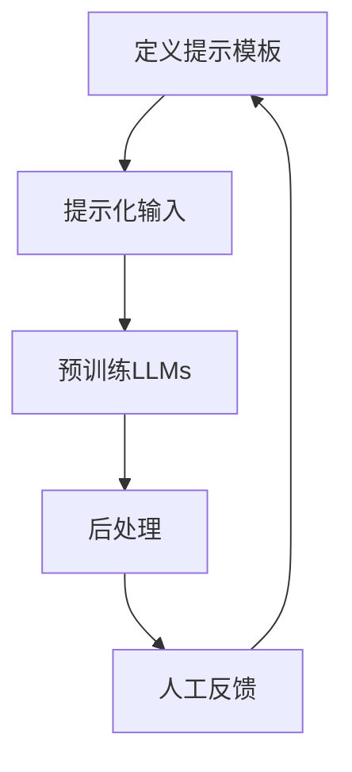
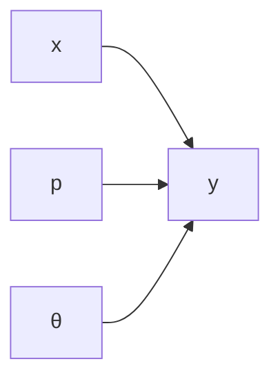

# 大规模语言模型从理论到实践 语境学习

关键词：大规模语言模型、语境学习、Transformer、预训练、微调、few-shot learning、prompt learning、知识蒸馏

## 1. 背景介绍
### 1.1  问题的由来
近年来，随着深度学习技术的快速发展，自然语言处理(NLP)领域取得了突破性的进展。其中，大规模语言模型(Large Language Models, LLMs)的出现，让NLP在许多任务上达到了甚至超越人类的性能水平。LLMs通过在海量文本语料上进行预训练，学习到了丰富的语言知识和常识，具备强大的语言理解和生成能力。然而，如何让LLMs更好地适应不同的应用场景，高效地学习和利用特定领域知识，仍然是一个亟待解决的问题。

### 1.2  研究现状
目前，主流的LLMs如BERT、GPT等，主要采用基于Transformer的架构，通过自监督学习在大规模无标注语料上进行预训练。预训练后的模型可以通过微调(fine-tuning)的方式应用到下游任务中。但是，这种范式存在一些局限性：
1. 微调需要大量标注数据，对低资源场景不友好；
2. 每个任务都需要单独微调，缺乏通用性和灵活性；
3. 模型参数量巨大，微调和存储成本高。

为了克服这些局限性，研究者们提出了一系列改进方法，如few-shot learning、prompt learning、知识蒸馏等。这些方法旨在通过对预训练模型进行适当修改和优化，使其能够在小样本、无监督、跨任务等场景下，更好地利用先验知识，实现快速、高效、灵活的学习和推理。

### 1.3  研究意义
探索LLMs的语境学习能力，对于拓展其应用范围、提升实际效果具有重要意义：
1. 降低应用门槛，普惠AI技术；
2. 提高知识的复用和泛化能力，实现更加通用的AI系统；
3. 减少计算和存储开销，让LLMs更加轻量和实时可用。

同时，语境学习也为认知科学、语言学等基础学科研究提供了新的视角和实证案例，有助于加深人们对语言智能的本质和机理的理解。

### 1.4  本文结构
本文将围绕语境学习展开，系统梳理LLMs领域的理论基础和前沿进展，重点关注few-shot learning、prompt learning等新范式。全文结构如下：

第2部分介绍LLMs的核心概念和技术基础；第3部分重点阐述语境学习的算法原理和操作步骤；第4部分从数学角度对语境学习进行建模分析；第5部分给出语境学习的代码实例；第6部分讨论语境学习的典型应用场景；第7部分推荐相关工具和学习资源；第8部分总结全文，展望未来研究方向；第9部分列举常见问题解答。

## 2. 核心概念与联系

大规模语言模型的语境学习涉及以下核心概念：

- 语言模型：对语言符号序列的概率分布建模，刻画符号之间的统计关系和依赖结构。
- 预训练：在大规模无标注语料上进行自监督学习，捕捉语言的一般性规律和知识。
- Transformer：一种基于self-attention的神经网络结构，善于学习长距离依赖，是当前主流LLMs的基础架构。
- 微调：在预训练的基础上，使用少量标注数据对模型进行针对性训练，使其适应特定任务。
- Few-shot learning：只给少量示例，就让模型掌握新概念、完成新任务的学习范式。
- Prompt learning：通过设计输入提示模板，引导LLMs进行特定模式的文本生成或理解。
- 知识蒸馏：将知识从大模型(teacher)转移到小模型(student)，在保持性能的同时压缩模型尺寸。

这些概念之间关系紧密（如图1所示）：预训练是LLMs的基础，Transformer是主流的模型架构；在此基础上，通过微调、few-shot、prompt等方式，让LLMs学习不同语境下的知识；知识蒸馏可进一步压缩和加速LLMs，提高其实用性。


<p align="center">图1 语境学习相关概念关系图</p>

## 3. 核心算法原理 & 具体操作步骤
### 3.1  算法原理概述
语境学习的核心是让LLMs能根据输入的上下文信息，动态调整其知识表示和应用方式。主要思路包括：

1. 元学习(meta-learning)：通过设计合适的元任务，训练LLMs掌握"如何学习新知识"的元能力。
2. 提示学习(prompt learning)：通过在输入中引入提示模板，激活LLMs与当前任务相关的知识。
3. 参数高效微调：在不改变主体参数的情况下，只微调少量额外参数，以实现快速适配。

### 3.2  算法步骤详解

以提示学习为例，其主要步骤如下：

1. 定义提示模板(prompt template)，用自然语言描述任务要求，并留出插槽(slot)；
2. 将输入样本填充到提示模板的插槽中，形成提示化的输入(prompted input)；
3. 将提示化输入送入预训练LLMs，让其生成目标文本；
4. 根据应用需求对生成结果进行后处理，如答案抽取、情感归一化等；
5. 收集人工反馈，对模板和生成过程进行优化，提高提示的质量和效果。

算法流程如图2所示。


<p align="center">图2 提示学习算法流程图</p>

### 3.3  算法优缺点

优点：
- 无需微调，即可让LLMs适应新任务，降低开发和计算成本；
- 通过自然语言提示，让人机交互更加灵活和可控；
- 提示可复用，不同任务可共享同一个LLMs，提高资源利用率。

缺点：
- 对提示质量敏感，需要精心设计和调优；
- 推理速度慢于微调模型；
- 对个别任务的专业性不如微调，性能上限受预训练影响。

### 3.4  算法应用领域
语境学习可广泛应用于NLP各领域，如：
- 问答：通过提示让LLMs回答特定领域的问题；
- 对话：通过提示引导LLMs进行个性化、多轮对话；
- 文本分类：通过提示让LLMs判断文本的类别、属性；
- 文本生成：通过提示让LLMs写作、改写、续写文本；
- 信息抽取：通过提示让LLMs从文本中提取结构化信息。

## 4. 数学模型和公式 & 详细讲解 & 举例说明
### 4.1  数学模型构建
我们可以用概率图模型来刻画语境学习的生成过程。如图3所示，生成目标文本$y$需要考虑三个因素：输入文本$x$、提示$p$、语言模型参数$\theta$。其联合概率分布为：

$$P(y|x,p,\theta) = \prod_{i=1}^n P(y_i|x,p,y_{<i},\theta)$$

其中$y_i$表示目标文本的第$i$个token，$y_{<i}$表示之前生成的token序列。


<p align="center">图3 语境学习的概率图模型</p>

### 4.2  公式推导过程
根据贝叶斯公式，我们可以将联合概率分解为：

$$P(y|x,p,\theta) = \frac{P(x,p,y|\theta)}{P(x,p|\theta)}$$

假设$x$和$p$相互独立，且与$\theta$无关，则分母可简化为：

$$P(x,p|\theta) = P(x)P(p)$$

代入原式，得：

$$P(y|x,p,\theta) = \frac{P(x,p,y|\theta)}{P(x)P(p)} \propto P(y|x,p,\theta)P(x|\theta)P(p|\theta)$$

其中$P(y|x,p,\theta)$对应LLMs基于提示生成目标文本的过程，$P(x|\theta)$和$P(p|\theta)$分别对应LLMs对输入文本和提示的建模能力。

### 4.3  案例分析与讲解
以一个问答任务为例，输入文本$x$="姚明的身高是多少？"，提示$p$="问题：{x}？回答："。

将$x$填入$p$的插槽，得到提示化的输入："问题：姚明的身高是多少？回答："。将其输入预训练好的LLMs，假设得到生成结果$y$="姚明的身高是2米26，是中国男篮历史上最高的球员。"

这里LLMs在生成过程中综合利用了三方面知识：
1. 基于$x$中的关键词"姚明"、"身高"检索相关知识；
2. 基于$p$中的"问题"、"回答"建立问答逻辑框架；
3. 基于预训练中学到的语言常识，组织通顺、流畅的回答内容。

可见，提示的设计对引导LLMs产生期望输出至关重要。一个好的提示应该包含明确的指令（如"回答"）和必要的背景信息（如"姚明"），让LLMs正确理解任务要求。

### 4.4  常见问题解答
Q: 语境学习对提示的质量有什么要求？

A: 一个好的提示应具备以下特点：
1. 指令明确，说明输出的类型和格式；
2. 背景充分，提供必要的上下文信息； 
3. 简洁凝练，避免冗余和歧义；
4. 可泛化，适用于不同的输入实例。

Q: 如何自动优化提示？

A: 主要有两类思路：
1. 基于规则：总结提示设计的最佳实践，提炼关键元素，构建模板库；
2. 基于学习：将提示生成看作一个序列转换任务，通过机器学习方法进行优化，如强化学习、对比学习等。

## 5. 项目实践：代码实例和详细解释说明
### 5.1  开发环境搭建
实验基于PyTorch深度学习框架和Hugging Face的Transformers库。主要依赖包括：

- torch：PyTorch核心库，提供张量运算、自动微分等功能。
- transformers：Transformer系列预训练模型的开源实现，包括BERT、GPT、T5等。
- datasets：用于加载和预处理NLP数据集的工具包。

安装命令：
```
pip install torch transformers datasets
```

### 5.2  源代码详细实现
以下代码展示了如何用GPT-2模型来实现基于提示的文本生成：

```python
from transformers import GPT2LMHeadModel, GPT2Tokenizer

# 加载预训练模型和tokenizer
model = GPT2LMHeadModel.from_pretrained('gpt2')
tokenizer = GPT2Tokenizer.from_pretrained('gpt2')

# 定义提示模板
prompt_template = "问题：{input_text}？回答："

# 定义函数，将输入文本填入模板，生成提示
def make_prompt(input_text):
    return prompt_template.format(input_text=input_text)

# 输入文本
input_text = "姚明的身高是多少"

# 生成提示
prompt_text = make_prompt(input_text)

# 对提示进行编码
input_ids = tokenizer.encode(prompt_text, return_tensors='pt')

# 使用模型生成文本
output = model.generate(input_ids, 
                        max_length=100, 
                        num_return_sequences=1, 
                        temperature=0.7
                        )

# 对生成结果解码并打印
generated_text = tokenizer.decode(output[0], skip_special_tokens=True)
print(generated_text)
```

### 5.3  代码解读与分析

1. 首先加载预训练的GPT-2模型和对应的tokenizer。GPT-2是