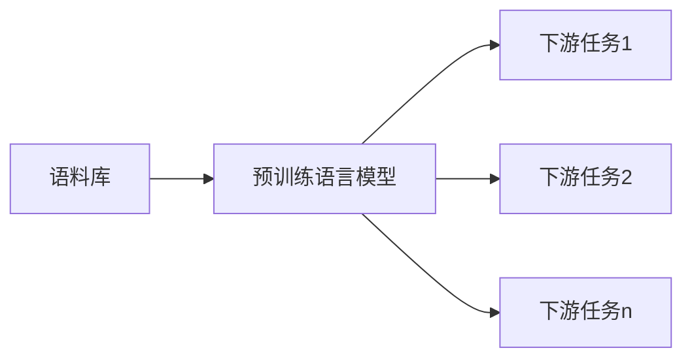
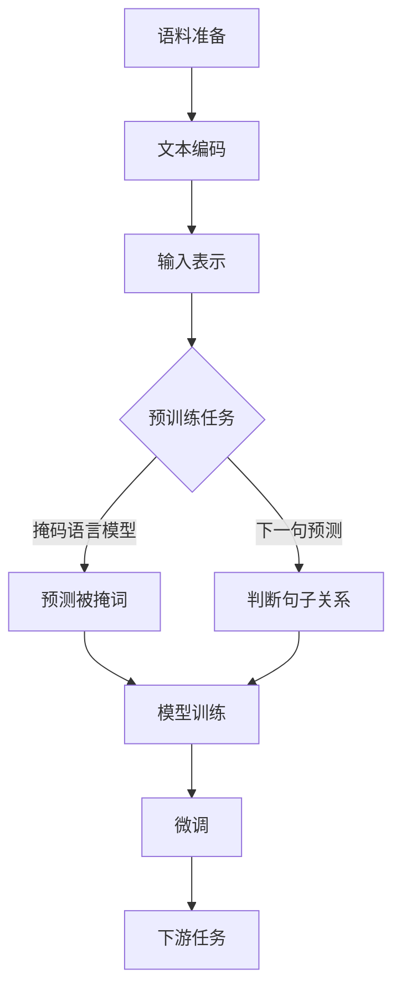

# 大规模语言模型从理论到实践 通用数据

关键词：大规模语言模型、预训练、微调、知识蒸馏、模型压缩、多任务学习、Zero-Shot Learning、Few-Shot Learning

## 1. 背景介绍

### 1.1 问题的由来

随着深度学习的快速发展,尤其是Transformer模型的出现,自然语言处理(NLP)领域取得了突破性的进展。以GPT、BERT等为代表的大规模预训练语言模型(Pretrained Language Models, PLMs)在多项NLP任务上取得了超越人类的性能,展现出了强大的语言理解和生成能力。这些模型通过在海量无标注语料上进行自监督预训练,可以学习到丰富的语言知识和通用语言表征,再通过在下游任务上进行微调,即可在特定任务上取得优异表现。

### 1.2 研究现状

目前,大规模语言模型的研究主要集中在以下几个方面:

(1)模型架构创新:如何设计更高效、更强大的语言模型架构,如Transformer-XL、XLNet、ELECTRA等;

(2)预训练目标和策略:探索新的预训练目标和策略,让模型学到更丰富、更通用的语言知识;

(3)知识增强:如何将外部知识融入语言模型,赋予其知识推理能力;

(4)模型压缩和优化:研究模型压缩、量化、剪枝等技术,在保持性能的同时降低模型体积和推理开销;

(5)低资源学习:探索如何在小样本、零样本场景下进行高效的语言学习。

### 1.3 研究意义

大规模语言模型的研究具有重要意义:

(1)推动NLP技术发展:语言模型是NLP的基础,其进步将带动整个NLP领域的发展;

(2)降低应用门槛:预训练模型可作为通用语言理解器,大大降低了NLP应用的开发门槛;

(3)拓展应用场景:强大的语言理解和生成能力使得语言模型可应用于问答、对话、写作等更广泛场景;

(4)探索通用人工智能:语言是人类智能的重要体现,语言模型研究有助于理解和模拟人类语言智能。

### 1.4 本文结构

本文将全面介绍大规模语言模型的理论基础和实践进展。第2部分介绍语言模型的核心概念;第3部分阐述语言模型的主流架构和算法;第4部分讲解语言模型相关的数学原理;第5部分通过代码实例演示语言模型的实现;第6部分展望语言模型的应用前景;第7部分推荐相关学习资源;第8部分总结全文并探讨未来研究方向。

## 2. 核心概念与联系

语言模型的目标是学习语言的概率分布,即给定上下文,预测下一个词出现的概率。形式化地,语言模型就是计算条件概率P(x|c),其中x为目标词,c为上下文。根据建模粒度,语言模型可分为 n-gram 语言模型、词级语言模型和字符级语言模型。

传统的 n-gram 语言模型基于马尔科夫假设,利用 n-1 阶历史信息预测下一个词,但面临数据稀疏和维度灾难问题。神经语言模型使用神经网络学习词语的分布式表示,克服了维度灾难,但仍受限于固定长度上下文。

Transformer 的提出使得语言模型可以建模任意长度的上下文信息。预训练语言模型通过自监督学习,在大规模无标注语料上训练 Transformer 网络,学习到通用语言表征。在此基础上,预训练模型可以通过微调的方式应用到下游任务,在小样本场景下也能取得不错的效果。这种"预训练-微调"范式极大地提升了 NLP 任务的性能,是当前 NLP 的主流技术路线。

除了微调,预训练语言模型还可以通过提示学习(Prompt Learning)的方式应用到下游任务。提示学习将下游任务转化为预训练模型已经学过的格式,通过设计提示模板引导模型进行预测。代表方法有 PET、GPT-3 等。提示学习可以实现零样本和少样本学习,是实现通用人工智能的一个有前景的方向。

为了进一步提升语言模型性能,研究者探索了多种优化技术:
- 知识蒸馏:通过teacher-student框架,将大模型的知识迁移到小模型,获得精度和效率的平衡。
- 模型压缩:通过网络剪枝、量化、矩阵分解等方法压缩模型体积,加速推理速度。
- 多任务学习:将多个任务放在一起联合训练,促进不同任务间的知识迁移。
- 对抗训练:引入对抗样本增强模型的鲁棒性,提高模型泛化能力。
- 知识融合:将知识库、规则等外部知识融入语言模型,增强语言理解的准确性。

## 3. 核心算法原理 & 具体操作步骤

### 3.1 算法原理概述

大规模语言模型的核心是 Transformer 架构和自监督预训练范式。

Transformer 抛弃了传统的 RNN/CNN 结构,完全依靠注意力机制(Attention)来建模文本。它采用编码器-解码器框架,编码器负责对输入序列进行特征提取,解码器根据编码器输出和之前的预测结果,生成目标序列。Transformer 的核心创新是自注意力机制(Self-Attention),通过计算序列中不同位置之间的相关性,获得当前位置对其他位置的注意力权重,再基于注意力权重对序列进行聚合,得到包含全局信息的新表示。

预训练过程通过设计自监督任务,让模型在大规模无标注语料上学习通用语言表征。主要的预训练任务有:

(1)语言模型:预测下一个词(从左到右)或上一个词(从右到左),代表模型有 GPT、XLNet 等;

(2)掩码语言模型:随机掩盖词语,预测被掩盖位置的词,代表模型有 BERT 等;

(3)自编码:将输入句子破坏,如打乱词序、删除词语,训练模型恢复原句,代表模型有 BART、T5 等;

(4)对比学习:让模型判断两个句子是否连贯,代表模型有 ELECTRA、ALBERT 等。

### 3.2 算法步骤详解

以 BERT 为例,详细说明预训练语言模型的实现步骤:

(1)语料准备:收集大规模无标注文本语料,进行清洗和预处理;

(2)文本编码:将词转为id,通过 WordPiece 方式处理未登录词;

(3)输入表示:将词id序列转为词向量,加上位置编码和片段编码;

(4)掩码语言模型:以一定概率随机掩盖部分词语,让模型预测被掩盖位置的词;

(5)下一句预测:对语料中的句子对,让模型判断第二个句子是否为第一个句子的下文;

(6)模型训练:将掩码语言模型和下一句预测作为训练目标,在大规模语料上训练双向Transformer编码器;

(7)微调与推理:用预训练模型初始化下游任务模型,在任务数据上进行微调,然后用于推理预测。

### 3.3 算法优缺点

预训练语言模型的优点包括:
- 通用性强,可应用于几乎所有NLP任务;
- 减少了对标注数据的依赖,在小样本场景下表现优异;
- 语言理解能力强,在多个任务上超越人类水平。

但它也存在一些局限:
- 模型参数量大,训练和推理开销高;
- 对硬件资源要求高,需要强大的GPU/TPU支持;
- 模型更新迭代快,落地应用存在滞后;
- 仍难以解决需要常识推理、数学计算等复杂语言任务。

### 3.4 算法应用领域

预训练语言模型可应用的任务包括但不限于:
- 文本分类:情感分析、新闻分类、意图识别等;
- 序列标注:命名实体识别、词性标注、语义角色标注等;
- 文本匹配:语义相似度计算、自然语言推理、问答匹配等;
- 文本生成:机器翻译、文本摘要、对话生成等;
- 信息抽取:关系抽取、事件抽取、观点抽取等。

此外,语言模型还可应用于语音识别、信息检索、知识图谱等多个交叉领域。随着模型不断发展,其应用范围还将进一步扩大。

## 4. 数学模型和公式 & 详细讲解 & 举例说明

### 4.1 数学模型构建

Transformer的数学模型可以用以下公式表示:

$$ \mathrm{Attention}(Q,K,V) = \mathrm{softmax}(\frac{QK^T}{\sqrt{d_k}})V $$

其中,$Q$,$K$,$V$分别为查询向量、键向量、值向量,$\sqrt{d_k}$为缩放因子。

Transformer编码器的计算过程为:

$$\begin{aligned}
\mathrm{MultiHead}(Q,K,V) &= \mathrm{Concat}(\mathrm{head_1,\dots,head_h})W^O \\
\mathrm{head_i} &= \mathrm{Attention}(QW_i^Q,KW_i^K,VW_i^V)
\end{aligned}$$

$$\mathrm{FFN}(x)=\max(0, xW_1 + b_1) W_2 + b_2$$

$$\begin{aligned}
\tilde{z}^l &= \mathrm{LayerNorm}(z^{l-1} + \mathrm{MultiHead}(z^{l-1})) \\
z^l &= \mathrm{LayerNorm}(\tilde{z}^l + \mathrm{FFN}(\tilde{z}^l)) 
\end{aligned}$$

其中,$W_i^Q$,$W_i^K$,$W_i^V$为注意力头的投影矩阵,$W^O$为多头注意力的输出投影矩阵,$W_1$,$W_2$,$b_1$,$b_2$为前馈网络的参数,$\mathrm{LayerNorm}$为层归一化。

### 4.2 公式推导过程

Transformer的注意力机制可以看作一种映射查询和一组键-值对到输出的过程,其中输出为值的加权求和,权重由查询与对应键的相似度函数计算得到。

具体推导如下:

(1) 将查询矩阵 $Q$、键矩阵 $K$、值矩阵 $V$ 分别乘以权重矩阵 $W^Q$, $W^K$, $W^V$,得到三个新矩阵:

$$Q_p = QW^Q, K_p = KW^K, V_p = VW^V$$

(2) 计算查询矩阵 $Q_p$ 和键矩阵 $K_p$ 的乘积,得到注意力得分矩阵 $A$:

$$A = Q_pK_p^T$$

(3) 对注意力得分矩阵 $A$ 按行做 softmax 归一化,得到注意力权重矩阵 $W$:

$$W = \mathrm{softmax}(\frac{A}{\sqrt{d_k}})$$

其中 $d_k$ 为缩放因子,通常取键向量的维度。

(4) 将注意力权重矩阵 $W$ 和值矩阵 $V_p$ 相乘,得到注意力输出矩阵 $Z$:

$$Z = WV_p$$

(5) 将多个注意力头的输出拼接,再乘以权重矩阵 $W^O$,得到多头注意力的最终输出:

$$\mathrm{MultiHead}(Q,K,V) = \mathrm