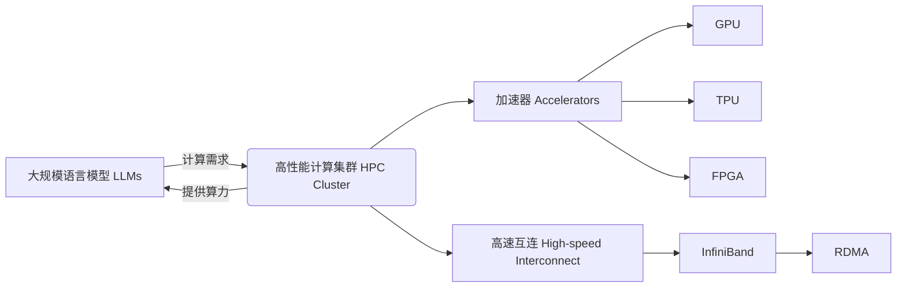

# 大规模语言模型从理论到实践 高性能计算集群的典型硬件组成

关键词：大规模语言模型、高性能计算集群、硬件组成、GPU、TPU、FPGA、InfiniBand、RDMA

## 1. 背景介绍
### 1.1  问题的由来
近年来,随着人工智能技术的飞速发展,大规模语言模型(Large Language Models,LLMs)在自然语言处理领域取得了突破性进展。LLMs 通过在海量文本数据上进行预训练,可以学习到丰富的语言知识和常识,从而在多种下游任务上取得优异表现,如问答、对话、文本生成等。然而,训练和部署 LLMs 对计算资源提出了极高要求,单台服务器难以满足,需要借助高性能计算集群来支撑。

### 1.2  研究现状
目前,业界主流的做法是利用由 GPU、TPU 等加速器组成的高性能计算集群来训练 LLMs。谷歌、OpenAI、DeepMind、微软等科技巨头都建立了强大的 AI 超算中心,拥有数以万计的 GPU/TPU。例如,谷歌 Switch Transformer 模型使用了 2048 个 TPU-v3 芯片训练[1],OpenAI GPT-3 模型则在 10000 个 GPU 上训练了数月之久[2]。高性能互连如 InfiniBand 可以大幅提升集群通信性能。但搭建如此规模的集群成本高昂,难度很大。

### 1.3  研究意义 
深入研究 LLMs 高性能计算集群的硬件组成,对于推动 LLMs 技术发展具有重要意义:

1. 有助于理解当前 LLMs 训练和推理对硬件的需求,为硬件系统设计提供指导。 
2. 探索各种加速器、互连技术在 LLMs 中的应用,推动相关产业发展。
3. 研究集群架构、拓扑和性能优化,可以提升资源利用率,降低训练成本。
4. 为更多研究者和从业者提供 LLMs 硬件平台搭建的参考,促进 LLMs 普及应用。

### 1.4  本文结构
本文将重点介绍 LLMs 高性能计算集群的典型硬件组成,内容安排如下:

- 第2节介绍 LLMs 相关的核心概念。 
- 第3节介绍 LLMs 训练和推理的核心算法原理与步骤。
- 第4节介绍 LLMs 涉及的数学模型与公式。
- 第5节给出 LLMs 项目实践的代码实例。
- 第6节分析 LLMs 的实际应用场景。 
- 第7节推荐 LLMs 学习和开发的工具与资源。
- 第8节总结全文,展望 LLMs 的未来发展趋势与挑战。
- 第9节附录,解答 LLMs 硬件常见问题。

## 2. 核心概念与联系

在讨论 LLMs 高性能计算集群硬件之前,我们先来了解几个核心概念:

- 大规模语言模型(Large Language Models,LLMs):是一类基于海量文本数据预训练的神经网络模型,规模通常在数十亿到上万亿参数量级。代表模型有 BERT、GPT-3、PaLM、OPT 等。
- 高性能计算集群(High-Performance Computing Cluster,HPC Cluster):由高性能计算节点通过高速互连网络连接而成的计算系统,可以协同完成大规模计算任务。
- 加速器(Accelerator):专用于加速机器学习等计算密集型任务的硬件设备,主要包括 GPU、TPU、FPGA、NPU、IPU 等。
- GPU(Graphics Processing Unit):原本用于图形渲染,由于其强大的并行计算能力,成为机器学习尤其是深度学习的主要加速器。
- TPU(Tensor Processing Unit):由谷歌开发的定制化 AI 芯片,针对机器学习进行了专门优化,可大幅提升矩阵乘等运算效率。
- FPGA(Field-Programmable Gate Array):现场可编程门阵列,可以根据需求灵活配置电路,实现定制化加速。 
- InfiniBand:一种高带宽、低延迟的集群互连技术,支持 RDMA,可以大幅提升集群通信性能。
- RDMA(Remote Direct Memory Access):远程直接内存访问技术,允许网络适配器直接读写远程节点内存,减少 CPU 负担。

LLMs 训练和推理涉及大量矩阵乘、卷积、注意力等计算密集型操作,需要强大的算力支持。而高性能计算集群恰好可以提供这种算力。通过部署大量 GPU、TPU 等加速器,并使用 InfiniBand 等高速互连,就能够满足 LLMs 的计算需求。因此,LLMs 与 HPC 集群是相辅相成的关系。

## 3. 核心算法原理 & 具体操作步骤
### 3.1  算法原理概述
LLMs 的核心是基于 Transformer[3] 架构的预训练语言模型。Transformer 使用自注意力机制来建模文本序列中词与词之间的依赖关系,捕捉长距离语义信息。预训练阶段通过自监督学习从海量无标注文本中学习通用语言知识,如 MLM、PLM、CLM 等范式。微调阶段在下游任务数据上进一步训练,完成特定任务。推理阶段则利用训练好的模型进行预测。

### 3.2  算法步骤详解
1. 预训练阶段:
   - 准备大规模无标注文本语料库
   - 对文本进行 tokenization,转换为数字 id 序列 
   - 构造预训练任务,如 MLM、PLM、CLM 等
   - 初始化 Transformer 模型参数
   - 将数据分批输入 Transformer,前向传播计算 loss
   - 反向传播计算梯度,更新模型参数
   - 重复多个 epoch 直到收敛
2. 微调阶段:
   - 准备下游任务标注数据
   - 在预训练模型基础上添加任务特定的输出层
   - 冻结或微调 Transformer 部分参数
   - 输入任务数据,计算 loss 并更新参数
   - early stopping 防止过拟合
3. 推理阶段:  
   - 加载微调后的模型权重
   - 输入待预测样本,前向传播计算输出
   - 对输出应用任务相关的后处理
   - 输出最终预测结果

### 3.3  算法优缺点
优点:
- 通过预训练学习通用语言知识,减少对标注数据的依赖
- 自注意力机制可以捕捉长距离依赖,建模能力强
- 模型规模大,可以学习更丰富的知识
- 在多种自然语言任务上取得 SOTA 效果

缺点:
- 模型参数量巨大,训练和推理成本高昂
- 需要海量高质量文本数据进行预训练
- 模型体积大,部署困难
- 训练不稳定,易出现偏见和毒性言论
- 可解释性差,容易产生幻觉

### 3.4  算法应用领域
LLMs 可以应用于以下领域:

- 智能问答:通过 LLMs 构建知识库问答系统
- 对话系统:通过 LLMs 实现多轮对话交互
- 文本生成:利用 LLMs 进行文章、诗歌、代码等内容生成
- 信息抽取:利用 LLMs 进行命名实体、关系、事件抽取
- 文本分类:利用 LLMs 进行情感分析、主题分类等
- 机器翻译:利用 LLMs 实现高质量的神经机器翻译
- 文本摘要:利用 LLMs 自动生成长文本摘要

## 4. 数学模型和公式 & 详细讲解 & 举例说明
### 4.1  数学模型构建
Transformer[3] 的核心是自注意力机制(Self-Attention)和前馈神经网络(Feed-Forward Network)。

假设输入序列为 $\mathbf{X} \in \mathbb{R}^{n \times d}$,其中 $n$ 为序列长度,$d$ 为特征维度。自注意力机制通过 query、key、value 三个矩阵计算注意力分布:

$$
\begin{aligned}
\mathbf{Q} &= \mathbf{X} \mathbf{W}^Q \\
\mathbf{K} &= \mathbf{X} \mathbf{W}^K \\ 
\mathbf{V} &= \mathbf{X} \mathbf{W}^V
\end{aligned}
$$

其中 $\mathbf{W}^Q, \mathbf{W}^K, \mathbf{W}^V \in \mathbb{R}^{d \times d_k}$ 为可学习的权重矩阵。

然后计算 query 和 key 的相似度,得到注意力分布:

$$
\mathbf{A} = \text{softmax}(\frac{\mathbf{Q}\mathbf{K}^T}{\sqrt{d_k}})
$$

最后将注意力分布与 value 相乘,得到输出表示:

$$
\text{Attention}(\mathbf{Q}, \mathbf{K}, \mathbf{V}) = \mathbf{A} \mathbf{V}
$$

前馈网络由两个全连接层组成,对自注意力的输出进行非线性变换:

$$
\text{FFN}(\mathbf{Z}) = \text{ReLU}(\mathbf{Z} \mathbf{W}_1 + \mathbf{b}_1) \mathbf{W}_2 + \mathbf{b}_2
$$

其中 $\mathbf{W}_1 \in \mathbb{R}^{d \times d_{ff}}, \mathbf{W}_2 \in \mathbb{R}^{d_{ff} \times d}$ 为权重矩阵,$\mathbf{b}_1 \in \mathbb{R}^{d_{ff}}, \mathbf{b}_2 \in \mathbb{R}^d$ 为偏置项。

Transformer 由多个编码器层和解码器层堆叠而成,每一层内部都包含自注意力和前馈网络。

### 4.2  公式推导过程
以上公式的推导过程如下:

1. 自注意力的 query、key、value 矩阵通过输入 $\mathbf{X}$ 与权重矩阵 $\mathbf{W}^Q, \mathbf{W}^K, \mathbf{W}^V$ 相乘得到。权重矩阵将输入从 $d$ 维映射到 $d_k$ 维。

2. 注意力分布 $\mathbf{A}$ 通过 query 矩阵 $\mathbf{Q}$ 与 key 矩阵 $\mathbf{K}$ 的转置相乘,再除以 $\sqrt{d_k}$ 得到。这里除以 $\sqrt{d_k}$ 是为了缓解点积结果过大的问题。然后对结果应用 softmax 函数,将其转化为概率分布。

3. 自注意力的输出通过注意力分布 $\mathbf{A}$ 与 value 矩阵 $\mathbf{V}$ 相乘得到。这相当于根据 query 和 key 的相似度对 value 进行加权求和。

4. 前馈网络的第一个全连接层将自注意力输出 $\mathbf{Z}$ 从 $d$ 维映射到 $d_{ff}$ 维,然后应用 ReLU 激活函数进行非线性变换。第二个全连接层将结果再映射回 $d$ 维。

### 4.3  案例分析与讲解
下面我们以一个简单的例子来说明 Transformer 的计算过程。

假设输入序列为 $\mathbf{X} = [x_1, x_2, x_3]^\top \in \mathbb{R}^{3 \times 4}$,其中 $x_1, x_2, x_3 \in \mathbb{R}^4$ 为序列中每个位置的 4 维特征向量。

初始化权重矩阵 $\mathbf{W}^Q, \mathbf{W}^K, \mathbf{W}^V \in \mathbb{R}^{4 \times 3}, \