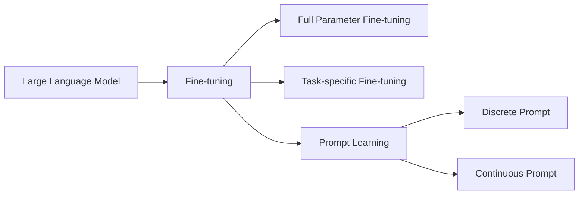

# 大语言模型原理与工程实践：全参数微调

## 1. 背景介绍

### 1.1 问题的由来
近年来，随着深度学习技术的飞速发展，大语言模型(Large Language Model, LLM)在自然语言处理(Natural Language Processing, NLP)领域取得了突破性进展。LLM通过在海量文本数据上进行预训练，能够学习到丰富的语言知识和通用语义表示，在机器翻译、问答系统、文本生成等任务上表现出色。然而，面对特定垂直领域的应用场景，如何有效地利用预训练的LLM进行微调(Fine-tuning)以提升下游任务性能，仍是一个亟待解决的问题。

### 1.2 研究现状
目前主流的LLM微调方法主要包括特定任务微调(Task-specific Fine-tuning)和提示学习(Prompt Learning)两大类。特定任务微调是在下游任务数据上对整个预训练模型进行端到端的微调，而提示学习则通过设计合适的提示模板(Prompt Template)，在少量标注数据的情况下对LLM进行快速适配。近期的研究表明，采用全参数微调(Full Parameter Fine-tuning)的方式，即在下游任务数据集上对LLM的所有参数进行微调，能够最大限度地发掘预训练语言知识，取得最优的任务性能表现。

### 1.3 研究意义
深入探究LLM全参数微调的原理和实践，对于推动LLM在垂直领域的落地应用具有重要意义。一方面，全参数微调能够充分利用预训练模型学习到的先验知识，降低模型训练对标注数据规模的依赖，提高模型泛化能力。另一方面，针对不同任务场景设计合理的微调策略和超参数优化方案，有助于进一步提升LLM在下游任务中的表现。因此，系统梳理全参数微调的理论基础和工程实践，对于拓展LLM的应用边界、赋能产业智能化发展具有重要价值。

### 1.4 本文结构
本文将围绕LLM全参数微调展开深入探讨，内容涵盖以下几个方面：

- 第2部分介绍LLM全参数微调涉及的核心概念，阐述其与其他微调范式之间的联系与区别。
- 第3部分重点剖析全参数微调算法的原理和具体操作步骤，评估算法的优缺点和应用领域。  
- 第4部分建立全参数微调的数学模型，推导相关公式，并结合案例进行详细讲解说明。
- 第5部分给出全参数微调的代码实例，搭建开发环境，解读源码实现，展示运行结果。
- 第6部分总结全参数微调在实际场景中的应用现状，展望其未来发展前景。
- 第7部分推荐学习全参数微调的工具和资源，包括学习资料、开发工具、相关论文等。
- 第8部分对全参数微调的研究进行总结，分析其未来趋势、面临的挑战和研究方向。
- 第9部分列举全参数微调的常见问题，给出详细解答，为读者释疑解惑。

## 2. 核心概念与联系

大语言模型全参数微调涉及的核心概念包括：

- 大语言模型(Large Language Model, LLM)：指基于海量文本语料进行预训练的大规模神经网络模型，如BERT、GPT、T5等。LLM通过自监督学习掌握了丰富的语言知识和通用语义表示能力。

- 微调(Fine-tuning)：指在预训练语言模型的基础上，使用下游任务的标注数据对模型进行进一步训练，使其适应特定任务。微调可分为特定任务微调和提示学习两类。

- 全参数微调(Full Parameter Fine-tuning)：指在下游任务数据上对预训练LLM的所有参数进行端到端微调，使模型充分吸收任务相关知识，获得最优性能。

- 特定任务微调(Task-specific Fine-tuning)：指针对特定下游任务，在任务数据集上对LLM进行微调，但仅调整模型的部分参数，如分类器等。

- 提示学习(Prompt Learning)：指在少量标注数据的情况下，通过构建提示模板引导LLM进行特定任务的推理和生成。提示学习可分为离散提示和连续提示两种。

下图展示了上述概念之间的关联：

可以看出，全参数微调是微调方法的一种，与特定任务微调和提示学习并列。三种微调范式的区别在于调整参数的范围和使用标注数据的方式不同，但都以预训练LLM为基础，旨在提升模型在下游任务上的表现。

## 3. 核心算法原理 & 具体操作步骤

### 3.1 算法原理概述
LLM全参数微调的核心思想是在下游任务数据集上对预训练模型的所有参数进行端到端的微调，使模型充分吸收任务相关知识，获得最优性能。具体而言，全参数微调通过以下步骤实现：

1. 加载预训练LLM的所有参数作为微调的初始化参数。
2. 在下游任务数据集上构建输入和监督信号。
3. 使用梯度下降等优化算法对模型所有参数进行微调，最小化任务损失函数。
4. 迭代进行多个epoch直至模型收敛，得到适应下游任务的微调模型。

### 3.2 算法步骤详解

**步骤1：加载预训练LLM参数**

首先需要加载预训练LLM的所有参数$\theta_{pretrain}$，包括Embedding层、Transformer编码器层等，作为全参数微调的初始化参数$\theta_{finetune}^{(0)}$：

$$\theta_{finetune}^{(0)} = \theta_{pretrain}$$

**步骤2：构建任务数据集**

针对给定的下游任务，构建微调数据集$\mathcal{D}_{finetune}=\{(x_i, y_i)\}_{i=1}^N$，其中$x_i$为输入文本，$y_i$为对应的监督信号，如分类标签、生成目标等。

**步骤3：模型微调优化**

使用梯度下降优化算法（如Adam），以任务损失函数$\mathcal{L}(\theta)$为优化目标，对模型参数$\theta$进行微调。在第$t$步迭代中，参数更新公式为：

$$g_t=\nabla_{\theta}\mathcal{L}(\theta)|_{\theta=\theta^{(t-1)}}$$

$$\theta^{(t)} = \theta^{(t-1)} - \eta \cdot g_t$$

其中$g_t$为损失函数对参数$\theta$的梯度，$\eta$为学习率。

**步骤4：迭代训练收敛**

重复步骤3，进行多个epoch的训练，直至模型在验证集上的性能指标趋于稳定。最终得到适应下游任务的微调模型参数$\theta_{finetune}^{*}$。

### 3.3 算法优缺点

全参数微调算法的优点包括：
- 充分利用预训练LLM学习到的语言知识，在下游任务数据集上进一步优化，可获得最优的任务性能。
- 端到端的微调方式简单直接，避免了特定任务微调中的人工特征工程。
- 通过增大下游任务数据集的规模，可进一步提升微调模型的性能上限。

全参数微调算法的缺点包括：
- 需要重新训练LLM的所有参数，计算和存储开销大，对算力要求高。
- 微调后的模型参数量大，部署时推理速度相对较慢。
- 容易出现过拟合问题，需要合理设置正则化策略和早停机制。

### 3.4 算法应用领域

LLM全参数微调算法可广泛应用于各类NLP任务，包括但不限于：
- 文本分类：如情感分析、新闻分类、意图识别等。
- 序列标注：如命名实体识别、词性标注、语义角色标注等。
- 文本生成：如机器翻译、摘要生成、对话生成等。
- 语言理解：如问答系统、自然语言推理、语义相似度计算等。

## 4. 数学模型和公式 & 详细讲解 & 举例说明

### 4.1 数学模型构建

我们以文本分类任务为例，建立LLM全参数微调的数学模型。假设微调数据集为$\mathcal{D}_{finetune}=\{(x_i, y_i)\}_{i=1}^N$，其中$x_i$为第$i$个输入文本，$y_i \in \{1,2,\dots,K\}$为对应的分类标签，$K$为类别总数。LLM微调后的参数为$\theta$，模型的输出概率分布为$p_{\theta}(y|x)$。

基于极大似然估计，微调的优化目标为最小化负对数似然损失：

$$\mathcal{L}(\theta)=-\frac{1}{N}\sum_{i=1}^N \log p_{\theta}(y_i|x_i)$$

其中$p_{\theta}(y_i|x_i)$表示模型在输入$x_i$下预测标签$y_i$的概率。

### 4.2 公式推导过程

对于第$i$个样本$(x_i,y_i)$，模型的输出概率分布$p_{\theta}(y|x_i)$通过Softmax归一化计算：

$$p_{\theta}(y=k|x_i)=\frac{\exp(z_k)}{\sum_{j=1}^K \exp(z_j)}$$

其中$z_k$为模型对第$k$类的输出Logits。将其代入损失函数，可得：

$$\mathcal{L}(\theta)=-\frac{1}{N}\sum_{i=1}^N \log \frac{\exp(z_{y_i})}{\sum_{j=1}^K \exp(z_j)}$$

$$=-\frac{1}{N}\sum_{i=1}^N \left[z_{y_i} - \log\sum_{j=1}^K \exp(z_j)\right]$$

使用梯度下降法对损失函数进行优化，参数更新公式为：

$$\theta^{(t)} = \theta^{(t-1)} - \eta \cdot \nabla_{\theta}\mathcal{L}(\theta)|_{\theta=\theta^{(t-1)}}$$

其中$\eta$为学习率，$\nabla_{\theta}\mathcal{L}(\theta)$为损失函数对参数$\theta$的梯度。

### 4.3 案例分析与讲解

我们以情感分类任务为例，说明LLM全参数微调的数学模型和优化过程。假设微调数据集包含1000个样本，每个样本由一段文本和对应的情感标签（正面/负面）组成。我们使用预训练的BERT模型作为基础模型进行微调。

首先，将输入文本通过BERT的Tokenizer进行编码，转换为模型可接受的输入格式。然后，在BERT模型的顶层添加一个全连接层，将输出Logits映射到情感类别的维度。

接着，使用交叉熵损失函数作为优化目标，对模型参数进行微调。在每个训练步骤中，计算当前参数下的损失函数值和梯度，并使用Adam优化器更新参数。

经过多个epoch的迭代训练，微调后的BERT模型在情感分类任务上可以达到较高的准确率，充分利用了预训练语言知识和下游任务监督信号。

### 4.4 常见问题解答

**Q1: 全参数微调需要多大的数据集才能取得良好效果？**

A1: 全参数微调对数据集规模的要求相对较高，一般需要至少几千到几万个标注样本才能充分发挥效果。当然，这也取决于任务的复杂度和预训练模型的质量。在数据集较小的情况下，可以考虑使用Few-shot Learning等技术。

**Q2: 微调过程中的Batch Size如何设置？**

A2: Batch Size的选择需要权衡计算效率和模型性能。较大的Batch Size有助于加速训练和提升模型泛化能力，但也会增加显存占用。一般来说，Batch Size可以根据显存大小进行调整，尽可能选择较大的值。当然，也要避