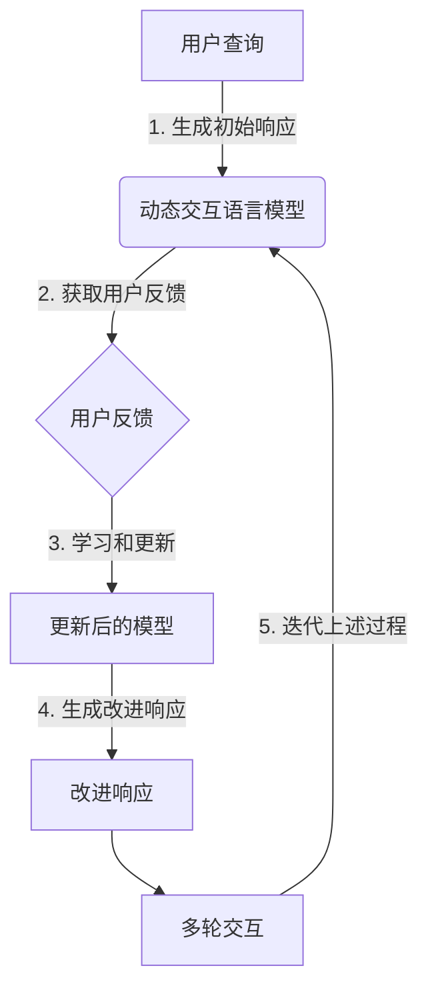

以下是根据您的要求撰写的技术博客文章正文部分：

# 大语言模型原理与工程实践：动态交互

## 1. 背景介绍

### 1.1 问题的由来

在过去的几年中,自然语言处理(NLP)领域取得了长足的进步,很大程度上归功于大型语言模型(Large Language Models, LLMs)的兴起。这些模型通过在大规模语料库上进行预训练,学习了丰富的语言知识和上下文理解能力,为各种自然语言任务提供了强大的基础。然而,传统的语言模型通常被视为静态的,它们在推理时无法与用户进行动态交互,也无法根据用户反馈进行自我修正和改进。

### 1.2 研究现状

为了解决这一问题,研究人员提出了动态交互语言模型(Dynamic Interactive Language Models, DILMs)的概念。这种模型不仅能够生成高质量的自然语言输出,而且还能够根据用户的反馈进行持续学习和改进。通过与用户进行多轮对话,DILM可以更好地理解用户的意图,并提供更加相关和个性化的响应。

目前,已有多个研究团队在探索DILMs的理论基础和实现方法。一些典型的工作包括:

- 斯坦福大学的研究人员提出了一种基于记忆增强的动态交互模型,能够在对话过程中积累和更新相关知识。
- OpenAI的研究人员则探索了一种基于反向传播的在线学习方法,使语言模型能够从用户反馈中持续学习和改进。
- 另一些研究则关注于如何在动态交互过程中保持模型的一致性和可控性,避免产生矛盾或不当的输出。

### 1.3 研究意义

动态交互语言模型具有广阔的应用前景。它们可以用于构建更加智能和人性化的对话系统,提升人机交互的质量和效率。此外,DILMs也可以应用于个性化推荐、知识库构建、教育辅助等多个领域,为用户提供更加贴近需求的服务。

从理论层面上,DILMs也为我们探索人类学习和认知过程提供了新的视角。通过研究模型如何从交互中获取知识并进行自我调整,我们可以更好地理解人类大脑的工作机制,为发展更加智能的人工智能系统提供借鉴。

### 1.4 本文结构

本文将全面介绍动态交互语言模型的原理和实践。我们将从核心概念出发,阐释DILMs与传统语言模型的区别和联系;接着深入探讨DILMs的核心算法原理,包括在线学习、知识积累和一致性保证等方面;然后介绍相关的数学模型和公式推导;分析DILMs在实际应用中的代码实现和案例;最后,我们将总结DILMs的发展趋势和面临的挑战,并提供相关的学习资源和工具推荐。

## 2. 核心概念与联系

动态交互语言模型(DILMs)是在传统语言模型的基础上发展而来的。传统语言模型通常被训练为一个静态的系统,它们在推理时无法根据用户反馈进行调整和改进。相比之下,DILMs则具有动态交互的能力,可以在与用户的对话过程中持续学习和更新自身的知识和策略。

DILMs的核心思想是将语言模型视为一个可以不断进化的系统,而不是一个固定的黑箱。在与用户交互的过程中,模型会根据用户的反馈(如纠正、补充或评价等)来调整自身的参数和知识库,从而提高未来的响应质量。

这种动态交互过程可以概括为以下几个关键步骤:

1. **生成初始响应**: 模型根据当前的知识和策略生成对用户查询的初始响应。
2. **获取用户反馈**: 用户对模型的响应进行评价或提供补充信息。
3. **学习和更新**: 模型根据用户的反馈,通过某种在线学习算法来调整自身的参数和知识库。
4. **生成改进响应**: 基于更新后的模型,生成对用户查询的改进响应。
5. **迭代上述过程**: 在多轮对话中不断重复上述步骤,使模型持续学习和改进。

这一过程与人类学习和交互的方式有些类似。我们在与他人交流的过程中,也会根据对方的反馈来调整自己的认知和表达方式,不断完善自身的知识和交流能力。

DILMs与传统语言模型相比,具有以下几个主要优势:

1. **个性化和贴近需求**: 通过持续学习用户的反馈,DILMs可以更好地理解和满足特定用户的需求和偏好。
2. **动态知识更新**: DILMs不再被限制在静态的知识库中,它们可以在交互过程中不断吸收新知识并更新旧有知识。
3. **持续改进和进化**: 随着与用户的交互次数增加,DILMs的性能将不断提高,避免了传统模型在固定语料库上训练后性能停滞的问题。
4. **更高的一致性和可控性**: 通过合理的在线学习算法,DILMs可以保持输出的一致性,避免出现矛盾或不当的响应。

然而,DILMs在实现过程中也面临一些挑战,例如如何高效地进行在线学习、如何处理矛盾反馈、如何保证模型的稳定性和可控性等。我们将在后续章节中详细探讨这些问题及其相应的解决方案。

## 3. 核心算法原理 & 具体操作步骤

### 3.1 算法原理概述

动态交互语言模型的核心算法原理可以概括为以下几个关键点:

1. **在线学习算法**: 用于根据用户反馈不断调整模型参数,实现持续学习和改进。
2. **知识库更新机制**: 用于根据用户反馈动态更新模型的知识库,吸收新知识并修正错误知识。
3. **一致性约束**: 用于在学习过程中保持模型输出的一致性和可控性,避免出现矛盾或不当的响应。
4. **交互策略**: 用于控制模型在与用户交互过程中的行为,如何获取反馈、何时进行学习等。

下面我们将详细介绍这些核心算法原理的具体实现步骤。

### 3.2 算法步骤详解

#### 3.2.1 在线学习算法

在线学习算法是DILMs的核心部分,它决定了模型如何根据用户反馈来调整自身的参数。常见的在线学习算法包括:

1. **基于梯度下降的在线学习**:
    - 步骤1: 根据当前模型参数生成初始响应
    - 步骤2: 获取用户对初始响应的反馈(如纠正、评分等)
    - 步骤3: 根据反馈计算损失函数(Loss Function)
    - 步骤4: 通过反向传播算法计算模型参数的梯度
    - 步骤5: 使用优化算法(如SGD、Adam等)更新模型参数
    - 步骤6: 重复上述步骤,持续学习

2. **基于记忆的在线学习**:
    - 步骤1: 维护一个记忆库,存储历史对话和模型响应
    - 步骤2: 根据当前查询和记忆库生成初始响应
    - 步骤3: 获取用户对初始响应的反馈
    - 步骤4: 根据反馈更新记忆库(如添加新条目、修正错误条目等)
    - 步骤5: 基于更新后的记忆库生成改进响应
    - 步骤6: 重复上述步骤,持续学习

这两种算法各有优缺点。基于梯度下降的算法更加通用,但需要大量计算资源;基于记忆的算法则更加高效,但受限于记忆库的容量和覆盖范围。在实际应用中,我们可以根据具体需求选择合适的算法,或者将两种算法相结合。

#### 3.2.2 知识库更新机制

除了调整模型参数之外,DILMs还需要一种机制来动态更新模型的知识库,吸收新知识并修正错误知识。常见的知识库更新机制包括:

1. **基于规则的知识库更新**:
    - 步骤1: 定义一组规则,用于识别用户反馈中的新知识或错误知识
    - 步骤2: 对用户反馈进行规则匹配
    - 步骤3: 根据匹配结果,在知识库中添加新条目或修正错误条目

2. **基于机器学习的知识库更新**:
    - 步骤1: 从历史对话数据中提取特征,标注新知识和错误知识
    - 步骤2: 训练一个二分类模型,用于识别新知识和错误知识
    - 步骤3: 对用户反馈进行分类,识别出新知识和错误知识
    - 步骤4: 在知识库中添加新条目或修正错误条目

这两种机制都有其优缺点。基于规则的方法更加直观和可解释,但需要人工定义规则,覆盖面有限;基于机器学习的方法则更加通用,但需要大量标注数据进行训练。在实践中,我们可以根据具体情况选择合适的方法,或将两种方法结合使用。

#### 3.2.3 一致性约束

在动态交互的过程中,如何保证模型输出的一致性和可控性是一个重要的挑战。常见的一致性约束方法包括:

1. **基于规则的一致性检查**:
    - 步骤1: 定义一组规则,描述模型输出应该满足的一致性约束
    - 步骤2: 在生成响应之前,对响应进行规则检查
    - 步骤3: 如果违反规则,则重新生成响应或进行修正

2. **基于对抗训练的一致性约束**:
    - 步骤1: 构建一个判别模型,用于评估响应的一致性
    - 步骤2: 在生成响应的同时,最小化判别模型的损失函数
    - 步骤3: 通过对抗训练,使生成模型产生更加一致的响应

3. **基于规划的一致性约束**:
    - 步骤1: 将一致性约束建模为规划问题的约束条件
    - 步骤2: 使用规划算法(如线性规划、整数规划等)求解满足约束的最优响应
    - 步骤3: 输出求解得到的最优响应

这些方法各有利弊。基于规则的方法直观但覆盖面有限,基于对抗训练的方法更加通用但计算代价高,基于规划的方法理论完备但求解效率较低。在实践中,我们可以根据具体需求选择合适的方法,或将多种方法相结合以获得更好的效果。

#### 3.2.4 交互策略

除了核心算法之外,DILMs还需要一种交互策略来控制与用户的交互过程。常见的交互策略包括:

1. **主动式交互策略**:
    - 步骤1: 模型主动询问用户是否需要进一步解释或补充
    - 步骤2: 根据用户反馈,决定是否进行学习和知识库更新
    - 步骤3: 生成改进响应,并重复上述过程

2. **被动式交互策略**:
    - 步骤1: 模型被动地等待用户反馈
    - 步骤2: 如果用户提供反馈,则进行学习和知识库更新
    - 步骤3: 生成改进响应,并重复上述过程

3. **混合式交互策略**:
    - 步骤1: 根据对话上下文和响应质量,决定采用主动式或被动式策略
    - 步骤2: 执行相应的交互策略
    - 步骤3: 根据需要进行学习和知识库更新,生成改进响应

不同的交互