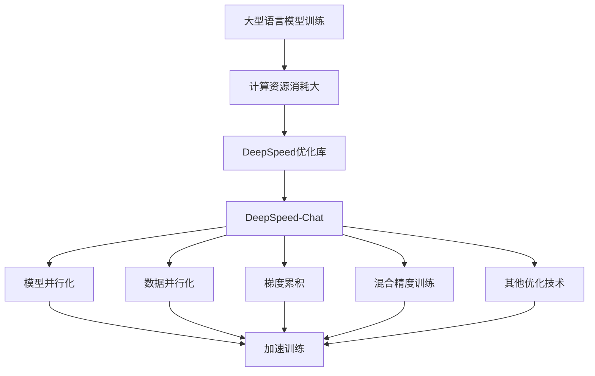
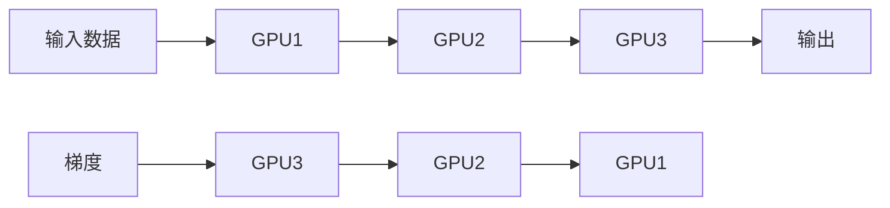
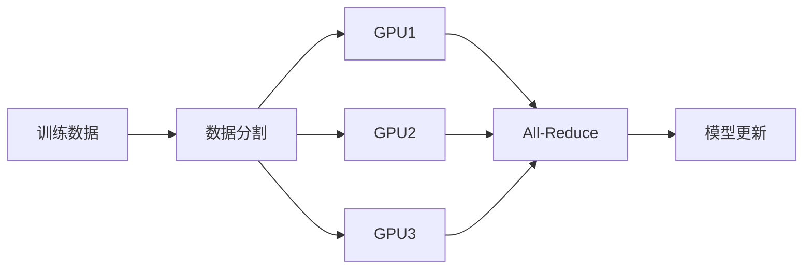
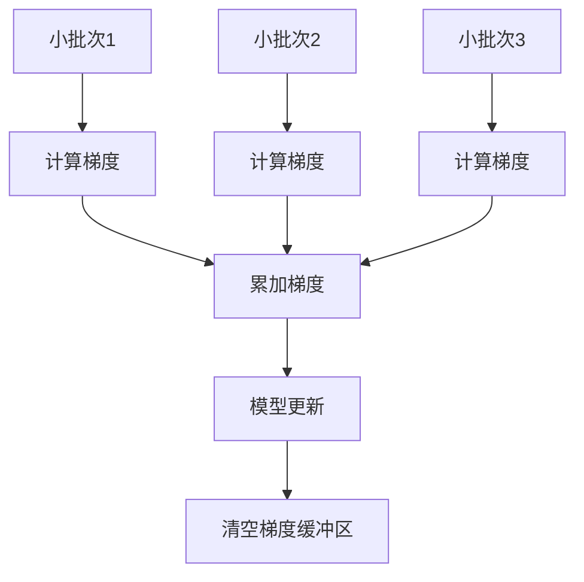
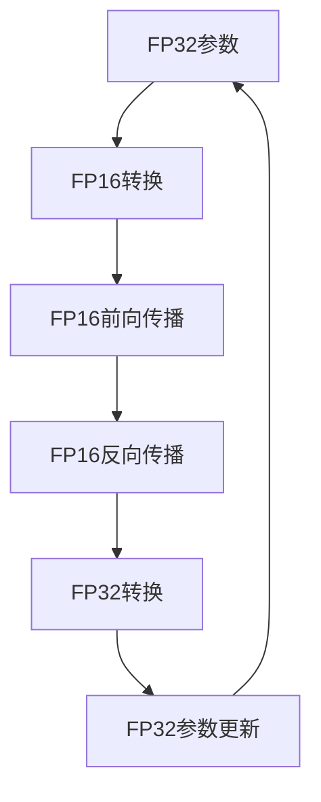
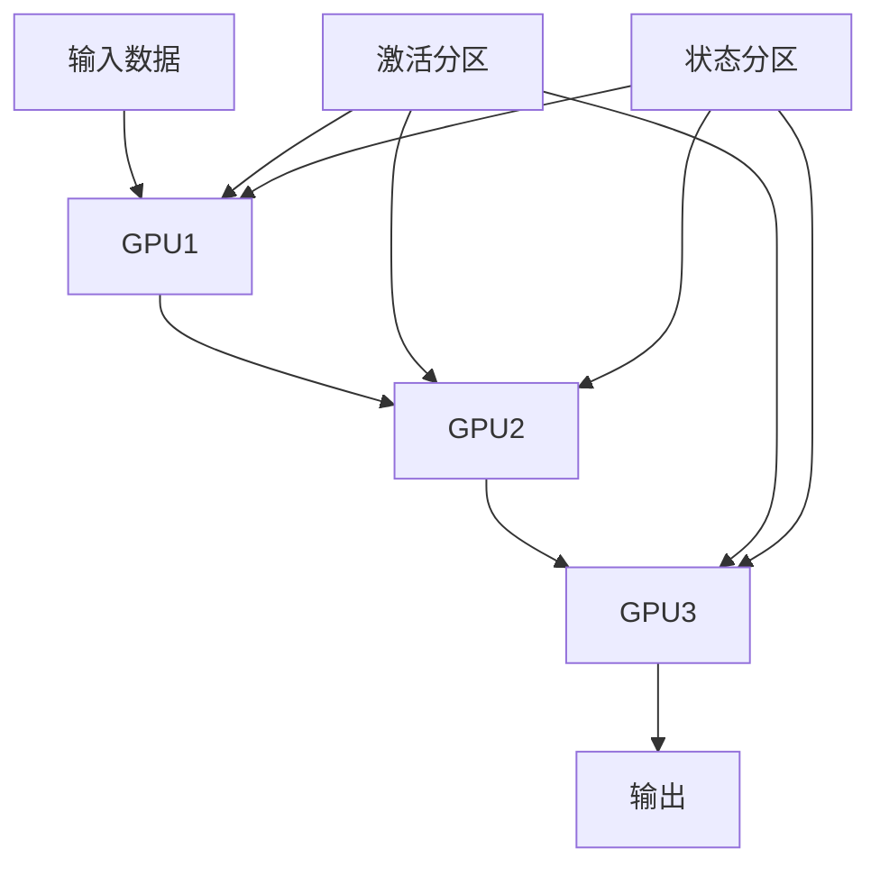
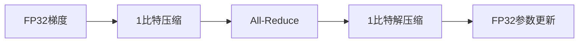

# 大语言模型原理与工程实践：强化学习工程实践 DeepSpeed-Chat 训练调优实践

## 1. 背景介绍

### 1.1 问题的由来

随着人工智能技术的不断发展,大型语言模型已经成为自然语言处理领域的核心驱动力。然而,训练这些庞大的模型需要消耗大量的计算资源,这对于大多数研究机构和公司来说是一个巨大的挑战。为了解决这个问题,微软推出了 DeepSpeed,这是一个用于训练大型模型的优化库。

DeepSpeed 旨在通过各种优化技术来加速训练过程,包括:模型并行化、数据并行化、梯度累积、混合精度训练等。其中,DeepSpeed-Chat 是一个基于强化学习的聊天机器人训练框架,它利用 DeepSpeed 的优化技术来高效地训练大型对话模型。

### 1.2 研究现状

目前,已有一些研究工作探索了 DeepSpeed-Chat 在训练大型对话模型方面的应用。例如,OpenAI 的 GPT-3 模型就采用了 DeepSpeed 进行训练优化。另外,一些学术机构也在使用 DeepSpeed-Chat 来训练开源的对话模型,如 DialoGPT 和 Meena。

然而,由于 DeepSpeed-Chat 涉及了多种优化技术的组合应用,因此对于如何有效地调优和配置这些技术还缺乏系统性的指导。许多研究人员和工程师在实践中仍然面临着诸多挑战,如:如何选择合适的优化策略?如何平衡不同优化技术之间的权衡?如何根据硬件资源和模型大小进行参数调整?等等。

### 1.3 研究意义

本文旨在深入探讨 DeepSpeed-Chat 在训练大型对话模型时的优化技术及其调优实践。通过全面分析 DeepSpeed-Chat 的核心原理、算法细节和数学模型,并结合实际案例和代码示例,我们将为读者提供一个系统性的指导,帮助他们更好地理解和应用这些优化技术。

此外,本文还将分享一些实用的工具和资源推荐,以及对未来发展趋势和挑战的展望,为读者提供更多的实践参考。

### 1.4 本文结构

本文的结构安排如下:

1. 背景介绍
2. 核心概念与联系
3. 核心算法原理与具体操作步骤
4. 数学模型和公式详细讲解与举例说明
5. 项目实践:代码实例和详细解释说明
6. 实际应用场景
7. 工具和资源推荐
8. 总结:未来发展趋势与挑战
9. 附录:常见问题与解答

## 2. 核心概念与联系

在深入探讨 DeepSpeed-Chat 的优化技术之前,我们先来了解一些核心概念及它们之间的联系。

如上图所示,训练大型语言模型需要消耗大量计算资源,这促使了 DeepSpeed 优化库的出现。DeepSpeed 集成了多种优化技术,如模型并行化、数据并行化、梯度累积、混合精度训练等,旨在加速训练过程。而 DeepSpeed-Chat 则是一个专门用于训练大型对话模型的框架,它利用了 DeepSpeed 的这些优化技术。

接下来,我们将逐一介绍这些核心优化技术的原理、算法细节和数学模型,并通过实例讲解它们的具体应用。

## 3. 核心算法原理与具体操作步骤

### 3.1 算法原理概述

DeepSpeed-Chat 包含了多种优化算法,它们的原理和操作步骤有所不同,但都是为了加速大型模型的训练过程。下面是一些主要算法的概述:

1. **模型并行化 (Model Parallelism)**: 将大型模型分割到多个GPU上,每个GPU只需要处理模型的一部分,从而减轻单个GPU的计算压力。

2. **数据并行化 (Data Parallelism)**: 将训练数据分割到多个GPU上,每个GPU处理不同的数据批次,然后汇总梯度进行模型更新。

3. **梯度累积 (Gradient Accumulation)**: 在多个小批次上累积梯度,然后一次性更新模型参数,从而减少通信开销。

4. **混合精度训练 (Mixed Precision Training)**: 利用半精度(FP16)或更低精度进行计算,降低内存占用和计算量,同时保持FP32精度的收敛性能。

5. **ZeRO冗余消除优化 (ZeRO Redundancy Optimizer)**: 通过优化状态和激活的分区策略,消除GPU内存中的冗余数据,支持更大的模型。

6. **1-bit Adam优化 (1-bit Adam Optimizer)**: 通过压缩梯度和权重到1比特,减少通信开销,加速分布式训练。

这些算法可以单独使用,也可以组合使用,形成更加复杂的优化策略。接下来,我们将详细介绍它们的具体操作步骤。

### 3.2 算法步骤详解

#### 3.2.1 模型并行化 (Model Parallelism)

模型并行化的核心思想是将大型模型分割到多个GPU上,每个GPU只需要处理模型的一部分。具体步骤如下:

1. 将模型分割成多个层或块,每个GPU负责处理其中一部分。
2. 在前向传播时,输入数据依次经过各个GPU处理对应的模型部分。
3. 在反向传播时,梯度从最后一个GPU开始逐层反向传播,每个GPU计算并更新自己负责的那部分模型参数。
4. 通过优化通信策略(如环形通信)来减少GPU之间的通信开销。

上图展示了一个3层模型在3个GPU上并行化的示意图。

#### 3.2.2 数据并行化 (Data Parallelism)

数据并行化的核心思想是将训练数据分割到多个GPU上,每个GPU处理不同的数据批次,然后汇总梯度进行模型更新。具体步骤如下:

1. 将训练数据划分成多个批次,分配给不同的GPU。
2. 每个GPU在本地计算前向传播和反向传播,得到本地梯度。
3. 使用All-Reduce操作将所有GPU的本地梯度汇总,得到全局梯度。
4. 每个GPU使用全局梯度更新自己的模型副本。
5. 在下一个训练迭代中,重复上述步骤。

上图展示了数据并行化的基本流程。

#### 3.2.3 梯度累积 (Gradient Accumulation)

梯度累积的核心思想是在多个小批次上累积梯度,然后一次性更新模型参数,从而减少通信开销。具体步骤如下:

1. 将训练数据划分成多个小批次。
2. 对于每个小批次,计算前向传播和反向传播,得到局部梯度。
3. 将局部梯度累加到一个全局梯度缓冲区中。
4. 当累积了指定数量的小批次后,使用累积的全局梯度一次性更新模型参数。
5. 清空全局梯度缓冲区,重复上述步骤进行下一轮累积。

上图展示了梯度累积的基本流程。

#### 3.2.4 混合精度训练 (Mixed Precision Training)

混合精度训练的核心思想是利用半精度(FP16)或更低精度进行计算,降低内存占用和计算量,同时保持FP32精度的收敛性能。具体步骤如下:

1. 将模型参数和梯度存储为FP32精度。
2. 在前向传播和反向传播时,将数据转换为FP16精度进行计算。
3. 使用Loss Scaling技术来避免下溢出问题。
4. 在模型更新时,将FP16梯度转换回FP32,并使用FP32精度进行参数更新。
5. 根据需要,可以使用更低精度(如BF16或FP8)进行部分计算。

上图展示了混合精度训练的基本流程。

#### 3.2.5 ZeRO冗余消除优化 (ZeRO Redundancy Optimizer)

ZeRO冗余消除优化的核心思想是通过优化状态和激活的分区策略,消除GPU内存中的冗余数据,支持更大的模型。具体步骤如下:

1. 将优化器状态(如momentums和velocities)分区到不同的GPU上。
2. 将模型激活(中间层输出)分区到不同的GPU上。
3. 在前向传播时,根据需要在GPU之间传输激活数据。
4. 在反向传播时,根据需要在GPU之间传输梯度和优化器状态。
5. 使用优化的通信策略(如集合通信)来减少GPU之间的通信开销。

上图展示了ZeRO优化中的激活和状态分区策略。

#### 3.2.6 1-bit Adam优化 (1-bit Adam Optimizer)

1-bit Adam优化的核心思想是通过压缩梯度和权重到1比特,减少通信开销,加速分布式训练。具体步骤如下:

1. 在每个GPU上,计算FP32精度的梯度和权重更新。
2. 将FP32梯度和权重压缩为1比特表示。
3. 使用All-Reduce操作在GPU之间传输压缩后的1比特数据。
4. 在每个GPU上,解压缩接收到的1比特数据,恢复FP32精度。
5. 使用解压缩后的FP32梯度和权重更新模型参数。

上图展示了1-bit Adam优化的基本流程。

### 3.3 算法优缺点

每种优化算法都有其优缺点,需要根据具体情况进行权衡选择。

- **模型并行化**:
  - 优点:支持训练超大型模型,突破单GPU内存限制。
  - 缺点:增加了GPU之间的通信开销,并行效率受到模型层数和通信策略的影响。

- **数据并行化**:
  - 优点:实现简单,并行效率较高。
  - 缺点:受限于单GPU内存,无法支持超大型模型。

- **梯度累积**:
  - 优点:减少通信开销,提高计算效率。
  - 缺点:需要更多内存来存储累积的梯度,对小批次训练不太适用。

- **混合精度训练**:
  - 优点:降低