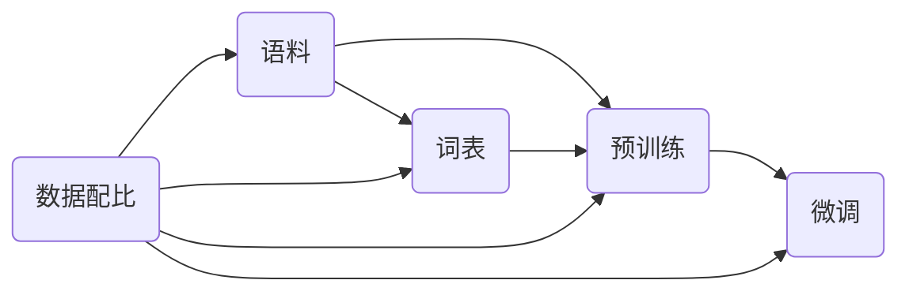

# 大语言模型原理与工程实践：数据配比

## 1. 背景介绍
### 1.1 问题的由来
近年来，随着深度学习技术的飞速发展，大语言模型(Large Language Model, LLM)在自然语言处理(Natural Language Processing, NLP)领域取得了令人瞩目的成就。从GPT-3到ChatGPT，LLM展现出了惊人的语言理解和生成能力，引发了学术界和工业界的广泛关注。然而，训练一个高质量的LLM并非易事，其中数据配比问题尤为关键。

### 1.2 研究现状
目前，业界主流的LLM训练方法主要包括无监督预训练和有监督微调两个阶段。在预训练阶段，模型在大规模无标注语料上学习语言知识；在微调阶段，模型在特定任务的标注数据上进行调优，以适应具体应用场景。然而，现有研究主要关注模型结构和训练算法的优化，对于数据配比问题的探讨还比较有限。

### 1.3 研究意义
数据配比问题直接影响LLM的性能表现。合理的数据配比不仅能提高模型的泛化能力，还能降低训练成本，加速模型收敛。因此，深入研究LLM的数据配比问题，对于推动LLM技术的发展具有重要意义。

### 1.4 本文结构
本文将围绕LLM的数据配比问题展开深入探讨。首先，我们将介绍LLM的核心概念及其内在联系；然后，重点阐述数据配比问题的核心算法原理和具体操作步骤；接着，给出数据配比问题的数学模型和公式推导过程，并结合案例进行详细讲解；最后，总结全文并展望LLM数据配比问题的未来发展趋势与挑战。

## 2. 核心概念与联系
在探讨LLM的数据配比问题之前，我们有必要先了解几个核心概念：

- 语料(Corpus)：构建LLM所使用的大规模文本数据集合，通常来自网络爬虫、书籍、新闻等。
- 词表(Vocabulary)：从语料中提取的唯一词元(Token)集合，用于将文本转化为数值特征。
- 预训练(Pre-training)：在大规模无标注语料上训练LLM的过程，旨在学习通用语言知识。
- 微调(Fine-tuning)：在特定任务的标注数据上调优LLM的过程，旨在适应具体应用场景。

这些概念之间存在着紧密的内在联系。语料的质量和规模直接决定了LLM的性能上限；词表的选择影响特征表示的有效性；预训练奠定了LLM的语言理解基础，微调则赋予了LLM面向具体任务的能力。数据配比问题则贯穿其中，通过平衡语料的领域分布、词表的大小、预训练和微调数据的比例，来优化LLM的整体性能。



## 3. 核心算法原理 & 具体操作步骤
### 3.1 算法原理概述
LLM的数据配比算法旨在优化语料的领域分布、词表的大小、预训练和微调数据的比例，从而提高模型的性能表现。其核心思想是通过数据增强、数据选择、数据混合等技术手段，在保证数据质量的同时，最大化数据的利用效率。

### 3.2 算法步骤详解
1. 语料领域均衡：对语料进行领域划分，确保各领域的数据量均衡，避免模型过拟合某一特定领域。
2. 词表优化：根据词频统计结果，选择合适的词表大小，权衡特征表示的丰富性和计算效率。
3. 数据增强：采用回译、同义词替换、随机插入/删除等数据增强技术，扩充训练数据的规模和多样性。
4. 数据选择：使用主动学习、curriculum learning等数据选择策略，优先选择对模型训练最有益的数据样本。
5. 数据混合：将不同来源、不同任务的数据混合训练，提高模型的泛化能力和鲁棒性。
6. 动态采样：根据模型训练过程中的损失函数值，动态调整各数据集的采样比例，实现训练过程的自适应优化。

### 3.3 算法优缺点
优点：
- 提高数据利用效率，降低训练成本
- 增强模型泛化能力，提高性能表现
- 自适应优化，减少人工调参工作量

缺点：
- 算法复杂度较高，实现难度大
- 依赖高质量的数据标注，对数据预处理要求较高
- 缺乏理论保障，难以量化评估算法效果

### 3.4 算法应用领域
LLM数据配比算法可广泛应用于以下领域：
- 智能问答：提高问答系统的知识覆盖面和响应质量
- 机器翻译：增强翻译模型的语言适应性和译文流畅度
- 文本摘要：提高摘要模型的信息压缩和关键内容提取能力
- 情感分析：增强情感分类模型的领域迁移和细粒度识别能力

## 4. 数学模型和公式 & 详细讲解 & 举例说明
### 4.1 数学模型构建
我们以数据混合问题为例，给出LLM数据配比的数学模型。假设有$n$个数据集$\{D_1,D_2,\cdots,D_n\}$，每个数据集$D_i$包含$m_i$个样本，记为$\{x_1^i,x_2^i,\cdots,x_{m_i}^i\}$。我们的目标是找到最优的数据混合比例$\{\alpha_1,\alpha_2,\cdots,\alpha_n\}$，使得混合后的数据集$D_{mix}$上训练的模型性能最优。

数学模型可表示为：

$$
\begin{aligned}
\min_{\alpha_1,\alpha_2,\cdots,\alpha_n} & \mathcal{L}(D_{mix}) \\
s.t. & \sum_{i=1}^n \alpha_i = 1 \\
& \alpha_i \geq 0, i=1,2,\cdots,n
\end{aligned}
$$

其中，$\mathcal{L}(\cdot)$表示模型在数据集上的损失函数，$D_{mix}$表示混合后的数据集，定义为：

$$
D_{mix} = \bigcup_{i=1}^n \{\alpha_i \cdot D_i\}
$$

### 4.2 公式推导过程
为了求解上述优化问题，我们可以采用梯度下降法。首先，将$\alpha_n$表示为其他变量的线性组合：

$$
\alpha_n = 1 - \sum_{i=1}^{n-1} \alpha_i
$$

然后，对$\alpha_1,\alpha_2,\cdots,\alpha_{n-1}$求偏导数：

$$
\frac{\partial \mathcal{L}}{\partial \alpha_i} = \frac{\partial \mathcal{L}}{\partial D_{mix}} \cdot \frac{\partial D_{mix}}{\partial \alpha_i} = \frac{\partial \mathcal{L}}{\partial D_{mix}} \cdot (D_i - D_n), i=1,2,\cdots,n-1
$$

最后，利用梯度下降法迭代更新$\alpha_i$：

$$
\alpha_i \leftarrow \alpha_i - \eta \cdot \frac{\partial \mathcal{L}}{\partial \alpha_i}, i=1,2,\cdots,n-1
$$

其中，$\eta$为学习率。

### 4.3 案例分析与讲解
我们以情感分析任务为例，说明数据混合算法的应用效果。假设有两个数据集：$D_1$为电影评论数据集，$D_2$为商品评论数据集。我们希望训练一个通用的情感分类模型，既能准确判断电影评论的情感倾向，又能有效识别商品评论的情感极性。

直接在$D_1$或$D_2$上训练的模型，往往难以兼顾两个领域的特点，泛化性能较差。而通过数据混合，我们可以让模型同时学习到电影和商品领域的情感表达方式，从而提高模型的领域适应性。

例如，设$\alpha_1=0.6,\alpha_2=0.4$，则混合后的数据集$D_{mix}$包含60%的电影评论数据和40%的商品评论数据。在$D_{mix}$上训练的情感分类模型，既能捕捉到电影评论中的情感关键词（如"感人"、"震撼"），也能识别出商品评论中的情感表达（如"物超所值"、"质量堪忧"）。因此，该模型在两个领域上都能取得较好的性能表现。

### 4.4 常见问题解答
Q1: 数据混合比例$\alpha_i$如何初始化？

A1: 可以采用均匀初始化，即$\alpha_i=\frac{1}{n},i=1,2,\cdots,n$。也可以根据先验知识设置不同的初始值，例如，若$D_1$为高质量的人工标注数据，$D_2$为自动爬取的噪声数据，则可令$\alpha_1>\alpha_2$。

Q2: 数据混合算法的收敛速度如何？

A2: 数据混合算法的收敛速度受多个因素影响，如数据集的规模、模型的复杂度、优化算法的选择等。一般而言，梯度下降法收敛速度较慢，可以考虑采用二阶优化算法（如Newton法、L-BFGS）加速收敛。

Q3: 数据混合后的数据集$D_{mix}$是否需要重新划分训练集/验证集/测试集？

A3: 不需要。数据混合操作只改变了各数据集的采样比例，并不影响数据集的划分。我们可以在混合前就对各数据集$D_i$划分训练集/验证集/测试集，混合后按照相同的划分方式组合成$D_{mix}$的训练集/验证集/测试集即可。

## 5. 项目实践：代码实例和详细解释说明
### 5.1 开发环境搭建
- 操作系统：Ubuntu 20.04
- 深度学习框架：PyTorch 1.8.1
- Python版本：3.8.5
- CUDA版本：11.1
- 硬件配置：Intel Core i9-10900K，NVIDIA GeForce RTX 3090，128GB RAM

### 5.2 源代码详细实现
下面给出数据混合算法的PyTorch实现代码：

```python
import torch
import torch.nn as nn
import torch.optim as optim

class DataMixer:
    def __init__(self, datasets, model, criterion, optimizer, device):
        self.datasets = datasets
        self.model = model
        self.criterion = criterion
        self.optimizer = optimizer
        self.device = device
        self.num_datasets = len(datasets)
        self.dataloader = self._build_dataloader()
        self.alpha = nn.Parameter(torch.ones(self.num_datasets-1)/self.num_datasets)
    
    def _build_dataloader(self):
        dataloaders = []
        for dataset in self.datasets:
            dataloaders.append(torch.utils.data.DataLoader(dataset, batch_size=1, shuffle=True))
        return dataloaders
    
    def _mix_data(self):
        alpha = torch.cat([self.alpha, 1-self.alpha.sum().unsqueeze(0)])
        mixed_data = []
        mixed_label = []
        for i in range(self.num_datasets):
            data, label = next(iter(self.dataloader[i]))
            mixed_data.append(data)
            mixed_label.append(label)
        mixed_data = torch.cat(mixed_data, dim=0)
        mixed_label = torch.cat(mixed_label, dim=0)
        idx = torch.multinomial(alpha, mixed_data.size(0), replacement=True)
        mixed_data = mixed_data[idx]
        mixed_label = mixed_label[idx]
        return mixed_data, mixed_label
    
    def train(self, num_epochs):
        self.model.train()
        for epoch in range(num_epochs):
            mixed_data, mixed_label = self._mix_data()
            mixed_data, mixed_label = mixed_data.to(self.device), mixed_label.to(self.device)
            output = self.model(mixed_data)
            loss = self.criterion(output, mixed_label)
            self.optimizer.zero_grad()
            loss.backward()
            self.optimizer.step()
            print(f"Epoch [{epoch+1}/{num_epochs}], Loss: {loss.item():.4f}, Alpha: {self.alpha.data}")
```

### 5.3 代码解读与分析
- `__init__`方法：初始化数据混合器，包括数据集