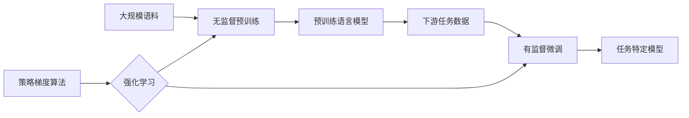

# 大语言模型原理与工程实践：策略梯度方法

## 1. 背景介绍
### 1.1 问题的由来
随着人工智能技术的飞速发展,大语言模型(Large Language Model, LLM)已经成为自然语言处理(Natural Language Processing, NLP)领域的研究热点。LLM 通过在海量文本语料上进行无监督预训练,能够学习到语言的底层规律和高层语义,在机器翻译、对话系统、文本生成等任务上取得了突破性进展。然而,现有的 LLM 在训练和推理过程中仍然面临诸多挑战,如训练效率低下、生成质量不稳定等问题亟待解决。

### 1.2 研究现状
近年来,学术界和工业界都在 LLM 领域投入了大量研究。GPT 系列模型[1]、BERT[2]等工作奠定了 Transformer 在 NLP 中的统治地位。GPT-3[3] 进一步将模型参数量扩大到 1750 亿,展现出了 LLM 的强大能力。为了提高训练效率,DeepSpeed[4]、Megatron-LM[5] 等分布式训练框架应运而生。同时,CTRL[6]、Prefix-Tuning[7] 等参数高效微调方法也受到广泛关注。另一方面,为了提升 LLM 生成文本的可控性,Plug and Play Language Model[8]、GeDi[9] 等引入额外的控制信号对语言模型进行调控。尽管如此,如何在保证生成质量的同时提高训练推理效率,仍是一个亟待突破的难题。

### 1.3 研究意义 
LLM 蕴含着巨大的应用潜力,高效且可控的 LLM 训练推理技术将极大促进 NLP 乃至整个 AI 领域的发展。首先,LLM 能够显著提升各类 NLP 任务的性能,如机器翻译、智能问答、文本分类等,有望在工业界得到大规模应用。其次,通过引入先验知识和因果推理等,LLM 有望突破当前 AI 系统的认知瓶颈,真正理解并解决复杂现实世界问题。此外,可解释、可控的 LLM 将极大促进人机协同,增强 AI 系统的可信性。总之,LLM 的研究意义重大而深远。

### 1.4 本文结构
本文将重点介绍一种基于强化学习的 LLM 训练方法——策略梯度。第 2 节介绍 LLM 的核心概念;第 3 节详细阐述策略梯度算法原理;第 4 节给出策略梯度的数学模型;第 5 节展示策略梯度在 LLM 训练中的代码实现;第 6 节分析策略梯度的应用场景;第 7 节推荐相关学习资源;第 8 节总结全文并展望未来研究方向。

## 2. 核心概念与联系

在介绍策略梯度算法之前,我们先来了解几个核心概念:

- 语言模型(Language Model):用于计算一段文本出现概率的概率模型,可形式化为根据上文预测下一个词的条件概率 $P(x_t|x_{<t})$。
- 大语言模型(Large Language Model):基于海量文本语料训练的大规模语言模型,通常包含数亿到上千亿参数,具有强大的语言理解和生成能力。代表模型有 GPT-3、PaLM、BLOOM 等。  
- 无监督预训练(Unsupervised Pre-training):在大规模无标注语料上进行自监督学习,让模型学习到语言的统计规律和语义特征。常见方法有自回归语言建模(如 GPT)和掩码语言建模(如 BERT)。
- 有监督微调(Supervised Fine-tuning):在下游任务的标注数据上对预训练模型进行微调,使其适应特定任务。常见任务有文本分类、序列标注、问答等。
- 强化学习(Reinforcement Learning):一种机器学习范式,通过智能体(Agent)与环境交互,根据环境反馈的奖励(Reward)不断优化策略(Policy),最终学会完成特定任务。
- 策略梯度(Policy Gradient):一类基于梯度的强化学习算法,通过随机策略采样,根据累积奖励估计梯度,并用梯度上升更新策略参数,从而找到最优策略。

这些概念间有着紧密联系。如下图所示,LLM 通过在大规模语料上进行无监督预训练,学习到通用语言知识;然后经过特定任务的有监督微调,得到适应下游任务的模型。策略梯度作为一种强化学习算法,可用于优化 LLM 的预训练和微调过程,提高训练效率和模型性能。

## 3. 核心算法原理 & 具体操作步骤

### 3.1 算法原理概述

策略梯度是一类常用的强化学习算法,其核心思想是:通过参数化的策略函数(如神经网络)对智能体的策略进行建模,在与环境交互的过程中,根据采样轨迹上的累积奖励估计策略梯度,并利用随机梯度上升等优化算法对策略参数进行更新,最终学习到最优策略。形式化地,假设策略函数为 $\pi_\theta(a|s)$,即在状态 $s$ 下选择动作 $a$ 的概率。我们的目标是最大化期望累积奖励(Expected Cumulative Reward):

$$J(\theta) = \mathbb{E}_{\tau \sim \pi_\theta}[\sum_{t=0}^T \gamma^t r_t] \tag{1}$$

其中 $\tau$ 表示一条完整的状态-动作轨迹 $(s_0,a_0,s_1,a_1,...,s_T)$,$\gamma$ 为折扣因子。根据策略梯度定理[10],我们可以得到目标函数 $J(\theta)$ 对策略参数 $\theta$ 的梯度:

$$\nabla_\theta J(\theta) = \mathbb{E}_{\tau \sim \pi_\theta}[\sum_{t=0}^T \nabla_\theta \log \pi_\theta(a_t|s_t) \hat{Q}^\pi(s_t,a_t)] \tag{2}$$

其中 $\hat{Q}^\pi(s_t,a_t)$ 为状态-动作值函数在策略 $\pi$ 下的无偏估计,可用蒙特卡洛方法估计:

$$\hat{Q}^\pi(s_t,a_t) = \sum_{t'=t}^T \gamma^{t'-t} r_{t'} \tag{3}$$

直观理解,公式(2)表明参数更新方向由两部分决定:动作 $a_t$ 在 $s_t$ 下的对数似然 $\log \pi_\theta(a_t|s_t)$ 和动作 $a_t$ 的累积回报 $\hat{Q}^\pi(s_t,a_t)$。前者使得参数朝着增大 $a_t$ 概率的方向更新,后者起到放大或缩小梯度的作用:当 $a_t$ 的回报较高时,其梯度被放大;反之则被缩小,从而引导策略朝着累积回报更高的方向优化。

### 3.2 算法步骤详解

基于上述原理,策略梯度算法的具体步骤如下:

1. 随机初始化策略网络参数 $\theta$
2. 重复以下步骤,直到满足终止条件(如达到预设迭代次数):
   - 与环境交互,收集一批轨迹数据 $\{\tau_i\}_{i=1}^N$,其中 $\tau_i=(s_0^i,a_0^i,r_0^i,s_1^i,a_1^i,r_1^i,...,s_T^i)$
   - 对每个时间步 $t$,计算优势函数 $\hat{A}_t^i=\sum_{t'=t}^T \gamma^{t'-t} r_{t'}^i$
   - 计算策略梯度的蒙特卡洛估计:$\hat{g} = \frac{1}{NT}\sum_{i=1}^N\sum_{t=0}^T \nabla_\theta \log \pi_\theta(a_t^i|s_t^i) \hat{A}_t^i$
   - 用梯度上升更新策略参数:$\theta \leftarrow \theta + \alpha \hat{g}$,其中 $\alpha$ 为学习率
3. 返回优化后的策略网络参数 $\theta^*$

值得注意的是,由于梯度估计方差较大,实践中往往加入一些技巧来减小方差,如引入基准线(Baseline)、使用因果推断、信任域优化等。此外,为了兼顾探索和利用,一般采用随机策略(如高斯策略、softmax 策略)而非确定性策略。

### 3.3 算法优缺点

策略梯度算法的主要优点包括:
- 直接优化策略函数,避免了值函数估计的偏差
- 适用于高维、连续动作空间
- 易于引入先验知识,如因果关系、专家经验等
- 可端到端训练,无需人工设计特征

同时,策略梯度也存在一些缺点:
- 样本效率较低,需要大量的环境交互
- 方差较大,训练不稳定,对超参数敏感  
- 可能收敛到局部最优,难以探索全局最优策略
- 不适合部分可观测环境,需要借助状态估计

### 3.4 算法应用领域

策略梯度算法在强化学习领域应用广泛,一些典型应用包括:
- 游戏 AI:如 AlphaGo[11]、Dota 2 AI[12] 等
- 机器人控制:如四足机器人[13]、机械臂操控[14] 等  
- 自动驾驶:端到端驾驶策略学习[15]
- 推荐系统:基于强化学习的排序策略[16]
- 计算机视觉:视觉问答[17]、图像字幕[18]等
- 自然语言处理:对话生成[19]、机器翻译[20]、文本摘要[21] 等

近年来,策略梯度在 NLP 领域受到越来越多关注。一方面,可将 NLP 任务建模为序列决策问题,每生成一个词视为一次动作,从而将策略梯度应用于文本生成[22]。另一方面,策略梯度可用于优化传统的有监督训练,如用 REINFORCE 算法[23]替代交叉熵损失[24],或用奖励模型引导梯度[25],提高训练效率和效果。

## 4. 数学模型和公式 & 详细讲解 & 举例说明

本节我们详细讲解策略梯度算法所基于的数学模型和公式,并给出具体的案例分析。

### 4.1 数学模型构建

考虑一个马尔可夫决策过程(Markov Decision Process, MDP),其由一个六元组 $(\mathcal{S},\mathcal{A},\mathcal{P},r,\rho_0,\gamma)$ 定义:

- $\mathcal{S}$ 是状态空间,即所有可能的状态集合
- $\mathcal{A}$ 是动作空间,即在某状态下可采取的所有动作集合
- $\mathcal{P}:\mathcal{S} \times \mathcal{A} \times \mathcal{S} \to \mathbb{R}$ 是状态转移概率,$\mathcal{P}(s'|s,a)$ 表示在状态 $s$ 下采取动作 $a$ 后转移到状态 $s'$ 的概率
- $r:\mathcal{S} \times \mathcal{A} \to \mathbb{R}$ 是奖励函数,$r(s,a)$ 表示在状态 $s$ 下采取动作 $a$ 获得的即时奖励
- $\rho_0:\mathcal{S} \to \mathbb{R}$ 是初始状态分布
- $\gamma \in [0,1]$ 是折扣因子,用于平衡即时奖励和长期奖励

在此基础上,我们定义策略函数 $\pi_\theta:\mathcal{S} \times \mathcal{A} \to \mathbb{R}$,表示在状态 $s$ 下选择动作 $a$ 的概率,其中 $\theta$ 为策略参数。给定一