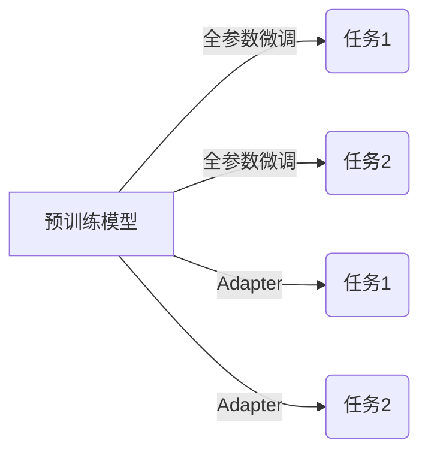

# 大语言模型原理与工程实践：适配器微调

关键词：大语言模型、预训练、微调、适配器、参数高效、知识迁移

## 1. 背景介绍
### 1.1 问题的由来
大语言模型（Large Language Model, LLM）如GPT-3、BERT等，通过在海量文本数据上进行预训练，可以学习到丰富的语言知识和通用表示，在自然语言处理（NLP）领域取得了巨大成功。然而，将预训练好的大模型应用到下游任务时，往往需要在特定任务数据上进行微调（fine-tuning），这不仅需要大量计算资源，而且容易出现灾难性遗忘（catastrophic forgetting）问题，即模型在适应新任务的同时，忘记了原有的知识。

### 1.2 研究现状
为了解决上述问题，研究者们提出了各种参数高效的微调方法，如Adapter、Prefix-tuning、LoRA等。其中，Adapter因其简单有效而备受关注。Adapter通过在预训练模型中插入少量可训练参数，在冻结原模型参数的情况下，只更新这些插入的参数，从而大大减少了微调所需的计算开销，同时避免了灾难性遗忘问题。目前，Adapter已经在各种NLP任务上取得了与全量微调相媲美的性能。

### 1.3 研究意义 
Adapter为大语言模型的工程应用提供了一种参数高效、灵活可扩展的解决方案。通过Adapter，我们可以将同一个预训练模型应用到多个不同的下游任务，而无需为每个任务单独微调和存储整个模型，这极大地节省了计算和存储资源。此外，Adapter还支持渐进学习、知识融合等高级功能，为构建通用人工智能（AGI）系统奠定了基础。因此，深入研究Adapter的原理和实践，对于自然语言理解、知识表示、终身学习等前沿课题具有重要意义。

### 1.4 本文结构
本文将全面介绍大语言模型适配器微调的原理与实践。第2节阐述相关概念；第3节详解算法原理和步骤；第4节建立数学模型并给出公式推导；第5节通过代码实例演示Adapter的实现；第6节展望其应用场景；第7节推荐相关工具和资源；第8节总结全文并探讨未来挑战；第9节附录常见问题解答。

## 2. 核心概念与联系
- 大语言模型：以Transformer为基础，在大规模无标注文本数据上预训练得到的语言模型，如GPT、BERT、RoBERTa等。
- 预训练：利用自监督学习，在大规模无标注数据上训练模型，学习通用语言知识和表示。常见的预训练任务包括语言模型、掩码语言模型等。  
- 微调：将预训练模型应用到下游任务时，在任务特定数据上重新训练部分或全部模型参数，使其适应新任务。传统的微调方法需要调整所有参数，计算开销大。
- Adapter：在预训练模型的每个Transformer块中插入少量可训练参数（即Adapter），在冻结原模型参数的情况下，只更新这些Adapter参数，实现参数高效的微调。
- 参数高效：只训练少量新引入的参数，固定预训练模型的绝大部分参数，从而大幅减少微调所需的计算资源和存储空间。
- 知识迁移：将预训练模型学到的通用语言知识迁移到下游任务，提高样本效率和泛化能力。Adapter可以很好地继承预训练模型的知识，同时适应新任务。

下图展示了预训练、微调、Adapter三者之间的关系：

## 3. 核心算法原理 & 具体操作步骤
### 3.1 算法原理概述
传统的微调方法是在预训练模型的基础上，利用下游任务的监督数据，通过反向传播更新所有模型参数，使其适应新任务。这种方法虽然简单直接，但存在以下问题：

1. 计算和存储开销大。每个任务都需要微调和保存一个完整的模型，当任务数量增多时，资源消耗巨大。
2. 灾难性遗忘。当同一个模型被多次微调时，后面的任务会破坏之前学到的知识，导致性能下降。
3. 负迁移问题。如果下游任务与预训练数据差异较大，微调可能无法有效继承预训练模型的知识。

Adapter通过引入少量额外的可训练参数，在冻结原模型参数的情况下进行微调，巧妙地解决了上述问题。具体来说，Adapter在Transformer的每个前馈网络（FFN）层和注意力层后面插入一个瓶颈结构，包含两个线性层和一个非线性激活函数，形式如下：

$$
\begin{aligned}
\mathbf{h} &= \text{Activation}(\mathbf{W}_{\text{down}}\mathbf{x}) \\
\mathbf{y} &= \mathbf{W}_{\text{up}}\mathbf{h} + \mathbf{x}
\end{aligned}
$$

其中，$\mathbf{x}$是输入，$\mathbf{W}_{\text{down}}$和$\mathbf{W}_{\text{up}}$是可训练的参数矩阵，$\text{Activation}$通常选择ReLU函数。在微调阶段，只更新Adapter的参数，而预训练模型的参数保持不变。由于Adapter的参数量远小于完整模型（通常只有2%-5%），因此大大减少了计算和存储开销。同时，不同任务的Adapter相互独立，互不干扰，从而避免了灾难性遗忘问题。

### 3.2 算法步骤详解
Adapter的训练分为两个阶段：预训练阶段和微调阶段。

**预训练阶段**：

1. 选择一个预训练的语言模型，如BERT、RoBERTa等。
2. 在每个Transformer块的FFN层和注意力层后面插入Adapter结构。
3. 冻结预训练模型的所有参数，只初始化Adapter的参数。
4. 在大规模无标注语料上，以自监督方式训练Adapter，如掩码语言模型任务。这一步可以帮助Adapter适应预训练模型的特征空间。

**微调阶段**：

1. 将预训练阶段得到的Adapter插入到预训练模型中。
2. 根据下游任务的类型，在预训练模型的顶层添加任务特定的输出层，如分类层、生成层等。
3. 冻结预训练模型和Adapter的所有参数，只更新任务特定的输出层参数。
4. 用下游任务的标注数据对模型进行微调，通过反向传播更新输出层参数。
5. 如果有多个下游任务，重复步骤2-4，为每个任务单独微调一组输出层参数。

在推理阶段，只需将相应任务的输出层和Adapter组合起来，就可以得到针对该任务的完整模型。

### 3.3 算法优缺点
**优点**：
1. 参数高效。Adapter只引入少量可训练参数，大大减少了微调的计算和存储开销。
2. 避免灾难性遗忘。不同任务的Adapter相互独立，互不干扰，可以同时应用于多个任务。
3. 提高迁移学习效果。Adapter在预训练阶段与语言模型协同优化，能够更好地继承和利用预训练知识。
4. 灵活可扩展。Adapter支持增量学习、多任务学习、知识蒸馏等高级功能，可以构建更加强大的NLP系统。

**缺点**：
1. 超参数敏感。Adapter的性能对超参数（如瓶颈维度、激活函数等）比较敏感，需要仔细调优。
2. 适用范围有限。Adapter主要针对使用相同预训练模型的下游任务，对于不同模型之间的迁移效果有待验证。
3. 理论基础不足。Adapter缺乏坚实的理论支撑，其工作机制和泛化能力还需要进一步研究。

### 3.4 算法应用领域
Adapter已经在多种NLP任务上取得了良好效果，包括：

1. 文本分类：如情感分析、主题分类、意图识别等。
2. 序列标注：如命名实体识别、词性标注、语义角色标注等。
3. 阅读理解：如问答、文本蕴含、自然语言推理等。
4. 文本生成：如摘要、翻译、对话等。

此外，Adapter还可以应用于多模态学习、知识图谱、可解释机器学习等交叉领域，具有广阔的应用前景。

## 4. 数学模型和公式 & 详细讲解 & 举例说明
### 4.1 数学模型构建
我们以BERT为例，介绍Adapter的数学模型。BERT是一个基于Transformer的双向语言模型，包含多个编码器层。每个编码器层由两个子层组成：多头自注意力（Multi-Head Self-Attention）和前馈网络（Feed-Forward Network）。

在第$l$层编码器中，假设输入为$\mathbf{h}^{(l-1)}$，多头自注意力子层的输出为$\mathbf{a}^{(l)}$，前馈网络子层的输出为$\mathbf{h}^{(l)}$，则有：

$$
\begin{aligned}
\mathbf{a}^{(l)} &= \text{MultiHead}(\mathbf{h}^{(l-1)}) \\
\mathbf{h}^{(l)} &= \text{FFN}(\mathbf{a}^{(l)})
\end{aligned}
$$

其中，$\text{MultiHead}$表示多头自注意力，$\text{FFN}$表示前馈网络。

引入Adapter后，在每个子层后面插入一个Adapter结构，记为$\text{Adapter}_a$和$\text{Adapter}_f$。则编码器层的计算过程变为：

$$
\begin{aligned}
\mathbf{a}^{(l)} &= \text{MultiHead}(\mathbf{h}^{(l-1)}) \\
\mathbf{m}^{(l)} &= \text{Adapter}_a(\mathbf{a}^{(l)}) \\
\mathbf{h}^{(l)} &= \text{FFN}(\mathbf{m}^{(l)}) \\
\mathbf{n}^{(l)} &= \text{Adapter}_f(\mathbf{h}^{(l)}) \\
\end{aligned}
$$

Adapter的数学形式为：

$$
\begin{aligned}
\mathbf{h} &= \text{ReLU}(\mathbf{W}_{\text{down}}\mathbf{x}) \\
\mathbf{y} &= \mathbf{W}_{\text{up}}\mathbf{h} + \mathbf{x}
\end{aligned}
$$

其中，$\mathbf{x}$是Adapter的输入，$\mathbf{W}_{\text{down}}$和$\mathbf{W}_{\text{up}}$是可训练的参数矩阵，维度分别为$d\times r$和$r\times d$，$d$是输入的维度，$r$是瓶颈维度（通常远小于$d$）。

在微调阶段，冻结BERT的所有参数，只更新Adapter的参数$\mathbf{W}_{\text{down}}$和$\mathbf{W}_{\text{up}}$，以及任务特定的输出层参数。

### 4.2 公式推导过程
下面我们推导Adapter的前向传播和反向传播公式。

**前向传播**：

给定输入$\mathbf{x}$，Adapter的输出$\mathbf{y}$为：

$$
\begin{aligned}
\mathbf{h} &= \text{ReLU}(\mathbf{W}_{\text{down}}\mathbf{x}) \\
\mathbf{y} &= \mathbf{W}_{\text{up}}\mathbf{h} + \mathbf{x}
\end{aligned}
$$

展开可得：

$$
\mathbf{y} = \mathbf{W}_{\text{up}}\cdot\text{ReLU}(\mathbf{W}_{\text{down}}\mathbf{x}) + \mathbf{x}
$$

**反向传播**：

假设损失函数对Adapter输出的梯度为$\frac{\partial L}{\partial \mathbf{y}}$，则根据链式法则，有：

$$
\frac{\partial L}{\partial \mathbf{W}_{\text{up}}} = \frac{\partial L