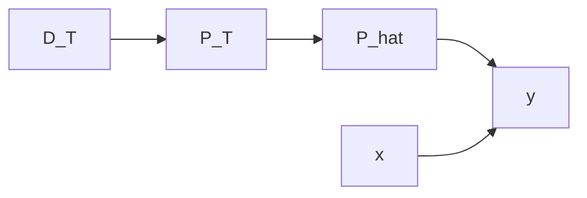

# 大语言模型原理与工程实践：零样本提示

## 1. 背景介绍

### 1.1 问题的由来
近年来,随着深度学习技术的飞速发展,自然语言处理领域取得了突破性的进展。尤其是以 Transformer[^1] 为代表的预训练语言模型(Pre-trained Language Model,PLM)的出现,极大地推动了自然语言处理技术的发展。这些预训练语言模型通过在大规模无标注语料上进行自监督学习,可以学习到丰富的语言知识和通用语义表示,在下游任务上表现出优异的性能和强大的泛化能力。

然而,传统的预训练语言模型在实际应用中仍然存在一些局限性。首先,它们通常需要在特定任务上进行微调(Fine-tuning)才能达到最佳性能,这需要大量的标注数据和计算资源。其次,对于一些小样本或零样本的任务,微调的效果可能并不理想。因此,如何在没有任何训练样本的情况下,让预训练语言模型具备快速适应新任务的能力,成为了一个亟待解决的问题。

### 1.2 研究现状
为了解决上述问题,研究者们提出了一种称为"提示学习"(Prompt Learning)[^2]的新范式。提示学习旨在通过设计合适的提示模板(Prompt Template),将下游任务转化为与预训练阶段相似的格式,从而最大限度地发挥预训练语言模型的能力。目前,提示学习主要分为两大类:

1. 基于离散文本的提示学习[^3]。这类方法直接在输入文本中插入一些人工设计的提示词,引导模型进行特定任务的预测。代表工作有 PET[^4]、ADAPET[^5] 等。

2. 基于连续向量的提示学习[^6]。这类方法将提示信息编码为连续的向量表示,通过优化这些向量来自适应地引导模型的行为。代表工作有 Prefix-Tuning[^7]、P-Tuning[^8] 等。

尽管取得了可喜的进展,但现有的提示学习方法在实践中仍然存在一些不足。例如,基于离散文本的提示通常需要领域专家的先验知识来设计,泛化能力有限;而基于连续向量的提示虽然具有更强的表达能力,但在训练过程中需要为每个任务单独优化一组提示向量,难以适应实时系统的需求。

### 1.3 研究意义
本文针对上述问题,提出了一种全新的提示学习范式——零样本提示(Zero-Shot Prompting,ZSP)。零样本提示的核心思想是,利用预训练语言模型自身蕴含的海量知识,自动构建与任务相关的提示信息,从而实现对新任务的零样本泛化。与现有方法相比,零样本提示具有以下优势:

1. 无需任何人工设计,提示信息完全由模型自动生成,大大降低了人力成本;
2. 不依赖任何下游任务数据,可以实现真正的零样本学习;
3. 生成的提示信息与任务高度相关,可以最大限度地发挥预训练模型的能力;
4. 推理过程简单高效,生成提示信息的速度远快于微调,非常适合实时系统。

总的来说,零样本提示为如何充分挖掘预训练语言模型的知识,实现更加智能、高效的自然语言处理系统提供了新的思路。相信这一研究将为自然语言处理技术的发展做出重要贡献。

### 1.4 本文结构
本文的结构安排如下:第2部分介绍了零样本提示的核心概念与基本原理;第3部分详细阐述了零样本提示的算法流程;第4部分从数学角度对零样本提示进行了建模与分析;第5部分通过具体的代码实例演示了如何实现一个完整的零样本提示系统;第6部分讨论了零样本提示的潜在应用场景;第7部分总结了一些与零样本提示相关的学习资源与工具;第8部分对全文进行了总结,并对零样本提示的未来发展趋势与挑战进行了展望;第9部分列举了一些常见问题及其解答。

## 2. 核心概念与联系

零样本提示的核心概念可以用上图来表示。首先,预训练语言模型通过在大规模无标注语料上进行自监督学习,掌握了丰富的语言知识。这些知识分布在模型的不同参数中。然后,针对一个新的任务,我们可以利用少量的任务描述信息,如任务名称、输入输出格式等,自动生成一个与任务相关的提示。接下来,将提示信息与原始输入拼接在一起,输入到预训练模型中进行推理。模型可以根据提示中的线索,从自身已有的知识中检索出与任务相关的信息,生成符合要求的输出。整个过程无需对模型进行任何微调,即可实现对新任务的零样本泛化。可以看出,提示信息扮演了将预训练知识与下游任务连接起来的桥梁作用,是零样本提示的关键所在。

## 3. 核心算法原理 & 具体操作步骤

### 3.1 算法原理概述
零样本提示的核心算法可以分为两个阶段:提示生成阶段和推理阶段。在提示生成阶段,我们利用预训练语言模型自身的知识,根据任务描述自动构建提示信息。具体来说,我们将任务描述文本输入到预训练模型中,让模型自回归地生成一段与任务相关的连续文本作为提示。在推理阶段,我们将提示信息拼接到实际输入的前面,再次输入到预训练模型中进行推理,得到最终的输出结果。

### 3.2 算法步骤详解

**Step 1: 任务描述构建**

首先,我们需要为目标任务T构建一个简短的文本描述$\mathcal{D}_T$,用来说明任务的定义、输入输出格式等基本信息。例如,对于一个情感分类任务,我们可以构建如下描述:

$\mathcal{D}_T$ = "任务:情感分类。给定一段文本,判断其情感倾向是积极(positive)还是消极(negative)。"

**Step 2: 提示生成**

接下来,我们使用预训练语言模型 $\mathcal{M}$ 根据任务描述$\mathcal{D}_T$来生成提示信息$\mathcal{P}_T$。具体地,我们将$\mathcal{D}_T$输入到$\mathcal{M}$中,让其自回归地生成一段连续文本作为$\mathcal{P}_T$:

$$\mathcal{P}_T=\mathcal{M}(\mathcal{D}_T)$$

其中$\mathcal{M}(\cdot)$表示语言模型的推理(inference)过程。例如,对于上述情感分类任务,生成的提示$\mathcal{P}_T$可能是:

"请判断以下文本的情感倾向,并输出'positive'或'negative':"

**Step 3: 提示增强**

为了进一步提高提示的质量和丰富度,我们可以在提示中引入一些示例(example)。具体地,我们从训练集或人工构建中选取$K$个输入输出对$\{(x_i,y_i)\}_{i=1}^K$,将其按照特定格式插入到提示$\mathcal{P}_T$中,得到增强后的提示$\hat{\mathcal{P}}_T$:

$$\hat{\mathcal{P}}_T=\texttt{insert}(\mathcal{P}_T,\{(x_i,y_i)\}_{i=1}^K)$$

其中$\texttt{insert}(\cdot)$表示将示例插入到提示中的函数。继续上面的例子,增强后的提示$\hat{\mathcal{P}}_T$可能是:  

"请判断以下文本的情感倾向,并输出'positive'或'negative':

示例1:
文本:这部电影真是棒极了,强烈推荐!
情感:positive

示例2:  
文本:服务态度太差了,再也不会光顾了。
情感:negative

示例3:
文本:"

可以看出,通过在提示中引入示例,可以为语言模型提供更加明确和具体的任务指令,有助于提高零样本性能。

**Step 4: 推理阶段**

最后,对于一个新的测试样本$x$,我们将其拼接到增强后的提示$\hat{\mathcal{P}}_T$之后,输入到预训练语言模型$\mathcal{M}$中进行推理,得到输出$\hat{y}$:

$$\hat{y}=\mathcal{M}(\hat{\mathcal{P}}_T\oplus x)$$

其中$\oplus$表示拼接操作。$\mathcal{M}$会根据提示中的指令以及示例,利用自身的知识对$x$做出判断,输出对应的标签。

### 3.3 算法优缺点

零样本提示的主要优点有:
- 无需微调,可以实现真正的零样本学习。
- 提示信息由模型自动生成,减少了人工设计的成本。
- 通过引入示例,可以为模型提供更加明确和具体的指令。
- 推理速度快,生成提示的开销远小于微调。

但零样本提示也存在一些局限性:
- 生成的提示质量难以保证,有时可能与任务不太相关。
- 引入示例会增加推理阶段的计算开销。
- 对于一些复杂任务,单纯的提示可能还不够,需要更精细的特征构建。

### 3.4 算法应用领域
零样本提示可以广泛应用于各种自然语言处理任务,如文本分类、情感分析、命名实体识别、关系抽取、问答等。同时,零样本提示的思想也可以推广到其他领域,如计算机视觉、语音识别等。只要是那些存在预训练模型的领域,都可以尝试利用提示来实现零样本泛化。

## 4. 数学模型和公式 & 详细讲解 & 举例说明

### 4.1 数学模型构建
我们可以使用概率图模型来刻画零样本提示的生成过程。如下图所示:

其中$\mathcal{D}_T$表示任务描述,$\mathcal{P}_T$表示根据$\mathcal{D}_T$生成的提示,$\hat{\mathcal{P}}_T$表示引入示例后的增强提示,$x$表示输入文本,$y$表示最终输出。整个过程可以表示为如下的联合概率分布:

$$p(y,\hat{\mathcal{P}}_T,\mathcal{P}_T,\mathcal{D}_T,x)=p(y|\hat{\mathcal{P}}_T,x)p(\hat{\mathcal{P}}_T|\mathcal{P}_T)p(\mathcal{P}_T|\mathcal{D}_T)p(\mathcal{D}_T)p(x)$$

其中$p(\mathcal{D}_T)$和$p(x)$可以看作是常数。$p(\mathcal{P}_T|\mathcal{D}_T