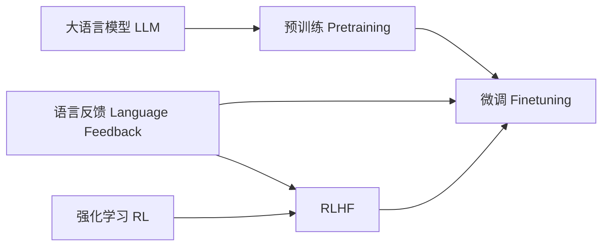

# 大语言模型原理基础与前沿 基于语言反馈进行微调

关键词：大语言模型、预训练、微调、语言反馈、ChatGPT、InstructGPT、RLHF

## 1. 背景介绍
### 1.1 问题的由来
近年来，随着深度学习技术的快速发展，大语言模型(Large Language Model, LLM)在自然语言处理(Natural Language Processing, NLP)领域取得了令人瞩目的成就。LLM通过在海量文本数据上进行预训练，能够学习到丰富的语言知识和通用的语言表示，在多项NLP任务上取得了显著的性能提升。然而，预训练得到的LLM虽然具有强大的语言理解和生成能力，但仍然存在一些问题，如生成的文本可能与人类意图不一致、存在事实性错误、缺乏可控性等。为了进一步提升LLM的性能并解决这些问题，研究者们提出了基于语言反馈(Language Feedback)对LLM进行微调(Fine-tuning)的方法。

### 1.2 研究现状 
基于语言反馈进行LLM微调的代表性工作包括ChatGPT[1]、InstructGPT[2]等。这些工作利用人工标注的高质量语言反馈数据，通过RLHF(Reinforcement Learning from Human Feedback)等技术对预训练的LLM进行微调，使其生成的文本更加符合人类偏好，在可控性、事实准确性等方面取得了显著的提升。微软的Prompt-tuning[3]、谷歌的Flan[4]等工作则在特定任务上引入了任务描述作为Prompt，通过对Prompt和任务输出进行联合微调，使LLM能够根据任务要求生成更加精准的结果。

### 1.3 研究意义
基于语言反馈的LLM微调技术有望进一步释放LLM的潜力，使其生成更加符合人类需求、安全可控的文本。这不仅能够提升LLM在智能对话、知识问答、内容创作等应用场景中的效果，也为打造更加通用、鲁棒的NLP系统奠定了基础。同时，语言反馈的引入也为LLM的可解释性研究提供了新的视角。

### 1.4 本文结构
本文将首先介绍LLM微调中的一些核心概念，然后重点阐述基于语言反馈的LLM微调算法原理和操作步骤。接下来，我们将通过数学建模的方式对算法进行形式化描述，并给出详细的公式推导和案例分析。在项目实践部分，我们将提供基于语言反馈微调的代码实例和详细解读。最后，我们总结了LLM微调技术的研究现状和未来发展趋势，并对一些常见问题进行了解答。

## 2. 核心概念与联系
- 大语言模型(Large Language Model, LLM)：在大规模文本数据上预训练得到的语言模型，具有强大的语言理解和生成能力，代表模型如GPT-3、PaLM等。
- 预训练(Pre-training)：利用无监督的语言建模任务在大规模语料上训练神经网络模型，使其学习到通用的语言表示。预训练一般采用自回归语言模型、Masked Language Model等范式。  
- 微调(Fine-tuning)：在预训练模型的基础上，利用下游任务的监督数据对模型进行进一步训练，使其适应特定任务。微调可以提升模型在下游任务上的性能。
- 语言反馈(Language Feedback)：人工标注的反映生成文本质量的数据，常见形式包括人类偏好标注、对比学习等。语言反馈为LLM微调提供了有益的监督信号。
- 强化学习(Reinforcement Learning, RL)：一种机器学习范式，通过智能体(Agent)与环境交互，根据环境反馈的奖励(Reward)不断优化策略，最终获得最优策略。
- RLHF(Reinforcement Learning from Human Feedback)：一种结合强化学习和人类反馈的机器学习范式，通过将人类反馈作为奖励信号来指导模型学习，使其生成更符合人类偏好的结果。

下图展示了这些核心概念之间的联系：



## 3. 核心算法原理 & 具体操作步骤
### 3.1 算法原理概述
基于语言反馈的LLM微调算法主要包含三个关键组件：语言模型、奖励模型和RL优化器。其基本原理是：首先利用语言反馈数据训练一个奖励模型，用于评估生成文本的质量；然后将预训练的语言模型作为RL智能体，以生成的文本作为动作(Action)，以奖励模型打分作为奖励，通过RL优化器对语言模型的参数进行优化，使其生成的文本能够获得更高的奖励，即更加符合人类偏好。

### 3.2 算法步骤详解
1. 语言反馈数据收集：由人工标注者对LLM生成的文本进行评分或排序，构建高质量的语言反馈数据集。
2. 奖励模型训练：在语言反馈数据上训练一个奖励模型，常见的模型结构包括BERT、RoBERTa等。奖励模型可以是一个打分器，用于预测生成文本的得分；也可以是一个排序器，用于比较不同生成文本的优劣。奖励模型的损失函数可以是回归损失或排序损失。 
3. 语言模型微调：基于RL框架对预训练的语言模型进行微调。将语言模型视为策略网络(Policy Network)，根据输入的Prompt生成文本作为动作。每个动作会传递给奖励模型，获得相应的奖励。RL优化器以奖励为指引，通过策略梯度(Policy Gradient)等算法对语言模型的参数进行更新，使其生成的文本能够获得更高的奖励。常见的RL优化器包括PPO、TRPO等。
4. 迭代优化：重复步骤3，不断用更新后的语言模型生成文本，并用奖励模型打分，再次对语言模型进行优化。如此迭代，直到语言模型的生成质量达到预期效果。

### 3.3 算法优缺点
优点：
- 引入人类反馈，使LLM生成更加符合人类偏好的文本
- 通过RL优化，可以持续提升LLM的生成质量
- 可以同时兼顾生成文本的流畅性、连贯性和安全性

缺点：
- 需要大量高质量的人工标注数据，成本较高
- RL训练过程计算开销大，对算力要求高
- 难以彻底避免语言模型生成有害、虚假或偏见的内容
- RL训练不够稳定，容易受到训练技巧和超参数选择的影响

### 3.4 算法应用领域
基于语言反馈的LLM微调算法可以应用于以下领域：
- 智能对话：通过语言反馈优化对话模型，使其生成更加自然、贴切的回复
- 内容创作：利用语言反馈提升LLM在文案、小说、剧本等创意写作任务上的表现
- 知识问答：通过语言反馈训练LLM在问答任务上给出更加准确、完整的答案
- 机器翻译：用语言反馈提升LLM在机器翻译任务上的流畅度和忠实度

## 4. 数学模型和公式 & 详细讲解 & 举例说明
### 4.1 数学模型构建
我们以打分器形式的奖励模型为例，对基于语言反馈的LLM微调过程进行数学建模。设预训练的语言模型参数为$\theta$，奖励模型参数为$\phi$。给定输入Prompt $x$，语言模型的策略为$p_\theta(y|x)$，即在给定$x$的条件下生成文本$y$的概率分布。奖励模型的打分函数为$r_\phi(x,y)$，表示在给定输入$x$和生成文本$y$时，奖励模型给出的分数。

语言模型的目标是最大化期望奖励：

$$J(\theta)=\mathbb{E}_{x \sim D, y \sim p_\theta(y|x)}[r_\phi(x,y)]$$

其中$D$为输入Prompt的分布。根据策略梯度定理，$J(\theta)$对$\theta$的梯度为：

$$\nabla_\theta J(\theta)=\mathbb{E}_{x \sim D, y \sim p_\theta(y|x)}[r_\phi(x,y) \nabla_\theta \log p_\theta(y|x)]$$

### 4.2 公式推导过程
对于给定的输入Prompt $x$，语言模型生成长度为$T$的文本$y=(y_1,\cdots,y_T)$。假设语言模型的策略$p_\theta(y|x)$可以分解为：

$$p_\theta(y|x)=\prod_{t=1}^T p_\theta(y_t|x,y_{<t})$$

其中$y_{<t}$表示$y$的前$t-1$个token。令$r_t=r_\phi(x,y_{1:t})$为奖励模型在生成第$t$个token时给出的分数，则整个生成过程的累积奖励为$R=\sum_{t=1}^T r_t$。

根据策略梯度定理，我们可以将梯度$\nabla_\theta J(\theta)$改写为：

$$\nabla_\theta J(\theta)=\mathbb{E}_{x \sim D, y \sim p_\theta(y|x)}[\sum_{t=1}^T r_t \nabla_\theta \log p_\theta(y_t|x,y_{<t})]$$

这个式子的物理意义是：对于每个时间步$t$，如果动作$y_t$导致了更高的累积奖励$R$，那么就增加在状态$(x,y_{<t})$下采取动作$y_t$的概率，反之则降低概率。

在实际优化时，我们通过蒙特卡洛采样的方式来近似梯度：

$$\nabla_\theta J(\theta) \approx \frac{1}{N} \sum_{i=1}^N \sum_{t=1}^T r_t^{(i)} \nabla_\theta \log p_\theta(y_t^{(i)}|x^{(i)},y_{<t}^{(i)})$$

其中$N$为采样的批量大小，$r_t^{(i)}$为第$i$个样本在第$t$步的奖励。

### 4.3 案例分析与讲解
下面我们以一个简单的例子来说明基于语言反馈的LLM微调过程。假设我们要微调一个英文写作辅助模型，使其能够根据给定的主题生成高质量的文章开头段落。

首先，我们准备一批由人工标注的语言反馈数据，形式为(topic, opening, score)的三元组，表示在给定主题topic下，opening是一个得分为score的开头段落。例如：

```
("The benefits of exercise", "Regular exercise has numerous benefits for both physical and mental health.", 4)
("The benefits of exercise", "Exercising is good for you.", 3)
("The benefits of exercise", "There are many reasons why people exercise, such as to lose weight or build muscle.", 2)
```

然后，我们在这些数据上训练一个打分器形式的奖励模型。奖励模型可以是一个预训练的语言模型如BERT，在输出层接一个线性层和sigmoid函数，用于预测一个0到1之间的分数。我们用MSE损失函数来训练奖励模型：

$$L(\phi)=\frac{1}{N}\sum_{i=1}^N (r_\phi(x^{(i)},y^{(i)})-s^{(i)})^2$$

其中$s^{(i)}$为第$i$个样本的人工标注分数。

接下来，我们用RL方法对预训练的语言模型进行微调。我们从头开始生成文本，每生成一个token，就将当前生成的内容送入奖励模型打分，得到一个0到1之间的分数$r_t$。然后，我们用策略梯度公式来计算语言模型参数的梯度，并用Adam优化器来更新参数。重复这个过程，直到生成质量达到预期。

例如，假设语言模型在主题"The benefits of exercise"下生成了以下开头段落：

"Exercise is important for maintaining good health. It can help you control your weight, reduce your risk