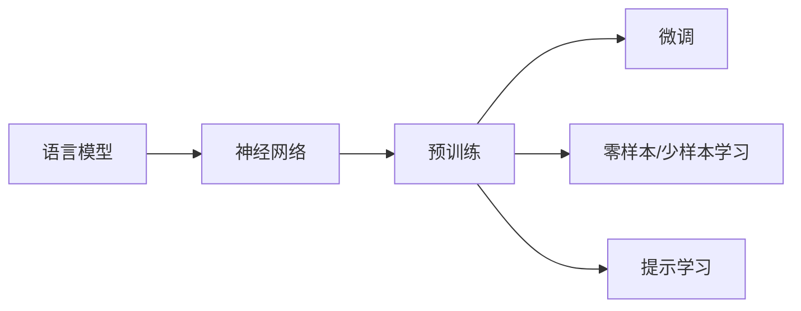

# 大语言模型原理基础与前沿 思维链

## 1. 背景介绍
### 1.1 问题的由来
近年来,随着人工智能技术的飞速发展,自然语言处理(NLP)领域取得了突破性进展。其中,大语言模型(Large Language Model, LLM)作为NLP的核心技术之一,受到了学术界和工业界的广泛关注。LLM通过海量语料的预训练,能够学习到丰富的语言知识,在机器翻译、对话系统、文本生成等任务上取得了优异的表现。然而,LLM的内在机理仍有待进一步探索,如何构建更加强大、高效、可解释的LLM,是当前亟需解决的问题。

### 1.2 研究现状
目前,学术界对LLM的研究主要集中在模型结构设计、预训练方法、下游任务适配等方面。在模型结构方面,Transformer[1]的提出开启了LLM的新纪元,GPT系列[2,3]、BERT[4]等模型相继问世,不断刷新着NLP任务的性能上限。在预训练方法上,从早期的基于语言模型的预训练[5],到掩码语言模型[4]、排列语言模型[6]等,研究者们探索了多种策略来充分利用无监督数据。针对下游任务适配,微调[7]、提示学习[8]、零样本学习[9]等技术不断涌现,极大地提升了LLM的实用性。

### 1.3 研究意义
深入研究LLM的原理和机制,对于推动NLP乃至整个AI领域的发展具有重要意义。一方面,LLM蕴含了海量的语言知识,解析其内在逻辑,有助于我们理解人类语言的奥秘,探索智能的本质。另一方面,发展更加先进的LLM技术,将促进智能对话、知识图谱、决策支持等应用的创新,为构建人机协同的智能社会提供关键支撑。同时,研究LLM的可解释性、可控性、鲁棒性等问题,对于实现可信、安全、透明的AI系统至关重要。

### 1.4 本文结构
本文将系统阐述LLM的原理基础与前沿进展。第2部分介绍LLM的核心概念与内在联系;第3部分重点探讨LLM的核心算法原理与操作步骤;第4部分深入分析LLM的数学模型与公式推导;第5部分通过代码实例演示LLM的实现细节;第6部分展望LLM的实际应用场景;第7部分梳理LLM相关的工具与学习资源;第8部分总结全文,并展望LLM的未来发展方向与挑战;第9部分附录了LLM领域的常见问题解答。

## 2. 核心概念与联系
大语言模型的核心是利用深度神经网络,在海量文本语料上进行预训练,习得语言的统计规律和隐含知识,再根据具体任务进行微调或迁移,从而实现文本生成、语义理解等功能。其关键概念包括:

- **语言模型**:刻画文本序列生成概率的数学模型,是LLM的理论基础。给定前置词序列,语言模型能够预测下一个词出现的概率。
- **神经网络**:由大量神经元组成的计算模型,能够拟合复杂的非线性函数。LLM通常采用多层的Transformer结构。
- **预训练**:在大规模无监督语料上进行自监督学习,使模型掌握语言的一般性知识。常见的预训练任务包括语言模型、掩码语言模型等。  
- **微调**:在预训练的基础上,使用少量标注数据对模型进行针对性训练,使其适应特定任务。
- **零样本/少样本学习**:在不使用或很少使用目标任务训练数据的情况下,直接应用预训练模型完成推理。
- **提示学习**:通过设计输入文本的提示模板,引导LLM进行特定任务的生成或预测。

这些概念环环相扣,共同构成了LLM的技术框架。下图展示了它们之间的逻辑关系:

## 3. 核心算法原理 & 具体操作步骤
### 3.1 算法原理概述
LLM的核心算法可以概括为基于Transformer的语言模型预训练与微调。Transformer是一种基于自注意力机制的神经网络结构,通过捕捉文本序列中的长距离依赖,建模词与词之间的关联。预训练阶段,模型在无标注语料上以自回归或自编码的方式学习通用语言知识;微调阶段,在预训练模型的基础上,引入下游任务的监督信号进行参数调优。

### 3.2 算法步骤详解
1. **语料准备**:收集大规模高质量的无标注文本数据,对其进行清洗、分词、编码等预处理。
2. **模型构建**:设计基于Transformer的神经网络结构,根据计算资源和任务需求,确定模型的层数、隐藏单元维度、注意力头数等超参数。
3. **预训练**:
   - 语言模型预训练:以自回归的方式训练模型,最小化给定前置词序列下的下一个词的负对数似然损失。
   - 掩码语言模型预训练:随机掩盖部分词,训练模型根据上下文预测被掩盖词,如BERT的训练方式。
   - 其他预训练任务:如排列语言模型、句子连贯性判别等,丰富语义建模目标。
4. **微调**:
   - 添加特定任务的输出层,如分类、序列标注等。
   - 使用任务标注数据,通过反向传播调整预训练模型的参数。
   - 评估模型在验证集上的性能,进行超参数搜索与模型选择。
5. **推理应用**:
   - 离线部署:将训练好的模型封装为API服务,提供文本生成、问答、摘要等功能。
   - 在线学习:持续收集用户交互数据,定期更新模型参数,实现增量学习。

### 3.3 算法优缺点
LLM算法的优势在于:
- 通过预训练掌握了丰富的语言知识,具备强大的语义理解和生成能力。
- 采用Transformer结构,能够有效建模长文本的全局依赖。
- 可扩展性好,通过增加模型参数量和训练数据,性能可以不断提升。
- 可适应多种下游任务,支持零样本/少样本学习。

但同时也存在一些局限:
- 模型参数量巨大,训练和推理成本高,对计算资源要求苛刻。
- 语言知识的获取高度依赖训练数据,存在偏见和有偏见覆盖问题。
- 缺乏明确的逻辑推理和常识推理能力,易产生幻觉。
- 可解释性差,难以分析模型的决策机制,存在安全隐患。

### 3.4 算法应用领域
LLM算法已在多个NLP任务上取得了突破性进展,主要应用包括:
- 机器翻译:将一种语言的文本翻译成另一种语言,如谷歌翻译。
- 智能对话:实现人机自然交互,提供个性化服务,如小爱同学、Siri。
- 文本生成:自动撰写文章、诗歌、代码等,如GPT-3的创意写作。
- 信息抽取:从非结构化文本中提取结构化知识,如实体、关系、事件抽取。
- 语义匹配:计算文本之间的相似度,支持搜索、推荐、问答等应用。

随着LLM技术的不断发展,其应用有望进一步拓展到知识图谱、决策优化、内容审核等更广阔的领域。

## 4. 数学模型和公式 & 详细讲解 & 举例说明
### 4.1 数学模型构建
LLM的数学基础是语言模型,即对文本序列的概率分布进行建模。给定文本序列$x=(x_1,\cdots,x_T)$,语言模型的目标是估计其生成概率$P(x)$。根据概率链式法则,序列生成概率可以分解为:

$$P(x)=\prod_{t=1}^TP(x_t|x_{<t})$$

其中,$x_{<t}$表示$x_t$之前的所有词。语言模型的任务就是学习这个条件概率分布$P(x_t|x_{<t})$。

传统的n-gram语言模型受限于有限的上下文窗口,难以刻画长距离依赖。神经语言模型使用神经网络拟合条件概率分布,其中Transformer结构以自注意力机制为核心,实现了对任意长度上下文的建模。

### 4.2 公式推导过程
Transformer的核心是自注意力层和前馈神经网络层的交替堆叠。对于第$l$层的第$i$个词,其隐藏状态表示为$h_i^l$。自注意力层首先将$h_i^l$通过三个线性变换得到查询向量$q_i^l$、键向量$k_i^l$和值向量$v_i^l$:

$$q_i^l=W_q^lh_i^l,\quad k_i^l=W_k^lh_i^l,\quad v_i^l=W_v^lh_i^l$$

然后,通过查询向量与所有键向量的点积计算注意力权重,再对值向量进行加权求和,得到上下文表示$c_i^l$:

$$\alpha_{ij}^l=\frac{\exp(q_i^l\cdot k_j^l)}{\sum_{j=1}^T\exp(q_i^l\cdot k_j^l)},\quad c_i^l=\sum_{j=1}^T\alpha_{ij}^lv_j^l$$

最后,将$c_i^l$通过前馈神经网络$\text{FFN}$进一步变换,得到新的隐藏状态$h_i^{l+1}$:

$$h_i^{l+1}=\text{FFN}(c_i^l)$$

通过多层Transformer的堆叠,可以建模任意长度文本序列的复杂依赖关系。在预训练阶段,模型参数$\theta$通过最小化负对数似然损失来优化:

$$\mathcal{L}(\theta)=-\sum_{t=1}^T\log P_\theta(x_t|x_{<t})$$

其中,$P_\theta(x_t|x_{<t})$是由模型参数$\theta$定义的条件概率分布。

### 4.3 案例分析与讲解
以GPT-3为例,其使用了175B的参数量和570GB的训练数据,堆叠了96层Transformer结构。在预训练阶段,GPT-3以自回归语言模型的方式学习英文语料的统计规律。给定文本序列"I love natural language processing because",模型逐词生成后续内容,如"it enables computers to understand human language"。

在下游任务微调时,GPT-3通过引入任务描述和少量示例,快速适应特定任务。例如在情感分类任务中,输入文本可构造为"Classify the sentiment of the following sentence: {输入句子} Sentiment:",模型根据提示生成"Positive"或"Negative"作为预测标签。

GPT-3还展现了强大的零样本学习能力。例如在机器翻译任务中,无需平行语料微调,模型可直接根据提示"Translate the following sentence from English to French: {英文句子}"生成对应的法语翻译。

### 4.4 常见问题解答
**Q:** LLM的预训练和微调有何区别?

**A:** 预训练是在大规模无标注语料上进行自监督学习,让模型掌握语言的一般性知识;微调是在预训练模型基础上,使用少量标注数据进行特定任务的有监督训练。预训练是通用的,可用于多个下游任务;微调是专用的,针对具体任务进行优化。

**Q:** Transformer为何能够建模长距离依赖?

**A:** Transformer使用自注意力机制,通过查询向量与所有位置的键向量计算注意力权重,再对值向量进行加权求和。这一过程直接捕捉了任意两个位置之间的依赖,不受距离的限制。此外,Transformer通过位置编码引入序列位置信息,有助于建模词序关