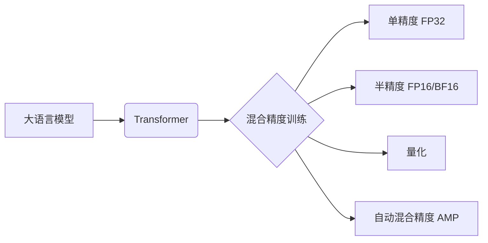

# 大语言模型原理基础与前沿 混合精度

关键词：大语言模型、混合精度、深度学习、Transformer、BERT、GPT、量化

## 1. 背景介绍
### 1.1 问题的由来
近年来，随着深度学习技术的飞速发展，大语言模型(Large Language Model, LLM)在自然语言处理(Natural Language Processing, NLP)领域取得了突破性的进展。LLM 通过在海量文本数据上进行预训练，可以学习到丰富的语言知识和语义表示，在机器翻译、问答系统、文本生成等任务上表现出色。然而，LLM 往往包含数以亿计的参数，训练和推理过程极其耗时耗力。如何在保证模型性能的同时提高训练和推理效率，成为了 LLM 研究的一大挑战。

### 1.2 研究现状
为了提升 LLM 的训练和推理效率，学术界和工业界提出了一系列优化方法。其中，混合精度(Mixed Precision)训练是一种广泛采用的加速技术。传统的神经网络训练使用 32 位浮点数(FP32)进行计算和存储，混合精度训练则结合了 FP32 和低精度数据类型如 FP16 或 BF16，在计算密集型操作(如矩阵乘法)中使用低精度以加速计算并减少显存占用，而在参数更新等对精度要求较高的操作中仍使用 FP32，从而在加速的同时保证了模型性能。

### 1.3 研究意义 
探索高效的 LLM 混合精度训练方法具有重要的研究意义和应用价值:

1. 从学术角度来看，混合精度训练涉及到数值优化、计算机体系结构、编译器优化等多个交叉学科，是一个富有挑战性的研究课题。深入研究混合精度训练有助于推动相关理论的发展。

2. 从应用角度来看，高效的混合精度训练可以大幅降低 LLM 的训练成本和推理延迟，让 LLM 更容易被部署到资源受限的场景中，如移动设备或边缘计算节点，拓宽 LLM 的应用范围。

### 1.4 本文结构
本文将全面介绍 LLM 混合精度训练的基础知识和前沿进展。第2部分介绍相关的核心概念。第3部分讲解混合精度训练的核心算法原理和具体步骤。第4部分给出混合精度训练的数学模型和公式推导。第5部分通过代码实例演示混合精度训练的实现细节。第6部分讨论混合精度训练的实际应用场景。第7部分推荐相关的学习资源和开发工具。第8部分总结全文并展望未来研究方向。第9部分列出常见问题解答。

## 2. 核心概念与联系

在深入探讨 LLM 混合精度训练之前，我们首先介绍一些核心概念：

- 大语言模型(Large Language Model, LLM): 以 Transformer 为基础，在大规模文本语料库上预训练得到的语言模型，可以学习语言的统计规律和语义知识。代表模型包括 BERT、GPT、T5、Switch Transformer 等。

- 混合精度训练(Mixed Precision Training): 在神经网络训练中，混合使用单精度(FP32)和半精度(FP16/BF16)数据类型进行计算和存储，以提高训练速度和降低显存占用。

- Transformer: 一种基于自注意力机制(Self-attention)的神经网络结构，广泛用于构建 LLM。Transformer 的特点是可以并行计算，计算复杂度与序列长度呈线性关系。

- 量化(Quantization): 将连续的实数空间映射到离散的整数空间，以减少数据位宽。常见的量化方法包括整数量化、二值量化等。量化可以进一步压缩模型体积。

- 自动混合精度(Automatic Mixed Precision, AMP): 一种自动化的混合精度训练框架，可以根据算子对精度的敏感程度，自适应地选择使用 FP32 还是 FP16/BF16，从而在提速的同时最小化精度损失。

这些概念之间的联系可以用下面的 Mermaid 流程图表示:

## 3. 核心算法原理 & 具体操作步骤
### 3.1 算法原理概述
混合精度训练的核心思想是在训练过程中，根据算子对数值精度的敏感程度，自适应地选择使用单精度(FP32)还是半精度(FP16/BF16)。一般而言，前向传播和反向传播中的矩阵乘法运算使用半精度，以加速计算并减少显存占用；而模型参数、梯度和优化器状态等对精度要求较高的量使用单精度。

具体来说，前向传播过程中的激活值和反向传播过程中的梯度值使用半精度存储。由于半精度的动态范围较小，为了避免出现上溢出(Overflow)或下溢出(Underflow)，需要对这些值进行放大(Scale)和缩小(Unscale)操作。

### 3.2 算法步骤详解
混合精度训练的一个典型实现是 NVIDIA 提出的自动混合精度(AMP)。下面我们详细介绍 AMP 的算法步骤。

1. 模型初始化: 将模型参数初始化为 FP32。

2. 训练循环:
   1. 前向传播:
      1. 将输入数据从 FP32 转换为 FP16。
      2. 前向计算，生成 FP16 格式的激活值。
      3. 将 FP16 激活值乘以一个缩放因子 $S$，将其映射到 FP32 范围，得到`Scaled_activations`。
   2. 反向传播:
      1. 根据损失函数计算`Scaled_activations`的梯度`Scaled_gradients`，数据类型为 FP32。
      2. 将`Scaled_gradients`除以缩放因子 $S$，将其映射回 FP16 范围，得到`Unscaled_gradients`。
   3. 优化器更新:
      1. 根据`Unscaled_gradients`和优化器超参数(学习率等)，更新模型参数，数据类型为 FP32。
      2. 如果梯度的无穷范数超过某个预设的阈值，则对梯度进行裁剪(Clipping)，防止梯度爆炸。
   4. 动态损失缩放:
      1. 记录当前 batch 是否出现了上溢出或下溢出。
      2. 如果连续 $N$ 个 batch 没有出现溢出，则将缩放因子 $S$ 乘以 $2$；如果当前 batch 出现了溢出，则将缩放因子 $S$ 除以 $2$，并跳过当前 batch 的更新。

3. 模型保存: 将训练好的 FP32 模型参数保存到磁盘。

### 3.3 算法优缺点
AMP 的主要优点包括:

1. 显著提升训练速度和节省显存。相比纯 FP32 训练，AMP 可以将训练速度提高 2-3 倍，显存占用减少 50%。

2. 实现简单，易于集成到现有的训练流程中。深度学习框架如 PyTorch、TensorFlow 都提供了 AMP 的封装实现。

3. 模型性能基本不受影响。在大多数任务上，AMP 训练的模型可以达到与 FP32 训练相当的性能。

AMP 的主要缺点包括:

1. 部分算子可能对精度较为敏感，需要针对性地调整。

2. 训练初期可能出现较多的溢出，导致训练不稳定。一般通过梯度裁剪和动态损失缩放来缓解。

### 3.4 算法应用领域
混合精度训练已经在学术界和工业界得到了广泛应用，尤其是在大模型训练中不可或缺。一些知名的 LLM 如 GPT-3、PaLM、Megatron-Turing NLG 等都采用了混合精度训练以提高训练效率。

除了 LLM，混合精度训练还被应用到计算机视觉、语音识别、推荐系统等领域的深度学习模型训练中。可以说，混合精度训练已经成为深度学习加速的标配。

## 4. 数学模型和公式 & 详细讲解 & 举例说明
### 4.1 数学模型构建
我们考虑一个简化的数学模型来说明 AMP 的原理。假设我们的模型只包含一个全连接层，其前向传播公式为:

$$
\boldsymbol{y} = \boldsymbol{W}\boldsymbol{x} + \boldsymbol{b}
$$

其中 $\boldsymbol{x} \in \mathbb{R}^{d_{in}}$ 为输入向量，$\boldsymbol{W} \in \mathbb{R}^{d_{out} \times d_{in}}$ 为权重矩阵，$\boldsymbol{b} \in \mathbb{R}^{d_{out}}$ 为偏置向量，$\boldsymbol{y} \in \mathbb{R}^{d_{out}}$ 为输出向量。

反向传播时，根据链式法则，损失 $\mathcal{L}$ 对权重 $\boldsymbol{W}$ 的梯度为:

$$
\frac{\partial \mathcal{L}}{\partial \boldsymbol{W}} = \frac{\partial \mathcal{L}}{\partial \boldsymbol{y}} \frac{\partial \boldsymbol{y}}{\partial \boldsymbol{W}} = \frac{\partial \mathcal{L}}{\partial \boldsymbol{y}} \boldsymbol{x}^T
$$

损失对偏置 $\boldsymbol{b}$ 的梯度为:

$$
\frac{\partial \mathcal{L}}{\partial \boldsymbol{b}} = \frac{\partial \mathcal{L}}{\partial \boldsymbol{y}}
$$

### 4.2 公式推导过程
现在我们引入 AMP。记 FP16 到 FP32 的缩放因子为 $S$。前向传播时，我们先将 FP32 的输入 $\boldsymbol{x}$ 和权重 $\boldsymbol{W}$ 转换为 FP16，记为 $\boldsymbol{x}_{16}$ 和 $\boldsymbol{W}_{16}$，然后进行矩阵乘法，得到 FP16 的输出 $\boldsymbol{y}_{16}$:

$$
\boldsymbol{y}_{16} = \boldsymbol{W}_{16}\boldsymbol{x}_{16} + \boldsymbol{b}_{16}
$$

接着将 $\boldsymbol{y}_{16}$ 乘以缩放因子 $S$，得到 FP32 格式的`Scaled_activations`:

$$
\text{Scaled_activations} = S \cdot \boldsymbol{y}_{16}
$$

反向传播时，我们先计算损失对`Scaled_activations`的梯度，记为`Scaled_gradients`:

$$
\text{Scaled_gradients} = \frac{\partial \mathcal{L}}{\partial \text{Scaled_activations}} = \frac{\partial \mathcal{L}}{\partial \boldsymbol{y}}
$$

然后将`Scaled_gradients`除以缩放因子 $S$，得到 FP16 格式的`Unscaled_gradients`:

$$
\text{Unscaled_gradients} = \frac{\text{Scaled_gradients}}{S} = \frac{1}{S} \cdot \frac{\partial \mathcal{L}}{\partial \boldsymbol{y}}
$$

最后，我们使用`Unscaled_gradients`来更新模型参数。对于权重 $\boldsymbol{W}$，其梯度为:

$$
\frac{\partial \mathcal{L}}{\partial \boldsymbol{W}} = \text{Unscaled_gradients} \cdot \boldsymbol{x}_{16}^T = \frac{1}{S} \cdot \frac{\partial \mathcal{L}}{\partial \boldsymbol{y}} \cdot \boldsymbol{x}_{16}^T
$$

对于偏置 $\boldsymbol{b}$，其梯度为:

$$
\frac{\partial \mathcal{L}}{\partial \boldsymbol{b}} = \text{Unscaled_gradients} = \frac{1}{S} \cdot \frac{\partial \mathcal{L}}{\partial \boldsymbol{y}}
$$

可以看到，通过引入缩放因