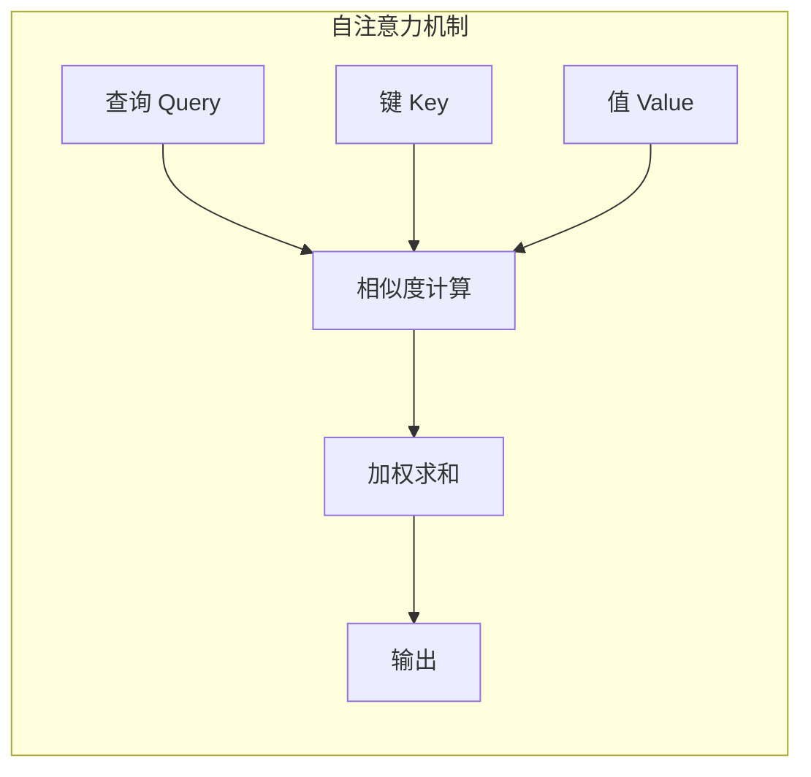
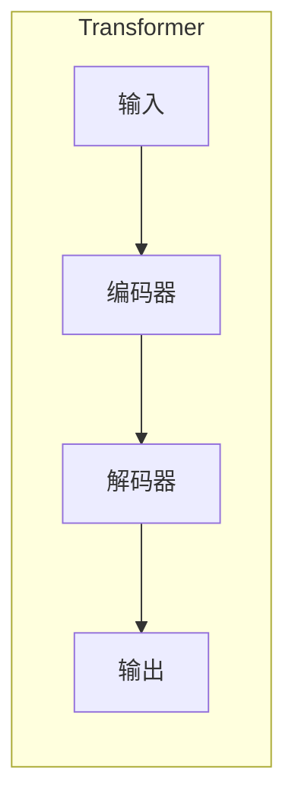
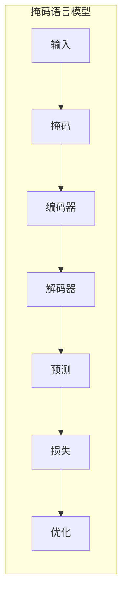
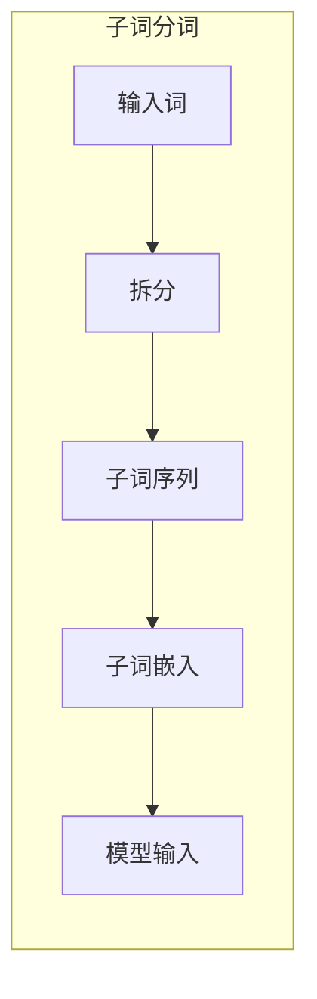

# 大语言模型原理基础与前沿 语言模型和分词

## 1. 背景介绍

### 1.1 问题的由来

在自然语言处理(NLP)领域,语言模型和分词是两个至关重要的基础问题。语言模型旨在捕捉语言的统计规律,为下游任务提供有价值的先验知识。而分词作为文本数据的基本预处理步骤,直接影响后续任务的效果。随着深度学习技术的不断发展,大型语言模型和分词模型的性能也在不断提升,为 NLP 领域带来了新的机遇和挑战。

### 1.2 研究现状

近年来,基于 Transformer 的大型语言模型(如 BERT、GPT、XLNet 等)取得了巨大成功,在多项 NLP 任务上刷新了最佳成绩。这些模型通过预训练的方式学习到了丰富的语言知识,使得下游任务能够以更少的数据获得更好的效果。与此同时,基于深度神经网络的分词模型(如 BERT-WordPiece、ZEN 等)也展现出了优异的性能,能够有效地处理未登录词和新词等问题。

### 1.3 研究意义

语言模型和分词是 NLP 系统的基石,对于提高自然语言理解和生成的能力至关重要。研究大型语言模型和分词模型的原理和方法,不仅能够帮助我们更好地理解和应用这些技术,还能为设计新的模型提供借鉴和启发。此外,将这些前沿技术应用于实际场景,可以推动 NLP 技术在各个领域的落地,为人类带来实实在在的价值。

### 1.4 本文结构

本文将全面介绍大型语言模型和分词模型的基础理论和前沿进展。首先阐述核心概念和算法原理,包括自注意力机制、Transformer 结构、掩码语言模型等。然后深入探讨数学模型和公式推导,并结合实例进行详细讲解。接下来通过代码实现展示具体的项目实践。最后分析实际应用场景,介绍相关工具和资源,并对未来发展趋势和挑战进行展望。

## 2. 核心概念与联系

大型语言模型和分词模型都基于神经网络和深度学习技术,但在具体实现上存在一些差异。下面我们先介绍一些核心概念,为后续内容做铺垫。

### 2.1 自注意力机制(Self-Attention)

自注意力机制是 Transformer 模型的核心,它能够捕捉输入序列中任意两个位置之间的依赖关系。不同于 RNN 按序捕捉上下文信息,自注意力机制通过计算查询(Query)、键(Key)和值(Value)之间的相似性,直接对整个序列进行建模。这种全局依赖的捕捉方式,使得模型能够高效地并行计算,同时避免了长期依赖问题。

### 2.2 Transformer 结构

Transformer 是一种全新的基于注意力机制的序列到序列(Seq2Seq)模型,主要由编码器(Encoder)和解码器(Decoder)两部分组成。编码器将输入序列映射为连续的表示,解码器则根据编码器的输出生成目标序列。两者内部都采用了多头自注意力机制和前馈神经网络,通过残差连接和层归一化实现高效的梯度传播。

### 2.3 掩码语言模型(Masked Language Model)

掩码语言模型是一种自监督学习方法,通过随机掩码部分输入词元,然后基于上下文预测被掩码的词元,从而学习到有效的语义表示。这种方法不需要人工标注的数据,可以在大规模无标记语料上进行预训练,获得通用的语言表示能力。BERT 就是一个典型的掩码语言模型,它在预训练阶段同时对输入序列进行掩码和下一句预测,在下游任务上表现出了卓越的性能。

### 2.4 子词分词(Subword Tokenization)

在处理文本数据时,分词是一个基本的预处理步骤。传统的基于词典的分词方法存在一些缺陷,如无法有效处理未登录词和新词。子词分词则通过构建一个有限的子词词表,将任意词拆分为子词序列,从而能够更好地表示和生成新词。常见的子词分词算法包括 BPE、WordPiece、Unigram 等。大型语言模型中通常采用子词分词的方式,以提高分词的鲁棒性和覆盖率。

上述概念相互关联,共同构建了大型语言模型和分词模型的理论基础。下面我们将深入探讨它们的核心算法原理和数学模型。

## 3. 核心算法原理 & 具体操作步骤

### 3.1 算法原理概述

大型语言模型和分词模型的核心算法都基于 Transformer 结构和自注意力机制。我们以 BERT 为例,介绍其基本原理和流程。

BERT 的主要创新点在于引入了掩码语言模型和下一句预测两个预训练任务。在掩码语言模型中,BERT 会随机选择输入序列中的 15% 的词元进行掩码,然后基于上下文预测被掩码的词元。这种自监督学习方式,使得 BERT 能够在大规模无标记语料上学习到丰富的语义和语法知识。

在模型结构上,BERT 由编码器组成,采用了多层 Transformer 编码器堆叠而成。每一层由多头自注意力机制和前馈神经网络构成,通过残差连接和层归一化实现高效的梯度传播。BERT 的输入由词元序列和位置编码组成,输出则是对应每个词元位置的向量表示。

在下游任务中,BERT 通过简单的微调策略,将预训练的参数作为初始化权重,在特定任务的数据上进行进一步训练,从而将通用的语言知识转移到具体的任务中。这种预训练 + 微调的范式,极大地提升了下游任务的性能,同时降低了数据需求。

### 3.2 算法步骤详解

1. **输入处理**:将原始文本按照特定的分词算法(如 WordPiece)转换为词元序列,并添加特殊符号(如 [CLS]、[SEP])。同时构建位置编码,以提供位置信息。

2. **嵌入层**:将词元序列和位置编码输入到嵌入层,获得对应的嵌入向量表示。

3. **掩码处理**:随机选择输入序列中 15% 的词元进行掩码,其中 80% 用 [MASK] 替换、10% 保持不变、10% 用随机词元替换。

4. **编码器**:将嵌入向量输入到多层 Transformer 编码器中,每一层由多头自注意力机制和前馈神经网络构成,通过残差连接和层归一化实现高效的梯度传播。

5. **预训练任务**:
   - **掩码语言模型**: 对被掩码的词元位置进行预测,目标是预测出正确的词元。
   - **下一句预测**: 判断两个句子是否相邻,目标是进行二分类。

6. **损失计算**:计算掩码语言模型和下一句预测两个任务的损失函数,如交叉熵损失。

7. **模型优化**:使用优化算法(如 Adam)对模型参数进行更新,最小化损失函数。

8. **预训练过程**:重复上述步骤,在大规模无标记语料上进行预训练,直至模型收敛。

9. **微调阶段**:在下游任务的数据上,使用预训练的 BERT 参数作为初始化权重,进行进一步的微调训练。

10. **模型评估**:在测试集上评估微调后的模型性能,计算相应的指标。

通过上述步骤,BERT 能够在大规模无标记语料上学习到通用的语言表示,并将这些知识迁移到下游任务中,从而显著提升任务性能。

### 3.3 算法优缺点

**优点**:

1. **通用性强**:BERT 通过自监督学习方式,在大规模无标记语料上进行预训练,获得了通用的语言表示能力,可以广泛应用于多种 NLP 任务。

2. **性能卓越**:BERT 在多项 NLP 任务上取得了最佳成绩,显著超越了以往的模型。

3. **高效并行**:基于 Transformer 结构,BERT 可以高效地并行计算,避免了 RNN 的长期依赖问题。

4. **可解释性**:BERT 的注意力机制能够捕捉输入序列中词元之间的依赖关系,提供了一定的可解释性。

**缺点**:

1. **计算资源需求高**:BERT 模型参数巨大,需要大量的计算资源进行训练和推理。

2. **缺乏位置信息**:BERT 的位置编码是通过简单的位置嵌入实现的,缺乏对位置关系的更深层次的建模。

3. **上下文长度限制**:受限于计算资源,BERT 只能处理长度有限的输入序列,无法直接对长文本建模。

4. **预训练数据偏差**:BERT 的预训练数据可能存在一定的偏差,导致在特定领域的性能不佳。

### 3.4 算法应用领域

BERT 及其变体模型已经在多个 NLP 任务中取得了卓越的成绩,包括但不限于:

- **文本分类**: 新闻分类、情感分析、垃圾邮件检测等。
- **序列标注**: 命名实体识别、关系抽取、事件抽取等。
- **问答系统**: 阅读理解、开放域问答、对话系统等。
- **文本生成**: 文本续写、机器翻译、文本摘要等。
- **其他领域**: 代码理解、蛋白质结构预测、化学反应预测等。

总的来说,BERT 展现出了强大的语言理解和生成能力,为 NLP 技术在各个领域的应用奠定了坚实的基础。

## 4. 数学模型和公式 & 详细讲解 & 举例说明

在介绍了 BERT 的基本原理和流程之后,我们来深入探讨其中的数学模型和公式推导过程。

### 4.1 数学模型构建

BERT 的核心是 Transformer 编码器,其中自注意力机制是关键所在。我们先来看看自注意力机制的数学表达式:

$$
\begin{aligned}
\text{Attention}(Q, K, V) &= \text{softmax}\left(\frac{QK^T}{\sqrt{d_k}}\right)V \\
\text{MultiHead}(Q, K, V) &= \text{Concat}(\text{head}_1, \dots, \text{head}_h)W^O\\
\text{where}\ \text{head}_i &= \text{Attention}(QW_i^Q, KW_i^K, VW_i^V)
\end{aligned}
$$

其中 $Q$、$K$、$V$ 分别表示查询(Query)、键(Key)和值(Value)。自注意力机制首先计算查询和键之间的相似度得分,然后对得分进行 softmax 归一化,最后将归一化的得分与值进行加权求和,得到注意力表示。多头注意力机制则是将多个注意力头的输出进行拼接,并经过一个线性变换得到最终的输出。

在 BERT 中,每一层的输入 $X$ 首先经过