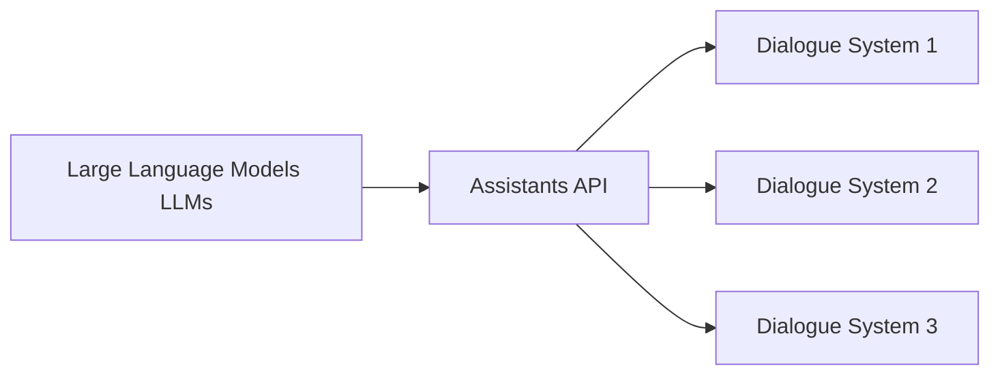

# 大语言模型应用指南：Assistants API整体执行过程

## 1. 背景介绍
### 1.1 问题的由来
随着人工智能技术的飞速发展，大语言模型（Large Language Models, LLMs）在自然语言处理领域取得了突破性的进展。LLMs 能够理解和生成接近人类水平的自然语言文本，为构建智能对话系统和语言应用开辟了新的可能性。然而，如何有效地将 LLMs 应用于实际场景，构建高质量的对话式 AI 助手，仍然是一个具有挑战性的问题。

### 1.2 研究现状
目前，业界已经出现了多个基于 LLMs 的对话式 AI 助手，如 OpenAI 的 ChatGPT、Anthropic 的 Claude 等。这些助手展现出了优异的语言理解和生成能力，能够与人进行自然流畅的对话。但在实际应用中，仍然存在一些问题，如上下文理解不足、知识覆盖有限、推理能力不强等。因此，如何进一步提升 LLMs 在对话领域的应用效果，是当前研究的热点问题。

### 1.3 研究意义
深入研究 LLMs 在对话式 AI 助手中的应用，对于推动人工智能技术在实际场景中的落地具有重要意义。一方面，高质量的对话式 AI 助手可以为用户提供更加智能、高效的服务，提升用户体验；另一方面，对 LLMs 应用过程的探索和优化，有助于推动 LLMs 技术的进一步发展，为其在更广泛领域的应用奠定基础。

### 1.4 本文结构
本文将围绕大语言模型在对话式 AI 助手中的应用展开深入探讨。首先，介绍 LLMs 和 Assistants API 的核心概念及二者之间的联系；然后，详细阐述 Assistants API 的整体执行过程，包括核心算法原理、数学模型、代码实现等；接着，讨论 Assistants API 在实际场景中的应用，并推荐相关工具和资源；最后，总结全文并展望未来发展趋势与挑战。

## 2. 核心概念与联系
大语言模型（LLMs）是一类基于深度学习的语言模型，通过在海量文本数据上进行预训练，学习到丰富的语言知识和模式。LLMs 具有强大的语言理解和生成能力，能够完成各种自然语言处理任务，如文本分类、问答、摘要、翻译等。

Assistants API 是一种基于 LLMs 构建对话式 AI 助手的应用程序接口。它利用 LLMs 的语言能力，实现了与用户进行自然对话的功能。通过 Assistants API，开发者可以方便地将 LLMs 集成到自己的应用中，快速构建智能对话系统。

LLMs 和 Assistants API 之间存在紧密的联系。LLMs 作为底层的语言模型，为 Assistants API 提供了语言理解和生成的能力基础。Assistants API 则在 LLMs 之上进行了更高层次的封装和抽象，提供了面向对话场景的接口和功能，使得开发者能够更加便捷地应用 LLMs 技术。

下图展示了 LLMs 和 Assistants API 之间的关系：



## 3. 核心算法原理 & 具体操作步骤
### 3.1 算法原理概述
Assistants API 的核心算法基于 Transformer 架构的语言模型。Transformer 通过自注意力机制和前馈神经网络，能够捕捉文本序列中的长距离依赖关系，实现高效的并行计算。在 Assistants API 中，预训练好的 LLMs 被用于编码用户输入和生成助手回复。

### 3.2 算法步骤详解
Assistants API 的执行过程可以分为以下几个步骤：

1. 用户输入预处理：对用户输入的文本进行清洗、分词、编码等预处理操作，将其转换为模型可接受的格式。

2. 上下文编码：将用户输入与之前的对话历史进行拼接，形成完整的对话上下文，并使用 LLMs 对上下文进行编码，得到上下文向量表示。

3. 解码生成回复：基于上下文向量，使用 LLMs 的解码器生成助手回复。解码过程通常采用 Beam Search 等策略，以提高生成质量。

4. 回复后处理：对生成的回复进行后处理，如去除重复内容、过滤不恰当词汇等，提升回复的可读性和适当性。

5. 返回结果：将处理后的助手回复返回给用户，完成一轮对话交互。

### 3.3 算法优缺点
Assistants API 基于 LLMs 的算法具有以下优点：

- 语言理解能力强：LLMs 在大规模语料上预训练，能够很好地理解用户意图和语义信息。
- 生成质量高：基于 Transformer 架构的生成模型，能够生成流畅、连贯、富有逻辑性的文本回复。
- 知识覆盖广：LLMs 从海量文本中学习知识，具有广泛的知识覆盖面，能够应对多领域的对话主题。

同时，该算法也存在一些局限性：

- 计算开销大：LLMs 模型参数量巨大，推理计算开销较高，对硬件资源要求较高。
- 泛化能力有限：尽管 LLMs 具有一定的泛化能力，但面对全新的领域或任务时，可能表现欠佳。
- 数据偏差风险：LLMs 从网络文本中学习，可能会继承数据中的偏差，产生不恰当或有偏见的回复。

### 3.4 算法应用领域
Assistants API 基于 LLMs 的算法可以应用于多个领域，包括：

- 客服聊天机器人：为用户提供智能客服服务，解答问题、处理投诉等。
- 个人助理：协助用户完成日程管理、信息查询、提醒等任务。
- 教育助手：为学生提供学习辅导、答疑解惑等服务。
- 医疗助理：协助医生进行初步诊断、提供医疗咨询等。

## 4. 数学模型和公式 & 详细讲解 & 举例说明
### 4.1 数学模型构建
Assistants API 中的 LLMs 可以用数学语言进行形式化描述。假设 $\mathcal{D}$ 表示对话数据集，$\mathcal{V}$ 表示词表，$\mathbf{x}=(x_1,\ldots,x_n)$ 表示一个对话上下文，其中 $x_i \in \mathcal{V}$ 为第 $i$ 个词。LLMs 的目标是学习一个条件概率分布 $p(\mathbf{y}|\mathbf{x})$，其中 $\mathbf{y}=(y_1,\ldots,y_m)$ 为助手回复序列。

Transformer 架构的 LLMs 通过自注意力机制和前馈神经网络来建模 $p(\mathbf{y}|\mathbf{x})$。自注意力机制可以表示为：

$$
\text{Attention}(Q, K, V) = \text{softmax}(\frac{QK^T}{\sqrt{d_k}})V
$$

其中，$Q$、$K$、$V$ 分别为查询、键、值矩阵，$d_k$ 为键向量的维度。

前馈神经网络可以表示为：

$$
\text{FFN}(x) = \max(0, xW_1 + b_1)W_2 + b_2
$$

其中，$W_1$、$W_2$ 为权重矩阵，$b_1$、$b_2$ 为偏置项。

### 4.2 公式推导过程
基于 Transformer 架构，LLMs 的训练过程可以表示为最小化以下损失函数：

$$
\mathcal{L}(\theta) = -\sum_{(\mathbf{x},\mathbf{y}) \in \mathcal{D}} \log p_\theta(\mathbf{y}|\mathbf{x})
$$

其中，$\theta$ 表示模型参数。

在推理阶段，给定对话上下文 $\mathbf{x}$，生成助手回复 $\mathbf{y}$ 的过程可以表示为：

$$
\mathbf{y}^* = \arg\max_{\mathbf{y}} p_\theta(\mathbf{y}|\mathbf{x})
$$

实际中，通常采用 Beam Search 等近似算法来解决上述优化问题，提高生成效率和质量。

### 4.3 案例分析与讲解
下面以一个简单的对话为例，说明 Assistants API 的执行过程。

用户：你好，请问今天天气怎么样？
助手：您好！根据最新的天气预报，今天是晴天，温度在25-30℃之间，非常适合外出活动。不过由于天气较热，外出时记得做好防晒，多喝水哦。祝您度过愉快的一天！

在这个例子中，Assistants API 的执行步骤如下：

1. 对用户输入"你好，请问今天天气怎么样？"进行预处理，转换为模型可接受的格式。

2. 将用户输入与之前的对话历史（如果有）拼接，形成完整的对话上下文，并使用 LLMs 进行编码。

3. 基于上下文向量，使用 LLMs 的解码器生成助手回复："您好！根据最新的天气预报，今天是晴天，温度在25-30℃之间，非常适合外出活动。不过由于天气较热，外出时记得做好防晒，多喝水哦。祝您度过愉快的一天！"

4. 对生成的回复进行后处理，确保其适当性和可读性。

5. 将处理后的回复返回给用户，完成本轮对话。

### 4.4 常见问题解答
1. Q: Assistants API 中的 LLMs 与传统的 Seq2Seq 模型有何区别？
   A: 与传统的 Seq2Seq 模型相比，基于 Transformer 的 LLMs 在以下方面有所改进：(1)采用自注意力机制，能够更好地捕捉长距离依赖关系；(2)引入位置编码，使模型能够感知词序信息；(3)采用多头注意力和残差连接，提高了模型的表达能力和训练稳定性。

2. Q: Assistants API 生成回复的多样性如何保证？
   A: 为了提高生成回复的多样性，可以采取以下策略：(1)在解码时引入随机性，如采用 Top-k 采样或 Nucleus 采样；(2)在训练时引入变分自编码器（VAE）或生成对抗网络（GAN）等技术，鼓励模型生成多样化的回复；(3)使用多个不同的 LLMs 进行集成，综合多个模型的生成结果。

3. Q: 如何提高 Assistants API 生成回复的安全性和适当性？
   A: 为了确保生成回复的安全性和适当性，可以采取以下措施：(1)在训练数据中加入安全和伦理相关的指令和示例，引导模型学习恰当的行为准则；(2)在生成过程中引入内容过滤和安全检查机制，过滤掉不恰当或有害的内容；(3)建立人工反馈和纠错机制，对模型生成的回复进行审核和修正。

## 5. 项目实践：代码实例和详细解释说明
### 5.1 开发环境搭建
要使用 Assistants API 进行开发，首先需要搭建合适的开发环境。以 Python 为例，可以按照以下步骤进行环境配置：

1. 安装 Python 3.7 或更高版本。
2. 创建虚拟环境并激活：
   ```bash
   python -m venv myenv
   source myenv/bin/activate
   ```
3. 安装所需的依赖库：
   ```bash
   pip install requests
   ```

### 5.2 源代码详细实现
下面是一个使用 Assistants API 进行对话的简单示例代码：

```python
import requests

API_ENDPOINT = "https://api.example.com/assistants"
API_KEY = "your_api_key"

def chat_with_assistant(context):
    headers = {
        "Content-Type": "application/json",
        "Authorization": f"Bearer {API_KEY}"
    }
    data = {