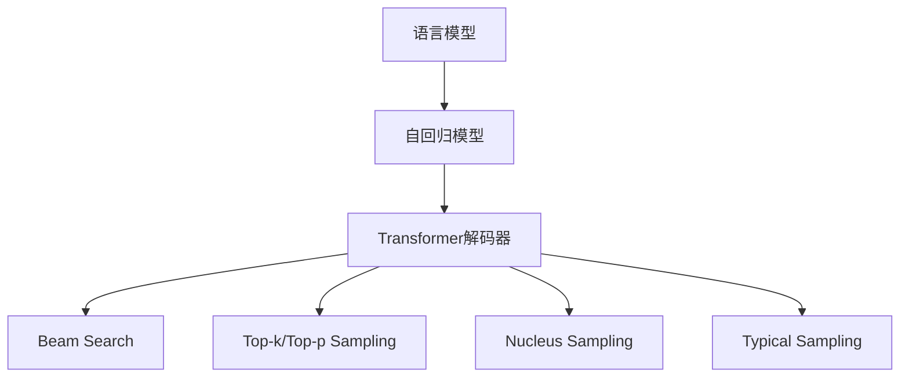
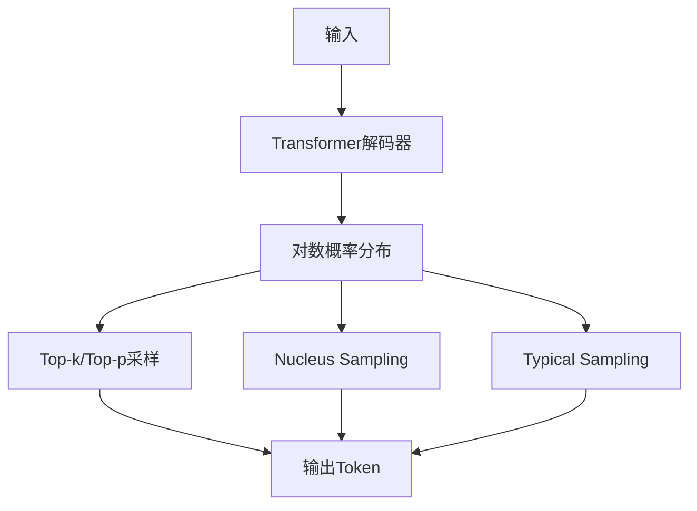

# 大语言模型应用指南：模型响应返回的参数

## 1. 背景介绍

### 1.1 问题的由来

随着人工智能技术的快速发展,大型语言模型(Large Language Models, LLMs)已经成为当前最受关注的研究热点之一。这些模型通过在海量文本数据上进行预训练,学习到了丰富的语言知识和上下文理解能力,可以被用于各种自然语言处理任务,如机器翻译、文本摘要、问答系统等。

然而,与传统的任务специ定模型不同,LLMs在生成响应时会返回一系列参数,这些参数反映了模型对输出的不确定性和置信度。理解和正确利用这些参数,对于提高模型性能、控制输出质量、减少不当输出的风险至关重要。

### 1.2 研究现状

目前,主流的LLMs如GPT-3、PaLM、ChatGPT等,在生成响应时通常会返回以下几种参数:

- **Log Probability(对数概率)**: 表示模型对当前输出token的概率分布。
- **Token Bias(Token偏差)**: 反映了模型对某些token的偏好程度。
- **Presence Penalty(存在惩罚)**: 用于惩罚重复生成相同token的倾向。
- **Frequency Penalty(频率惩罚)**: 惩罚生成高频token的倾向。
- **Top-k/Top-p Sampling(前K/前P采样)**: 控制模型输出多样性的采样方法。

虽然这些参数的作用已有一定研究,但如何系统地利用和调整这些参数以获得最佳输出效果,仍然是一个值得探索的课题。

### 1.3 研究意义 

合理利用LLMs返回的参数,可以带来以下潜在好处:

1. **提高输出质量**: 通过调整参数,可以控制模型输出的流畅性、多样性和相关性。
2. **降低不当输出风险**: 适当设置参数,可以减少模型生成有害、不当或不相关内容的风险。
3. **提升模型可解释性**: 分析参数变化,有助于理解模型内部的决策过程。
4. **优化推理效率**: 合理设置参数,可以在保证输出质量的同时,提高模型的推理速度。

因此,深入研究LLMs返回参数的作用机理及其应用指南,将为更好地利用这些先进模型提供理论基础和实践指导。

### 1.4 本文结构

本文将系统地介绍大型语言模型在生成响应时返回的各种参数,包括它们的定义、作用原理,以及如何根据实际需求对它们进行调整和应用。文章主要结构如下:

1. 背景介绍
2. 核心概念与联系
3. 核心算法原理与具体操作步骤
4. 数学模型和公式详细讲解与案例分析  
5. 项目实践:代码实例和详细解释
6. 实际应用场景
7. 工具和资源推荐
8. 总结:未来发展趋势与挑战
9. 附录:常见问题与解答

## 2. 核心概念与联系

在深入探讨LLMs返回参数的细节之前,我们先介绍一些核心概念,为后续内容做铺垫。

1. **语言模型(Language Model)**: 用于捕获和建模语言的统计规律,是自然语言处理任务的基础。
2. **自回归模型(Autoregressive Model)**: 一种生成模型,预测序列中的下一个token基于之前生成的tokens。
3. **Transformer解码器(Transformer Decoder)**: 自回归模型的核心,利用Self-Attention机制对上下文进行建模。
4. **Beam Search(束搜索)**: 一种解码策略,保留前K个最可能的候选tokens进行扩展。
5. **Top-k/Top-p Sampling(前K/前P采样)**: 一种解码策略,从前K个最可能tokens或累积概率达到P的tokens中随机采样。
6. **Nucleus Sampling(核采样)**: 一种解码策略,从概率质量最高的一组tokens中采样,可控制输出多样性。
7. **Typical Sampling(典型采样)**: 一种解码策略,根据tokens与整体分布的距离进行采样,鼓励生成"典型"的tokens。

这些概念之间存在密切联系,LLMs返回的参数主要与解码策略和Transformer解码器的运作方式相关。下一节将详细介绍这些参数的具体算法原理。

## 3. 核心算法原理与具体操作步骤

### 3.1 算法原理概述

LLMs在生成响应时,通常会采用自回归模型的解码策略。以Transformer解码器为例,其核心思想是利用Self-Attention机制对上下文进行建模,并基于当前上下文预测下一个token。在这个过程中,模型会返回一系列参数,反映了其对输出的不确定性和置信度。

上图展示了Transformer解码器的工作流程。给定输入,解码器首先计算出对数概率分布,即对于词表中的每个token,模型认为它是下一个token的概率。然后,根据采用的解码策略(如Top-k/Top-p、Nucleus或Typical Sampling),从概率分布中采样出一个token作为输出。在这个过程中,模型会返回一系列参数,如对数概率、Token Bias等,用于控制输出质量和多样性。

### 3.2 算法步骤详解

1. **对数概率计算**

    对数概率(Log Probability)反映了模型对于生成每个可能token的置信度。具体来说,对于词表V中的每个token $w_i$,模型会计算出其对数概率 $\log P(w_i|x)$,表示在给定上下文x的情况下,生成token $w_i$的对数概率。

    对数概率的计算公式为:

    $$\log P(w_i|x) = \text{TransformerDecoder}(x, w_{<i})$$

    其中,TransformerDecoder是Transformer解码器模型,它以上下文x和已生成的tokens $w_{<i}$为输入,输出当前时间步的对数概率分布。

2. **Token Bias**

    Token Bias表示模型对于生成某些特定token的偏好程度。在一些场景下,我们可能希望鼓励或抑制生成某些token,这时就可以人为设置Token Bias。

    具体地,对于每个token $w_i$,我们可以设置一个bias值 $b_i$,将其加到对应的对数概率上:

    $$\log P'(w_i|x) = \log P(w_i|x) + b_i$$

    正的bias值会增加该token被生成的概率,而负的bias值会降低其概率。

3. **Presence Penalty & Frequency Penalty**

    Presence Penalty(存在惩罚)和Frequency Penalty(频率惩罚)都是用于惩罚重复生成相同token的策略。它们的计算方式类似:

    - Presence Penalty: $\log P''(w_i|x) = \log P'(w_i|x) - \alpha * \mathbb{1}[w_i \in \text{Generated}]$
    - Frequency Penalty: $\log P''(w_i|x) = \log P'(w_i|x) - \beta * \text{Count}(w_i, \text{Generated})$

    其中,$\alpha$和$\beta$分别是存在惩罚和频率惩罚的系数,$\mathbb{1}[\cdot]$是示性函数,表示如果$w_i$已经生成过,则对其进行惩罚。Count函数计算$w_i$在已生成序列中出现的次数。

    这两种策略可以防止模型过度重复生成相同的内容,从而提高输出的多样性。

4. **Top-k/Top-p Sampling**

    Top-k和Top-p是两种常用的采样策略,用于从对数概率分布中选择输出token,从而控制输出的多样性。

    - Top-k: 从概率分布的前k个最高概率的token中随机采样。
    - Top-p: 从概率质量最高的一组tokens中采样,直到累积概率达到p(通常取0.9~0.995)。

    采用这些策略可以避免从概率分布的"长尾"中采样出低概率的token,从而提高输出质量。

5. **Nucleus Sampling & Typical Sampling**

    Nucleus Sampling(核采样)和Typical Sampling(典型采样)是两种新兴的采样策略,旨在进一步改善输出质量和多样性。

    - Nucleus Sampling: 从概率质量最高的一组tokens中采样,累积概率达到一个预设阈值(如0.9)时停止。这种策略可以很好地平衡输出质量和多样性。
    - Typical Sampling: 根据tokens与整体分布的距离(KL散度)进行采样,鼓励生成"典型"的tokens,即与整体分布较为接近的tokens。这种策略可以生成更加自然流畅的输出。

通过合理设置和组合上述参数,我们可以有效控制LLMs的输出质量、多样性和风险。下一节将介绍这些参数的数学模型和公式推导过程。

### 3.3 算法优缺点

上述算法虽然可以有效控制LLMs的输出质量和多样性,但也存在一些不足:

**优点**:

1. 可解释性强,参数的作用明确,便于调整和控制。
2. 操作简单,只需设置少数几个参数即可满足大部分需求。
3. 通用性好,适用于大多数基于Transformer的LLMs。

**缺点**:

1. 参数之间可能存在耦合,需要反复试验寻找最优组合。
2. 对于一些特殊需求,可能需要引入额外的策略或损失函数。
3. 过于强调多样性时,可能会牺牲输出的连贯性和相关性。

总的来说,这些参数为我们提供了一种简单有效的方式来控制LLMs的输出,但在实际应用中仍需结合具体场景进行调优。

### 3.4 算法应用领域

LLMs返回参数的调整策略可以应用于以下几个主要领域:

1. **开放域对话系统**: 通过调整参数,可以生成更加多样、流畅和相关的对话响应。
2. **文本生成任务**: 包括文章/故事写作、广告文案创作、自动化报告生成等,参数调整可以提高生成文本的质量和多样性。
3. **机器翻译**: 调整参数可以生成更加准确、流畅的译文,同时避免不当输出。
4. **风险控制**: 通过设置合理的参数,可以降低LLMs生成有害、不当或不相关内容的风险。
5. **个性化生成**: 为不同的用户或场景设置不同的参数,实现个性化的生成服务。

总之,LLMs返回参数的调整策略为我们提供了一种简单而有效的方式,来控制和优化这些大型模型在各种应用场景下的输出效果。

## 4. 数学模型和公式详细讲解与举例说明

在上一节中,我们介绍了LLMs返回参数的核心算法原理。现在,我们将更深入地探讨其数学模型和公式推导过程,并通过具体案例加以说明。

### 4.1 数学模型构建

我们将LLMs生成响应的过程建模为一个条件概率问题。给定上下文x,我们需要最大化生成目标序列y的条件概率 $P(y|x)$。根据链式法则,我们可以将其分解为:

$$P(y|x) = \prod_{t=1}^{|y|} P(y_t | y_{<t}, x)$$

其中, $y_{<t}$ 表示序列y中位于t之前的所有tokens。

在自回归模型中,我们使用Transformer解码器来估计每一个条件概率项 $P(y_t | y_{<t}, x)$。具体来说,对于词表V中的每个token $w_i$,解码器会输出其对数概率:

$$\log P(w_i | y_{<t}, x) = \text{TransformerDecoder}(y_{<t}, x)$$

在生成过程中,我们根据对数概