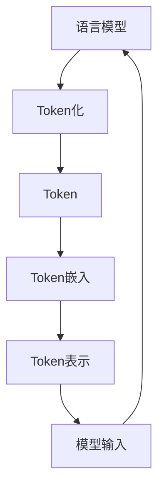

# 大语言模型应用指南：语言模型中的token

## 1. 背景介绍

### 1.1 问题的由来

在自然语言处理(NLP)领域,语言模型扮演着至关重要的角色。它们被广泛应用于机器翻译、文本生成、语音识别等任务中。随着深度学习技术的不断发展,大型语言模型(Large Language Models, LLMs)逐渐成为研究热点。这些模型通过在海量文本数据上进行预训练,学习到丰富的语言知识,从而在下游任务中表现出色。

然而,训练和部署大型语言模型面临着巨大的计算和存储开销。为了高效地处理文本数据,我们需要将其转换为模型可以理解的数字表示形式。这就引入了token的概念。Token是语言模型中最基本的构建块,它们代表着语言中的基本单元,如单词、子词或字符。选择合适的token化方式对模型的性能和效率有着深远的影响。

### 1.2 研究现状

目前,常见的token化方式包括基于单词(Word-based)、基于字符(Character-based)和基于子词(Subword-based)等。每种方式都有其优缺点,需要根据具体任务和数据集进行权衡选择。

基于单词的token化方式直观且高效,但它无法很好地处理低频词和未见词。基于字符的token化则可以完美覆盖任何单词,但会导致token序列过长,增加了模型的计算复杂度。基于子词的token化方法(如BPE、WordPiece等)试图在两者之间寻求平衡,通过将单词分割为常见的子词片段来构建词表,从而在覆盖率和效率之间达成权衡。

除了token化方式之外,token的嵌入(Embedding)也是一个重要研究课题。传统的one-hot编码方式存在维度灾难的问题,而预训练的分布式词向量(如Word2Vec、GloVe等)可以更好地捕捉语义信息,成为当前主流做法。

### 1.3 研究意义

合理的token化策略对于提高语言模型的性能和效率至关重要。选择合适的token粒度级别,可以平衡词表大小、未见词覆盖率和序列长度之间的权衡,从而优化模型的计算和存储开销。此外,高质量的token嵌入也能为模型提供更好的语义表示,提升其在下游任务中的泛化能力。

因此,深入研究token在语言模型中的作用,探索更优秀的token化和嵌入方法,对于推动自然语言处理技术的发展具有重要意义。

### 1.4 本文结构

本文将全面探讨token在大型语言模型中的应用。我们将从token的基本概念出发,介绍常见的token化方法及其优缺点。接着,我们将重点讨论子词token化算法(如BPE和WordPiece)的原理和实现细节。此外,我们还将探讨token嵌入的发展历程,并介绍一些前沿的嵌入技术。最后,我们将分享一些实践经验,并对token在语言模型中的未来发展趋势进行展望。

## 2. 核心概念与联系

在深入探讨token在语言模型中的应用之前,我们需要先理解一些核心概念及它们之间的联系。

1. **语言模型(Language Model)**: 语言模型是自然语言处理领域的基础模型,旨在捕捉语言的统计规律。它们通过学习大量文本数据,估计一个句子或者一个词序列出现的概率。语言模型在机器翻译、文本生成、语音识别等任务中扮演着重要角色。

2. **Token化(Tokenization)**: 为了将文本数据输入到语言模型中,我们需要先将其转换为模型可以理解的数字表示形式。Token化就是这个过程,它将文本切分为一系列token(如单词、子词或字符)。

3. **Token(Token)**: Token是语言模型中最基本的构建块,代表着语言中的基本单元。不同的token化方式会产生不同的token集合。

4. **Token嵌入(Token Embedding)**: 为了更好地表示token及其语义信息,我们需要将离散的token映射到连续的向量空间中。这个过程称为token嵌入。嵌入向量能够捕捉token之间的语义关系,为模型提供更好的输入表示。

5. **Token表示(Token Representation)**: 通过token嵌入,我们得到了每个token的分布式向量表示。这些向量表示将作为语言模型的输入,用于捕捉文本中的语义和结构信息。

6. **模型输入(Model Input)**: 将token表示输入到语言模型中,模型将学习到语言的统计规律,并在下游任务中发挥作用。

正是由于token在语言模型中扮演着基础性的角色,探索更优秀的token化和嵌入方法,对于提高模型的性能和效率至关重要。

## 3. 核心算法原理 & 具体操作步骤

### 3.1 算法原理概述

在探讨具体的token化算法之前,我们先来了解一下token化的一般原理。token化的目标是将一个文本序列切分为一系列有意义的token,同时尽可能减少token的数量和未见token的比例。常见的token化方法包括:

1. **基于规则(Rule-based)**: 根据一些预定义的规则(如空格、标点符号等)对文本进行切分。这种方法简单直观,但无法很好处理复合词和未见词。

2. **基于词典(Dictionary-based)**: 维护一个词典,将文本中出现的词条直接映射为token。这种方法高效且覆盖率高,但词典的构建和维护成本较高,且无法处理未见词。

3. **基于统计(Statistical-based)**: 根据token在语料库中的统计信息(如频率、互信息等)对文本进行切分。这种方法更加灵活,但需要大量的语料数据和计算资源。

4. **基于机器学习(ML-based)**: 将token化问题建模为序列标注任务,使用机器学习模型(如条件随机场、神经网络等)对文本进行token切分。这种方法性能较好,但需要大量标注数据进行训练。

5. **基于子词(Subword-based)**: 将单词分割为常见的子词片段,构建一个子词词表。这种方法在覆盖率和效率之间达成了较好的平衡,成为当前主流做法。

其中,基于子词的token化算法(如BPE和WordPiece)因其优秀的性能而备受关注。下面我们将重点介绍这两种算法的原理和实现细节。

### 3.2 算法步骤详解

#### 3.2.1 BPE算法

BPE(Byte Pair Encoding)算法是一种基于子词的token化方法,它通过迭代地合并最频繁的连续字节对,来构建一个子词词表。算法步骤如下:

1. 初始化: 将每个单词按字符切分,构建初始的token集合。例如,"example"被切分为["e", "x", "a", "m", "p", "l", "e"]。

2. 计算token对频率: 统计语料库中所有相邻token对的出现频率。

3. 合并token对: 选择频率最高的token对,将它们合并为一个新的token,并将其加入token集合中。例如,将"e x"合并为"ex"。

4. 更新语料库: 用新的token替换原语料库中出现的相应token对。

5. 重复步骤2-4: 直到达到预设的词表大小或其他停止条件。

6. 词表完成: 最终得到的token集合即为子词词表。

通过上述迭代过程,BPE算法能够自动发现常见的子词片段,从而构建一个高质量的子词词表。这种词表不仅覆盖率高,而且可以有效减小token序列的长度,提高模型的效率。

#### 3.2.2 WordPiece算法

WordPiece算法与BPE算法类似,也是一种基于子词的token化方法。但它们在具体实现上有一些区别。WordPiece算法的步骤如下:

1. 初始化: 将每个单词按字符切分,构建初始的token集合。

2. 构建语料库: 将所有单词按字符拼接为一个长字符串,作为语料库。

3. 计算token对概率: 在语料库中统计所有可能的token对的出现概率。

4. 合并token对: 选择概率最高的token对,将它们合并为一个新的token,并将其加入token集合中。

5. 更新语料库: 用新的token替换原语料库中出现的相应token对。

6. 重复步骤3-5: 直到达到预设的词表大小或其他停止条件。

7. 词表完成: 最终得到的token集合即为子词词表。

与BPE算法相比,WordPiece算法使用概率而非频率作为合并标准,并且将所有单词拼接为一个长字符串作为语料库。这种实现方式可以更好地捕捉跨单词的模式,从而产生更高质量的子词词表。

无论是BPE还是WordPiece,它们都能够自动发现常见的子词片段,并将其作为token进行建模。这种方法在覆盖率和效率之间达成了较好的平衡,成为当前大型语言模型中的主流token化方法。

### 3.3 算法优缺点

基于子词的token化算法(如BPE和WordPiece)相比其他方法有以下优缺点:

**优点**:

1. **高覆盖率**: 通过将单词分割为子词片段,这些算法能够很好地覆盖语料库中的大部分单词,包括低频词和未见词。

2. **合理长度**: 相比基于字符的token化方法,子词token化产生的序列长度更加合理,从而降低了模型的计算复杂度。

3. **无需维护词典**: 这些算法能够自动从语料库中学习子词词表,无需人工维护庞大的词典。

4. **语言无关性**: 由于操作对象是字符级别的token,因此这些算法具有很好的语言无关性,可以应用于不同语言的token化任务。

5. **高效率**: 子词token化算法的时间和空间复杂度都相对较低,能够高效地处理大规模语料库。

**缺点**:

1. **缺乏语义信息**: 子词token化算法主要基于统计信息进行操作,无法很好地捕捉token之间的语义关系。

2. **超参数选择**: 这些算法需要预设一些超参数(如词表大小、合并阈值等),不同的超参数设置会影响token化的效果。

3. **未完全解决未见词问题**: 尽管覆盖率较高,但仍然存在一些极低频词无法被完全覆盖的情况。

4. **拼写错误敏感性**: 由于操作对象是字符级别的token,这些算法对于拼写错误等噪声数据较为敏感。

5. **缺乏上下文信息**: 当前的子词token化算法主要基于局部信息进行操作,缺乏对全局上下文的利用。

总的来说,基于子词的token化算法在覆盖率和效率之间达成了较好的平衡,是当前大型语言模型中的主流做法。但它们也存在一些不足,如缺乏语义信息、未完全解决未见词问题等,这为未来的研究留下了广阔的空间。

### 3.4 算法应用领域

基于子词的token化算法(如BPE和WordPiece)已被广泛应用于自然语言处理的各个领域,尤其是在大型语言模型的预训练和微调过程中。以下是一些典型的应用场景:

1. **机器翻译**: 在神经机器翻译系统中,子词token化算法被用于对源语言和目标语言进行token化,从而更好地处理低频词和未见词。例如,Google的神经机器翻译系统就采用了WordPiece算法。

2. **文本生成**: 在文本生成任务中,子词token化算法可以帮助模型更好地表示和生成低频词和未见词,提高生成文本的质量和多样性。例如,OpenAI的GPT语言模型就使用了BPE算法进行token化。

3. **语言